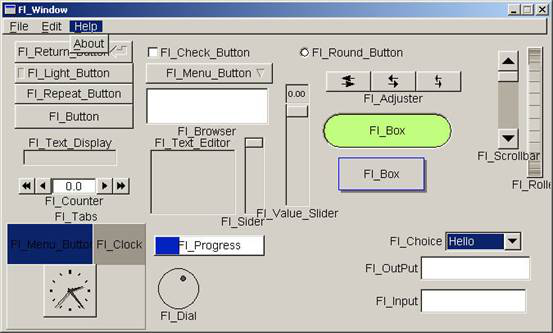
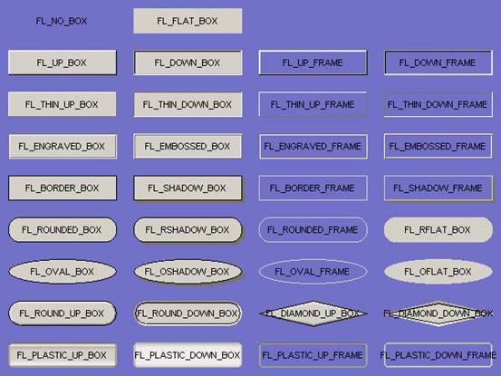
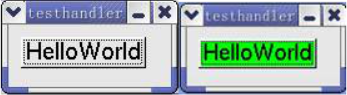
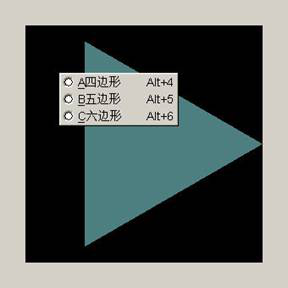

# 第一章：FLTK 编程模型

# 第一章：FLTK 编程模型

FLTK(Fast Light Tool Kit 发音为 fulltick) 是一种使用 C++开发的 GUI 工具包，它可以应用于 Unix,Linux,MS-Windows95/98/NT/2000 和 MacOS 操作系统平台，相对于其它的许多图形接口开发工具包（如 MFC、GTK、QT 等），它具有体积很小、速度比较快，且有着更好的移植性。FLTK(Fast Light Tool Kit 发音为 fulltick) 是一种使用 C++开发的 GUI 工具包，它可以应用于 Unix，Linux，MS-Windows95/98/NT/2000 和 MacOS 操作系统平台，相对于其它的许多图形接口开发工具包（如 MFC、GTK、QT 等），它具有体积很小、速度比较快，且有着更好的移植性。本文就 FLTK 编程的一些基本方法进行介绍。

# 1.1FLTK 功能简介

## 1.1FLTK 功能简介

1.  提供丰富的跨平台的 GUI 构件(Widget)。有按钮，菜单，窗口等，近六十个。
2.  支持 OpenGL，提供 Fl_GL_Window，支持 OpenGL 相关的操作。
3.  提供界面设计工具 FLUID，非常方便进行界面的设计。
4.  良好的跨平台移植性。
5.  支持多种 C++编译器，Gcc，BC，VC 等等。
6.  灵活性。FLTK 本身可以定制，以满足不同的需要。这使得 FLTK 在嵌入式开发上有着极大的竞争力，这正是我要推荐使用 FLTK 的原因。

本文就 FLTK 编程的一些基本方法进行介绍.

# 1.2 搭建 FLTK 开发环境

## 1.2 搭建 FLTK 开发环境

安装 FLTK 很简单，我们只需要下载它的源文件，解压缩到目录下，在 Linux 下我们只需要输入 make，编译完成然后 make install 就头文件安装到/usr/include/FL 目录下。库文件就在/usr/lib 下，也可以自己编译之后把这些文件复制到这些目录，或者不需要复制，只在编译连接的时候指定路径。在 window 下可以使用 VC，BC 打开相应目录下的工程文件编译即可。

### 1.21 windows 下搭建 FLTK 开发环境

第一步:下载 FLTK 源码包

FLTK 官网:[`www.fltk.org/`](http://www.fltk.org/)

下载后解压缩到 C 盘根目录下,命名为 FLTK

进到`C:\FLTK\ide\visualc`目录下,找到 fltk.dsw

用 Visual C++6.0 打开项目，然后选择【组建】-->全部重建，就开始编译了

编译完成后关闭 Visual C++6.0

第二步:添加 FTLK 库文件

1.  重新打开 Visual C++6.0, 新建一个 Win32 Application 项目,命名为 FLTK，然后再新建一个 hello.cxx 文件

2.  建立好之后选择【工程】->【设置】-->选择“连接”选项卡-->“分类”下拉框选择输入，在对象/ 库模块添加：

    *   fltkd.lib
    *   fltkgld.lib
    *   comctl32.lib
    *   wsock32.lib
    *   opengl32.lib
    *   glu32.lib

    还要在忽略库中添加：LIBCD libcd.lib

3.  之后选择“C/C++"选项卡,"分类”下拉框选择：code generation, 在“use run-time library"中选择”Multi-threaded DLL“ 最后确定。

4.  选择【工具】-->【选项】--》"目录"选项卡 在”目录“下拉框中选择"Include Files" 然后新增一项 C:\FLTK(导入头文件)

5.  在“目录“下拉框中选择"Library Files”然后新增一项 C:\FLTK (导入类库)

6.  编译运行 hello.cxx

### 1.22 ubuntu 下搭建 FLTK 开发环境

第一步：配置基础开发环境 GCC

```cpp
xhy@xhy-desktop:~$sudo apt-get install build-essential 
```

第二步：安装 QT 开发环境

```cpp
xhy@xhy-desktop:~$sudo apt-get install qt4-dev-tools qt4-doc qt4-qtconfig qt4-demos qt4-designer 
```

第三步：下载 FLTK 源码包

FLTK 官网:[`www.fltk.org/`](http://www.fltk.org/)

下载后解压缩：

```cpp
xhy@xhy-desktop:~$sudo tar zxvf FLTK.tar.gz 
```

第四步：编译安装 FLTK

```cpp
xhy@xhy-desktop:~$cd FLTK
xhy@xhy-desktop:~$make
xhy@xhy-desktop:~$sudo make install 
```

第五步：测试环境

写一个简单的 FLTK 程序

```cpp
#include <FL/Fl.H>
#include <FL/Fl_Window.H>
#include <FL/Fl_Box.H>
int main(int argc, char **argv)
{
  Fl_Window *window = new Fl_Window(300,180);
  Fl_Box *box = new Fl_Box(20,40,260,100,"Hello, World!");
  box->box(FL_UP_BOX);
  box->labelsize(36);
  box->labelfont(FL_BOLD+FL_ITALIC);
  box->labeltype(FL_SHADOW_LABEL);
  window->end();
  window->show(argc, argv);
  return Fl::run();
} 
```

包含了需要的头文件后，该程序创建了一个窗口

```cpp
Fl_Window *window = new Fl_Window(300,180); 
```

还创建了一个 box 类，标签是“Hello World!”

```cpp
Fl_Box *box = new Fl_Box(20,40,260,100,"Hello, World!"); 
```

下一步，我们设置了 box 的类型，大小，字体和标签的类型

```cpp
box->box(FL_UP_BOX);
box->labelsize(36); 
```

# 1.3FLTK 构件简介

## 1.3FLTK 构件简介

FLTK 作为 GUI 开发包，包含了常用的图形用户接口需要的一些构件，视觉表现非常丰富，如下两图所示：





常用按钮构件

| 按钮名称 | 头文件 | 按钮名称 | 头文件 |
| --- | --- | --- | --- |
| Fl_Button | Fl_Button.H | Fl_Check_Button | Fl_Check_Button.H |
| Fl_Light_Button | Fl_Light_Button.H | Fl_Repeat_Button | Fl_Repeat_Button.H |
| Fl_Return_Button | Fl_Return_Button.H | Fl_Round_Button | Fl_Round_Button.H |

对于具有 Fl_Check_Button、Fl_Loght_Button 和 Fl_Round_Button 当状态为 off 时 value() =0 ，On 时 value()返回 1。

处理按钮时间可以使用回调(callback)函数,参见后面的事件处理。

文本处理构件

| 构件名称 | 头文件 | 构件名称 | 头文件 |
| --- | --- | --- | --- |
| Fl_Input | Fl_Input.H | Fl_Output | Fl_Output.H |
| Fl_Multiline_Input | Fl_Multiline_Input.H | Fl_Multiline_output | Fl_Multiline_output.H |

设置和取得文本内容使用 value();

如：

```cpp
(new  Fl_Input(x,y,width,height,"Label"))->value("Hello World!"); 
```

其他构件参见 FLTK.org 的 文档说明。

写一个简单的 FLTK 程序

```cpp
#include <FL/Fl.H>
#include <FL/Fl_Window.H>
#include <FL/Fl_Box.H>

int main(int argc, char **argv)
{
  Fl_Window *window = new Fl_Window(300,180);
  Fl_Box *box = new Fl_Box(20,40,260,100,"Hello, World!");
  box->box(FL_UP_BOX);
  box->labelsize(36);
  box->labelfont(FL_BOLD+FL_ITALIC);
  box->labeltype(FL_SHADOW_LABEL);
  window->end();
  window->show(argc, argv);
  return Fl::run();
} 
```

包含了需要的头文件后，该程序创建了一个窗口

```cpp
Fl_Window *window = new Fl_Window(300,180); 
```

还创建了一个 box 类，标签是“Hello World!”

```cpp
Fl_Box *box = new Fl_Box(20,40,260,100,"Hello, World!"); 
```

下一步，我们设置了 box 的类型，大小，字体和标签的类型

```cpp
box->box(FL_UP_BOX);
box->labelsize(36);
box->labelfont(FL_BOLD+FL_ITALIC);
box->labeltype(FL_SHADOW_LABEL); 
```

最后，我们显示该窗口并进入 FLTK 事件循环

```cpp
window->end();
window->show(argc, argv);
return Fl::run(); 
```

运行该程序得到的界面如下，你能直接关闭该窗口退出，也可以按 ESC 键退出


# 1.4FLTK 事件处理

## 1.4FLTK 事件处理

对于一般构件的如按钮，菜单等常用事件的处理一般可以使用回调函数实现，回调函数的原型是：

```cpp
void  XXX_callback( Fl_Widget *w,void *data )
{
    //添加自己处理的内容
} 
```

使用 F1_Widget->callback( XXX_callback, data) 注册回调函数

```cpp
/***************************************************************
按钮事件例子
***************************************************************/
#include <FL/Fl.H>
#include <FL/Fl_Window.H>
#include <FL/Fl_Button.H>
#include <FL/Fl_ask.H>

void Btn01_cb(Fl_Widget *w, void *data)
{
    ((Fl_Button *)w)->label((char *)data);
    fl_alert("Hello");
}

int main(int argc, char **argv)
{
    char *buff ="Hello";
    Fl_Window* w = new Fl_Window(272, 144);
    Fl_Button* Btn01 = new Fl_Button(85, 50, 105, 25, "&Test callback");
    Btn01->shortcut(FL_ALT+'t');               //定义按钮的快捷键
    Btn01->callback((Fl_Callback*)Btn01_cb,buff); //调用处理函数 buff 作为参数
    w->end();
    w->show(argc, argv);
    return Fl::run();
} 
```

编译运行程序，鼠标点击按钮，按钮标签会发生改变，并且会弹出提示框。

通常的 callback 是当构件的 value 改变时调用，可以使用 when()改变为其他事件发生调用回调函数，主要事件有以下事件

| 事件 | 说明 |
| --- | --- |
| FL_WHEN_NERVER | 从不调用回调函数 |
| FL_WHEN_CHANGED | 当构件值改变时调用 |
| FL_WHEN_RELEASE | 当释放按键或者鼠标并且构件值改变 |
| FL_WHEN_RELEASE_ALWAYS | 当释放按键或者鼠标，即使构件值没有改变 |
| FL_WHEN_ENTER_KEY | 按下 Enter 键并且构件值改变 |
| FL_WHEN_ENTER_KEY_ALWAYS | 按下 Enter 键，即使构件值没有改变 |

通过使用 F1_Widget->when(FL_WHEN_XXXX)来改变回调事件。

```cpp
#include <FL/Fl.H>
#include <FL/Fl_Window.H>
#include <FL/Fl_Button.H>
#include <FL/Fl_ask.H>

void Btn01_cb(Fl_Widget *w, void *data)
{
    fl_alert("Hello");
}

int main(int argc, char **argv)
{
    char *buff = "Hello";
    Fl_Window* w = new Fl_Window(272, 144);
    Fl_Button* Btn01 = new Fl_Button(85, 50, 105, 25, "&Test callback");
    Btn01->shortcut(FL_ALT + 't');
    Btn01->callback((Fl_Callback*) Btn01_cb, buff);
    Btn01->when(FL_WHEN_RELEASE_ALWAYS);
    w->end();
    w->show(argc,  argv);
    return Fl::run();
} 
```

编译运行程序，在按钮上按下鼠标左键，移动到按钮外，松开鼠标按键，仍然会弹出对话框，对比上面的两程序，看看有什么不同。

# 1.5FLTK 消息处理

## 1.5FLTK 消息处理

在 FLTK 中是通过 Fl_Widegt::handle(),虚拟函数来处理系统的消息。我们可以查看 Fltk 的源代码来分析系统是怎样处理一些系统消息的，如按钮的消息处理

```cpp
/*******************************************************
Fl_Button 中处理消息的代码，省略了具体的处理代码
*******************************************************/
int Fl_Button::handle(int event) {
    switch (event)
    {
        case FL_ENTER:
        case FL_LEAVE:     return 1;
        case FL_PUSH:         ……
        case FL_DRAG:        ……
        case FL_RELEASE:     ……
        case FL_SHORTCUT:   ……
        case FL_FOCUS :       ……
        case FL_UNFOCUS :    ……
        case FL_KEYBOARD :  ……
        default:return 0;
    }
} 
```

可以看出了，系统的一些消息，都是在构件的 handle()中进行处理的。 系统的主要消息有以下

| 鼠标事件消息 | 焦点事件消息 |
| --- | --- |
| FL_PUSH | FL_ENTER |
| FL_DRAG | FL_LEAVE |
| FL_RELEASE | FL_FOCUS |
| FL_MOVE | FL_UNFOCUS |

| 键盘事件消息 | 剪贴板事件消息 |
| --- | --- |
| FL_KEYBOARD | FL_PASTE |
| FL_SHORTCUT | FL_SELECTIONCLEAR |

| 构件事件消息 |  |
| --- | --- |
| FL_DEACTIVATE | FL_ACTIVE |
| FL_HIDE | FL_SHOW |

通过重载 handle 函数我们可扩充标准构件，下面是一个鼠标移动到上面就改变颜色的按钮的实现源代码。

```cpp
#include <FL/Fl.H>
#include <FL/Fl_Window.H>
#include <FL/Fl_Button.H>
#include <FL/fl_ask.H>

class EnterButton : public Fl_Button
{
    int handle(int e)
    {
        switch (e)
        {
              case  FL_ENTER:
                 color(FL_GREEN);
                 labelsize(18);
                 redraw();
                 return 1;
             case  FL_LEAVE:
                 color(FL_GRAY);
                 labelsize(18);
                 redraw();
                 return 1;
             default: return Fl_Button::handle(e);         
        }
    }

public:  
    EnterButton(int x, int y, int w, int h, const char *l ) : Fl_Button(x,y,w,h,l) {}
};

static void  cb(Fl_Widget* s,  void *data)
{
    fl_alert( "Hello World!" );
}

int main(int argc, char **argv)
{
    Fl_Window* w  =  new  Fl_Window(130, 50);
    EnterButton *eBtn  =  new  EnterButton(25,50,120,25,"HelloWorld");
    eBtn->callback((Fl_Callback*)cb);
    w->end();
    w->show(argc, argv);
    return Fl::run();
} 
```

运行显示效果如图:


Linux 下演示（截屏时鼠标没有取到）



# 1.6OpenGL 编程

## 1.6OpenGL 编程

在 FLTK 中很容易使用 OpenGL 进行图形编程的，我们只需要使用它的 Fl_Gl_Window 构件，重新定义一个派生于 Fl_Gl_Window 的类，重载 draw()和 handle()就可以。所需要的代码和步骤如下：

1.  包含以下头文件

    ```cpp
    #include <FL/Fl.H>
    #include <FL/gl.h>
    #include <FL/Fl_Gl_Window.H> 
    ```

2.  定义一个子类，如下代码所示

    ```cpp
    class MYGLWindow : public Fl_Gl_Window
    {
        void draw(); //作图操作
        void handle( int ); //消息事件处理

        public :
        MYGLWindow(int x,int y,int w,int h,const char *L) : Fl_Gl_Window(x,y,w,h,L){};
    }; 
    ```

3.  实现 draw()事件

    ```cpp
    void MYGLWindow::draw() //作图
    {
        if(!valid())
        {
             //设置 viewport 窗口大小等等 例如
            /**********************************************
            valid(1);
            glLoadIdentity();
            glViewport(0,0,w(),h());
            ***********************************************/
        }
        //添加使用 OPENGL 作图操作
    }; 
    ```

4.  事件处理实现

    ```cpp
    void MYGLWindow::handle( int event) //事件处理
    {  
        switch (event)
        {  
            case FL_PUSH :  //操作等
            return 1;
            case ……
        }
    } 
    ```

注意

1.  编译时需要包含 openGL32 的库文件，名字在不同的平台名字稍微不同。
2.  使用`<FL/gl.h>`代替`<GL/gl.h>`头文件，不要使用后者的头文件。

例子程序比较长，附在参考中。运行显示，弹出菜单后如图所示：

