# 第二章 Qt 的安装与配置

# 第二章 Qt 的安装与配置

**本章重点**

*   掌握获取 Qt 的方法
*   了解 Qt 的协议
*   掌握在 X11 平台上安装配置 Qt 的方法
*   掌握在 Windows 平台上安装配置 Qt 的方法
*   掌握在 Mac OS X 平台上安装配置 Qt 的方法
*   掌握在不同的 Linux 发行版上安装配置 Qt 的方法
*   掌握配置 Qt 环境变量的方法

本章说明了如何获取并在你的系统中安装常见的各种版本的 Qt。这些版本可用于 Windows、X11 和 Mac OS X。可用于 Windows 和 Mac OS X 的预编译库中包含了 SQLite 和 SQLite 的驱动程序，SQLite 目前已用于公众数据库中。从源码包中编译而来的版本则可以 自由选取是否包含 SQLite。开始之前，请先从 [`www.qtsoftware.com/downloads-cn`](http://www.qtsoftware.com/downloads-cn) 下载最新版的 Qt。如果你打算开发商业软件，那么就需要购买 Qt 的商业版，然后按照他们 提供的安装说明安装即可。

# 2.1 获取 Qt

## 2.1 获取 Qt

一般说来，可以通过两种方式获取 Qt：一种是开源形式，另外一种是商业形式。开源 版的各个版本都可以免费获取，而商业版的各个版本则需要通过一定的费用购买得到。

获取开源版 Qt 大致有以下途径： 1.从官方网站上获取最新版本 网址是：[`www.qtsoftware.com/downloads-cn`](http://www.qtsoftware.com/downloads-cn) 2.使用网友已经编译好的 Qt 库

目前国内几个主要的 Qt 网站和论坛大多有这方面的内容，如：

*   Qt 中文论坛：[`www.qtcn.org/bbs/`](http://www.qtcn.org/bbs/)
*   Qt 知识库：[`www.qtkbase.com/`](http://www.qtkbase.com/)
*   Qt 核心技术论坛：[`www.insideqt.com/bbs/`](http://www.insideqt.com/bbs/)
*   酷享 Qt 论坛：[`www.cuteqt.com/bbs/`](http://www.cuteqt.com/bbs/)

3.从 FTP 下载

如果想使用以前的 Qt 版本，可以从这里下载：

*   ftp://ftp.qtsoftware.com/
*   ftp://ftp.trolltech.no/qt/source/
*   ftp://ftp.ntua.gr/pub/X11/Qt/qt/source/

获取商业版可以从网上购买，网址是 [`www.qtsoftware.com/downloads-cn，也可以直接和`](http://www.qtsoftware.com/downloads-cn，也可以直接和) Qt Software 公司联系。

# 2.2 协议说明

## 2.2 协议说明

如果你希望发布给予 Qt 开源版创建的那些应用程序，那么就必须遵从在创建这个应用 程序时所使用的 Qt 软件协议中列举出的那些特定条款和条件。对于开源版，这些条款和条 件包括了使用 GNU 通用公共协议（GPL，General Public License）以及 LGPL 协议（Lesser General Public License）的要求。像 GPL 这样的开放协议会给予这个应用程序 的用户一些特定的权利，包括查看和修改源代码以及重新发布这个应用程序（在同等条款下）的权利。如果希望在发布应用程序的同时不公布源代码（要保持源代码的私有性），或者希望在发布应用程序时使用自己的商业协议条件，那么就必须购买创建该应用程序时所使 用到的那些商业版 Qt 软件。这些商业版允许基于自己的条款来销售和发布应用程序。

许可协议中的这些完整法律条款都包含在用于 Windows，Mac OS X 和 X11 的 GPL 版 Qt 中，其中也包含了如何获得商业版的信息。

在本书的第一章中，对 Qt 采用的协议做了介绍和比较，读者朋友可以参阅。如果想更 多的了解这些协议，请登录 [`www.gnu.org/licenses/gpl.html。`](http://www.gnu.org/licenses/gpl.html。)

# 2.3 安装 Qt

## 2.3 安装 Qt

下面说明了如何在你的系统中安装 GPL 或 LGPL 版的 Qt。这些版本可用于 Windows、 Mac OS X 和 X11(可适用于 Linux 和绝大多数的 UNIX)。

### 2.3.1 Qt/X11 的安装

1.使用 SDK 安装

在 linux 上使用 SDK 安装 Qt 是比较简便的，按照安装向导的提示，一步一步下来即可 完成，但其中还是有需要注意的地方，下面笔者给出一个图文安装教程，操作系统是 Ubuntu8.04 版，Qt SDK 是笔者写作时最新的 4.5.2 开源版。

第 1 步：下载 SDK

登录到 Qt Software 网站，下载支持 Linux 的 Open Source 版，你下载到的文件名字 类似于 qt-sdk-linux-x86-opensource-2009.03.bin，大小约 276 MB。

第 2 步：设置文件权限

要想安装，用户必须要对该文件有读写和执行的权限。方法是在你下载到的文件上， 用鼠标右键点击，在弹出的对话框上选择 “属性”，如图 2-1 所示，进入到属性设置对话 框。


图 2-1 第 1 步：右键点击，选择属性

接下来，在属性设置对话框中，如果愿意所有用户都拥有读写权限，则可以将所有下 拉框内容选择为“可读写”，并选中【可执行】复选框，然后点击【确定】按钮，完成权 限设置。图 2-2 显示了这个过程。

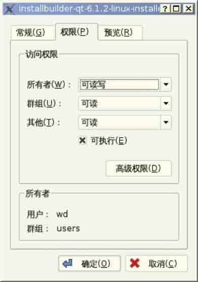

图 2-2 第 2 步：设置文件的权限

当然，你也可以采用命令行的方式，完成文件权限设置，命令如下 :

```cpp
$ chmod 755 qt-sdk-linux-x86-opensource-2009.03.bin 
```

第 3 步：开始安装

用 cd 命令切换到你这个文件所在的目录，运行安装程序，方法是：

```cpp
$ ./qt-sdk-linux-x86-opensource-2009.03.bin 
```

在有的发行版里面，直接双击这个文件就可以开启安装进程，比如 Red Flag 和 Qomo（原 Everest），赞一下，确实方便用户；而其他多数发行版比如 Ubuntu、Fedora Core、 OpenSUSE、Mandriva 等，默认是不可以这样的。你还是老老实实的执行上述命令吧，否则他们会提示你这个文件是不识别的执行文件格式，或者干脆告诉你这个文件不完整， 好多朋 友遇到了这个情况，还误以为下载文件不成功的缘故。

好了，安装过程开启后应该如图 2-3 的情形，先解压。


图 2-3 开启安装进程

第 4 步：开始安装

这一步没有什么好说的，安装程序解压缩完毕后，将来到图 2-4 这个欢迎画面，点击【Next】按钮进入下一步。

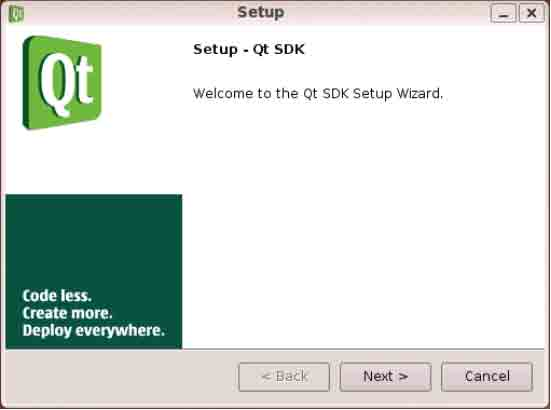

图 2-4 开始安装

第 5 步：接受授权协议

在图 2-5 这个画面，安装程序将对 Qt 采用的协议做一个说明，阅读完毕后，选择接受 协议那个选项，然后点击【Next】按钮进入下一步。

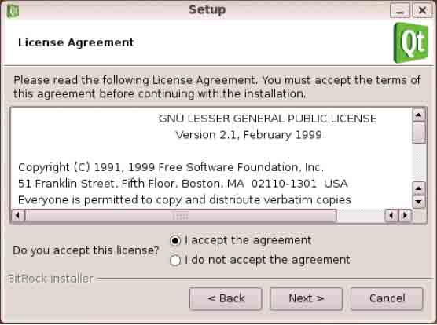

图 2-5 接受协议

第 6 步：选择安装路径

这一步是配置 Qt 的安装路径，如果没有特殊要求，建议选择默认路径。当然你也可以 修改，但是切记一点，就是不可以在路径中加入空格，否则以后很可能出现意想不到的问题。其实，如果你对研究了解一下 Qt 自身对变量、路径等的命名方式，就会发现它们都是不带空格的，如果确实需要隔开的话，就用 -好了。选择好之后，在图 2-6 中点击【Next】 按钮进入下一步。

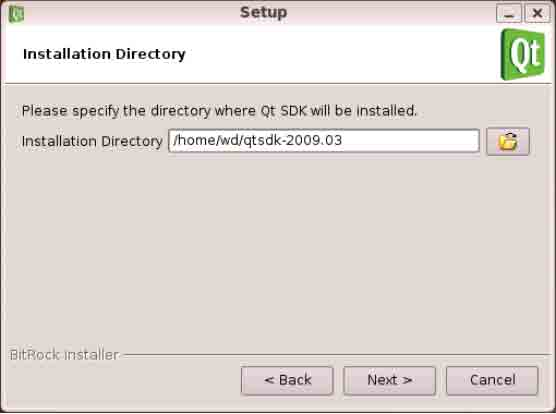

图 2-6 选择安装路径

第 7 步：选择安装组件

在图 2-7 所示的选择安装组件对话框中，有两个选项，其中 Qt Creator 是必选的，Qt Development Libraries 也是建议选择，否则我们是干什么来了，就是要使用 Qt 的库阿，点击【Next】按钮进入下一步。

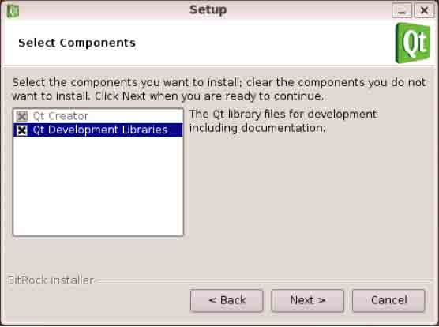

图 2-7 选择安装组件

第 8 步：开始安装

这一步没有什么好说的，在图 2-8 上点击【Next】按钮开始安装。

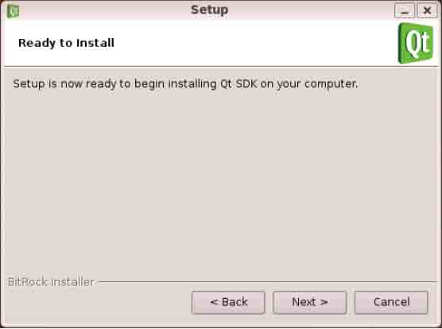

图 2-8 准备开始安装

第 9 步：安装过程

这一步我们做看客，静静等候安装结束，这个过程大约需要若干分钟。如图 2-9 所示 的画面显示了详细的安装进度和内容，如果想取消，可以点击 【Cancel】按钮。

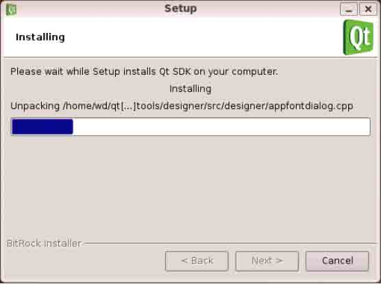

图 2-9 安装进行中

第 10 步：安装过程结束

如果到了图 2-10 这一步，并且中间没有提示错误，那么安装过程就结束了，选中那个 复选按钮，以验证是否成功。

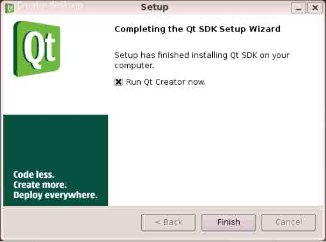

图 2-10 安装成功

第 11 步：验证安装

一切正常的话，如图 2-11 所示 ，Qt Creator 将会来到你的面前，表示安装成功了。 Qt Creator 是 qtsoftware 官方出品的 IDE，以后我们还会讲到它。

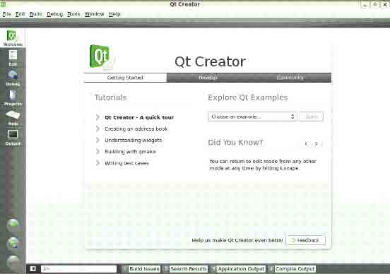

图 2-11 运行 Qt Creator 以验证安装

第 12 步：配置 Qt 环境

如果你今后完全使用 Qt Creator 来编程的话，不配置 Qt 环境也无妨，因为 Qt Creator 会准确的找到你的 Qt 安装位置。但还是建议配置一下，因为在很多情况下我们还

是要用到基本的命令。

关于 Qt 环境变量的配置，请参见后面的第 2.4 节。

2.编译安装的方法

从 qt 的网站中下载文件 qt-x11-opensource-src-4.5.2.tar.gz(在写作本书时采用的 就是这个版本，但当你阅读此书时，使用的文件可能已经发生了改变 )。在 X11 中，要把 Qt 安装到它的默认位置，需要拥有 root 权限。如果没有 root 权限，那么请使用 config 工具 的-prefix 选项来指定一个你具有操作权限的目录。

第 1 步：把当前路径切换到你存放下载文件的目录处 例如：

```cpp
cd /tmp; 
```

第 2 步：解压缩该压缩文件

命令是：

```cpp
gunzip qt-x11-opensource-src-4.5.2.tar.gz

tar xvf qt-x11-opensource-src-4.5.2.tar 
```

此时会生成一个/tmp/qt-x11-opensource-src-4.5.2 目录。Qt 需要的是 GNU 的 tar 工具，而在某些系统中它称为 gtar。

第 3 步：运行 configure

在整个的编译过程中，configure 这一步很关键。configure 的作用有两个，一是生成 平台相关的 qmake；二是配置 Qt 的 Feature，比如源文件放在哪里，库在哪里，是否支持 OpenGL 等等。

用你喜欢的选项来执行 configure 工具，它可用于编译 Qt 库以及与 Qt 一起提供的工 具软件：

```cpp
cd /tmp/qt-x11-opensource-src-4.5.2

./configure 
```

要查看 configure 的配置选项列表，可以运行./configure -help 命令。

如果 configure 失败，可以以使用-v 选项查看具体的原因，命令是./configure -v 如果以后需要在这次配置的基础上更改选项，先要运行 make confclean 命令以清除之前的配置。

第 4 步：执行 make

这一步是根据 configure 时由 qmake 生成的 makefile 来编译 QT 库。只要前面配置好 了，一般不会出什么问题。

要编译 Qt，输入命令：

```cpp
make 
```

这样将会生成 Qt 库，同时也会编译所有的演示程序、示例程序和工具软件。在某些系统中，make 命令称为 gmake。 第 5 步：安装 Qt 输入命令：

```cpp
su -c “make install” 
```

然后输入 root 密码。（在某些系统中，上述命令是： sudo make install）这样就可以把 Qt 安装到/usr/local/Trolltech/Qt-4.5.2 目录中。如果要改变安装路径，那么可以 在 configure 命令的后面使用-prefix 选项来做到这一点。如果你已经对安装目录具有写操 作权限的话，那么只需输入以下命令即可：

```cpp
make install 
```

第 6 步：设置环境变量

如果使用的 shell 是 bash、ksh、zsh 或者 sh，那么请把以下两行代码添加到.profile 中：

```cpp
PATH=/usr/local/Trolltech/Qt-4.5.2/bin:$PATH

export PATH 
```

如果使用的 shell 是 csh 或者 tcsh，那么请把下面一行代码添加到.login 文件中：

```cpp
setenv PATH /usr/local/Trolltech/Qt-4.5.2/bin:$PATH 
```

如果使用了 configure 的-prefix 选项，那么请使用你自己指定的路径来代替这里给出的默认路径。

如果你正在使用的编译器不支持 rpath 命令，那么还必须扩展 LD_LIBRARY_PATH 环境 变量，使其包含/usr/local/Trolltech/Qt-4.5.3/lib。对于带有 GCC 的 Linux 用户来讲， 则没有必要执行这一步。

第 7 步：验证安装 在命令行输入：

```cpp
qmake -v 
```

看看输出是什么。

举个例子，如果你看到的是如下的输出，则表示你的 qmake 链接指向 Qt3.3.8 的版本 而不是 Qt4.5，你需要检查你的安装是否成功，以及环境变量是否配置正确。

```cpp
[wd@localhost ~]$ qmake -v

Qmake version: 1.07a (Qt 3.3.8)
Qmake is free software from Trolltech ASA. 
```

如果你看到如下的信息，则表示你的 Qt 4.5 配置成功了。

```cpp
[wd@localhost ~]$ qmake -v

QMake version: 2.01a (Qt 4.5.2)
QMake is free software from Trolltech ASA. 
```

第 8 步：删除源码和配置文件

这一步是可选的，运行 make clean 命令后，可以删除掉本次安装时的源码和配置文 件，这样可以节省空间。笔者做过测试，以安装 Qt4.5 版为例，如果采用 configure - static -release 的参数编译，执行 make clean 后，大约可以节省 500 Mb 的空间。

如果你想以后在不改变原来配置的基础上，多编译一些内容，比如数据库驱动的话， 就不要执行这个命令了。

小贴士：如果你还需要要编译 Qt3 的程序，你最好使用其它的用户进行安装，并建立 Qt3 对应的环境变量。实际应用中，还存在这种情况，就是系统中自带了 Qt3 的包，而你又编 译安装了 Qt4 库，那么使用中最方便的调用 Qt4 库的方法是将命令 qmake 改为输入 qmake- qt4

专题：如何编译数据库驱动

Qt 在采用缺省安装参数进行编译安装的情况下，是不配置安装数据库驱动的，所以你 如果要驱动数据库，就需要在 configure 的时候，配置相应的参数。这方面的详细说明， 可在安装完成后的 Qt Assistant 的中搜索与 SQL Database Drivers 相关的条目查到。

下面说说如何安装 psql, odbc, sqlite, mysql 的驱动。 在 configure 的时候，要加上配置项，命令如下：

```cpp
./configure -plugin-sql-mysql -plugin-sql-sqlite -plugin-sql-odbc -plugin-sql-psql 
```

但是在运行的时候，它会可能会提示你测试不到 mysql 函数。于是，要修改一下文件

```cpp
src/plugins/sqldrivers/mysql/mysql.pro（以上 mysql 的路径请根据你自己的实际情况 调整）。 
```

在最开始处，加上下面两行（具体的目录，需要你自己查看系统的实际位置） ：

```cpp
INCLUDEPATH += /usr/include/mysql
LIBS += -L/usr/lib/mysql 
```

保存后，退出来，然后运行:

```cpp
./configure -plugin-sql-mysql -plugin-sql-sqlite -plugin-sql-odbc -plugin-sql-psql -continue 
```

再然后，就和其它的一样了，依次执行：

```cpp
make
make install 
```

但是在安装后，你会发现，mysql 的驱动并未在 sqldriver 目录下面，于是再转到

src/plugins/sqldrivers/mysql/目录下，运行：

```cpp
make 
```

然后把 plugins/sqldrivers/目录下面的 libqsqlmysql.so, libqsqlmysql_debug.so

这几个文件拷贝到/usr/local/Trolltech/Qt 4.5.2/plugins/sqldrivers 目录下面，这样 就可以了。

可能有的同学会问到，如果自己已经按照默认的参数配置安装完了 Qt4，但又想使用数 据库驱动，是不是要重新编译一次呢？从理论上来说，是要重新编译，但实际上不用重新编 译，这是由 make 机制决定的，只要你 make install 后源代码及编译后的东西没有删除， 也就是没有使用 make clean 命令的话，编译的时候 qmake 会自动的略过已经编译过的东 西，而只编译另外附加的数据库驱动。

### 2.3.2 Qt/Windows 的安装

从 4.5 版以后，Qt 的安装有了多种选择，你也可以像以前那样，从源代码包编译安 装；也可以用 Qt 最新提供的 SDK 安装程序安装。

1.使用 Qt SDK 安装

下面笔者给出一个 Qt4.5 opensource 版 SDK 安装的图文过程，操作系统是 Windows XP SP2 中文版，Qt 版本是 qt-sdk-win-opensource-2009.03 版，这一过程在 Windows Vista 上也是类似的，请大家参考使用。

第 1 步：下载

这一步不用多说了吧，到 qtsoftware 网站，如果英文不熟悉，先切换到中文版，方法 是在右上角点那个五星红旗，如图 2-12 所示。然后在下载链接里面选择 windows 平台上对 应的版本，就是下载 Qt SDK for Windows* (194 Mb) 这一项，你下载到的文件名字类似于 qt-sdk-win-opensource-2009.03.exe。

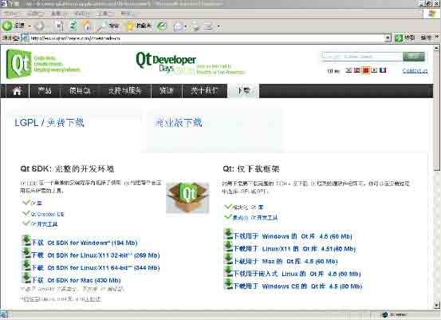

图 2-12 下载 Qt SDK for Windows

第 2 步：在本地双击安装 安装程序将先解压，这个过程大概有若干分钟，视你的机器配置而有不同，程序自解压完成后，将进入下一步，如图 2-13 所示


图 2-13 在本地双击安装

第 3 步：同意遵守授权协议

在下图 2-14 中同意遵守授权协议，或者按下 Alt+A 键即可，点击【Next】按钮，进入 下一步。

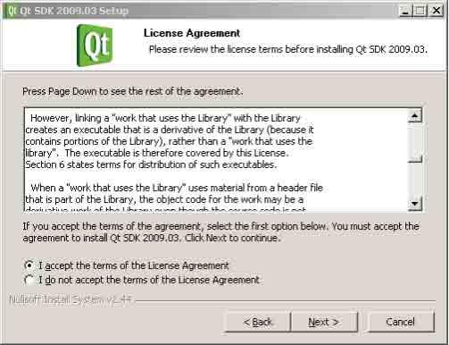

图 2-14 遵守 Qt 协议

第 4 步：了解与 Qt 集成的调试器（debugger）的内容

如图 2-15 所示，其内容大意是说，默认 Qt 将选择 gdb 作为调试器，它是集成到 MinGW 里面的，MinGW 会随着本安装程序一同安装；而如果要使用 CDB 作为调试器的话，需要到微 软的网站上取得，因为使用 VS 创建的项目将使用 CDB 作为调试器。此外，该版本的 Qt Creator 目前只支持 32 位调试模式。

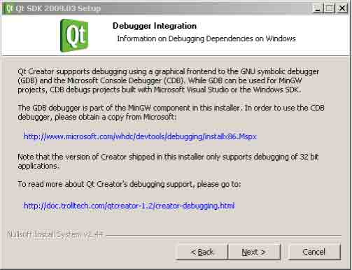

图 2-15 了解 Qt 调试器的内容

第 5 步：选择安装组件

如图 2-16 所示，默认情况下，安装程序推荐你安装所有 5 项组件中的前 4 项，其中第 1 项是默认必需的，我们建议遵从默认的选择；点击【 Next】按钮进入下一步。

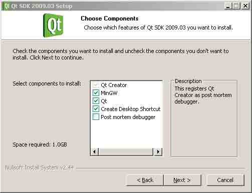

图 2-16 选择安装组件

还有要说明的是最后一个选项：Post mortem debugger，它的意思是程序崩溃后调试的工具，类似 coredump 之类的。注意，post mortem 是一个结合在一起才有意义的词。举 个例子，有时候程序崩溃了，会问你要不要用 visual studio 调试。选上这个框之后，在应用程序崩溃时，就可以调用 Qt Creator 直接调试了，所以你也可以把它选择上。

第 6 步：选择安装路径

这一步比较容易，大家可以根据需要调整 Qt SDK 的安装路径，然后可以点击【Next】 按钮进入下一步，如图 2-17 所示。在这里仍然提醒路径中不要包含空格和特殊字符。

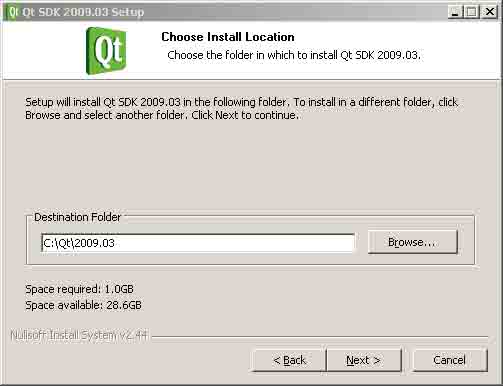

图 2-17 选择安装路径

第 7 步：调整快捷方式的名称

这一步也容易，你可以根据需要调整安装后在程序菜单上显示的快捷方式的名称，然后点击【Next】按钮进入下一步，如图 2-18 所示。

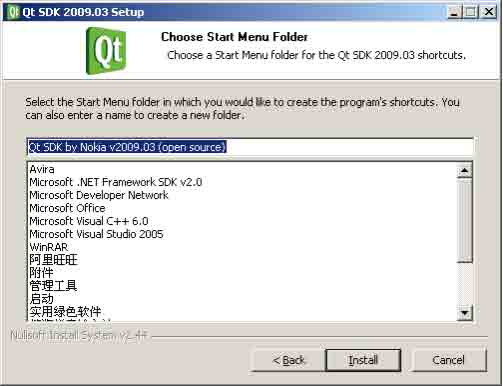

图 2-18 调整快捷方式的名称

第 8 步：安装过程进行中

到这一步后，你就只能做看客了，静静等待安装过程进行。如果想看仔细，就点击那 个【Show details】按钮，如图 2-19 所示。

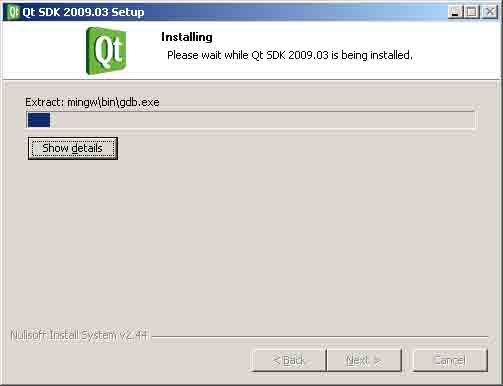

图 2-19 安装过程正在进行

第 9 步：安装过程告一段落

通常安装到这一步，并且中间没有弹出什么错误提示之类的情况，就基本成功了，点 击【Next】按钮进入下一步，如图 2-20 所示。

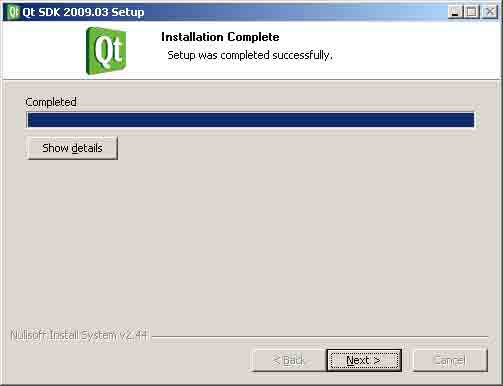

图 2-20 安装过程告一段落

第 10 步：安装结束

安装程序会提示你安装过程成功结束，并且建议你立即运行 Qt Creator 验证和体验一 下，点击【Finish】按钮，如图 2-21 所示。

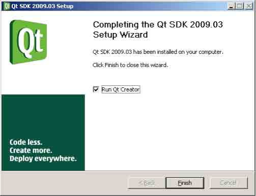

图 2-21 安装结束

第 11 步：验证安装，运行 Qt Creator

一切顺利的话，Qt Creator 会来到你的面前，请看图 2-22。

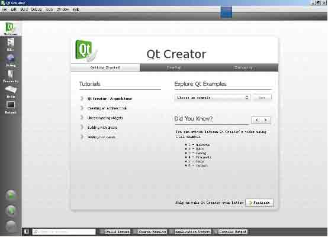

图 2-22 运行 Qt Creator 成功

好了，安装过程到此结束，接下来还是需要配置环境变量，请参阅后面的章节。

2.从源代码编译安装

第 1 步：准备工作

首先就是确定你要安装的 Qt 版本和需求，如是 OpenSource 还是 Commercial 版，准备 与 MinGW 集成还是与 VS 系列集成（这方面内容在后面第四章会讲到）等等。下面的几个原 则很有用：

*   在 windows 上编译安装 Qt 最好遵循一定的顺序 首先安装操作系统，再安装你选定的编译器 或 IDE，然后再安装 Qt。
*   安装操作系统时不要选择精简版或 home 版等 因为某些库环境不完全，可能会出现问题。
*   创建一个干净的系统环境

在我们这里是与 MinGW 集成，所以就先安装它，不要安装其他的编译器。 举个例子，如果你的计算机上安装了 Borland C++ Builder， 在它的目录下有个 make.exe 文件，系统可能会把 MinGW 下的 make.bat 文件搞错，从而导致不能正常编译。

做好了上面这些，就可以开始安装了。 第 2 步：安装 MinGW

MinGW 是 Minimallist GNU for Windows 的缩写，是在 Windows 上的 GNU 工具集。在 Windows 上安装开源版 Qt，首先需要安装 MinGW。安装 MinGW 有几种方法，一种是从网站上 下载安装，一种是通过安装 dev-cpp 来安装 MinGW。

第一种方式：

首先是下载 MinGW，有几个可以下载 MinGW 的网站： 官方网站： [`www.mingw.org/`](http://www.mingw.org/)

sourceforge 的网站：[`mingw.sourceforge.net`](http://mingw.sourceforge.net) 本书写作时的使用的版本是最新的 MinGW-5.1.4，你下载到的文件名字类似于 MinGW-5.1.4.exe 或者是 MinGW-5.1.4-2008-12-4.exe，前者实际上是网络安装的一个链接，后者是完整的本地安装版本，大约有 13Mb 的样子。你使用哪一种都可以，速度都够快，安装过 程是一样的。下面就给出关键步骤的图文说明：

然后双击安装程序，出现如图 2-23 所示的欢迎画面。

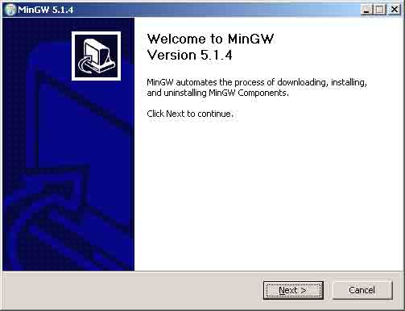

图 2-23 MinGW 安装程序欢迎画面

单击【Next】按钮，进入下一步的下载安装界面， 如图 2-24 所示。选择第一项，即下 载的同时安装，单击【Next】按钮进入下一步。

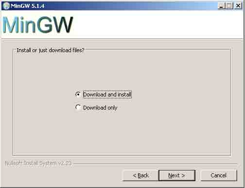

图 2-24 选择下载方式

接下来这一步是阅读并同意协议授权，单击【 I Agree】按钮，进入下一步。

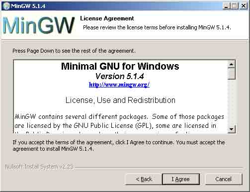

图 2-25 阅读并遵守协议

这一步是询问你需要 MinGW 的版本，有 3 个选项：Previous、Current 和 Candidate， 分别对应以前的、当前的和预发行的版本，选择 Current 即当前版，单击【Next】按钮进 入下一步。

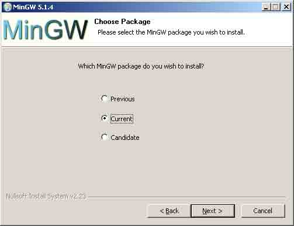

图 2-26 选择安装包类型

如图 2-27 所示，这一步是选择要安装的 MinGW 的组件，我们需要的是 gcc、g++ compiler、MinGW Make 这几个选项。选中后，点击【Next】按钮进入下一步。

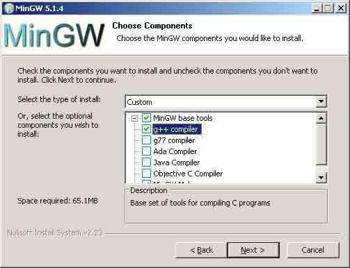

图 2-27 选择 MinGW 组件

接下来的两步分别是选择安装路径和配置快捷方式的名称，选择缺省，一路点击【Next】按钮即可。然后安装程序会开启网络安装进程，如图 2-28 所示。

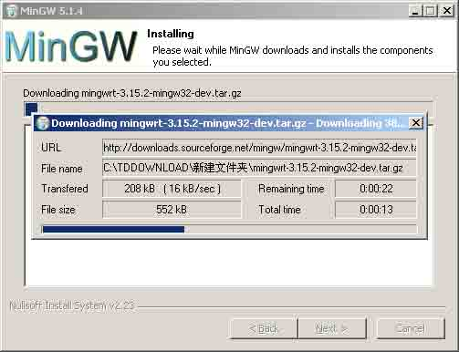

图 2-28 网络安装进程

约莫十来分钟的时间，安装过程顺利结束。

第二种方法步骤如下：

首先是下载安装文件，需要下载 Dev-cpp。Dev-C++是一个 Windows 下的 C 和 C++程序 的集成开发环境。它使用 MinGW32/GCC 编译器 。我安装的是 devcpp-4.9.9.2_setup.exe ，Dev-cpp 的官方网站是 [`www.bloodshed.net/`](http://www.bloodshed.net/) ，可以登录上 去下载最新的版本。

然后是执行安装文件。先执行 devcpp-4.9.9.2_setup.exe 文件。其中，需要注意的 是【组件选择】对话框，如图 2-29 所示。请勾选上【Mingw compiler system】。

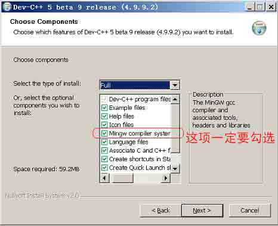

图 2-29 选择安装组件 接下来就是都选择默认选项，一路点击【 Next】按钮直至安装结束。 第 3 步，下载并解压缩 Qt 源代码

你下载到的源代码文件类似于 qt-win-opensource-src-4.5.2.zip，把它解压缩到你想安装 Qt 的目录，比如是 d:\Qt\OpenSource。请注意， 在 Qt 的应用中，路径大都可以自定,但是 尽量不要在路径中包含空格、中文或其它的特殊字符，否则可能会出现意想不到的问题。

第 4 步，编译 Qt 源代码

运行 cmd 命令进入 DOS 窗口，使用 cd 命令进入你的 Qt 源代码的目录，比如这里是 D:

```cpp
\Qt\OpenSource\qt-win-opensource-src-4.5.2 
```

屏幕显示如下：

```cpp
C:\&gt; D:
D:\&gt; cd D:\Qt\OpenSource\qt-win-opensource-src-4.5.2 
```

运行 configure 命令进行配置，输入 configure -help 可以获得选项的列表并使用自

定义的选项。比如要同时配置 debug 和 release 版本，可以输入命令 configure -debug- and-release，屏幕显示如下：

```cpp
D:\Qt\OpenSource\qt-win-opensource-src-4.5.2&gt;configure -debug-and-release 
```

这一步类似于在 X11 上编译 Qt 时 configure 的情形，大约有十几分钟就可以完成了。

然后运行 MinGW 的 make 工具，命令是 mingw32 –make。 屏幕显示如下：

```cpp
D:\Qt\OpenSource\qt-win-opensource-src-4.5.2&gt; mingw32-make 
```

这个过程比较长，大约几个小时。编译成功后，可以手动创建桌面快捷方式如

qtdemo、designer 等。Qt Windows 开源版本不同于 X11 上的版本，不需要安装，编译成功 后就可以使用。

第 5 步，设置环境变量

按下 Ctrl+Break 进入系统设置，也可以从控制面板进入，选择 “高级→环境变量”， 显示如图 2-30 所示。

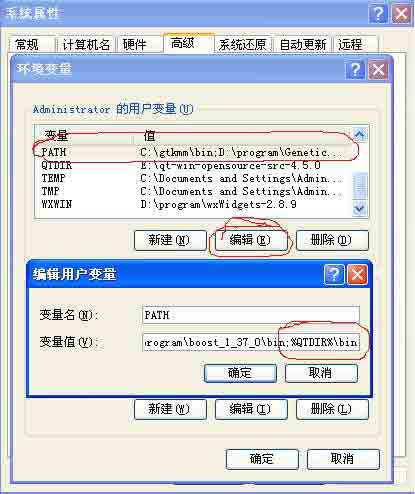

图 2-30 设置环境变量

在用户变量中设置 PATH 环境变量为：d:\Qt\OpenSource\qt-win-opensource-src- 4.5.2;%P%ATH。

小贴士：在 Windows Vista 中，需要对 MinGW 进行额外的设置才能正常使用，具体步骤如 下：

设置 GCCPREFIX 环境变量为 MinGW 的安装目录，如：C:\MinGW；

设置 PATH 环境变量为%GCCPREFIX%\libexec\gcc\mingw32\4.0.0:%PATH%，其中 4.0.0 的版本号需要根据你的 GCC 版本实际情况调整；

编译 Qt 的步骤与 Windows XP 上相同。

3.从框架安装程序安装

(1) 下载安装文件

在本书还在写作时，Qt 在 Windows 下的安装程序称为 qt-win-opensource-4.5.2- mingw.exe。这个版本号可能与你阅读本书时所看到的版本号有所不同，但其安装过程应当 是相同的。要开始安装过程，请先到 qtsoftware 网站上把这个文件下载下来并运行它。

(2) 安装 MinGW

在执行框架安装程序之前，必须先安装 MinGW，安装步骤清参考上一节，这里不再赘述。

(3) 执行安装

双击执行 qt-win-opensource-4.5.2-mingw.exe 文件。开头的几步与使用 SDK 安装过 程类似，直到如图所示的【选择安装组件】这一步，列表中有两项，其中 Qt4.5.2 这一项 默认必选，而“File Associations”这一项是建立.ui 文件与 Qt Designer 的关联，建议 选上。

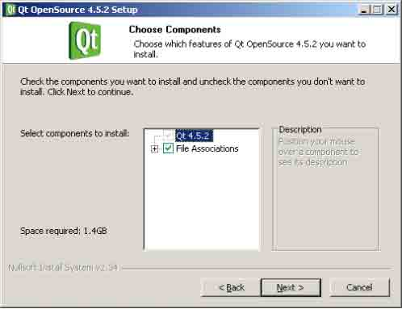

图 2-31 选择 Qt 组件

接下来的两步是选择 Qt 的安装路径和配置快捷方式，选择默认即可，再次提醒路径可 以自行决定，但不能包含空格和特殊字符。

下面这一步是安装过程中最为关键的。

如果你在前面还没有安装 MinGW，没有关系，在图 2-32 所示的画面中选择【Download and install minimal MinGW installation】，安装程序会先连接到 MinGW 的官方网站， 下载并安装 MinGW。但根据笔者的体会，MinGW 的网站比较访问量比较大，下载速度较慢， 所以种这方式相当耗费时间，一般光是这一步就要用去一个多小时的时间。

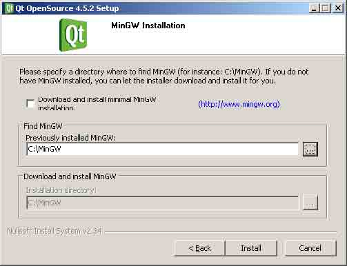

图 2-32 指定 MinGW 的位置（缺省选择）

如果你在前面已经安装了 MinGW，就不要选中【Download and install minimal MinGW installation】，而是在【Find MinGW】框中选择你安装的 MinGW 的实际路径。如果前面 安装 MinGW 时，你是用直接安装的方式，并采用默认的路径，这里你的选择就是如图 2-32 所示缺省的路径；如果你是采用安装 DevCpp 的方式安装 MinGW 的，就在其中选择为 Devcpp 的路径，如图 2-33 所示。


图 2-33 指定 MinGW 的位置（devcpp 方式）

后面的步骤就简单了，一路点击【Next】按钮直至安装结束，与 SDK 安装过程大致相 同，不再赘述。

(4) 后续工作

安装完成后，你将会在 Windows 的“开始”菜单中看到一个名为“Qt by Nokia(OpenSource)”的新的程序组。在这个程序组中，有指向的快捷方式，还有命令行提 示符（Qt4.5.2 Command Prompt）的快捷方式，它可以打开一个控制台窗口。打开这个窗口 后，它能够自动设置使用 MinGW 编译器编译 Qt 程序所需要的环境变量。在这个窗口中，可 以运行 qmake 和 make 命令来编译 Qt 应用程序。

(5) 配置环境变量 这与上一节中的步骤相同，把路径改为你安装的路径即可 。

4\. 三安装方式的比较

在上面提到的 3 种安装方式中，采用 SDK 的方式无疑是最为便捷的，所需时间最少， 安装的组件最为全面，这也是官方重点推荐的方法，笔者也推荐。

采用源代码编译安装的方法是比较复杂的，尤其是在 Windows 上。而且这种方式并没 有安装 Qt Creator，它是“官方”推出的 IDE，也很好用。但这种方式能够使你更灵活的 配置你的 Qt 功能和版本，而且在这个过程中的苦辣酸甜都会使你对 Qt 的理解更进一步， 笔者也推荐这种方法。

采用框架安装的方式在难易度上介于前两者之间，安装过程算不上便捷，它也没有同 时安装 Qt Creator。此外，采用这种方法也相当耗费时间，光是下载和安装 MinGW 就要个 把小时，其中还要指定 MinGW 的位置，也可能出错。 比较起来，笔者不是很推荐采用这种方法。

所以，在 4.5 版以后，建议尽量采用 SDK 安装。随着学习的深入，并且需要灵活的配 置 Qt 库，那么就选择第二种的编译安装的方法。当然，如果你有时间，把这 3 种方式都熟 悉一下，是再好不过了，在这个过程中你会不断加深对 Qt 的理解，打牢你的基础，这对于 后来的学习过程有极大的裨益。

5.一点说明

Qt4.5 SDK 不能安装在 Windows 2000 平台上，这点在官方网站上并未说明，但事实确 实如此。

### 2.3.3 Qt/Mac 的安装

在把 Qt 安装到 Mac OS X 之前，必须已经安装了 Apple 的 Xcode Tools 工具包。这些 工具包通常会包含在和 Mac OS X 一起提供的那些 CD（或者 DVD）中，也可以从 Apple Developer Connection 中下载这些工具包，网址是 [`developer.apple.com。`](http://developer.apple.com。)

如果使用的是 Mac OS X 10.4 和 Xcode Tools2.x（with GCC 4.0.x）或者是之后版 本，那么就可以使用如下描述的安装步骤；如果使用的是 Mac OS X 的早期版本，或者 GCC 是一个较早的版本，那么将需要手动安装这个源码包。该源码包的名称是 qt-mac- opensource-4.5.2.tar.gz，并且可以从 qtsoftware 的网站中下载它。如果要安装这个软 件包，就可以参照 X11 上编译安装 Qt 的方式，不要忘记配置 Qt 环境。

要使用安装程序安装 Qt，请下载 qt-mac-opensource-2009.03.1.dmg（在本书写作时 采用的就是这个版本，但当你阅读此书时，版本号可能已经与此有所不同了）。双击这 个.dmg 文件，然后再双击这个 Qt.dmg 软件包。这样将会启动安装程序，它会把 Qt 的文档 及其标准示例程序与 Qt 一起安装在/Developer 目录中。

要运行像 qmake 和 make 这样的命令，就需要使用一个终端窗口，例如，/Applications/Utilities 目录中的 Terminal.app。还有的情况就是要用 qmake 生成一个 Xcode 工程。例如，要为 hello 这个例子生成一个 Xcode 工程，就需要先打开一个控制台， 比如 Terminal.app，然后把当前路径切换到 examples/chap01/hello，并且输入一下命令：

```cpp
qmake -spec macx-xcode hello.pro 
```

在 Mac OS X 上安装 Qt 的过程与 X11 上的情形很相似，只是目录有所不同，不再赘述。

### 2.3.4 Qt/WinCE

嵌入式系统中经常采用 WinCE 作为操作系统，因而在 WinCE 上安装 Qt 是很常见的，下 面就讲讲这方面需要注意的问题。本节将以一个实际的例子来说明整个的过程。 笔者的使用 的 Samsung i718 是基于 arm9 和 WinCE 的一款智能手机，如何在这个平台上面构建我需要的 Qt 开发环境呢。下面就是笔者的构思过程。

1.确定需求

了解需求这一步很重要，这可以使你少走弯路。比如要弄清楚，你在开发机上要使用什么操作系统，Windows 2000 还是 Windows XP，Vista；Qt4.5 是否支持它们，你的手持设备的操作系统是标准系统还是设备制造商自行定制的版本，开发平台是否匹配等。你一般还 需要在目标机和开发机之间传输文件和数据，这需要一个同步软件。

Qt 官方宣称从 4.5 版起，正式支持 Win CE，并已经在 Visual Studio 2005 上做过验 证，桌面操作系统（开发机）可以是 Windows XP 和 Windows Vista。Windows 2000 系列 并不在支持列表中，所以就不要选择了，至于选择那些古董级的 Windows Me、98 就更不现 实了，好在好像也很少有人这么做。

目标机系统可以是下列几种：

*   Windows CE 5.0 for ARM, X86, SH-4 and MIPS
*   Windows CE 6.0 for ARM generated using the defaults found in Platform Builder
*   Windows Mobile 5.0 (Pocket PC, Smartphone and Pocket PC with Phone editions)

Windows Mobile 6.0 (Standard, Classic and Professional editions) 另外，你需要知道的是 Win CE 和 Windows Mobile 的关系，它们并不是等同的。 当然，你的手持设备制造商往往会自行定制一个基于上述系统的操作系统版本，你必须针对这些特点，有选择的调整编译参数，这样才能使 Qt 很好的支持开发。

我们回到实际的例子中。经过考虑，我决定开发机采用 Windows XP SP2 版，使用 Visual Studio 2005 中文版并打上 SP1 补丁，目标机是基于 Windows Mobile 5.0 Pocket PC 的，所以我们需要使用 Windows Mobile 5.0 Pocket PC SDK；另外，同步传输软件采用 Microsoft ActiveSync4.5 简体中文版，这可以在 Microsoft 的网站上下载到；Qt 库选用 qt-embedded-wince-opensource-src-4.5.2。表 2-1 归纳了我的需求分析的结果和最终的 系统选型。

表 2-1 需求分析及最终选型

| 需求 | 选型 |
| --- | --- |
| CPU 架构 | arm 系列（arm9） |
| 开发机操作系统 | Windows XP SP2 中文版 |
| 目标机操作系统 | Windows Mobile 5.0 Pocket PC |
| 开发机使用的 SDK | Windows Mobile 5.0 Pocket PC SDK |
| 同步软件 | Microsoft ActiveSync4.5 简体中文版 |
| Qt 库 | Qt/Win CE 4.5.2 |
| 开发 IDE | Visual Studio 2005 SP1 中文版 |

2.下载软件包

表 2-2 归纳了需要的软件包和下载地址。

表 2-2 软件包和下载地址

| Windows Mobile 5.0 Pocket PC SDK | [`www.microsoft.com`](http://www.microsoft.com/) |
| --- | --- |
| Microsoft ActiveSync4.5 简体中文版 | [`www.microsoft.com`](http://www.microsoft.com/) |
| Visual Studio 2005 SP1 中文版 | 购买 |
| Qt/Win CE 4.5.2 | [`www.qtsoftware.com`](http://www.qtsoftware.com/) |

3.安装软件

按照以下步骤进行安装，次序不可弄错。

*   安装 VS2005，很简单，按照向导来，在自定义安装中务必选择 “智能设备开发”。
*   安装 Microsoft ActiveSync4.5 中文版，一路选择缺省配置即可；
*   安装 Windows Mobile 5.0 Pocket PC SDK，一路选择缺省设置即可；
*   安装 Qt/Win CE ，下载到的文件名字类似于 qt-embedded-wince-opensource-src- 4.5.2

这里又分为几个步骤：

(1) 解压 将解压后的文件夹放到一个不含空格、中文字符和特殊字符的路径中，比如我的是：

```cpp
d:\qt\qtWinCE，qtWinCE 即为此文件夹。 
```

(2) 设置环境变量

鼠标右键单击“我的电脑”－>“属性”－>点“高级”标签－>“环境变量”选项－>

在"PATH"中添加路径“d:\qt\qtWinCE\ bin”。

(3) configure

进入到 VS2005 的命令行中，进入解压的文件夹，然后执行命令：

```cpp
configure -platform win32-msvc2005 -xplatform wincewm50pocket-msvc2005 
```

对于我的机器，也可以使用下面的命令，指出了具体的软硬件平台 ：

```cpp
configure -platform win32-msvc2005 -xplatform wince50standard-armv4i-msvc2005 
```

当然我们仍然可以运行 configure -help 命令来查看 configure 的参数选项，并根据自己的开发板及手机配置来选择其它的嵌入式的 xplatfrom，要了解这些信息，你可能需要 查看 Qt 所支持平台的 readme 文件里面的说明。configure 这个过程大约需要十几分钟。

(4) 更新环境变量

configure 正确完成后，为了使你的资源能够被目标机系统正确的找到，需要更新 Qt 环境变量，主要包括 PATH, INCLUDE 和 LIB 。命令如下：

```cpp
set INCLUDE=C:\Program Files\Microsoft Visual Studio 8\VC\ce\include;C:\Program Files\Windows CE Tools\wce500\Windows Mobile 5.0 Pocket PC SDK\Include\Armv4i
set LIB=C:\Program Files\Microsoft Visual Studio 8\VC\ce\lib\armv4i;C:\Program Files\Windows CE Tools\wce500\Windows Mobile 5.0 Pocket PC SDK\Lib\ARMV4I
set PATH=C:\Program Files\Microsoft Visual Studio 8\VC\ce\bin\x86_arm;%PATH% 
```

(5) 运行 nmake

根据你机器配置的不同，大约需要 1 到若干个小时不等。nmake 执行成功后，你的 Qt for Win Ce 就可以使用了。

小贴士：一定要使用 VS 2005 打上 SP1 的的补丁。Qt/Win CE 的安装相对比较容易，但是更 新环境变量那一步容易被忽略。

### 2.3.5 Qt/S60

自 4.5 版后，Qt 将支持 S60，并且可以与 Qt Creator 集成。在笔者写作时，最新的版 本是 Qt for S60 的技术概览版（Technology Preview）Tower，这已经是第 2 个概览版 了，Qt for S60 完全版计划于 2009 年第四季度发布。虽说不是正式版，但它的安装方式 和特性与正式版并无太大差异。但请注意，技术概览版包含尚不成熟的代码，还未达到最终 发布产品的性能和兼容性。

1.了解需求

表 2-3 归纳了在 S60 上安装 Qt 所需的软件包名称以及它们的最低版本和需要的环境。

表 2-3 需要的软件包

| 软件名称 | 版本 | 说明 |
| --- | --- | --- |
| ActivePerl | 5.6.1 或者更高 | 执行脚本文件环境 |
| JRE | JRE 1.5 或更高 | Java 环境 |
| S60 SDK | S60 SDK 3rd FP2 for C++ 或更高（依硬件不同而不同） | Series 60 软件开发环境 |
| C++编译器 | Carbide.c++ V2.0、V C6.0 或更高（Qt4.5 不再支持 VC 6.0） | Carbide.c++、Visual C++等 |
| Qt for S60 source code | 4.5.2 或更高 | Samsung 部分手机有专门版本 |
| 操作系统 | Windows XP SP2 或更高 |

2.准备安装

如果安装过程中有意外，对应的帮助可以在 C:\qts60\doc \html\s60-with-qt- introduction.html 里找到。

表 2-4 归纳了我举例时选用的软件包和版本，还有获取它们的网址。

表 2-4 选用的软件包的详细情况

| 软件包 | 选用版本 | 下载网址 |
| --- | --- | --- |
| ActivePerl | 5.8.8 | [`www.activestate.com`](http://www.activestate.com/) |
| JRE | JDK7.0（含 JRE） | [`cn.sun.com`](http://cn.sun.com/) |
| S60 SDK | S60 SDK 3rd FP2 for C++ | [`www.forum.nokia.com`](http://www.forum.nokia.com/) |
| Carbide.C++ | V2.0 | [`www.forum.nokia.com`](http://www.forum.nokia.com/) |
| Qt for S60 source code | 4.5.2 Technology Preview Tower | [Http://www.qtsoftware.com](http://www.qtsoftware.com/) |
| Windows | Windows XP SP2 中文版 | 购买 |

小贴士：在安装 Qt for S60 之前，我们必须先安装配置好 S60 的开发环境。首先必须知道 的一件事情是，所有的与 S60 相关的开发工具，最好都安装在同一个逻辑盘里面，并且在 安装的路径中不要包含有空格，比如， "Program Files"，否则，可能安装不成功，或者在 后面的开发中会遇到莫明其妙的问题。我把所有这些软件全部安装到了 d:\QtS60 目录下 面。

再有就是安装这几个软件是有顺序的，其中最为重要的是在编译安装 Qt for S60 之 前，最后一个安装 Carbide.C++ ,否则，即使最后安装成功，却也可能不可以建立 Qt 工 程，切记！我选择的顺序是 ActivePerl、JDK、S60 SDK、Carbide.C++，最后是 Qt。

下面是详细的安装步骤。

(1) 安装 ActivePerl 这个也没有什么好说的了，基本是一路 点击【Next】按钮，其间只需要更改安装路径。我的情形如图 2-34 所示。

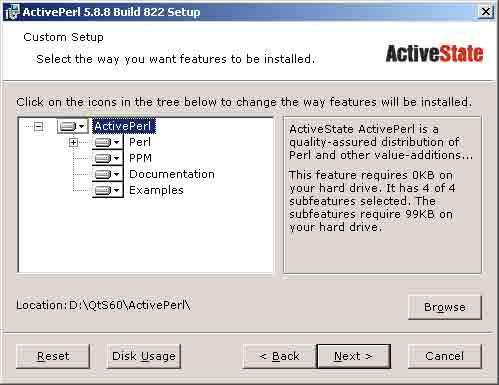

图 2-34 ActivePerl 安装路径

(2) 安装 JRE

我是安装的 JDK，中间过程需要关注 JDK 和 JRE 的路径。 安装 JDK 的路径如图 2-35 所示。

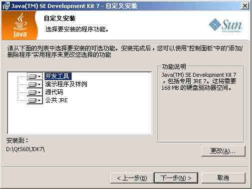

图 2-35 JDK 的路径

安装 JRE 的路径如图 2-36 所示。

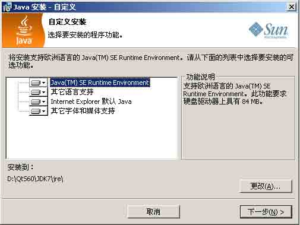

(3) 安装 S60 SDK 3rd FP2

图 2-36 JRE 的路径

这一步有几个地方需要注意，第一个是路径，我设置的路径如图 2-37 所示。

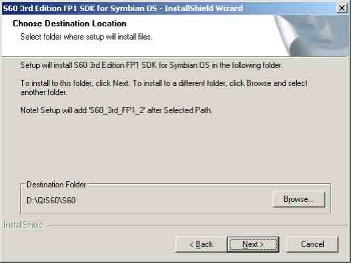

图 2-37 S60SDK 的路径

第 2 个地方是选择一下版本，我的情形如图 2-38 所示，这里只有一个选项，但必须选上才行。

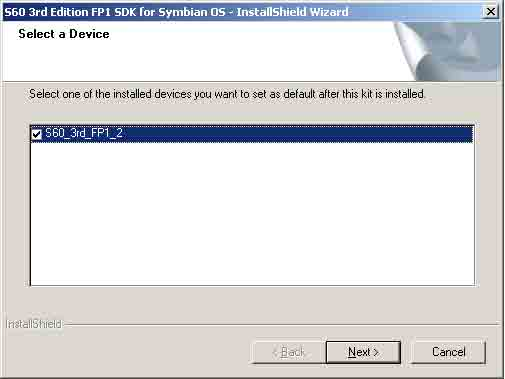

图 2-38 选择安装组件

然后都是选择缺省设置，一路点击【Next】按钮，就可以完成安装。 安装完成之后，验证一下是否可以成功启动 S60 的模拟器，如果启动不了，说明安装不成功。运行模拟器可以依次点击： Windows Start Menu | Programs | S60 Developer Tools | 3rd Edition FP2 SDK | v1.1 | Emulator, 这个过程如图 2-39 所示。

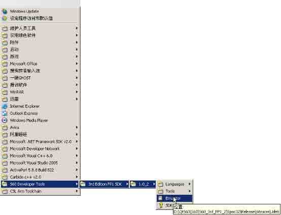

图 2-39 启动 S60 的模拟器

启动后的模拟器样子如图 2-40 所示，可以点选上面的手机按钮测试一下。

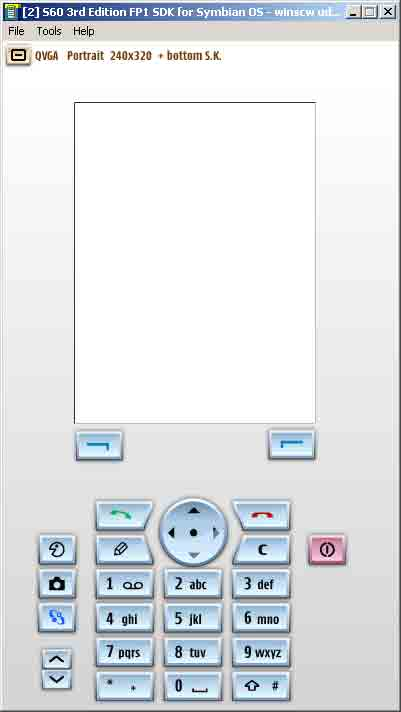

(4) 安装 Carbide.c++

图 2-40 S60 模拟器

这里有几个地方需要注意，一个是选择安装的版本， 如图 2-41 所示，这里选择 Professional Edition，它的功能最全。

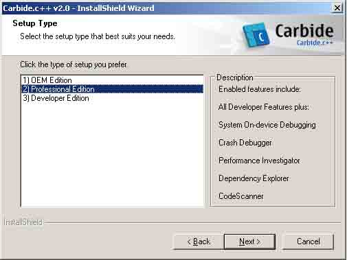

图 2-41 选择 Carbide.C++的版本

还有就是一直强调的路径问题，其情形如图 2-42 所示。

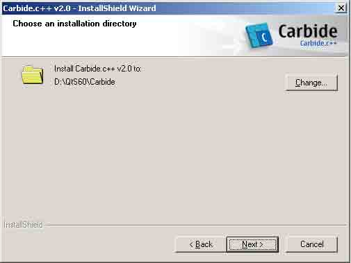

图 2-42 Carbide.c++的安装路径

选择好安装路径后，一路点击【Next】按钮，直至安装结束。这时，安装程序会如图 2-43 所示那样提醒你如果日后需要使用命令行工具，就需要配置 WINSCW 环境变量，如果完 全使用 IDE，则不必进行这一步。

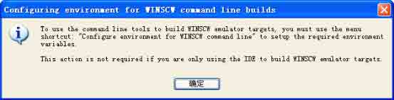

图 2-43 安装的提示

我是觉得有必要，按照提示的说法，编译一下 WINSCW 的环境变量，大约需要十几秒的 时间就好了，如图 2-44 所示。

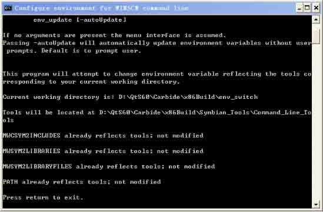

图 2-44 编译 WINSCW 环境

安装完成之后，启动 Carbide.c++，第一次运行 Carbide.C++，它会要求设置 workspace 的路径，这个也很重要，这个路径设置一定要和 S60 SDK 在同一个逻辑盘上，不 然，后面编译程序的时候会出错，如图 2-45 所示。

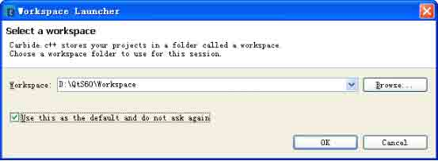

图 2-45 设置 Workspace

在启动之后，它会自动去扫描系统中的 S60 SDK，然后给出一个提示，需要重启 Carbide.c++，满足它的要求，点击 Restart 按钮重新启动即可，如图 2-46 所示。


(5) 安装 Qt for S60

图 2-46 Carbide.c++要求重新启动

首先是解压缩 Qt for S60 源代码包，把它放到与前述软件相同的逻辑盘中的一个路径 里面，这里是 d:\QtS60\QtS60SDK，路径可根据自己情况调整。

然后是配置环境变量，把 Qt for S60 的 bin 子目录路径加入到 PATH 中去，目的是要 在后面 configure 时找到 qmake 等工具。例如我的就是 d:\QtS60\QtS60SDK，可以通过命令 行或者【Control Panel】->【System】->【Advanced】->【Environment variables】来完 成。

接下来开始配置 Qt。打开一个一个命令行界面的窗口，切换到解压后的 Qt for S60 软 件包的目录，我的是 d:\QtS60\QtS60SDK，执行命令：configure -platform win32-mwc - xplatform symbian-abld 开始 configure。如图 2-47 情形，系统会首先询问要安装哪个版 本，商业版（commercial）还是开源版（Open Source），我们输入 o，选择开源版。

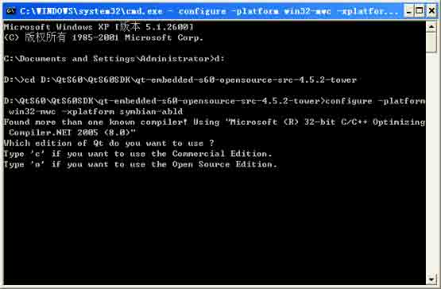

图 2-47 configure 的情形

这之后，如图 2-48 所示，Qt 会询问是否同意它的 License，当然接受，输入 y,按下回 车，开始配置。

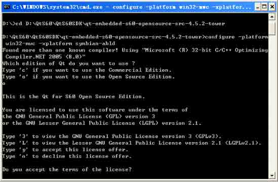

图 2-48 同意 Qt 授权

经过一段时间，configure 结束，我们开始编译 Qt。输入命令：

```cpp
make debug-winscw 
```

经过若干小时，编译结束，Qt 算是安装完成。注意，这里同样不需要 make install。接下来，我们需要配置一下 Carbide.c++，使它能够与 Qt 很好的集成。如图 2-49 所示，启动 Carbide.c++。

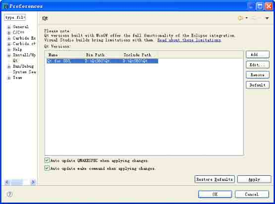

图 2-49 设置 Qt 的 Preference

然后依次点击主菜单的 Windows | Preference，在左边的列表中选择 Qt，然后点击右 边的【Add…】按钮，弹出对话框，如图 2-50 所示，添加添加 Qt 的目录，Version Name 一 项可以随意命名。

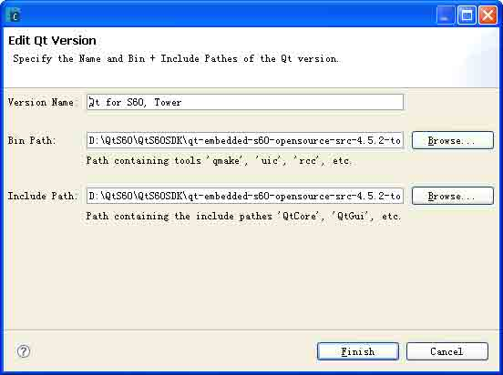

图 2-50 配置 Qt 的路径

好了，到这里 Qt for S60 开发环境就搭建完成了，在这个平台上的工作将是使用 Carbide.c++结合 Qt 进行来完成。

### 2.3.6 基于 Linux 发行版的安装

1.Red Hat 9.0

RedHat 9.0 是一个比较“古老”但直到现在还有很多人在使用的版本，在论坛上不时 的可以看到有朋友提问与安装 Qt 相关的问题。所以，笔者觉得有必要将 Red Hat 9.0 上安 装 Qt 的方法详细介绍给大家。

RedHat 9.0 上自带的 Qt 版本是 Qt3.1.1 的，并且 Red Hat 已经不再对它进行升级和支 持。所以一般只能采用编译源代码的方式来安装 Qt4。

(1) 下载 Qt4 源码包

先去官方网站下载 Qt 的源码包，版本为“qt-x11-opensource-src-4.5.2.tar.gz",下 载到 linux 中解压。

(2) 修改头文件链接 打开个终端，输入：

```cpp
ln -s /usr/kerberos/include/com_err.h /usr/include/
ln -s /usr/kerberos/include/profile.h /usr/include/
ln -s /usr/kerberos/include/krb5.h /usr/include/ 
```

这样设置的目的是防止在下面的编译中，报出一个常见的 “krb5.h”的错误。

(3) 修改头文件内容

有时候，在下面进行的编译安装时，会报出 “TIFFReadRGBAImageOriented' undeclared”的错误，这需修改里面的一些文件。

修改方法是：打开 qtiffhandler.cpp 把 `TIFFReadRGBAImageOriented(tiff, width, height, reinterpret_cast&lt;uint32 *&gt;(tiffImage.bits()), ORIENTATION_TOPLEFT, 0))`改 为 `TIFFReadRGBAImage(tiff, width, height, reinterpret_cast&lt;uint32*&gt;(tiffImage.bits()), 0)`就可以了，因为 RedHat 9 里的 usr/include/tiffio.h 没有前 一个函数。

(4) 编译安装 Qt

下面开始开始编译安装 Qt。

在终端内，cd 到解压出来的文件下面，然后输入：

```cpp
./configure
gmake
gmake install 
```

整个过程大约需要若干个小时，视你的机器速度不同而有长短。它安装的默认路径是：/usr/local/Trolltech/Qt-4.5.2。

(5) 配置 Qt4 的环境变量

I. 打开 /etc/profile 文件，在该文件的末尾加上以下语句：

```cpp
PATH=/usr/local/Trolltech/Qt-4.5.2/bin:$PATH
QTDIR=/usr/local/Trolltech/Qt-4.5.2
MANPATH=$QTDIR/man:$MANPATH
LD_LIBRARY_PATH=$QTDIR/lib:$LD_LIBRARY_PATH
export PATH QTDIR MANPATH LD_LIBRARY_PATH 
```

II. 重定向链接

系统默认开启的是 Qt3，现在我们来修改，启动 Qt3 的关联文件在“/usr /bin”下 面，找到“designer”，我们发现这个文件果然链接的是 Qt3 的执行文件，那么就清楚了 designer 是个链接，通过 designer 指向 Qt3 的 designer, 现在想让 designer 默认为 qt4 的 designer, 只要重定向链接。同样，想要 qmake 也默认为 Qt4 的也一样，只要重定向链 接。以下是方法：

```cpp
rm /usr/bin/designer
ln -s /usr/local/Trolltech/Qt-4.5.2/bin/designer /usr/bin/designer
rm /usr/bin/qmake
ln -s /usr/local/Trolltech/Qt-4.5.2/bin/qmake /usr/bin/qmake 
```

我的建议是最好把那个跟“/usr/local/Trolltech/Qt-4.5.2”下面的执行文件有关的

都修改一下链接。这样便可以彻底的使用 Qt4 了。

(6) 安装修改字体

这里使用 Qt4 默认的字体会出现乱码，将系统采用的字体设置为中文字体，我们来设 置一下。打开 qtconfig，如图 2-51 所示，将<Select or Enter a Family>和<Select Subtitute Family>都设置为 Bitstream Charter，然后保存退出即可。

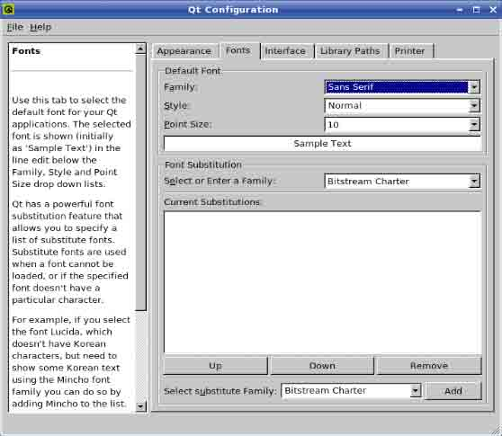

图 2-51 在 Qt Config 中配置字体

这样，我们的 Qt4 就可以在 Red Hat 9.0 上使用了。

2.Fedora Core

这里我们以 Fedora Core 10（以下简称 FC 10）为例，介绍在 Fedora 上如何安装配置 Qt4 的开发环境。

在 FC 10 上安装配置 Qt4，对于新手而言，我们一般不推荐采用编译源代码的方式。 由 于在默认情况下，FC 10 采用 GNOME 环境，而 Qt4 又需要依赖与 KDE 相关的好多库，并且 FC10 的软件包管理器在处理依赖问题时不是很方便，所以 编译安装 Qt4 容易出错且不好解 决。因此我们推荐采用 FC 10 编译好的安装包来安装 Qt4，一般要遵循下面的步骤：

(1) 安装系统

FC 10 的安装比较简便，建议最好采用 Live CD 的方式来安装，按照向导的提示，通常 只需若干个步骤即可完成。

(2) 更新系统

安装完毕后，需要做的第一件事就是更新系统。步骤如下： 依次点击菜单栏上的【系统】->【管理】->【更新系统】，出现如图 2-52 所示的对话框，系统将检测你需要更新的内容，待系统检测完毕后，点击【 Update System】按钮即可开始更新，需要的时间与你机器的速度和网络带宽有关系，大概从几十分钟到若干小时不 等。


图 2-52 更新系统

(3) 安装 Qt

完成系统更新后，我们开始安装 Qt。依次点击【菜单栏】->【系统】->【管理】->【增加/删除软件】,系统弹出软件包管理器的界面，如图 2-53 所示。


图 2-53 FC 10 的软件包管理器

I. 配置过滤条件

如图 2-54 所示，点击【Filters】，在下拉的列表中取消选中默认的【 Only newest packages】。

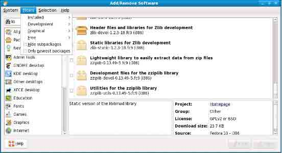

图 2-54 配置过滤条件第 1 步

然后，在每个二级菜单下面，选中【No filter】,如图 2-55 所示。


图 2-55 配置过滤条件第 2 步

II. 安装 Qt

如图 2-56 所示，在搜索栏中输入“qt”，然后按下回车键或者鼠标点击【Find】按 钮，软件包管理器将把所有包含 qt 关键字的包罗列出来，表 2-5 列举了我们要安装的包。

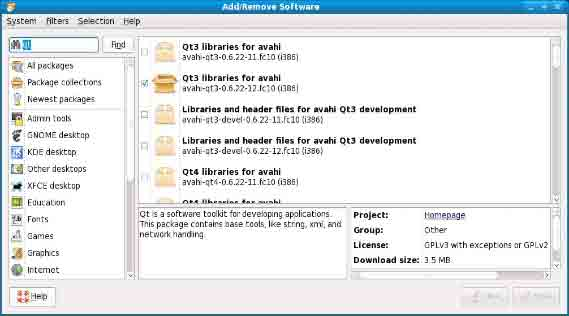

图 2-56 搜索 Qt 的安装包

表 2-5 需要安装的软件包

| 包名称 | 说 明 |
| --- | --- |
| qt-x11-1:4.5.0-14.fc10(i386) | Qt 基础库，包括 Qt Designer |
| qt-1:4.5.0-14.fc10(i386) | Qt 基础工具，含 xml、sql、network 等模块 |
| qt-devel-1:4.5.0-14.fc10(i386) | Qt 的开发文档，包括 Qt Linguist |
| qt-doc-1:4.5.0-14.fc10(i386) | API 文档、帮助和示例，包括 Qt Assistant 和 Qt Demo |
| qt3-config-3.3.8b-17.fc10(i386) | Qt 配置工具 |
| scim-bridge-qt-0.4.15-8.fc10(i386) | 为 Qt 配置输入法支持 |
| scim-qtimm-0.9.4-11.fc10(i386) | 为 Qt 配置输入法支持 |
| qt-creator-1.1.0-2.fc10(i386) | 安装 Qt Creator，可选 |
| qt-mysql-1:4.5.0-14.fc10(i386) | 安装 MySQL 数据库驱动 |
| qt-odbc-1:4.5.0-14.fc10(i386) | 安装 odbc 驱动 |
| qt-postgresql-1:4.5.0-14.fc10(i386) | 安装 PostgreSQL 数据库驱动 |

(4) 配置环境

请参见后面的《配置环境》一节。这里需要说明的是，在某些发行版中，由于自行增 加了某些配置文件，与标准的配置文件可能有些不同，但 FC 属于“遵守规定”的。也就是 采用标准配置方法就可以了。

至此，在 FC 10 上安装配置 Qt4 就完成了，这之后可以在程序组中找到 Qt4 各个组件

的快捷方式，并且使用它们开发应用程序了。

3\. Ubuntu/Kubuntu

Ubuntu 和 Kubuntu 这两个 Linux 发行版都是比较容易上手的，在上面安装 Qt4 也是比 较简捷的。但在论坛里面还是不断有朋友提问与 Ubuntu 上安装配置 Qt4 相关的问题。下面 笔者就以 Ubuntu8.04 为例，讲解从 Live CD 安装 Ubuntu 后如何安装配置 Qt4 的全过程， 希望能够对读者朋友有所帮助。

(1) Ubuntu 版本的选择

截至笔者写作时，Ubuntu 最新的版本是 9.04 版，它带来了性能上的提升与多方面的改 进。但是笔者仍然向大家推荐 8.04 版，原因是这是 Ubuntu 最近几年来推出的一个 LTS 版 (长期支持版)，并且技术比较先进，软件仓库中提供的软件能够持续更新，服务更有保障。 上一个 LTS 版是 6.06 版，技术已经比较落后了，下一个 LTS 版还没有浮出水面。

(2) 安装方式的选择

Ubuntu 8.04 支持多种安装方式，这里推荐采用 Live CD 安装的方式。Live CD 是免费 的，可以在 Ubuntu 的官网上提出申请，Ubuntu 会免费邮寄给用户。也可以在下载安装文件 后，刻成 Live CD 来使用，可以登录 Ubuntu 中文官方论坛查询有关信息。

(3) 添加软件源

在源里面添加两个地址：

```cpp
deb http://download.tuxfamily.org/3v1deb feisty eyecandy
deb-src http://download.tuxfamily.org/3v1deb feisty eyecandy 
```

Ubuntu 的源文件在/etc/apt/sources.list 里，将上述两行添加入来。

(4) 安装 Ubuntu

采用 Live CD 方式安装 Ubuntu 只需要 6 步即可完成，只需依据安装向导的提示完成安 装即可。

(5) 执行系统更新

I. 安装完系统后，依次点击菜单【系统】->【系统管理】->【更新管理器】，系统弹 出如图 2-57 所示的界面，首先点击【检查】按钮，系统将会检查需要更新的内容，几分钟 后，系统将会提示你需要更新的内容和大约的时间 。

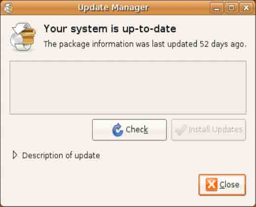

图 2-57 更新管理器

II. 点击【安装更新】按钮，系统将会执行 Update 操作，时间视你的网络速度和需要 更新内容的多少而又不同。需要强调的是，你的机器需要保持互联网在线。

(6) 中文化

I. 执行完系统更新后，依次点击【系统】 ->【系统管理】->【语言支持】，如果是第 一次运行，系统会提示说，语言支持选项尚未安装完全。则需要依据提示将汉语（中国）以 及其它你想安装的语言安装上去，如图 2-58 所示。

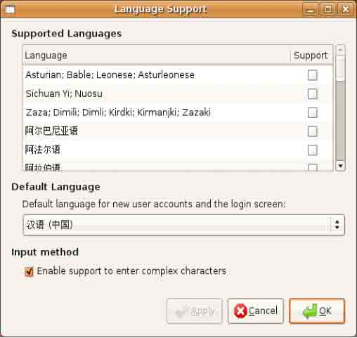

图 2-58 安装语言支持

II. 在新立得软件包管理器中搜索：language 关键字，将 language-pack-gnome-zh、 language-pack-gnome-zh-base、language-pack-kde-zh、language-pack-kde-zh-base、 language-support-extra-zh、language-support-fonts-zh、language-support-input- zh、language-support-translations-zh、language-support-zh 这些包选中并安装。

III. 安装中文字体，比如选中 ttf-wqy-zenhei 包即可安装上“文泉驿正黑”这种中文 字体。

(7) 安装输入法

在新立得软件包管理器内搜索 scim 关键字，将 scim、scim-chewing、scim-chinese、 scim-pinyin 包选中并安装。

(8) 闪电配置系统环境 这一步主要是安装配置系统的字体、程序常用的插件、常用多媒体编码插件，以及应用环境等。只需在新利得软件包管理器中搜索并安装 ”ubuntu-restricted-extras”软件包即可，一次性完成安装配置。喜欢使用命令行的朋友也可以在终端中输入如下命令：

```cpp
$sudo apt-get install ubuntu-restricted-extras 
```

安装成功后多数常用的插件和应用环境就搭建好了，可谓闪电配置。

(9) 配置 GCC

刚安装好的系统已经存在 GCC，但它缺少必需的头文件，所以还无法编译 C 程序，这就 需要安装 build-essential 这个软件包，安装此软件包会自动安装上 g++、libc6-dev、 linux-libc-dev、libstdc++6-4.1-dev 等一些必需的软件和头文件库。

在终端中输入如下命令：

```cpp
$sudo apt-get install build-essential 
```

当然也可以使用新立得软件包管理器安装。

(10) 安装 Qt

安装方法有 3 种：

I. 编译源码安装

请参考前面的通用安装方法，注意在 Debian 系的发行版如 Ubuntu、Kubuntu 等，需要 root 用户口令时，在你的命令前面加上 sudo 即可，而不必切换到 root 权限。如执行 make install 操作，输入：sudo make install 即可。

还有，编译安装完成后，在你机器的 home 目录下你的的用户名字的目录中, 在.profile 文件中追加如下环境变量(可以采用 vim .profile 或是 gedit .profile 的方式 打开该文件):

```cpp
QTDIR=/usr/local/Trolltech/Qt-4.4.3/
PATH=$QTDIR/bin:$PATH
MANPATH=$QTDIR/doc/man:$MANPATH
LD_LIBRARY_PATH=$QTDIR/lib:$LD_LIBRARY_PATH
export QTDIR PATH MANPATH LD_LIBRARY_PATH 
```

以上步骤执行完后，需要按 ctrl+alt+backspace 键, 注销用户,并重新登录，使更改厚的.profile 文件内容生效，其中最后两行代码不是必需的。

II. 使用图形界面安装

这种方式就是采用新立得软件包管理器来安装。

依次点击【系统】->【系统管理】->【新立得软件包管理器】，注意如果不是以 root 用户身份登录，则需要输入 root 用户密码方可使用。点击工具栏上的【 Search】按钮，弹 出如图 2-59 所示对话框。


图 2-59 查找与 Qt 相关的包

在其中输入 qt 后点击【Search】按钮，系统将显示出如图 2-60 所示的结果。


图 2-60 查找出的与 Qt 相关的结果

选中如下包：

*   libqt4-core
*   libqt4-debug
*   libqt4-dev
*   libqt4-gui
*   libqt4-qt3support libqt4-sql
*   qt3-qtconfig
*   qt4-designer
*   qt4-dev-tools qt4-doc
*   qt4-config
*   qt-x11-free-dbg

注意在这些软件包中，qt4-dev-tools 包含了 Qt Assistant 及 Qt Linguist 等工具； qt4-doc 是帮助文档，包含了 Qt 中各个类库的详细说明以及丰富的例子程序，可以使用 Qt Assistant 工具来打开并阅读；qt4-qtconfig 是配置 Qt 环境的工具；qt4-demos 包含很 多可以运行起来的程序范例；qt4-designer 是用来设计 GUI 界面的设计器。

点击工具栏上面的【应用】按钮，即可以安装了。安装时间视你选择包的数量和网络 速度而有不同，但通常会比采用源码编译方式的时间略短。

这之后，仍然需要配置环境变量。

III. 命令行方式

也有的朋友喜欢使用命令行，那么可以输入下面的命令：

```cpp
sudo apt-get install qt4-demos qt4-designer qt4-dev-tools qt4-doc qt4-doc-html 
```

小贴士：如果还需要其它的没有默认安装的 Qt 库，可以在命令行输入 sudo apt-get install libqt4- 然后按 tab 键自动补全，就会列出所有以 libqt4- 开头的软件包，如图 2-61 所示。


图 2-61 列出所有的以 libqt4-开头的软件包

这些都可以使用一个命令搞定，而不需要自己从源码开始编译。在记不准或不知道名 字的情况下，使用 tab 键列出所有可选的软件包是一个很实用的小技巧。

小贴士：如果还有画一些数据曲线和统计图表等方面的需求，可以安装第三方的 QWT 库。 同样，只需要一个命令即可完成安装：

```cpp
sudo apt-get install libqwt5-qt4 libqwt5-qt4-dev 
```

完成安装后，打开 Qt Designer，就会发现左边的 Widget 列表里面多了“QWT Widget”这一组窗口部件。

至此，在 Ubuntu 下安装 Qt4 就介绍完了，从安装操作系统到安装配置 Qt 成功，中间的过程虽然有些复杂但脉络还是清晰的，希望读者朋友能够熟练掌握。

4\. OpenSUSE

(1) 版本的选择

OpenSUSE 通常每一个发行版都区分为 KDE 和 GNOME 版，但 OpenSUSE 默认采用的就是 KDE 版。从安装使用 Qt 的角度考虑，我们推荐采用 KDE 版。另外，OpenSUSE 11.1 是目前 的最新版本，无论是软件的丰富程度、系统的易用性、性能等都较 10.3 版有较大的提升， 所以我们就以 OpenSUSE 11.1 KDE 版为例，向大家讲解安装配置 Qt4 的方法。

在 OpenSUSE 11.1 上安装配置 Qt 是比较容易的。采用编译源代码和软件包管理器这两 种方式都可以，其中采用源代码编译的方式与通用方式并无二致，只需在配置 Qt 环境时注 意一下，它的配置文件的位置与其它发行版稍稍有所不同，详见《配置环境》这一节 。

(2) 安装 Qt

下面重点讲解如何从 YaST2（OpenSUSE 的软件包管理器）中安装配置 Qt4。通常需要如 下步骤：安装 OpenSUSE、更新系统、安装 Qt4、配置 Qt4 环境。

I. 安装 OpenSUSE

推荐从 LiveCD 安装，可以从 OpenSUSE 的官方网站上自由获得镜像，网址是 [`www.opensuse.org/。安装过程很简单，遵循向导的指引，几步下来就可以完成。`](http://www.opensuse.org/。安装过程很简单，遵循向导的指引，几步下来就可以完成。)

II. 更新系统

安装完毕后，需要确保始终在线，然后依次点击【菜单】 ->【应用程序】->【管理员 设置】，系统将启动 YaST2 控制中心，如图 2-62 所示。


图 2-62 YaST2 控制中心

在左边的大类里面选择【软件】，在右面的细分类别里面选择【在线更新】，系统将 搜索可用于更新的部件，并显示如 图 2-63 所示界面。


图 2-63 更新系统

在界面的左上部分选中你想要更新的构件，然后点击界面右下角的【接受】按钮即可 开始更新，需要的时间与选择的包的数量多少、机器配置情况以及网络速度有关。

III. 安装 Qt4

完成系统更新后，可以开始安装 Qt4 了。

第 1 步，启动 YaST2。依次点击【菜单】->【计算机】->【安装软件】，输入管理员密 码，然后点击【确定】按钮，如图 2-64 所示。


图 2-64 启动 YaST2

第 2 步，搜索相关软件包。在界面上的搜索栏中输入 ”qt”,搜索范围选中【名称】、【范围】选项，搜索方式选择“包含”，不选择【区分大小写】选项。然后点击【搜索】 按钮，系统将符合的选项在列表中罗列出来，如图 2-65 所示。


图 2-65 搜索 Qt 后的 YaST2 界面

在其中选中如下软件包：

*   libqt4
*   libqt4-debuginfo
*   libqt4-debugsource
*   libqt4-devel
*   libqt4-devel-doc
*   libqt4-devel-doc-data
*   libqt4-qt3support
*   libqt4-sql
*   libqt4-sql-mysql
*   libqt4-sql-postgresql
*   libqt4-sql-sqlite
*   libqt4-sql-unixODBC
*   libqt4-sql-x11
*   libQtWebKit4
*   libQtWebKit4-devel
*   qt4-x11-tools
*   scim-bridge-qt

然后点击【接受】按钮，系统将为你安装选中的包以及所有的依赖包。通常约需要几十分钟到几小时不等的时间。

(3) 配置 Qt4 环境

这一步请参见《配置环境》一节，那里有详细的说明。 需要特别注意的是，OpenSUSE 环境变量配置文件与其它发行版有所不同 。

5\. Mandriva

(1) 版本的选择

就产品的成熟度来讲，Mandriva 通常提供两个版本供使用，分别是开发版（ devel）和 正式版（official）。devel 存放的是正在开发的版本，喜欢当小白鼠的朋友常用； official 存放的是正式发行的版本。我们选择 official 版。

就授权方式来讲，Mandriva 将产品分为 FREE、ONE 和 POWERPACK 版。 POWERPACK（加强版）：这是要付费才能获得的版本，价格也不便宜，当然物有所值，它包括了技术支持、服务、以及重要的第三方私有软件，如 LinDVD、Cedega、Fluendo multimedia codecs 等，而这些东西在其它版本里是没有的。 FREE、ONE：这些都是免费的版本，其中 ONE 是 Live CD，可独立运行的光盘系统，也能够安装在硬盘上，FREE 做不到这一点。ONE 源自 POWERPACK，而且 ONE 的桌面与 POWERPACK 现在一致，但是 ONE 也有较大局限：默认内核只能管理 1G 的内存。

就系统采用的桌面环境不同，Mandriva 又分为 MINI、GNOME 和 KDE 版。 MINI：迷你版本，以 ICEWM 为桌面环境（不是 icewm-light），所选软件都是轻量级软件而且数目非常少，软件包还可以定制安装，非常适合机器性能差或者极度追求速度、干净和自由的朋友。

GNOME：这是 ONE 里的一个分支，以 GNOME 为桌面环境，其实 Mandriva 默认的是 KDE， 所以不要对它抱有太高期望值，当然它也不是太差，适合喜欢 Mandriva 和 GNOME 的朋友。

KDE：这是 ONE 里的一个分支，以 KDE 为桌面环境，由于 Mandriva 默认的是 KDE，所以 使用它能获得更好体验。

基于上面的描述，我们不难分析出，应该采用 Mandriva 的 ONE 的采用 KDE 的 OFFICIAL 版作为 Qt4 开发工作站的首选版本。下面就以这个版本为例介绍如何安装 Qt4.5。

(2) 安装 Qt

第 1 步，在 Mandriva 中依次点击【菜单】->【安装/删除软件】，启动软件包管理器，如图 2-66 所示。


图 2-66 Mandriva 软件包管理器

第 2 步，在【搜索】框中输入”qt”关键字查询，查询条件选为【All】，系统将把所 有包含 Qt 的软件包搜索出来，如图 2-67 所示。


图 2-67 搜索与 qt 相关的包

选中如下软件包：

*   libqt3
*   libqt4-devel
*   qt4-common
*   qt4-designer
*   qt4-doc
*   qt4-assistant
*   qt4-examples
*   qt4-linguist
*   qt4-qtconfig
*   qt4-qtdbus
*   qt4-qvfb
*   qt4-tutorial

安装 libqt3 这个包是因为需要使用 qt3config 来配置 Qt4。

libqt4-devel 这个包含了如下包：libqt3support4、libqtcore4、libqtdbus4、libqtdesigner4、libqtgui4、libqtnetwork4、libqtopengl4、libqtscript4、libqtsql4、ilbqtsvg4、libqttest4、libqtWebKit4、ilbqtxml4、、libqt4-static-devel

此外，以下是与数据库开发相关的包，如果你不想开发数据库程序的话，也可以不安装。

*   qt4-database-plugin-mysql-lib
*   qt4-database-plugin-odbc-lib
*   qt4-database-plugin-pgsql-lib
*   qt4-database-plugin-sqlite-lib

到此为止，你的 Qt4 在 Mandirva 上已经可以使用了。 如果你有其他的需求，比如使用 Java、Python 等，还可以选装与它们相关的如 Python-qt4 包等等，这里就不再赘述了。

(3) 配置环境变量

在这里并无特殊说明，请见后面的《配置 Qt 环境》一节。

# 2.4 配置 Qt4 环境

## 2.4 配置 Qt4 环境

笔者看到有的朋友在网上说，采用软件包管理器安装 Qt4 后，在过程中系统已经自动 设置好了 Qt4 需要的环境变量，可以不用自己手工设置了。 这是不正确的说法，经过笔者 的反复验证，在常见的 Linux 发行版中，都没有这种情况发生。也就是说 ，不论你是采用 编译源代码编译还是采用各个发行版提供的安装包的方式安装的 Qt4，你都需要配置环境变 量。下面就各个不同平台分别介绍如何配置 Qt4 环境。

### 2.4.1 Windows 平台

在 Windows 下打开命令行(运行 cmd 命令)，输入以下命令即可完成设置。

```cpp
c:\&gt;set QTDIR=c:\qt-win-free-mingw-3.3.4-3
c:\&gt;set MINGW=c:\mingw
c:\&gt;set PATH=%QTDIR%\bin;%MINGW%\bin;%PATH%
c:\&gt;set QMAKESPEC=win32-g++ 
```

### 2.4.2 X11 平台

如果你在安装时，表明了 root 身份，那么你的 Qt 将被安装到 /usr/local/Trolltech/Qt-4.5.2 这个目录下面。在 X11 上，需要区分用户使用的 shell 是 哪一种。

1\. 如果使用的 shell 是 bash、ksh、zsh 或者 sh 若只想某个用户用户，比如 xx（也包括 root 用户）使用 Qt，则打开 /xx/.bash_profile 文件，在其中加入以下内容：

```cpp
# Qt4 Settings
export QTDIR=/usr/local/Trolltech/Qt-4.4.3
export PATH=$QTDIR/bin:$PATH
export LD_LIBRARY_PATH=$QTDIR/lib:$LD_LIBRARY_PATH
# End Qt4 Settings 
```

注意第 1 行和最后 1 行是注释内容，用#表示。

重新登录 xx 用户，设置生效，现在 xx 用户就可以使用 Qt 了。 如果想以后新建的用户也可以使用 Qt，则在/etc/skel/.bash_profile 文件中加入与前面所述相同的内容，当然具体路径要视你的 Qt 安装路径而定。保存文件后，别忘了重新登录 xx 用户，以使设置生效。

2\. 如果使用的 shell 是 csh 或者 tcsh 需要把下面的代码添加到/etc/csh.login 文件中：

```cpp
# Qt4 Settings
setenv PATH /usr/local/Trolltech/Qt-4.4.3/bin:$PATH
# End Qt4 Settings 
```

小贴士：特别需要注意的是，这些配置文件默认情况下都是隐藏不见的，你需要设置系统来显示隐藏文件。

还有一点，就是各个发行版的配置文件可能会有不同， 现在将常见的几种发行版的配 置文件概括至表 2-6 中（以下以 xx 代指用户名）：

表 2-6 Linux 发行版的配置文件

| 发行版名称 | 采用 bsh 等作为 shell | 采用 csh 等作为 shell |
| --- | --- | --- |
| Fedora Core | /home/xx/.bash_profile | /etc/csh.login |
| OpenSUSE | /home/xx/.profile | /etc/csh.login |
| Mandriva | /home/xx/.bash_profile | /etc/csh.login |
| Ubuntu | /home/xx/.bash_profile | /etc/csh.login |
| Kubuntu | /home/xx/.bash_profile | /etc/csh.login |
| Red Hat | /home/xx/.bash_profile | /etc/csh.login |
| Red Flag | /home/xx/.bash_profile | /etc/csh.login |
| Everest | /home/xx/.bash_profile | /etc/csh.login |

# 2.5 问题与解答

## 2.5 问题与解答

问：我在 Ubuntu8.04 上编译安装 Qt4 开源版，config 时遇到如下错误：

Qtchecking for Qt... configure: error: Qt (>= qt 3.3 and < 4.0) (headers and libraries) not found. Please check your installation!

答：这个问题是由于你还没有安装与 Qt3 相关的库文件的缘故，打开一个终端，输入

```cpp
sudo apt-get install libqt3-mt-dev 
```

安装完毕后，再重新编译安装 Qt4 就可以了。

问：商业版 Qt 在 Solaris 上编译的问题

我购买了商业版的 Qt，是 4.4.0 版本，现在升级到 4.4.1 了，在 Windows 上开 发，没有出现什么问题，现在想转到 Solaris 上面，但解压 qt-x11-commercial-src- 4.4.1.tar.gz 时总是出现问题。

首先我是用 gunzip 解压成 qt-x11-commercial-src-4.4.1.tar，然后用 tar xvf 来解压，到一半的时候就出错了，提示 “校验和错误”。我是在 windows 下下载的 qt-x11- commercial-src- 4.4.1.tar.gz，这是什么原因呢？

答：原因在于 solaris 下 tar 有 bug，解压路径加文件名过长时就会出错。所以不要用 solaris 自带的 tar ，而要用 gnu 的 tar, 可以在 www.sunfreeware.com 上下载到。

问：我的 Qt4 已经安装完了，但是忘记编译数据库驱动了。如果加上的话，是不是还 要重新编译一遍，很费时费力，有什么办法？

答：你还是要走一遍这个完整的编译流程，但这次它实际上不是重新编译，而是只编 译需要改变的东西，这是 make 机制决定的，你已经编译过的其他东东，这次时就会略过， 不会再次编译了。

问：编译 Qt4.5 时如何剔除一些并不想要使用的内容，比如 examples 和 demo？ 答：有几种方法可以实现，这里推荐一种，可以同时节省时间和空间，方法是在

configure 时，输入-nomake demos nomake examples ，即表示不编译 examples 和 demos。

完整的命令是：

```cpp
configure -nomake demos nomake examples 
```

问：我在 linux 下都把 Qt 安装成功了，就是 make install 成功了，可是，当我编译一个 qt 的例子时候，执行 qmake，系统告诉我，没有这个命令，怎么办呀，难道安装不是 使用 make install 命令吗？

答：这种情况通常是由于你在安装 Qt 后没有设置环境变量，你把 qt 的安装目录加入 到 PATH 里面去，应该就可以了。

再次提醒，编译安装 Qt 的基本步骤如下：

1.下载

2.编译安装

3.配置环境变量

4.验证安装：qmake -v 看看输出是什么 5.减小体积，执行 make clean，将一些中间文件去掉。

其中，配置环境变量的方法是这样的，在你的 shell 配置文件里加上下面两句：

```cpp
PATH=/usr/local/Trolltech/Qt-4.5.2/bin:$PATH
export PATH 
```

# 2.6 总结与提高

## 2.6 总结与提高

这一章是学习 Qt4 编程的第一站，只有能够正确的安装和配置 Qt4，才可以顺利开启开 发进程。而据笔者的经验，在网上很多朋友提出的程序编译时的问题，往往与 Qt4 的安装 与配置有关。所以这是一项基本功，尤其是编译安装 Qt4 的方法必须要牢牢掌握。