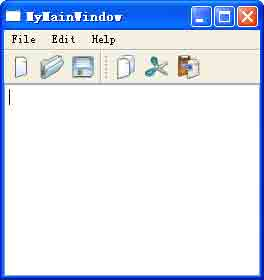
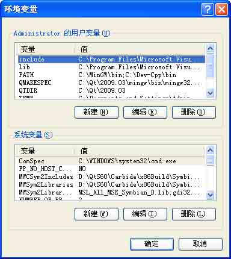
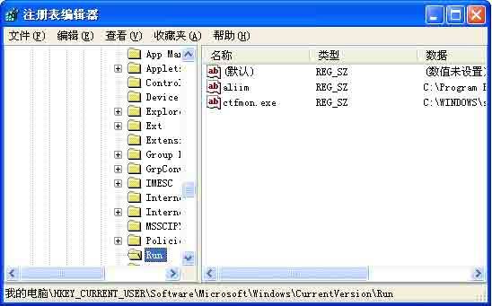
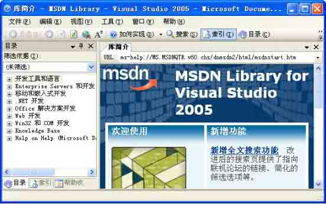
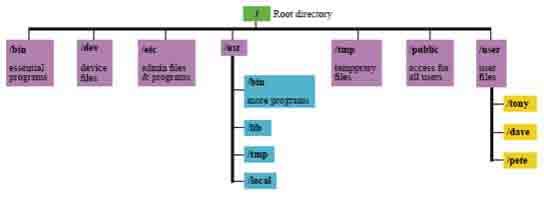
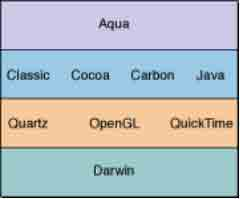
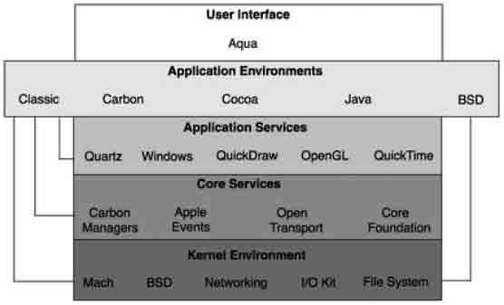
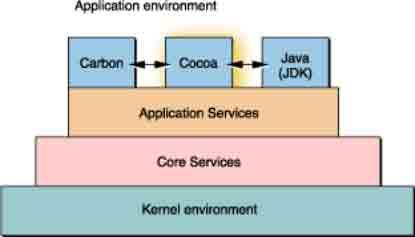
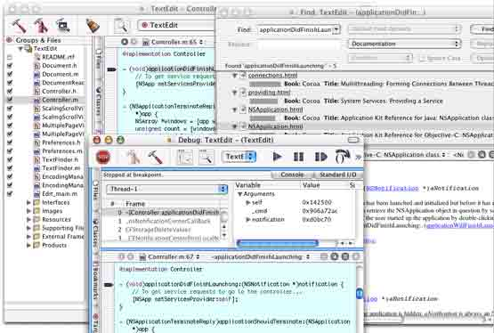

# 第三章 Qt 编程基础

**本章重点**

*   掌握标准 C++的基础知识和技能
*   掌握不同平台上的基本编程机制和原理
*   掌握 Vi 的使用
*   掌握 GCC 和 GDB 的使用

本章主要讲述与 Qt 编程相关的一些基础知识和技能，内容涵盖了 Windows、Linux 和 Mac OS X 这三大主流平台，由于篇幅关系，有些内容无法详细展开，希望读者朋友能够查 阅相关的书籍和资料辅助学习。

对于本章内容的学习，笔者建议开始时可采用 “粗读”的方式，以对整体有一个把 握。在接下来学习本书的其他内容时，可以翻过头来对照参考，效果更佳。

# 3.1 标准 C++精讲

## 3.1 标准 C++精讲

掌握标准 C++的基础知识和技能是使用 Qt 进行编程的前提，虽然 Qt 也支持其他的语言 扩展（比如 Java、Python 等），但 Qt 的基础和努力方向仍然是以 C++语言为主，所以读者 朋友一定要掌握标准 C++。

### 3.1.1 程序设计语言介绍

1.软件

计算机内部所有能够存储的各种数据和能够执行的各种程序都称为软件。而程序一词 经常有两种理解：（1）由程序员编写的源代码；（2）可执行的软件。

程序通常可以分为以下几类：

(1) 操作系统（Openation System）

为用户管理计算机软硬件的程序。例如 DOS、Windows 98、Windows XP、Windows CE、 UNIX、Linux、Mac OS X、BSD、Solaris 等。

实际上，操作系统包含很多可执行程序，这些程序组合在一起，完成一个或几个特定 的任务。这些程序的根本目的在于有效的组织计算机的硬件资源，并为用户提供一个访问硬 件的友好界面。通常也可以将其称为系统软件。

(2) 应用软件（Applications）

在操作系统下执行的，具有特殊用处的程序，如字处理软件 Microsoft Word、游戏软件、财务软件等。这部分程序，也就是程序员主要的服务方向，也是软件设计中商业利润比较大的一部分内容。

(3) 应用程序开发环境（Application Development Environment）

协助程序员开发应用程序的特殊程序，如 Microsoft Visual Studio、Eclipse 等。

2.程序语言

程序语言是人与计算机交流的工具。通过程序语言我们可以编写程序，控制计算机执 行相应任务。到目前为止，先后出现了 4 代程序语言。

第 1 代语言：机器语言（machine language）

计算机执行的每一个操作都是由一组特定的二元指令所指定，称为操作码。通常将这些操作码称为机器语言。该语言不仅难于读写，撰写复杂，而且非常容易出错。

第 2 代语言：汇编语言（assembly language）

以接近英文和数学式的方式写作程序，它的语意与机器语言有一对一的对应关系。该语言能发挥特定机器的硬件功能，编译后的程序运行速度快、效率高，但因仍与机器硬件相关，编写仍然较困难。

第 3 代语言：高级程序语言（high -level programming language）

包括 Fortran、Pascal、C、C++、Java、Basic、C#等，用这些语言编写应用程序的时 候，通常不需要知道 CPU 执行的细节。这些语言都有自己的特色，能胜任某一方面的程序 设计。例如 Fortran 用于科学及工程的方程式运算，而 C 语言具备汇编语言的优点，可以 直接进行位运算，而且有高度的结构性，代码相对容易维护，可理解性大大提高。 C++不仅 继承了 C 的优点，而且引入了面向对象程序设计的思想。

第 4 代语言：特殊用途语言

使用在特殊的环境中，便于非专业程序设计人员使用的语言，例如 Perl、SQL、MATLAB 等，它们通常都不需要声明变量，而且有很多现成的功能可以套用。

3.编程思想

编程思想逐渐由结构化编程发展到面向对象编程。 结构化编程的主要思想是把问题细化，即把现实中的目标分解成一系列的任务，对每一个任务再进行分解，直到每个任务都能被解决为止。这是处理复杂问题的一种非常成功的方法。即使是现在，在处理很多问题上仍会经常用到这个解决问题的思想。当然，这种编程 思想存在着问题。首先，它将数据结构从函数中分离出来，这使得程序员在设计程序的时候不得不把一个事物的属性与方法分离开考虑，于是就很难真实的表现现实生活中的模型。其 次，代码的可重用性不高。虽然，现在用的很多函数都是用 C 语言编写的，但是，现在需 要的可重用的代码已经不再是这个层次上的代码，而是集中了很多功能和数据的完整的组件，并且要保证其可维护。

面向对象的编程思想满足以上的种种需求，它提供一种方法，可实现软件组件的可重 用性，并将数据与操作数据的任务结合起来。

面向对象编程的实质就是将“对象”作为模型，而不是“数据”。用作模型的对象可 以是屏幕上的界面，如按钮、列表框，也可以是现实世界中的对象，如自行车、人等。

面向对象的编程思想必须要涉及到封装、继承、多态性这 3 种技术，C++完全支持它们。

(1) 封装

实际的事物有很多组成部分，描述一个事物也可以从不同的角度出发，从程序设计的 角度出发，需要两个元素－数据和函数，当从这两个元素出发去描述一个事物时，会看到： 一个事物本身具有一些属性，相应的存在一些行为能改变其中的一些属性。要用程序中的对 象来代表这些实际的事物，于是，用数据代表事物的属性，用函数反映事物的行为。这样， 与该对象相关的数据和行为就被封装在这个对象里了。

例如：一个人有肤色、身高、体重等属性，有自己的说话、跑、跳等行为。但有时， 属性并不是实际存在的一个事物特征的反映，它可能是一种人为抽象出来的状态的反映，例 如一个人有静止、说话、跑步、睡觉 4 种状态，可以定义一个属性来表示当前这个人是处 于什么状态。假设这个人处于百米跑起跑前的静止状态，当发令枪响起，这个人开始跑（即 发出跑的动作），同时状态属性发生变化，由静止状态变为跑步状态；还有其他的属性也随 着这个动作的发出而发生变化，由静止状态变为跑步状态；还有其他的属性也随着这个跑的 动作的发出而发生变化，如心跳频率加快、移动速度变快等。这个过程即反映了行为改变属 性这一特征。

程序并不一定要完全模拟实际的事物。在系统分析时，希望设计结果能真实反映实际 问题，但是，也没有必要对涉及到的所有的事物都建立模型。下面针对系统分析过程中可能 遇到的问题举例。一个顾客染发，染发的动作会改变头发的颜色属性。显然，染发的动作由 理发师发出，但在程序中是否真的由理发师发出这个动作还需要根据具体问题再进行分析。

I. 当具体问题中理发师的存在仅仅完成一个染发的作用，那么要考虑理发师是否有存 在的必要，如果没必要，就果断的删除这个对象，把染发的动作交给顾客自己来完成。

II. 当具体问题是为了描述理发师的行为状态变化，那么可能就把这个染发的动作交给 理发师来完成。

该例子也说明，行为交给哪个对象来完成，是需要就具体问题进行分析而得到的，关 于这个问题可以参看下列规则：

*   如果行为影响或修改了一个对象，最好把该行为交给目标对象（而不是动作的发起 者 ）。
*   如果行为涉及到多个对象以及它们之间的关联，从中找出处于中心地位的对象，将 行为将给该对象完成。

这两个规则只是经验的反映，经验不能反映所有的情况，也有可能把行为交给其他对象来完成也是合理的，这需要根据实际情况进行判断。

(2) 继承

这是代码重用的很有效的方法，新的类可以通过继承原有类，并选择性的增加或修改其中的属性或行为，以达到利用原有类的目的。现介绍一下代码重用的方式。

注意，类是与对象相关联的概念，将在稍后介绍。

I. 源代码剪贴

最原始的形式，缺点很多。首先是复制或修改原有代码可能会出错，其次需要对源代码有一定程度的了解。另外，存在严重的配置管理问题，人们几乎无法跟踪源代码多次修改重用的过程。

II. 源代码包含

许多程序语言都提供了包含库中源代码的机制。使用这种重用形式时，配置管理问题有所缓解，因为修改了库中源代码之后，所有包含它的程序自然都必须重新编译。

III. 继承

利用继承机制重用类库中的类时，无需修改已有的代码，就可以扩充或具体化原有类，因此，基本上不存在配置管理的问题。

(3) 多态

允许使用相同的接口，与各种不同的派生类定义出来的对象交互，能够产生正确的行为。

例如，中国人说汉语，美国人说英语。 “说”的动作相同，却有着不同的内容－汉语和英语；对于不同类型的电视机，都可以使用相同的动作：单击【播放】按钮，开始播放电 视频道，显然不同类型的电视机显示的方法会有所区别，但没有必要关心这些，人们看电视的目的已经达到了。

### 3.1.2 C++语法基础知识

1.预处理知识

在阅读本节之前，读者最好看看 C++这方面的专著。这里只讲一些常用的知识，并不对 C++作全面深入的讲解。

C++程序由对象、函数、变量及其他组件组成。 从最简单的程序讲起：

```cpp
#include &lt;instream.h&gt;
int main()
{
    cout&lt;&lt;”Hello World\n”;
    return 0;
} 
```

这是一个 Console 程序，撰写 Console 程序时需要注意：主程序为 main 可以使用 C Runtime 函数和不涉及 GUI 的 Win32 API 函数。撰写 Console 程序是学习 C++的第一步。进入 Console 模式进行编程，使用 VC++ 6.0，操作步骤如下：

(1) 选择【File】菜单中的【New】菜单项，在弹出的对话框中选择【Projects】标 签；再选择“Win32 Console Application“程序，然后输入工程名称，单击【OK】按钮； 在接下来的对话框中，为了脱离 VC 提供的代码支持，选择“an empty project”，然后单 击【Finish】按钮，会得到一个不包含任何工程文件的工程。之后，要加入包含着主函数的 头文件。

(2) 选择【File】菜单中的【New...】子菜单，在弹出的对话框中选择【Files】标 签，再选择“C++ Source File”，选中“Add to Project”项，选中（1）中的工程名 称。接下来，确定文件的名称，单击【 OK】按钮，于是就得到了需要的文件，同时可以在这 个空文件里键入上述代码。

(3) 运行程序，它会弹出一个对话框提示没有可执行程序，询问是否创建可执行程序。 单击【是】即可，然后 VC 开始编译，链接目标文件。如果没有意外的话，会得到一个 DOS 窗口，窗口内有如下的输出：

```cpp
Hello World
Press any key to Continue 
```

最后一句话并不是源代码反映的内容，这是由编译器提供的，方便查看输出内容的提

示。如果读者想看程序真正的输出结果，就进入命令行下（即以前的 DOS 窗口下），运行 该程序，读者就可以看到 Hello World，而没有其他的信息。

```cpp
#include&lt;iostream.h&gt; 
```

该语句的意思是：将文件包含到当前的文件中，符号 #是预处理 标志。

注意，每次启动编译器时，先运行预处理器。预处理器浏览源代码，找到以 #开头的 行，处理这些行，预处理的作用是改变源代码的文本。结果生成一个新的源代码文件－一个 通常看不到的临时文件，但读者可以指定编译器保存它，这样，读者可以在感兴趣的时候或 者需要的时候检查它。编译器不读取最初的源代码文件，它读取预处理器输出的结果并编译 该文件，最终生成可执行程序。

初步介绍预处理作用如下，以便读者了解预处理的概念：

I. 包含另一个文件（通常是头文件），为了引入需要的代码。

II. 定义符号，祈祷开关作用，可以根据机器的情况、操作系统的情况及用户的需求来 决定哪部分代码有效，例如，如果要在 Win32 的环境下编程，那么，就定义 Win32 这个符 号。

III. 定义宏，简化常用的数据，或者简化复杂的函数声明、定义的过程。

预处理的功能不止这些，以上是本书程序中略有涉及的内容。

正式的程序从 main 函数开始，每一个 C++程序都有一个 main 函数。函数是指能实现一 个或多个功能的代码块。通常函数是由其他函数调用或激活，而 main 属于特殊情况。程序 在开始的时候自动调用 main。从本质上讲，也是被调用，不过，那些都不是现在需要关心 的事情。

所有的函数都以左大括号开始，以右大括号结束。两个大括号之间是函数体。 使用对象 cout 将一个字符串打印到屏幕上。最后返回 0。

这些就是一个 C++程序的基本轮廓。下面开始讲解+的基本语法。 2.基本数据类型

在任何一台计算机中，每种变量类型都占据一定量的内存单元。但并不是每种变量类 型占的内存大小在每台计算机上都相同，一个整型变量在一台机器上可能是 2 个字节，而在另一台机器上可能是 4 字节，但对任意一台机器而言，这个值是确定的。字符型变量通常只有 1 个字节。

在大多数计算机上，短整型是 2 个字节，长整型是 4 个字节，而整型可能是 2 个字节也可能是 4 个字节。编程语言并没有对此做出精确的定义，它定义的是短整型必须小于或 等于整型的大小，整型必须小于或等于长整型的大小。

整型的大小是由读者所使用的处理器（ 16 位还是 32 位）和编译器决定的。例如，在使 用 Visual C＋＋4.0 及以上版本的 32 位 Intel x86 计算机上，整型为 4 字节。详细的变量 类型说明如表 3-1 所示。

表 3-1 C++变量类型说明

| 类型 | 大小 | 值 |
| --- | --- | --- |
| bool | 1 字节 | true 或 false |
| unsigned short int | 2 字节 | 0~65535 |
| short int | 2 字节 | -32768～32767 |
| unsigned long int | 4 字节 | 0~4294967295 |
| long int | 4 字节 | -2147483648~2147483647 |
| int（16 位） | 2 字节 | －32768～32767 |
| int（32 位） | 4 字节 | -2147483648~2147483647 |
| unsigned int（16 位） | 2 字节 | 0～65535 |
| unsigned int（32 位） | 4 字节 | 0~4294967295 |
| char | 1 字节 | 256 个字符 |
| float | 1 字节 | 1.2e-38~3.4e38 |
| double | 8 字节 | 2.2e-308~1.8e308 |

3.表达式和语句

在 C++中，语句用于控制程序的执行顺序、计算表达式的值，或者什么都不做（空语 句）。

所有的 C++语句都以分号结尾，即使是空语句也是如此。 下面是典型的语句：

```cpp
value = value2 – value4; 
```

在 C++中任何一个计算值的操作都可称为表达式，表达式总是能够返回一个值。表达式可以简化到 1，2，3 这样的整数，也可以是 a+b 这样的形式，重要的是它能返回一个值。

运算符是一种能使编译器进行某项操作的符号。运算符作用于操作数，在 C++中所有操 作数都是表达式。

(1) 赋值运算符（=）：使赋值运算符左边的操作数的值改变为赋值运算符右边的值。 例如：

```cpp
value = 20; 
```

(2) 数学运算符：加（＋）、减（-）、乘（*）、除（/）、取模（%）。取模运算符（%）就是求整型除法的余数。

I. 一些特殊的运算符：如，`+=`，`-=`，`*=`，`/=`，`%=`。 例如：

`a+=2;` 等价于 `a=a+2;`

`a-=2;` 等价于 `a=a-2;`

`a*=2;` 等价于 `a=a*2;`

`a/=2;` 等价于 `a=a/2;`

`a%=2;` 等价于 `a=a%2;`

II. 单目运算符：如++、--等。

`a++;`和`++a;` 等价于 `a=a+1;`

`a--;`和`--a;` 等价于 `a=a-1;`

`x=a++;` 等价于两步操作：先是 `x=a;`然后是 `a=a+1;`

`x=++a;` 等价于两步操作：先是 `a=a+1;`然后是 `x=a;`

在复杂的表达式之中，多个运算符同时出现，不同的符号有不同的执行优先级。例如：a=8-3*2，对于该表达式，由于*号的优先级大于-号，所以先执行 3*2，然后执行 8-6,最后执行 a=2。可以通过添加括号（）来改变运算顺序。将原式改成 a=(8-3)*2，这时，先 执行 8-3，再执行 5*2，最后执行 a=10。

(3) 关系运算符：用来对两个量进行比较的（等于、大于或小于）符号。每条关系语句 的值要么为真要么为假，每个表达式都可以按真假来求值。凡是数值运算结果为 0 的表达 式返回假，否则返回真，也就是返回 False 或 True。C++基本的关系运算符如表 3-2 所示。

表 3-2 关系运算符说明

| 名称 | 运算符 | 例子 | 值 |
| --- | --- | --- | --- |
| 等于 | == | 1==1 | true |
|  |  | 1==2 | false |
| 不等于 | != | 1!=1 | false |
|  |  | 1!=2 | true |
| 大于 | > | 1>2 | false |
|  |  | 2>1 | true |
| 大于等于 | >= | 1>=2 | fasle |
|  |  | 1>=1 | true |
| 小于 | < | 1<2 | true |
|  |  | 2<1 | false |
| 小于等于 | <= | 1<=2 | true |
|  |  | 2<=1 | false |

(4) 逻辑运算符：用于判断操作数之间逻辑关系的运算符， C++基本的逻辑运算符如表 3-3 所示。

表 3-3 逻辑运算符

| 运算符 | 符号 | 例子 |
| --- | --- | --- |
| 与（AND） | && | 表达式 1&&表达式 2 |
| 或（OR） | &#124;&#124; | 表达式 1&#124;&#124;表达式 2 |
| 非（NOT） | ! | !表达式 |

(5) 条件运算符（?:）

条件运算符（?:）是 C++中唯一的三目运算符。其格式如下：

```cpp
（表达式 1）?（表达式 2）:（表达式 3） 
```

它的意思是：如果表达式 1 的值为真，就返回表达式 2 的值；否则就返回表达式 3 的值。通常，这个值将赋给某个变量。

例如：

```cpp
c=(a&gt;b)?a:bj; 
```

等价于

```cpp
if(a&gt;b)
{
    c = a;
}
else
{
    c=b;
} 
```

4.函数

函数实际上是能够对数据进行处理并返回一个值的子程序。每个 C++程序都至少有一个 函数 main。当程序启动时，系统自动调用 main 函数。main 函数可调用其他的函数，其中 一些函数还可以再调用其他函数。每个函数都有自己的名字，当程序读到函数名时，程序执 行就转到函数体。这个过程称作“调用函数”。当函数执行完后，程序又跳回到函数名所 在行的下一行继续执行。设计得好的函数能执行特定的易于了解的任务。对于复杂的任务， 应该将其分成多个函数来完成，这些函数可以被程序依次调用。

函数通常有两种类型：用户定义函数和内置函数。用户定义函数是由用户自己编写的 函数。内置函数则是编译器软件包的一部分－由开发商提供给用户使用。

(1) 函数的声明

在使用函数时，必须先声明再定义。声明告诉编译器该函数的名称、返回值类型以及参数。定义则告诉编译器该函数的功能是什么。如果不声明，任何函数都不能被其他函数调用。函数的声明又称为函数原型。

有 3 种函数的声明：

I. 将函数原型写在某个文件中，再用#include 将其包含到程序中

II. 将函数原型写到使用该函数的文件中

III. 在函数被其他函数使用前定义该函数，这样做时，函数定义将作为声明。

实际上，大家使用的许多内置函数已经将它们的函数原型写到了用 #include 包含在程序使用的头文件内。对于读者自己编写的函数，必须包含该原型。函数原型也是一条语句，也就是说它以分号结尾。它由函数的返回值类型和函数标识组成。函数标识包括函数名和参 数列表。参数列表包含函数的所有参数及其类型的列表，这些参数由逗号分开。

函数原型与它的定义必须在返回类型和标识上完全相符。如果不相符，就会有编译错 误。不过，请注意，函数原型中不必包含参数名，而只需要参数类型。例如，像这样的函数 类型就完全合乎要求：

```cpp
long Area(int,int); 
```

这个原型声明了一个函数 Area，它返回一个长整型变量，它有两个参数均为整型。不过，虽然这种方式合法，但它不够好。如果在原型中加入参数名，这个函数原型就会变得清 晰得多。例如：

```cpp
long Area(int length,int width); 
```

就可以比较清楚的看到函数的作用，参数的意义。所有的函数都有返回值，如果未明确声明返回值类型，则系统自动默认为整型。不过，精确的声明每个函数的返回值类型，包 括 main，可使程序更清楚。

(2) 函数的定义

函数的定义由函数头和函数体组成。函数头与函数原型很像，只是其中的参数必须有名称，而且函数头不以分号结尾。

函数体是包含在一对大括号内的一组语句。 可以这样使用函数：

```cpp
int main()
{
    int areaOfRect = Area(4,5);
    cout&lt;&lt;areaOfRect;
} 
```

函数可以调用其他函数，甚至调用自己。

5.类和对象

类与对象的关系反映在现实生活中就像是概念与实体、抽象与具体的关系。例如：提 起自行车，一定能在脑海中形成一个概念－两个轮子，可以用脚蹬的交通工具。当然，大家 不可能“骑着”这个脑海中的概念去工作，或上学，只能骑着一部真正客观存在的自行车 去工作或上学。这就是类与对象的区别，就是说对象是类的个体实例。

程序通常是用来解决实际问题的，为了方便模拟现实存在的事物以及事物之间的关 系，需要建立这样的类来模拟现实生活中相应的事物。例如：模拟猫捉老鼠的 过程，就需 要建立两个类，一个模拟猫，一个模拟老鼠。猫有个动作是追赶，老鼠有个动作是逃跑。这 样就可以动手模拟这个过程了。

要声明一个类，需要使用 C++的关键字 class，然后列出类的成员变量和成员函数，注 意类的声明要以分号结束，例如：

```cpp
class Rect
{
    int width;
    int length;
    void show();
    int getArea();
}; 
```

声明 Rect 时，并没有为它分配内存。它只是告诉编译器： Rect 是什么，它包含什么数据（width,length），能做什么（show(),getArea()）。他还告诉编译器 Rect 要占多大空 间，大家可以算一算，Rect 需要编译器预留多大空间呢？答案是 8 个字节，width 和 length 各占 4 个字节，加起来是 8 个，系统不会为成员函数分配存储空间。

在定义类的成员变量和成员函数时，还经常用到两个关键字 public 和 private。 类的所有成员默认时均为私有。私有成员只能通过类本身提供的成员函数内访问。公有成员则可以被该类的对象访问。如上例的 Rect 类，在默认情况下，width 和 length 都是私有成员变量，所以如果你写下了这样的代码，就会出错：

```cpp
Rect rect;
rect.width = 10;
rect.length = 10; 
```

因为在默认情况下成员变量 width 和 length 都是私有的，如果想让这两个成员变量都能够被访问，可以将它们改变为共有的，声明如下：

```cpp
class Rect
{
public:
    int width;
    int length;
    void show();
    int getArea();
}; 
```

在 public 之后修饰的成员变量和函数都被定义为公有的。这样，下列语句就是合法

的：

```cpp
rect.show(); 
```

要定义类的成员函数，可以在类声明函数的地方，也可以在类声明体之外的地方，但

需要 include 包含类的声明的文件。

```cpp
#include”Rect.h”
int Rect::show()
{
    cout&lt;&lt;width;
    cout&lt;&lt;length;
} 
```

类中的成员函数类似 C 函数的定义方式，不同的是，每个成员函数之前带有 “类名”和::域作用符，以表示该成员函数是属于哪个类的成员。

当然，私有的数据成员和函数并不是只有该类的成员函数才能访问到，友元函数和友 元类也能访问，例如：

class Rect { public: int width; int length; void show(); int getArea(); friend void setRectWidth(Rect* pRect); friend class Point; };

这样类 Point 和函数 setRectWidth 都可以对类 Rect 的私有成员变量和函数访问了。

6.类的继承机制

C++中允许单继承和多继承。一个类可以根据需要生成派生类。派生类根据情况继承了基类的方法，还可以定义新的方法。一个子类的每个对象包含有从父类那里继承来的数据成

员以及自己所特有的数据成员。在 C++语言中，派生类可以从一个基类派生，称为单继承； 也可以从多个基类派生，就是所谓多继承。

派生类的继承方式有“公有继承（public）”、“私有继承（private）”和“保护继 承（protected）”这 3 种常见的方式，此外还有虚继承这种方式。

这里重点介绍一下公有继承。 公有继承的特点是基类的公有成员和保护成员作为派生类的成员时，它们都保持原有的状态，而基类的私有成员仍然是私有的。

(1) 基类成员对其对象的可见性：公有成员可见，其他不可见。这里保护成员同于私有 成员；

(2) 基类成员对派生类的可见性：公有成员和保护成员可见，而私有成员不可见。这里 保护成员同于公有成员；

(3) 基类成员对派生类对象的可见性：公有成员可见，其他成员不可见。

所以，在公有继承时，派生类的对象可以访问基类中的公有成员；派生类的成员函数可以访问基类中的公有成员和保护成员。例如：

```cpp
class BaseClass
{
protected:
    int x;
    int y;
};

class DerivedClass:public BaseClass
{
    void show(){cout&lt;&lt;x;cout&lt;&lt;y;}; //访问基类中受保护的数据成员
}; 
```

本节讲述了 C++程序设计的基本内容，简单的讲解了 C++中实现面向对象程序设计思想

的语法、类与对象，这些只是 C++程序中很少的一部分，希望读者能够阅读相关书籍加以巩 固提高。

### 3.1.3 C++高级应用－虚函数

这里重点讲一下虚函数。虚函数就是人们希望在派生类中被重新定义的函数，当我们

用基类的指针指向派生类的对象时，就能调用该派生类的虚函数。例如：

```cpp
class BaseClass
{
public:
    virtual void show(){};
};

class DerivedClass:public BaseClass
{
public:
    int x;
    int y;
    void show(){cout&lt;&lt;x;cout&lt;&lt;y;};
}; 
```

函数 show()被基类声明为虚函数，那么在派生类中也就都是虚函数。使用虚函数的用

意是什么呢，请看：

```cpp
BaseClass* pBaseObject = NULL;
DerivedClass DerivedObject;
pBaseObject = &DerivedObject;
pBaseObject-&gt;show(); 
```

运行后，屏幕上将显示 x,y 的值。

该例中，先定义了一个基类的指针，又定义了一个派生类的 对象，接着，用基类的指 针指向派生类的对象，最后用基类的指针调用函数 show()，这时，结果将输出 x,y 的值。

从结果上可以看出，基类的指针调用了派生类的成员函数。

需要注意以下几点： 1.在基类中声明一个成员函数为虚函数后，在它的派生类中此成员函数也是虚函数，

并且不需要在前面加关键字。

2.当指针调用函数时，如果调用的是虚函数，则根据指针指向的对象访问函数；如果 调用的是非虚函数，则指针的类型调用相应的函数；如果虚函数在派生类中没有定义，则会 自动调用基类中的函数定义。

另外，虚函数的使用需要谨慎，因为它会增加一些额外的开销，不过这点开销不足以 削弱它的强大功能，除非用户漫无目的滥用它。

此外，可以将一个虚函数声明为一个纯虚函数：

```cpp
virtual void show()=0; 
```

这么做，等于告诉编译器在对象中为函数 show 保留一个间隔，为将来从基类中派生的

函数占据一个位置。纯虚函数有以下特点：

1.纯虚函数仅仅是用来为基类的派生类中的函数保留位置

2.纯虚函数在基类中没有定义，它们被初始化为 0

3.当虚函数变成纯虚函数时，任何派生类都必须给出它自己的定义。否则编译出错。 在使用中，不能创建一个带有纯虚函数的类的对象，但允许声明含有纯虚函数的类的指针。 在程序中往往会用到这个功能。

# 3.2 Windows 编程基础

## 3.2 Windows 编程基础

### 3.2.1 你需要掌握的技能

下面是笔者总结的在 Windows 下做开发需要掌握的一些基本技能，这些都是在实际工 作中经常会用到的，在后面的章节中，我们有重点的讲解相关内容，但这并不是全部 。

*   了解 Windows 系统各个版本的特点，能够根据需求选用合适的版本；
*   熟悉 Windows 的运行机理和编程模式
*   能够熟练配置环境变量，了解注册表的功用，能够修改注册表项
*   能够熟练配置网络连接，包括局域网和 Internet
*   掌握常见的 DOS 命令，熟悉命令行的使用
*   能够熟练使用 MSDN，获取帮助
*   能够熟练使用一种代码编辑器，如记事本、 emacs 等，推荐掌握 Mingw 和 Visual Studio 的使用
*   了解 Windows 系统下打包软件的常用方法，掌握至少一种打包软件的使用

### 3.2.2 Windows 运行机理

要想熟练掌握 Windows 应用程序的开发，我们首先需要理解 Windows 平台下程序运行 的内部机制。

1.API 与 SDK

我们在编写标准 C 程序的时候，经常会调用各种库函数来辅助完成某些功能：初学者 使用得最多的库函数就是 printf 了，这些库函数是由你所使用的编译器厂商所提供的。在 Windows 平台下，也有类似的函数可供调用。不同的是，这些函数是由 Windows 操作系统本 身提供的。

Windows 操作系统提供了各种各样的函数，以方便我们开发 Windows 应用程序。这些函 数是 Windows 操作系统提供给应用程序编程的接口（ Application Programming Interface），简称为 API 函数。我们在编写 Windows 程序时所说的 API 函数，就是指系统 提供的函数，所有主要的 Windows 函数都在 Windows.h 头文件中进行了说明。

我们经常听到 Win32 SDK 开发、Qt SDK 开发等等说法。那么什么是 SDK 呢？SDK 的全 称是 Software Development Kit，中文译为软件开开发包。比如我们现在要开发与短信猫 相关的通信程序，在购买短信猫的同时，厂商会提供短信猫的 SDK 开发包，以方便我们对 短信猫的编程操作。这个开发包通常都会包括短信猫的 API 函数库、帮助文档、使用手 册、辅助工具等资源。也就是说， SDK 实际上就是开发所需资源的一个集合。

需要明确的是，API 和 SDK 是一种广泛使用的专业术语，并没有专指某一种特定的 API 和 SDK。

Windows 操作系统提供了 1000 多种 API 函数，作为开发人员，要全部记住这些函数调 用的语法几乎是不可能的。那么我们如何才能更好的去使用和掌握这些函数呢？答案是熟练 使用 MSDN，我们将在后面详细为大家介绍。

2.窗口和句柄

(1) 窗口

窗口是 Windows 应用程序中一个非常重要的元素，一个 Windows 应用程序至少要有一 个窗口，称为主窗口。窗口是指屏幕上的一块矩形区域，是 Windows 应用程序与用户进行 交互的接口。利用窗口，可以接收用户的输入以及显示输出。

一个应用程序窗口通常都包含标题栏、菜单栏、系统菜单、最小化框、最大化框、可 调边框，有的还有滚动条。一个典型的窗口如图所示。



图 3-1 一个典型的窗口

窗口可以分为客户区和非客户区，客户区是窗口的一部分，应用程序通常在客户区中 显示文字或者绘制图形。标题栏、菜单栏、系统菜单、最小化框和最大化框、可调边框统称 为窗口的非客户区，它们由 Windows 系统来管理，而应用程序则主要管理客户区的外观及 操作。

窗口可以有一个父窗口，有父窗口的窗口称为子窗口。除了图所示类型的窗口之外， 对话框和消息框也是一种窗口。在对话框上通常还包含许多子窗口，这些子窗口的形式有按 钮、单选按钮、复选框、组框、文本编辑框等。

此外，我们在启动 Windows 系统后，看到的桌面也是一个窗口，称为桌面窗口，是位 于最上层的窗口，由 Windows 系统创建和管理。

(2) 句柄

下面再说说句柄（handle）。Windows 具有很强的面向对象特性。Windows 对象有很 多，譬如桌面、读取所使用的程序等等。那么，如何区分这些东西呢？答案是使用句柄。句 柄是引用不同 Windows 对象的方式。可以使用 Windows 的句柄、文件的句柄、分配内存的 句柄、图像的句柄等等。系统在创建这些资源时会为它们分配内存，并返回标识这些资源的 标识号，这就是句柄。实际上我们也可以将这些句柄看作指针。

在使用句柄之前，必须先创建它们，当不再使用时，应当及时销毁它们。如果不销毁 它们，最终将导致资源泄露（resource leak），资源泄露有可能导致系统崩溃，所以，务 必确保在适当的时候销毁不再使用的句柄。

在 windows 应用程序中，窗口是通过窗口句柄（ HWND）来标识的。我们要对某个窗口 进行操作，首先就要得到这个窗口的句柄，这就是窗口和句柄的联系。

3.消息与消息队列

Windows 程序设计是一种基于消息的事件驱动方式的设计模式，完全不同于传统的 DOS

方式的程序设计方法。在 Windows 中，编程的骨架都是响应和发送消息。例如，当用户在

窗口中画图的时候，按下鼠标左键，此时操作系统会感知这一事件，于是将这个事件包装成 一个消息，投递到应用程序的消息队列中，然后应用程序从消息队列中取出消息并响应。在

这个处理过程中，操作系统也会给应用程序 “发送消息”。所谓“发送消息”，实际上是 操作系统调用程序中一个专门处理消息的函数，称为 “窗口过程”。

(1) 消息

在 windows 程序中，消息是由 MSG 结构体来表示的。MSG 结构体的定义如下：

```cpp
typedef struct tagMSG
{
    HWND hwnd;
    UINT message;
    WPARAM wParam;
    LPARAM lParam;
    DWORD time;
    POINT pt;
}MSG; 
```

该结构体中各成员变量的含义如下：

hwnd 表示消息所属的窗口。我们开发的程序都是窗口应用程序，消息一般都是与某个 窗口相关联的。在 Windows 程序中，用 HWND 类型的变量来标识窗口。

message 变量指定了消息的标识符。在 Windows 中，消息是由一个数值来表示的，不同 的消息对应不同的数值。但是由于数值不便于记忆，所以 Windows 将消息对应的数值定义 为 WM_XXX 宏（WM 是 Window Message 的缩写）的形式，XXX 对应某种消息的英文拼写的大 写形式。例如，鼠标左键按下的消息是 WM_LBUTTONDOWN，键盘按下消息是 WM_KEYDOWN，字 符消息是 WM_CHAR 等等。在程序中，我们通常都是用 WM_XXX 宏的形式来使用消息的。

此外，我们可以定义自己的消息，并给窗口发送这些消息，您完全不用担心如何使这 些消息与代码联系起来，因为这是应用程序框架的事情。但是另一方面，这也在一定程度上 固定了程序设计上的一些结构。

wParam 和 lParam 用于指定消息的其他附加信息。比如，当我们收到一个字符消息的时 候，message 成员变量的值就是 WM_CHAR，但用户输入的是那些字符，就由 wParam 和 lParam 来说明。wParam、lParam 表示的信息随消息的不同而有变化。

time 和 pt 分别表示消息投递到消息队列的时间和鼠标的当前位置。

(2) 消息队列

每一个 Windows 应用程序开始执行后，系统都会为该程序创建一个消息队列，这个消 息队列用来存放该程序创建的窗口的消息。 Windows 将产生的消息依次放入消息队列中，而 应用程序则通过消息循环不断从队列中取出消息，进行响应。这种消息机制，就是 Windows

程序运行的基本机制。

4.窗口句柄和消息 现在我们将消息与句柄联系起来。假如有一个窗口，且拥有该窗口的一个句柄（称作一个 HWND），我们命名该句柄为 your_HWND。假设因为其他的窗口刚刚从该窗口上移走，那么操作系统希望重绘这个窗口。Windows 将传递如下所示消息：

```cpp
PostMessage(your_HWND,WM_PAINT,0,0); 
```

这个函数通过句柄 your_HWND 给窗口发送了一条绘制消息。最后两个参数用作消息的额外信息，暂时可以不必深究它们的具体细节。

现在，应用程序中有一个函数用一个庞大的 case 语句来处理所有信息。例如：

```cpp
void HandleTheMessage()
{
    switch(Message)
    {
        case WM_PAINT:
            DrawWindow();
            break;
        case WM_KEYDOWN:
            break;
        ......
    }
} 
```

以上就是 Windows 中的消息和句柄的大致工作过程。了解这些后原理后，下面就可以

学习一下有关主程序以及窗口创建的知识。

5.主程序－WinMain 函数

在 windows 操作系统下，用 C 或者 C++来编写 MS-DOS 应用程序时，最起码要有一个 main 函数。当用户运行该应用程序时，操作系统会自动调用 main。但当编写 Windows 应用 程序时，就一定要有 WinMain 函数，因为当用户运行该程序时，操作系统首先调用程序中 的 WinMain 函数。该函数一般用来完成某些特殊的任务，其中最重要的任务就是要创建该 应用程序的“主窗口”。许多 Windows 集成开发环境，包括使用 Microsoft MFC 类库的 Visual C++，都通过隐藏 WinMain 函数及构造消息－控制机制来简化编程。虽然使用 MFC 编程不再需要过多关注 WinMain 函数，但是弄清楚操作系统与程序之间的这种关系是最基 本的要求。

注意，有关于 Win32 API 编程基础的内容，大家可以参看候俊杰著的《深入浅出 MFC（第二版）》一书。

6.创建窗口

Windows 窗口在创建之前，其属性必须设定好，所谓属性包括类的名字、图标、光标及窗口过程处理函数等属性。为了设定这些属性， Windows 要求注册窗口类，一经注册，就可 以创建更多的同类窗口，无需再次注册。窗口类仅仅定义了窗口的特征，所有创建窗口的对象都用窗口类来创建窗口。程序必须在产生窗口前先利用 API 函数 RegisterClass 设定属 性，这一个过程就是注册窗口类。

窗口注册完之后，就可以创建相应的窗口。 注册窗口时，必须给函数传递一个指针，这个指针指向一个包含窗口属性的结构。该结构有 2 个版本，WNDCLASS 和 WNDCLASSEX，前者本来用于 Windows 早期版本，但现在仍可沿用；后者用于 32 位 Windows，该结构包含 1 个 cbSize 成员和 1 个指向小图标的句柄，其 它两者相同。

WNDCLASSEX 定义如下：

```cpp
typedef struct_WNDCLASSEX
{
    UINT cbSize;
    UINT style;
    WNDPROC lpfn WndProc;
    int cbClsExtra;
    int cbWndExtra;
    HANDLE hInstance;
    HICON hIcon;
    HCURSOR hCursor;
    HBRUSH hbrBackground;
    LPCTSTR lpszMenuName;
    LPCTSTR lpszClassName;
    HICON hIconSm;
}WNDCLASSEX;

ATOM RegisterClassEx
(
    CONST WNDCLASSEX *lpwcx
); 
```

调用过程如下：

```cpp
WNDCLASSEX wcex;
wcex.cbSize = sizeof(WNDCLASSEX);
wcex.style = CS_HREDRAW | CS_VREDRAW; //窗口风格
wcex.lpfnWndproc = (WNDPROC)WndProc; //窗口过程，处理消息响应
wcex.cbClsExtra = 0;
wcex.cbWndExtra = 0;
wcex.hInstance = hInstance; //程序实例
wcex.hIcon = 0; //图标
wcex.hCursor = LoadCursor(NULL,IDC_ARROW); //光标
wcex.hbrBackground = (HBRUSH)(COLOR_WINDOW+1); //背景色
wcex.lpszMenuName = NULL; //菜单资源
wcex.lpszClassName = “Your Class Name”; //窗口类名
wcex.hIconSm = NULL; //小图标
RegisterClassEx(&wcex); //注册窗口类 
```

在此之后，就可以使用函数 CreateWindow 创建窗口了。不过，这个函数还有 11 个参数，第 1 个 参数就是：

```cpp
wcex.lpszClassName = “Your Class Name”; 
```

只有用注册过的窗口类名才可以创建窗体。不过，用户一般情况下不用担心这些事情，因为，MFC 已经做了其中的大部分事情。如：

(1) 在 3 个应用程序框架里，主要的窗口都已经被创建了，可以直接使用 C++对象；

(2) 在资源编辑器里，控件窗口也被设计好了，您可以用 Class Wizard 为控件窗口连 接 C++对象。

(3) 如果是动态创建控件，您只需要用 Create 等函数来创建窗口，这一过程中，MFC 提 供了方法来判断窗口类是否注册。若未注册，则先注册，再创建窗口（您完全可以不了解这 些内容）。

### 3.2.3 Windows 编程基础

1.环境变量

和类 Unix 系统一样，Windows 系统也有环境变量，分为系统环境变量和用户环境变量 两种。

一般来说，系统环境变量影响所有的用户和程序，但更改系统环境变量后，对已经启 动的服务程序并不起作用，因为此服务程序并不知道环境变量已发生改变，需要重新启动操 作系统。

在命令提示符下，运行 set 可以看到当前所有的环境变量。同时， set 也可以更改环境 变量的值，但仅对当前的命令提示符下启动的程序起作用。

Windows 也提供 GUI 工具来修改环境变量，做法是单击【开始】菜单， 或者在【我的电 脑】图标上单击鼠标右键，在弹出的菜单中选择【属性】命令，弹出【系统属性】对话框。 切换到【高级】选项页，单击下方的【环境变量】按钮，弹出【环境变量】对话框，可以查 看或修改增加环境变量，此时的界面如图 3-2 所示。



图 3-2 环境变量的查看设置对话框

环境变量 PATH 的功能和 Unix 下的 PATH 加上 LD_LIBRARY_PATH 是一样的，同时影响可 执行文件和动态链接库。执行命令时， Windows 会根据是否含路径，是否是 cmd 内部命令， 当前路径下是否有可执行扩展名的文件，然后再在 PATH 环境变量（先系统的再到用户的） 路径里查找有无可执行扩展名的文件。如果匹配，则执行。对于动态链接库，则是查找是否 包含路径，系统的 system32（32 位 OS 情况下）路径，然后是 PATH 环境变量（先系统的再 到用户的）路径里查找动态链接库的文件。

其他需要传递的信息对 C/C++程序员影响比较小，因为传递信息的方式已经被存取注册 表这种方式取代。

2.注册表

注册表可以看作是一个系统的数据库，大量系统及用户的数据在此存放，尤其是配置数据及运行状态数据。这些数据有字符、数字及二进制数组等类型。通过以 Reg 开头的一系列函数，可以存取注册表数据。

需要注意的是，注册表中的数据是透明的，其他程序及 regedit、regedt32 等系统工 具，也可以存取这些数据，这些数据 并不是被某个用户所独占的。

3.开机自动运行程序

通常我们开发的许多处理程序，往往是无人职守的开机自动运行的。

有许多种方式，可以让程序开机自动运行。通常可以在启动组里面，建立要运行程序的快捷方式。另外，可以放到全局或用户的启动注册表里面。全局的注册表项位于 “我的 电脑\HEKY_LOCAL_MACHINE\software\microsoft\Windows\currentversion\run”里面，用户注册表项在“我的电脑\HKEY_CURRENT_USER\software\microsoft\Windows\currentversion\run”里面。图 3-3 是用 regedit.exe 程序打开的注册表里面的全局启动程序数据。可以用工具或注册表的 API 函数修改数据。



图 3-3 注册表中的全局自动运行程序数据

上述方法，有一个前提，就是用户必须能够自动登录系统。这可以通过修改注册表来 解决，方法是在注册表项 HKEY_LOCAL_MACHINE\SOFTWARE\Microsoft\WindowsNT\CurrentVersion\Winlogon 下面，增 加 DefaultUserName、DefaultPassword、AutoAdminLogon 三项数据，分别填入用户名和 密码，及数字 1，其中，DefaultUserName， DefaultPassword 的类型是字符串， AutoAdminLogon 的类型是数字。这样做虽然可以实现目标，但是存在安全隐患，就是你的 用户密码以明文保存在注册表里面，这通常是非常危险的。

还可以采用其他方法来规避安全隐患。采用任务计划是一种方法，把计划的属性设为 在系统启动时启动，把计划的命令设置为要自动启动的程序。

其实最理想的方法是，把程序写成服务程序，设定此程序为服务，启动方式设为自动 启动。当然也可以使用 sc 命令，把普通的程序设为服务并设置为自动启动。

需要注意的是，如果自动运行的程序导致了系统错误，则很难进行跟踪调试，定位故障。

4.服务程序

服务程序是一种特殊机制的程序，用户不能直接运行或停止服务程序的可执行文件， 而是通过控制服务的启动停止来启动和退出。这些程序启动可以不需要用户登录就自动运 行，可以不需要 GUI 界面，非常适合业务处理类型程序的运行方式。

在控制面板里的服务管理面板中可以查看、启动和停止服务程序。

在 DOS 命令提示符环境下，可以用 net start 命令查看启动的服务列表；用“net start 服务名”命令启动服务；用“net stop 服务名”停止服务。

命令 sc 可以用来增加、删除、设置、启动或停止服务。

5.使用 Visual C++

Windows 编程是很复杂的事情。我们使用微软提供的 Develop Studio 中的 Visual C++ IDE，它能够处理编译和连接，提供帮助参考，自动生成程序框架代码，并且提供一种可视 化的设计环境。

在开始使用 Visual Studio 之前，需要掌握一些相应的知识和技能。最为重要的是要 熟练掌握在线帮助－MSDN 的使用方法。

然后是最重要的组合键 Ctrl+W。这个组合键能够调出 Class Wizard。Class Wizard 能 够为程序员在项目中加入代码，能够处理连接函数与 Windows 发送的消息的代码。

我们也会经常用到 Resource 视图面板。它可以用于设计 GUI。可以在对话框或其他框 架上放置窗口部件。通常情况下，通过若干次鼠标的点击，就可以完成界面的布局。然后再 使用 Class Wizard，完成类和对象的添加。剩下的工作主要是完成 Class Wizard 生成的函 数，并处理消息等。

这里不准备详细讨论 Visual C++的用法，并且从 VC6.0 到现在的 VC2008，每个版本都 拥有大量的使用者，而它们的操作方式也 不尽相同，请读者朋友在使用时阅读相关的书籍并 用心体会。

6.使用 MSDN

笔者最初学用 Visual C++时，经常会因为不知道某些类和方法如何使用而去问别人。 有一次，因为要问一个问题，把一位老鸟请到我的机器上，那位同事顺手就在我的计算机上 找 MSDN，找了半天没有找到，经询问我得知并没有安装时，他非常惊讶的说：没有装 MSDN 怎么搞开发啊？

这是真实的故事，从中我们可以看出 MSDN 在 Windows 平台的软件开发的重要地位，但 需要澄清的一个错误观念是 MSDN 并不是专门与 Visual C++配套使用的，它的内容涵盖了在 Windows 上开发所需的方方面面的内容。所以可以这样说，只要是在 Windows 上进行应用开 发，就需要使用 MSDN。下面我们就来了解和学用一下 MSDN。

(1) MSDN 简介

MSDN 是 Microsoft Software Developer Network 的简称，是微软针对开发者的帮助网络，可以在 [`msdn.microsoft.com`](http://msdn.microsoft.com) 看到有关的详细介绍。MSDN 可以单独购买订阅，也可以在购买 Visual Studio 套件时得到。

(2) MSDN 的使用。MSDN 的安装比较简单，只需要按照向导提示安装即可完成。安装完 毕后，可以在 Windows 的开始菜单里找到【Microsoft Developer Network】→【MSDN Library for Visual Studio 2005】这一项（因为笔者安装的是这个版本，你的可能会有所 不同），通过这个菜单就可以打开 MSDN 了，也可以在 Visual Studio 中按下 F1 键打开 MSDN。打开后的 MSDN 主界面如图 3-4 所示。



图 3-4 MSDN 主界面

MSDN 菜单操作方式和一般的 Windows 帮助文件的样式并无不同。

# 3.3 Linux 编程基础

## 3.3 Linux 编程基础

### 3.3.1 你必须掌握的技能

根据笔者的经验，要想在 Linux 上能够”无障碍”的用 Qt 编程，掌握必要的 Linux 技 能是必需的。以下是笔者列出的一些技能，供参考：

*   了解各个发行版的特点，能够根据需求，挑选和安装适合自己的发行版；
*   掌握常见的软件包管理工具的使用，包括 GUI 工具和编译命令，能够熟练安装软件包
*   熟悉 Linux 文件系统结构，能够熟练使用文件系统操作命令，配置文件的权限
*   了解 X Window 系统的原理和组成结构，必要时可以自行配置
*   能够熟练使用常见的集成式桌面环境，如 KDE 和 GNOME
*   熟悉 Linux 系统的帐号管理，能够熟练管理用户与组的帐号，并使用常用命令
*   能够熟练配置网络连接，包括局域网和 Internet
*   熟悉 Shell，了解 Shell 的种类，熟悉与 Shell 有关的配置文件，并能够根据需要修改
*   熟悉 Linux 文件压缩的方法，掌握文件压缩的常见命令
*   能够熟练使用 man 命令执行在线查询和获取帮助，能够熟练使用查找命令
*   能够熟练掌握各个发行版上基础编程环境的配置，主要包括 GCC、GDB 等
*   能够熟练使用一种代码编辑器，如 vi、emacs 等，推荐 vi
*   了解 Linux 系统下打包软件的常见方法

在下面的各节中，笔者将结合编程实际和本书内容的需要，有选择的向大家介绍这些技能，更为详尽的说明，请参考相关的 Linux 书籍。

### 3.3.2 文件系统管理

文件系统操作系统实际用来保存和管理各种文件的方法。由于每种操作系统支持的文件系统数量和类型都不同，因此在了解系统运行前，必须对文件系统的结构有所了解。尤其在 Linux 系统中，任何软硬件都被视为文件，所以这一部分的内容就尤为重要。

1.Linux 文件系统架构

操作系统中的文件系统（File System）可说是最基本的架构，因为几乎所有与用户、 应用程序或安全性模型相互通信的方法，都与文件保存的类型息息相关。

(1) 文件类型 简单来说，文件系统可以分为两种类型。

*   共享与非共享文件：共享文件是指允许其他主机访问的文件，而非共享文件则只供 本机使用
*   可变与固定文件：可变文件是指不需要通过系统管理员修改，即可自动更改内容的 文件，例如数据库文件；而固定文件则是指内容不会自动更改的文件，例如一般的文件或二 进制文件。

Linux 文件系统采用层次式的树状目录结构，此结构的最上层是根目录 “/”，然后在 根目录下再建立其他的目录。虽然目录的名称可以自定义，但是某些特殊的目录名称包含重 要的功能，所以不可随意将它们改名，否则会造成系统错误。

因为 Linux 允许不同的厂商及个人修改其操作系统，所以常会造成目录名称不统一的 情况，有鉴于此，目前有一套规范文件目录的命名及存放标准，它被称为 Filesystem Hierarchy Standard(FHS)，这也是大多数 Linux 发行版遵循的标准，如果需要详细的说 明，请参考以下网站说明：[`proton.pathname.com/fhs/。`](http://proton.pathname.com/fhs/。)

(2) Linux 默认目录

在安装 Linux 时，系统会建立一些默认的目录， 并且每个目录都有其特殊功能，如图 3-5 所示。



图 3-5 Unix/Linux 文件系统结构图

以下是这些目录的说明：

*   /：Linux 文件系统的最顶层根目录
*   /bin：Binary 的 缩写，存放用户的可执行程序，例如 ls、cp 和 mv 等，也包含其 他的 Shell，例如 Bash 和 csh
*   /boot：操作系统启动时需要的文件，例如 vmlinuz 和 initrd.imp。这些文件如果 损坏，常会导致系统无法正常启动，因此最好不要任意改动
*   /dev：接口设备文件目录，例如 hda 表示第一块 IDE 硬盘
*   /etc：有关系统设置与管理的文件，例如 password。目前保存在 etc/目录中的文 件都不是二进制文件，之前在此目录中的二进制文件都已移到 /sbin 或/bin 目录
*   etc/X11：X Window 系统的设置目录
*   /home：一般用户的主目录或 FTP 站台目录
*   /lib：仅包含执行/bin 和/sbin 目录中的二进制文件时所需的共享类库（ shared library）
*   /mnt：各项设备的文件挂载（Mount）点，例如光盘的默认挂载点是/mnt/cdrom， 而/mnt/floppy 是软驱的默认挂载点
*   /opt：这个目录通常提供一个空间，供较大型且固定的应用程序软件包保存文件使 用，这样可以避免将文件分散到整个文件系统
*   /proc：目前系统内核与程序执行的信息，它和用 ps 命令看到的内容相同
*   /root：root 管理员主目录，其他用户的主目录都位于 /home 目录中
*   /sbin：是 System Binary 的缩写，此目录存放的是系统启动时需要执行的程序， 比如 swapon
*   /tmp：Tempoary 的缩写，它是用来存放临时文件的目录
*   /usr：存放用户使用的系统命令，以及应用程序等信息
*   /usr/bin：存放用户可执行程序，例如 finger 和 mdir 等
*   /usr/include：保存供 C 语言加载的头文件
*   /usr/include/X11：保存供 X Window 程序加载的头文件
*   /usr/lib：用户类库
*   /usr/lib/X11：X11 的类库
*   /usr/local：提供自行安装的应用程序位置
*   /usr/sbin：存放非经常性使用的程序，例如 showmount
*   /usr/src：保存程序的原始文件
*   /usr/X11R6/bin：存放 X Window 系统的执行程序
*   /var：Variable 的缩写，具有可变性质的相关程序目录，例如 log、spool 和 named 等

(3) Linux 文件名称

Linux 中的文件名称最长可允许 256 个字符，而这些字符可用 A~Z、0~9、_、-等字符 来命名。

与其他操作系统相比，比如 DOS 和 Windows，Linux 最大的不同是，它并没有扩展名的 概念，也就是说文件的名称和该文件的类型并没有直接的关联，例如 sample.txt 可能是执 行文件，sample.exe 也有可能是文本文件，甚至可以不用扩展名。

另一个特性是文件名称区分大小写（Case Sensitive），这也是习惯 DOS 和 Windows 平台用户最难适应的一点。但所有的 Unix（包括 Linux）都遵循这条原则，例如 sample.txt、Sample.txt、SAMPLE.txt、sampLE.txt 在 Linux 上代表不同的文件，但在 DOS 和 Windows 平台上却是指同一个文件。

(4) Ext3 文件系统

Linux 可说是一种兼容性很高的操作系统。它可以支持的文件系统有很多，例如 msdos、ntfs、vfat、iso9660、minix 等等，也就是说它可以和其他许多不同的文件或操作 系统同时存在于硬盘中，这也是 Linux 足以傲视其他操作系统的地方之一。

与 micorsoft Windows 操作系统不同的是，Linux 并没有分区的概念，也就是说，它不 会将文件的保存位置指定为磁盘驱动器 C、D、E 等等，而是使用树状的 ext3fs（Third Extended File System）作为主要的文件系统（有时也简称为 ext3）。

ext3fs 是大多数 Linux 默认的文件系统，它主要是在原有的 ext2fs 系统上增加了日志 功能，并且在数据的有效性、完整性、访问速度方面有了大幅提高。

(5) Linux 文件路径

在此我们要介绍 Linux 文件路径表示法。因为在 Linux 的世界中没有微软产品的磁盘 驱动器的概念，也就是说没有所谓的磁盘驱动器 C、D 等表示法，它是利用目录与子目录的 层次式（Hierarchical）概念来表示文件保存位置的。

所以你需要先建立起这个新概念，否则可能会因为先前的概念而产生学习 Linux 的障 碍。一般来说，Linux 的文件路径分为两类：绝对路径和相对路径。

所谓绝对路径，就是指以根目录（/）为起始点来表示的路径，例如 “/etc/ppp/peers/isdn/avm”就是绝对路径，也就是说，如果一个路径的表示法是以根目 录（/）开头，那就属于绝对路径；如果不是以根目录开头，就称为相对路径。

相对路径是指从当前的目录算起。我们以刚才的绝对路径为例，如果现在工作的目录 是/etc/ppp，那么用相对路径来表示就是“./peers/isdn/avm”（也可以省略为 peers/isdn/avm）。

因为系统会自动在此路径前加上当前的工作目录位置，所以适当的使用相对路径可以 节省输入时间，并避免错误产生。

### 3.3.3 X Window 系统

许多人在抗拒学习 Linux 时，最大的借口之一就是命令和参数多如牛毛，特别是惯用 微软 Windows 操作系统的人更难接受。不过目前在 Linux 上已经大幅进步的图形界面功 能，使得 X Window 系统成为学习 Linux 时的另一种选择。

1.X Window 系统基础

X Window 系统是一种图形化的操作环境，它可以在 Unix 和 Linux 操作系统上提供 GUI（Graphical User Interface，图形用户界面）操作界面，同时它也有以下几种不同的名 称：X、X 视窗、X11、X11R7。

在此特别提醒一点，虽然以上名称都可用来表示 X Window 系统，但却不可称为 “Windows”，因为 Windows 一词已被 Microsoft 公司注册，所以切勿使用 Windows，以免 侵犯该公司的注册商标。

(1) X Window 系统的起源

在 X Window 系统出现前，其实已经有很多公司在发展 Unix 用户图形界面，但由于每 家公司开发的规范不一，因此在兼容性方面表现不佳，这种情形直到 X Window 系统推出后 才得以解决。

X Window 系统起源于 1984 年的雅典娜（Project Athena），它是由麻省理工学院（MIT）与 Digital Equipment 公司合作开发的图形界面系统，因为它以斯坦福大学的 W Window 系统为基础，所以命名为 X Window 系统（因为字母 X 位于 W 之后）。

为了确保 X Window 系统的持续发展，MIT 于 1988 年成立 X Consortium，它由 X Window 系统的主要设计者 Robert W.Scheifler 负责。之后由于 X Window 系统引起许多公司的兴趣，所以新版的 X Window 系统不断问世。

(2) X Window 系统组成

X Window 系统采用客户端－服务器架构，其中主要的组件为： X Server 和 X Client。 前者负责驱动显示卡和各种图形的显示，同时也会驱动其他输入设备，使客户端可以通过这 些输入界面与应用程序通信。而后者指实际执行的应用程序，它会向 X Server 提出服务请 求，以得到响应的显示画面。

除了 X Server 和 X Client 之外，在 X Window 系统中还包含其它组件，如图所示，以 下是这些组件的说明：

X Protocol

介于 X Server 和 X Client 间用于沟通的通信协议。因为基本的 X Window 系统并不提 供用户界面，比如按钮和菜单等组件，所以必须依靠 X Protocol 中的程序来提供这类功 能，否则单纯的 X Window 系统无法满足客户端的要求。

X Library

最底层的程序界面，它的主要功能是存取 X Protocol 服务，这对于图形程序编写非常 重要，常见的 X Library 有：Xlib、Motif、Qt 和 GTK+等。

X Toolkit

包含在 X Library 中的应用程序发展工具，它提供了 X Window 设计时需要的基本函 数，避免了程序开发时必须自行设计所有组件的不便，例如滚动条和功能钮。这些组件也称 为 widgets。目前 X Toolkit 的种类很多，较常见的有：Motif Development Toolkit、 OpenLook Toolkit、GTK+、TCL/TK、XForms 和 X Toolkit（Xt）等。

(3) X Window 系统的特点

X Window 系统的特点可以归纳如下：

*   图形化界面

    X Window 系统是在 Linux 中唯一的图形界面系统，但是可以搭配多套窗口管理程序使 用，是比 Windows 产品更具有弹性设计。如果希望修改某些窗口管理程序的内容，可以用 它的源代码进行修改。

*   支持多种应用程序

    目前在 X Window 系统中可使用的应用程序越来越多，文字处理、多媒体、图形图像、 游戏软件、因特网、甚至系统管理工具，都有免费的图形化工具可供使用。这除了有助于消 除用户对于文字界面的陌生感，还可以使其可能逐步取代 Windows 而成为个人工作站的选 择。

*   弹性设计

    因为在 X Window 系统的设计中，X Server 只负责基本的显示及终端的控制，而其余的部分都是由 X Client 处理，所以这种设计不受操作系统的限制，突同的操作系统都可以使用 X Server。特别是在 Unix 的多任务环境中，更能发挥其优异的特性。

*   客户端－服务器架构

    X Window 系统采用客户端－服务器架构，它将系统显示功能与应用程序分别用 X Server（X11R7）和 X Client 来执行，这种架构最大的优势是，执行程序（ X Client）和 显示结果（X Server）的主机可以是不同的两部计算机。

举例来说，如果希望在主机上使用 firefox 来浏览网页，但是主机尚未安装 firefox， 而网络的某个工作站上装有 firefox，此时即可连接此工作站并执行 firefox，再将结果返 回本地主机。

在以上的例子中，本地主机担任 X Server 的角色，它只负责显示结果，而远程装有 firefox 的 Linux 工作站则是 X Client，它负责执行程序，在网络间负责传递两端信息的 机制则为 X Protocol。

通过 X Protocol 这个媒介，所有的主机都能使用此软件，而不需要在每台计算机上安 装相同的软件。因此建议将大型且需要高速运算的软件交由能力较强的工作站来处理，然后 再用网络显示执行结果。

2.X11R7

X11R7 是目前多数主流 Linux 发行版使用的 X Server，它发布于 2005 年 12 月，与之 前的 X11R6.9 相比，采用了模块化的设计。

(1) X11R7 重要目录

与 X11R7 有关的软件，大多放在/usr 及其子目录中，以下是较为重要的目录的说明。

*   /usr/bin：存放 X Server 和不同的 X Client
*   /usr/include：开发 X Client 和图形所需的文件路径
*   /usr/lib：X Server 和 X Client 所需的类库目录
*   /usr/lib/X11：保存多项资源，例如字体和文件等
*   /usr/lib/xorg/moudles：包含驱动程序与多种 X Server 模块
*   /usr/X11/man：保存 X11 程序编写时的手册说明

(2) /etc/X11/xorg.conf 文件

在安装 Linux 时如果没有设置 X Window 系统，之后必须先设置鼠标、键盘、显示器以 及显示卡等，才能成功启用 X Window 系统，而这些设置都记录在/etc/X11/xorg.conf 文件 中，由此可见这个文件的重要性。

这个文件由数个 Section/EndSection 的区块组成，每个区块的格式如下：

```cpp
Section “Section 名称”
选项名称 “选项值”
选项名称 “选项值”
选项名称 “选项值”
......
EndSection 
```

在/etc/X11/xorg.conf 文件中，有多个区块是非常重要的，包括 ServerLayout、

Files、Moudle、InputDevice、Monitor、Device、Screen 和 DRI 等。从字名上不难看出它 们的用途，详细的设置请参阅相应的 Linux 发行版手册，这里不再赘述。

3.集成式桌面环境

惯用 Windows 操作系统的用户可能没有想过，为什么每个人的右键菜单、开始菜单、 所有程序以及其它的系统设置都是如出一辙？能不能随着用户的喜好进行修改呢？

的确，Windows 系统使用单一的图形界面，并且用户无法改变它。而 Linux 在这方面就 具有较大的弹性，用户可以依其喜好随时改变图形界面，这就是所谓的集成式桌面环境。在 我们使用 Qt 开发的时候，经常用到的两种桌面环境是 GNOME 和 KDE。

(1) GNOME

GNOME 是 GNU Network Object Model Environment 的缩写，它属于 GNU（GNU‘s Not Unix）项目的一部分，这个项目始于 1984 年，目的是发展一个完全免费的类 Unix 操作系 统。GNOME 目前是许多 Linux 发行版默认的桌面环境。

除了包含功能强大的组件外，GNOME 也具有灵活的可配置性，所以可以根据个人的喜好 和习惯设置桌面环境。

(2) KDE

KDE（K Desktop Environment）是目前 Linux 两大集成式桌面环境之一，它与 1996 年 10 月由 Lyx 的原创者 Matthias Ettich 发起，从而促成了 KDE 计划的产生。

与 GNOME 最大的不同是，KDE 原本是使用 QPL（商业版权）发展的，而 GNOME 则是遵循 GNU 协议的，因此在刚开始时，KDE 的推广遇到了一定的障碍。直到 Qt 决定使用 GPL 协议 后，KDE 的发展又进入了快车道。

Linux 桌面环境的使用相对比较容易，可以参阅系统提供的帮助。

### 3.3.4 常用命令

下面我们介绍一些常用的命令，它们是经常会被用到的，需要熟练掌握。这里并不展 开对各个命令的详细说明，使用时请参考相关书籍，也可以使用 man 命令来获得帮助。

表 3-4 Linux 常用命令说明

| man | 获得联机帮助，是类 Unix 用户的在线帮助手册 |
| --- | --- |
| cd | 切换当前路径命令 |
| pwd | 显示当前路径 |
| ls | 显示目录下面的文件和子目录情况 |
| chmod | 变更文件和目录的属性 |
| mkdir | 建立目录 |
| rm | 删除目录或文件 |
| su | 切换用户登录到 shell，常见从一般用户到 root 用户或者相反顺序 |
| exec | 执行程序，并且不返回到当前 shell |
| ldd | 查看应用程序使用的动态库 |
| nm | 查看程序或库的调试信息 |
| objdump | 查看程序或库的信息 |
| env | 查看环境变量 |
| grep | 从文件中查找字符串 |
| find | 查找文件 |
| which | 查找命令的可执行文件 |
| uname | 查看操作系统版本 |
| ps | 查看进程信息 |
| top | 查看系统资源信息 |
| vmstat | 查看系统虚拟机各资源信息 |
| vi/vim | 使用 vi/vim 编辑器 |
| make | 处理工程文件，生成可执行文件或库或其他资源文件 |
| gdb/dbx | 调试工具命令 |
| strace/ltrace | 跟踪程序调用的系统函数情况 |
| file | 查看文件的格式 |
| fuser | 查看进程使用了哪些文件 |

### 3.3.5 Shell 应用

Shell 在操作系统中的作用就如同是翻译员，它在用户和操作系统之间传递信息。如果 少了它的运行，那么用户和操作系统之间将被完全阻隔而无法沟通。因此，了解 Shell 是 深入 Linux 核心、学习 Linux 上 Qt 开发的基本功课之一。

1.Shell 基础

Shell－如同其名字一样，它就像是一个壳，而这个壳介于用户和操作系统（ Kernel）中间，负责将用户的命令解释为操作系统可以接受的低级语言，同时将操作系统的响应信息 以用户了解的方式来显示，这样可以避免用户执行不当的命令而对系统产生损害。图描述的是 Shell 这种角色。

每个用户在登录 Linux 后，系统会出现不同的提示符号，如#、$或~等，之后就可以输 入需要的命令。如果命令正确，系统就可按照命令的要求来执行，直到用户注销系统为止。 在登录到注销期间，用户输入的每个命令都会经过解释并执行，而这个负责的机制就是 Shell。

(1) 命令的类型

一般用户的命令可分为两大类：程序和 Shell 内置命令。如果该命令为程序类型，那 么 Shell 会找出该程序，然后将控制权交给内核，并由内核负责执行该程序；而在内核将 程序执行完毕后，再将控制权交给 Shell。但如果是 Shell 内置命令，则由 Shell 直接响 应，因此速度较快。

要判断一个命令属于 Shell 的内置命令还是程序，可以用 find 命令来判断：如果 find 命令没有任何响应，则表示该命令为 Shell 内置命令；如果显示查找的结果，则该命令为 程序。

其实 Shell 的概念并不只存在与 Linux 系统，在其他的操作系统上也有，只不过名称 不同，如 DOS 中的 command.com 和 Microsoft Windows 的 GUI（Graphical User Interface）。

但是 Linux 操作系统对于 Shell 极具灵活性的使用，是其他操作系统望尘莫及的。在 Linux 中可以使用的 Shell 很多，并且可以随意更换不同的 Shell。

(2) Shell 的种类

Linux 支持的 Shell 都记录在/etc/shells 文件中，我们可以使用 cat 命令来查看支持 的 Shell。

```cpp
[wd@localhost ~]$ cat /etc/shells

/bin/sh
/bin/bash
/sbin/nologin
/bin/tcsh
/bin/csh
/bin/ksh 
```

虽然每种 Unix/Linux 系统可以兼容的 Shell 有很多，但是使用较广的只有三种： Bourne Shell（sh）、C Shell（csh）以及 Korn Shell（ksh）。

每种 Shell 的命令名称和登录时出现的提示符号不尽相同，表 3-5 是个简单的说明。

表 3-5 常见 Shell 的说明

| Shell 名称 | 命令名称 | 登录符号 |
| --- | --- | --- |
| Bourne | /bin/sh | $ |
| C | /bin/csh | % |
| Korn | ksh | $ |

I. Bourne Shell

Bourne Shell 是最早被大量使用和标准化的 Shell，几乎所有的 Unix/Linux 都支持。 由于 Bourne Shell 在执行效率上优于其他的 Shell，所以它是大多数 Unix 系统的默认 Shell。但是它并不支持别名（aliases）与历史记录（history）等功能，同时在作业控制（Job Control）上的功能也比较简单，所以整体而言，在目前的系统环境下已略显不足。

II. C Shell

C Shell 的语法与 C 语言类似，它因此而得名。C Shell 已经是 Unix 类操作系统的重 要组成部分之一。

C Shell 的特点在于易于使用以及交互性强，目前 BSD 版的 UNIX 大多以 C Shell 作为 默认的 Shell。

III. Korn Shell

Korn Shell 兼具 Bourne Shell 和 C Shell 的优点，并且语法与 Bourne Shell 兼容， 但它出现的较晚，在一些新版的 Linux 发行版如 Ubuntu 中才有支持。

(3) 更改 Shell

因为 Linux 可以支持的 Shell 有很多，所以大家可以根据个人的习惯选择使用不同的 Shell。要查看当前使用的 Shell 或系统默认的 Shell，最简单的方式就是使用 echo 命令来 查询系统的 Shell 环境变量，命令用法如下：

```cpp
[wd@localhost ~]$ echo $SHELL

/bin/bash #当前使用的 Shell 为 bash 
```

或者输入：

```cpp
[wd@localhost ~]$ echo ${SHELL}

/bin/bash 
```

但是以上的方法只能显示用户登录时使用的 Shell，而无法显示出更换过的 Shell。如

果要更改使用的 Shell。只要执行该 Shell 程序名称，即可切换到不同的 Shell。下面是更 改 Shell 的方法：

```cpp
[wd@localhost ~]$ sudo sh
#执行 sh
$ sudo bash
#执行 bash 
```

在一般情况下，执行 exit 命令会立即注销系统。但如果从默认的 Shell 切换到其他的 Shell，则不论切换的次数有多少，在切换后使用 exit 命令都不会注销系统，而只会跳离 当前的 Shell，并回到上一层的 Shell。

以上切换 Shell 的方法虽然简单，但它只是暂时的改变，待用户注销后登录，又会回 到系统默认的 Shell。

要解决上述问题，可以使用 chsh 命令（Change Shell），它的使用方法很简单。下面 是将用户默认的 Shell 改为 csh 的例子：

```cpp
[wd@localhost ~]$ sudo chsh
正在更改 root 的 Shell
请输入新值，或直接敲回车键以使用默认值
登录 Shell [/bin/bash]: /bin/csh
# Shell 更改成功 
```

注意，在使用 chsh 命令更改用户默认的 Shell 后，要重新登录才会更改。

2.环境变量

所谓的“环境变量”（Environment Variables），是指 Shell 中用来保存系统信息的 变量，这些变量可供 Shell 中执行的程序使用。不同的 Shell 会有不同的环境变量名称和 环境变量值的设置方法。

在 bash 中要显示环境变量名称及环境变量值，可以使用 set 命令。

3.Shell 配置文件与 Shell Script

在上一小节里，我们介绍了环境变量的内容，并了解了如何自定义变量名称或修改预 先定义的变量。而除了可以使用命令来执行变量的设置外，也可以通过一些 Shell 配置文 件来设置。在用户登录时，系统会检查这些配置文件，以便设置环境。

本小节我们将列出所有与 Shell 有关的配置文件名称，并且说明每个文件的功能。

(1) /etc/profile

这是系统最主要的 Shell 配置文件，也是用户登录时系统最先检查的文件。系统最重 要的环境变量都定义在此，其中包括 PATH、USER、LOGNAME、MAIL、HOSTNAME、HISTSIZE 和 INPUTRC 等。

除此之外，这个文件也定义了 ulimit，它的功能是限制每个 Shell 所能执行的程序数 目，以免造成系统资源的过度消耗。而在文件的最后，它会检查并执行

```cpp
/etc/profile.d/*.sh 的 Script。 
```

(2) ~/.bash_profile

这个文件是每位用户的 BASH 环境配置文件，它存在于用户的主目录中。当系统执行 /etc/profile 后，就会接着读取此文件内的设置值。

在此文件中，会定义 USERNAME、BASH_ENV 和 PATH 等环境变量。但是此处的 PATH 除了 包含系统的$PATH 变量外，还另外加入了用户的 bin 目录路径，而 BASH_ENV 变量则指出接 下来系统要检查的文件名称。

(3) ~/.bashrc

接下来系统会检查~/.bashrc 文件，这个文件和前两个文件（/etc/profile 和 ~/.bash_profile）最大的不同是，每次执行 bash 时，~/.bashrc 都会被再次读取，也就是 说变量会再次被设置；而/etc/profile 和~/.bash_profile 只有在登录时才进行读取。

就是因为经常被重新读取，所以~/.bashrc 文件只用来定义一些终端设置及 Shell 提示 符号等，而不用来定义环境变量。

举例来说，如果远程的终端窗口（例如由微软平台以 Telnet 进行登录）无法浏览超过 一页的信息或文件内容，可以在此文件中加入下面这行：

```cpp
export TERM=vt100 
```

~/.bashrc 文件中值得注意的一行是“. /etc/bashrc”，它利用一个小数点接着一个空格键再指向另外一个 Script，表示同时执行此 Script，并且采用 Script 的变量设置。

(4) ~/.bash_login

如果~/.bash_profile 文件不存在，则系统会转而读取这个文件内容。这是用户的登录 文件，每次用户登录系统时，bash 都会读取此文件，所以通常都会将登录后必须执行的命 令放在这个文件中。

(5) ~/.profile

如果~/.bash_profile 和~/.bash_login 两个文件都不存在，则会使用这个文件的设置 内容。它的功能与~/.bash_profile 完全相同。

(6) ~/.bash_logout

这个文件是 bash 在注销系统前读取的文件。通常这个文件只包含 clear 命令，也就是 先清除屏幕再注销。如果想在注销 Shell 前执行一些工作，例如清空缓冲区或执行备份， 都可以在此文件中设置。

(7) ~/.bash_history 这个文件中会记录用户曾经使用的命令历史，以供查阅。

### 3.3.6 使用库程序

编程库是可以在多个软件项目中重用的代码集合。库是软件开发核心目标（代码重用）的一个经典例子。它们把常用的编程例程和实用程序代码收集到单独位置。例如，标准的 C 库包含数百个常用的例程，如输出函数 printf()和输入函数 getchar()，如果 每次创 建新程序都要重写它们很让人厌烦。但是，除了代码重用和程序员获得便利之外，库还提供大量已完成调试和良好测试过的实用程序代码，如用于网络编程、图像处理、数据操作和系统调用的例程。

在创建、维护以及管理编程库时，需要知道可用的工具。有两类库：静态的和共享的。

1.静态库

静态库是包含目标文件的专门格式文件，这些文件称为模块或成员，是可重用的、预 编译的代码。以特殊格式将它们与一张表格或映射图（把符号名链接到定义符号的成员）存 储起来。映射图可加快编译和链接。静态库通常用扩展名 .a 命名，.a 代表归档（archive）。

2.共享库 又被称作是动态库。与静态库类似的地方是，共享库也是文件，它包含其他目标文件或者指向其他目标文件的指针。称它们为共享库是因为在编译程序时，不 需要将它们包含的代码链接到程序。相反，动态的链接器 /装载器在运行时把共享库代码链接到程序中。

与静态库相比，共享库有几个优势。首先，它们需要的系统资源较少。因为共享库代 码没有编译成二进制代码，而是在运行时从单个位置动态的链接和装载，所以它们使用更少 的磁盘空间。它们使用的系统内存也较少，因为只需一次即可将它们装载到内存。最后，共 享库简化了代码和系统维护。修复 bug 或添加特性后，用户只需获得已更新的库并且安装 它即可。但对于静态库，必须重新编译使用该库的每个程序。

小贴士：如果想要构建一个在主机系统上不依靠任何内容的应用程序，或者在不确定开发 环境的地方使用特殊的命令时，使用静态库也有一定的优势。但是通常建议使用共享库。

3.常见的库命令

(1) nm 命令

nm 命令列出目标或二进制文件中所有已编码的符号。使用它可查看程序调用了什么函 数，或者查看库或目标文件是否提供了所需的函数。 nm 的语法如下：

```cpp
nm [options] file 
```

nm 列出存储在 file 中的符号，该 file 必须是静态库或归档文件，正如前面小节所描述的。options 控制 nm 的行为。符号类似与在代码中引用的函数、来自其他库的全局变量 等内容。必须跟踪找到程序所需的丢失符号时，可以使用 nm 命令作为一个工具。

表 3-6 介绍了有用的 nm 选项。

表 3-6 nm 命令行选项

| 选项 | 描述 |
| --- | --- |
| -c | 把符号名转换成用户级别名。这对使 C++函数名可读特别有用 |
| -l | 使用调试信息打印每个符号定义的行号，如果符号未定义，则重定位输入项 |
| -s | 在归档文件（.a）上使用时打印索引，该索引把符号名映射到定义符号的模块或成员上 |
| -u | 只把未定义的符号、外部定义的符号显示到正被检验的文件 |

下面是一个例子，它使用 nm 显示/usr/lib/libdl.a 中的一些符号：

```cpp
$ nm /usr/lib/libdl.a | head
dlopen.o:
0 0 0 0 0 0 4 0 T __dlopen_check
U _dl_open
U _dlerror_run
0 0 0 0 0 0 4 0 W dlopen
0 0 0 0 0 0 0 0 t dlopen_doit
dlclose.o:
U _dl_close 
```

(2) ar 命令

ar 可创建、修改或者提取档案。最常用于创建静态库（该库是包含一个或者多个目标 文件的文件）。ar 还创建并维护一个表，该表交叉引用符号名和定义符号名的成员。 Ar 命 令的句法如下：

```cpp
ar {dmpqrtx} [options] [member] archive file [...] 
```

ar 根据 file 中列出的文件创建名为 archive 的档案。至少要求使用 d、m、p、q、r、t 和 x 中的一个。通常使用 r。表 列出了最为常用的 ar 选项。

表 3-7 ar 命令行选项

| 选项 | 描述 |
| --- | --- |
| -c | 如果 archive 尚不存在，则通常发出禁止警告 |
| -q | 不检查是否有移位，把文件添加到 archive 末尾 |
| -r | 把文件插入 archive，代替任何现有成员中其名字与正增加的 文件名匹配的成员。新成员增加到档案末尾 |
| -s | 创建或者更新映射，此映射将符号链接到定义符号的成员 |

小贴士：给定一个用 ar 命令创建的档案，通过创建该档案的索引，可以加快档案的访问速度。ranlib 可精确的完成该任务，它在档案本身中存储该索引。 Ranlib 的句法是：

```cpp
ranlib [-v | -V] file 
```

这在 file 中生成符号映射，它等同于 ar -s file。

(3) ldd 命令

虽然 nm 可列出目标文件中定义的符号，但除非知道各个库定义了哪些函数，否则它没 什么太大用处。这就是 ldd 的工作了。它列出程序运行时所需的共享库。它的句法是：

```cpp
ldd [options] file 
```

ldd 打印 file 要求的共享库名。ldd 两个最有用的选项是-d（它报告任何缺失的函数）和-r（它报告缺失的函数和缺失的数据对象）。例如，下面的 ldd 报告 ftp 客户端 lftp（系统 上可能已安装它，也可能未安装）需要 13 个共享库：

```cpp
$ ldd /usr/bin/lftp
liblftp-jobs.so.0 =&gt; /usr/lib/liblftp-jobs.so.0 (0x2aaf8000)
liblftp-tasks.so.0 =&gt; /usr/lib/liblftp-tasks.so.0 (0x2ab48000)
libreadline.so.5 =&gt; /usr/lib/libreadline.so.5 (0x2abbc000)
libutil.so.1 =&gt; /lib/libutil.so.1 (0x2ac08000)
libncurses.so.5 =&gt; /lib/libncurses.so.5 (0x2ac1c000)
libresolv.so.2 =&gt; /lib/libresolv.so.2 (0x2ac50000)
libdl.so.2 =&gt; /lib/libdl.so.2 (0x2ac78000)
libc.so.6 =&gt; /lib/libc.so.6 (0x2ac8c000)
libstdc++.so.6 =&gt; /usr/lib/libstdc++.so.6 (0x2ae24000)
libm.so.6 =&gt; /lib/libm.so.6 (0x2af44000)
libgcc_s.so.1 =&gt; /lib/libgcc_s.so.1 (0x2afdc000)
/lib/ld.so.1 (0x2aaa8000)
libtinfo.so.5 =&gt; /lib/libtinfo.so.5 (0x2b018000) 
```

具体系统上的输出可能会有所不同。

(4) ldconfig 命令

ldconfig 确定共享库所需的运行时链接，它位于 /usr/lib 和/lib 中，在命令行上 libs 中指定，存储在/etc/ld.so.conf 中。它与动态链接器/装载器 ld.so 一起工作，创建 并维护到系统上最新版本可用共享库的链接。它的句法如下：

```cpp
ldconfig [options] [libs] 
```

运行无参数的 ldconfig 只会更新缓存文件/etc/ld.so.cache。options 控制 ldconfig 的行为。当 ldconfig 更新缓存时，-v 选项通知它是 verbose 的。-p 选项表示打印，但不 更新 ld.so 所知道的当前共享库列表。要查看更新缓存时 ldconfig 正在完成什么，-v 选项可以打印显示 ldconfig 已经找到的目录和系统链接。

4\. 环境变量和配置文件

动态链接器/装载器 ld.so 使用很多的环境变量来自定义和控制其行为。这些变量包括：

```cpp
$LD_LIBRARY_PATH 
```

该变量包含一个用冒号分隔开的目录列表，运行时在该表中查找共享库。它类似于$PATH 环境变量。

```cpp
$LD_PRELOAD 
```

该变量是一个用空格分隔开的附加列表，其中包含用户指定在所有其他库之前装载的库。它用于有选择的覆盖其他共享库中的函数。

ld.so 还使用两个配置文件，其作用目的与那些环境变量平行：

```cpp
/etc/ld.so.conf 
```

包含一个目录列表，除了标准目录（/usr/lib 和/lib，以及 64 位架构系统上的/lib64），连接器/装载器还应该在该列表的目录内搜索共享库。

/etc/ld.so.preload 包含$LD_PRELOAD 环境变量基于磁盘的版本，它包括一个在执行程序之前装载的、用空 格分开的共享库列表。

可以借助$LD_PRELOAD 使用特定的版本来覆盖已安装的版本。在测试新的（或者不同 的）库版本，而又不想在系统上安装代替库时，该功能通常很有用。通常在创建程序时只使 用环境变量。在生产环境中不要依赖这些环境变量，因为在过去它们导致过安全问题，所以 可能无法控制变量的值。

### 3.3.3 使用 VI

一个常用的 Linux 开发工具箱中必须包含包括什么？基本上要包括一个编写代码的编 辑器、一个或者多个把源代码转化成二进制代码的编译器，以及一个跟踪无法避免的 bug 的调试器。多数人都有喜爱的编辑器，试图说服他们试用新的编辑器是很困难的事情。多数 编辑器支持一组与编程有关的功能（可以肯定有些支持的功能会更多）。可以使用的编辑器 太多，由于篇幅有限无法意义介绍，但有一点是必须要声明的：至少需要一个编辑器。

只要使用 Linux，那么不使用文本编辑器几乎是不可能的。这是因为多数 Linux 配置文 件是纯文本文件，所以有时肯定需要进行手动修改。

如果正在使用 GUI，那么可以运行 gedit，编辑文本时使用它相当直观。还有一个简单 的文本编辑器 nano，可以从 shell 中运行它。但是多数 Linux Shell 用户会使用 vi 或 emacs 命令来编辑文本文件。与图形编辑器相比， vi 或 emacs 的优势在于可以在任何 shell、字符终端或基于字符的网络连接（例如使用 telnet 或 ssh）中使用它们，而无需使 用 GUI。它们都具有强大的功能，所以可以一直使用它们。

本节我们将提供一个简单的 vi 文本编辑器教程，使用它可在任意 shell 中手动编辑配 置文件。

1.运行 vi

通常情况下，运行 vi 可以打开特定的文件。例如，要打开 /tmp/test 文件，可输入下 面的命令：

```cpp
$ vi /tmp/test 
```

如果这是一个新文件，应该看到和下面类似的内容：

```cpp
"/tmp/test" [New File] 
```

顶部的框表示光标的位置，底部的行通知编辑情况（此处只是打开了一个新文件）。

在这两部分之间，波浪线（～）作为填充符，因为文件中还没有任何文本。现在这是令人害 怕的部分：这里没有提示、菜单或图标告诉我们要做什么。不能只是从顶部开始输入。如果 这样做，计算机就会发出蜂鸣声。所以有些人抱怨 Linux 并不友好。

(1) 首先需要了解的是不同的操作模式：命令或输入。

vi 编辑器始终启动到命令模式。在添加或修改文件中的文本前，必须输入命令（一个 或者两个字母加上一个可选的数字）告诉 vi 您想要做什么。大小写很重要，所以要按例子 所示精确的使用大写或小写字母！要进入输入模式，输入该输入命令。输入下面的命令开始 操作。

*   a：添加命令。在它之后，可以从光标的右端开始输入文本。
*   i：插入命令。在它之后，可以从光标的左端开始输入文本。 输入一些词句，然后按下 Enter 键。重复执行该操作数次，直到有几行文本为止。完成输入后，按下 Esc 键反回到命令模式。现在文件中有些文本了，试用下面的键或字母在文本中移动。记住使用 Esc 键，它始终可以回到命令模式。
*   方向键：在文件中上、下、左或右移动光标，一次一个字符。也可以使用退格键和 空格键分别向左和向右移动。如果喜欢将手指放在键盘上，可使用 h(左)、l(右)、j(下)、 或 k(上)来移动
*   w：将光标移动到下一个单词的开头。
*   b：将光标移动到前个单词的开头。
*   $（零）：将光标移动到当前行的末尾。
*   H：将光标移动到屏幕的左上角（屏幕上的第一行）。
*   M：将光标移动到屏幕中间的第一个字符。
*   L：将光标移动到屏幕的左下角（屏幕上的最后一行）。

(2) 其它编辑操作中唯一需要知道的是如何删除文本。 下面是一些删除文本用的命令。

*   x：删除光标下的字符。
*   X：删除光标前字符。
*   dw：删除从当前字符开始直到当前单词末尾的所有字符。
*   d$：删除从当前字符开始直到当前行末尾的所有字符。
*   d0：删除从前一个字符开始直到当前行开头的所有字符。

(3) 要结束编辑，可使用下列击键保存和退出文件。

*   ZZ：将当前修改保存到文件并退出 vi。
*   :w：保存当前文件，但继续编辑。
*   :wq：与 ZZ 相同。
*   :q：退出当前文件。没有任何未保存的修改时该命令才会工作。
*   :q!：退出当前文件，并且不保存对文件进行的修改。 小贴士:如果确实错误的修改了文件，那么 :q!命令是退出并且放弃修改的最好方法。文件会还原到最近修改的版本。所以如果只是使用 :w，有时可能会陷入困境。如果只想取消一些错误的编辑，按 u 键即可撤销修改。

(4) 常用技巧

现在已经学习了一些 vi 编辑命令。在后面会介绍更多的命令。这里先列出首次使用 vi 的一些提示。

*   Esc：记住，Esc 用于回到命令模式（我曾看到有人按下键盘上的所有键来尝试退出 文件）。
*   u：按 u 键可以撤销之前做的修改。连续按 u 键可以撤销更前面的修改。
*   Ctrl+R：如果决定不再撤销前面的命令，可使用 Ctrl+R 进行恢复。本质上，这个 命令取消所做的撤销操作。
*   Caps Lock：小心不要错按了 Caps Lock 键。处于大写状态时，在 vi 中输入的任何 内容都有不同含义。输入大写字母时不会出现警告，但事情却开始变得不可思议。
*   :!命令：在 vi 中，可使用:!后跟命令名的方式来运行命令。例如，输入 :!date 查 看当前的时间和日期，输入:!pwd 查看当前目录，输入:!jobs 查看后台是否有任务正在运 行。命令运行完成时，按 Enter 键就可以返回继续编辑文件。甚至可以使用该技术从 vi 中 启动 shell（：！bash）、在该 shell 中运行几个命令，然后键入 exit 返回到 vi（我建议 转到 shell 前保存文件，防止回到 vi 后忘记保存）。
*   —INSERT：处于插入模式时，INSERT 一词会出现在屏幕底部。
*   Ctrl+G：如果忘记了正在编辑的内容，按下这些键可在屏幕底部显示正在编辑的文 件名和所在的行。它还显示文件的总行数、己浏览过的部分占该文件的百分比，以及光标所 在的列号。这用来在下午停止工作一段时间后，帮助您确定编辑的位置。

2.搜索文本

要搜索文本在文件中下次出现的位置，可使用斜线（／）或问号（？）。在斜线或问号后面加上模式（字符串或文本）可分别向前或向后搜索该模式。搜索时也可以使用元字符。下面是一些例子。

*   /hello：向前搜索单词 hello。
*   ?goodbye：向后搜索单词 goodbye。
*   /The.*foot：向前搜索包括单词 The，同时在 The 之后的某处有单词 foot 的行。
*   ?[pP]rint：向后搜索 pring 或 Print。记住，Linux 中是区分大小写的，所以可使 用括号来搜索大小写不同的单词。

vi 编辑器最初基于 ex 编辑器，而 ex 编辑器不能完全在全屏幕模式下运行。但是它允 许运行命令，以便同时在一行或者多行中搜索和修改文本。输入冒号并且光标到达屏幕底部 时，实际上就处于 ex 模式下。下面的例子用 ex 命令搜索和修改文本（例如我选择搜索 Local 和 Remote，但也可以使用其它合适的单词）。

*   :g/Local：搜索单词 Local，并且打印文件中它所出现的行（如果结果多于一个屏 幕，则以管道形式将输出定向到 more 命令）。
*   :s/Local/s//Remote：在当前行上用 Remote 代替 Local。
*   :g/Local/s//Remote：用 Remote 代替文件中每行第一次出现的 Local。
*   :g/Local/s//Remote/g：用 Remote 代替文件中出现的所有 Local。
*   :g/Local/s//Remote/gp:用 Remote 代替文件中出现所有的 Local，然后打印没一行 来查看进行的修改（如果输出多于一页，则以管道的形式将输出定向到 more 命令）。

3.使用命令和数字

在多数 vi 命令前都可以使用数字，这样命令就能够重复执行该指定数目的次数。这是 一次处理多行、多个单词或多个字符的便捷方法。下面是一些例子。

*   3dw：删除下面的 3 个单词。
*   5cl：修改下面的 5 个字母（即删除字母并进入输入模式）。
*   12j：向下移动 12 行。

在多数命令前加上数字只是重复执行这些命令。此时对于使用 vi 命令应该相当精通了。一旦习惯了使用 vi，就会发现其它文本编辑器使用起来效率都不高了。

在很多 Linux 系统中调用 vi 时，实际上正在调用 vim 文本编辑器，它运行在 vi 兼容 模式下。进行大量编程工作的人可能更愿意使用 vim，因为它以不同颜色显示不同的代码层 次。vim 还有一些其它有用的功能，例如在打开文档时，将光标放在最后一次退出文件时光 标所在的位置。

vi 编辑器在开始时很难学，可是一旦掌握了它，就永远不必使用鼠标或功能键了－一 个键盘就可以快速高效的在文件中编辑和移动。

### 3.3.4 使用 GCC

1.GCC 简介

通常所说的 GCC 是 GUN Compiler Collection 的简称，除了编译程序之外，它还含其 他相关工具，所以它能把易于人类使用的高级语言编写的源代码构建成计算机能够直接执行 的二进制代码。GCC 是 Linux 平台下最常用的编译程序，它是 Linux 平台编译器的事实标准。同时，在 Linux 平台下的嵌入式开发领域，GCC 也是用得最普遍的一种编译器。GCC 之

所以被广泛采用，是因为它能支持各种不同的目标体系结构。例如，它既支持基于宿主的开 发（简单讲就是要为某平台编译程序，就在该平台上编译），也支持交叉编译（即在 A 平台上编译的程序是供平台 B 使用的）。目前，GCC 支持的体系结构有四十余种，常见的有 X86 系列、Arm、 PowerPC 等。同时，GCC 还能运行在不同的操作系统上，如 Linux、 Solaris、Windows 等。

除了上面讲的之外，GCC 除了支持 C 语言外，还支持多种其他语言，例如 C++、Ada、 Java、Objective-C、FORTRAN、Pascal 等。

下面我们将介绍 Linux 平台下应用程序的编译过程，以及使用 GCC 编译应用程序的具 体用法，同时详细说明了 GCC 的常用选项、模式和警告选项。

2.使用 GCC 编译程序的过程

对于 GNU 通用编译器来说，程序的编译要经历预处理、编译、汇编、连接四个阶段， 如下图所示：

从功能上分，预处理、编译、汇编是三个不同的阶段，但 GCC 的实际操作上，它可以 把这三个步骤合并为一个步骤来执行。下面我们以 C 语言为例来谈一下不同阶段的输入和 输出情况。

在预处理阶段，输入的是 C 语言的源文件，通常为*.c。它们通常带有.h 之类头文件的 包含文件。这个阶段主要处理源文件中的 #ifdef、 #include 和#define 命令。该阶段会生 成一个中间文件*.i，但实际工作中通常不用专门生成这种文件，因为基本上用不到；若非 要生成这种文件不可，可以利用下面的示例命令：

```cpp
GCC -E test.c -o test.i 
```

在编译阶段，输入的是中间文件*.i，编译后生成汇编语言文件*.s 。这个阶段对应的 GCC 命令如下所示：

```cpp
GCC -S test.i -o test.s 
```

在汇编阶段，将输入的汇编文件*.s 转换成机器语言*.o。这个阶段对应的 GCC 命令如下所示：

```cpp
GCC -c test.s -o test.o 
```

最后，在连接阶段将输入的机器代码文件 *.s（与其它的机器代码文件和库文件）汇集成一个可执行的二进制代码文件。这一步骤，可以利用下面的示例命令完成：

```cpp
GCC test.o -o test 
```

上面介绍了 GCC 编译过程的四个阶段以及相应的命令。下面我们进一步介绍常用 GCC 的模式。

3.GCC 常用模式

这里介绍 GCC 追常用的两种模式：编译模式和编译连接模式。下面以一个例子来说明

各种模式的使用方法。为简单起见，假设我们全部的源代码都在一个文件 test.c 中，要想 把这个源文件直接编译成可执行程序，可以使用以下命令：

```cpp
$ GCC -o test 
```

这里 test.c 是源文件，生成的可执行代码存放在一个名为 test 的文件中（该文件是

机器代码并且可执行）。-o 是生成可执行文件的输出选项。如果我们只想让源文件生成目 标文件（给文件虽然也是机器代码但不可执行），可以使用标记 -c ，详细命令如下所示：

```cpp
$ GCC -c test.c 
```

默认情况下，生成的目标文件被命名为 test.o，但我们也可以为输出文件指定名称，

如下所示：

```cpp
$ GCC -c test.c -o 
```

上面这条命令将编译后的目标文件命名为 mytest.o，而不是默认的 test.o。

迄今为止，我们谈论的程序仅涉及到一个源文件；现实中，一个程序的源代码通常包 含在多个源文件之中，这该怎么办？没关系，即使这样，用 GCC 处理起来也并不复杂，见 下例：

```cpp
$ GCC -o test first.c second.c third.c 
```

该命令将同时编译 3 个源文件，即 first.c、second.c 和 third.c，然后将它们连接成一个可执行程序，名为 test。

许多情况下，头文件和源文件会单独存放在不同的目录中。例如，假设存放源文件的 子目录名为./src，而包含文件则放在层次的其他目录下，如 ./inc。当我们在./src 目录下 进行编译工作时，如何告诉 GCC 到哪里找头文件呢？方法如下所示：

```cpp
$ gcc test.c –I../inc -o test 
```

上面的命令告诉 GCC 包含文件存放在./inc 目录下，在当前目录的上一级。如果在编译时需要的包含文件存放在多个目录下，可以使用多个 -I 来指定各个目录：

```cpp
$ gcc test.c –I../inc –I../../inc2 -o test 
```

这里指出了另一个包含子目录 inc2，较之前目录它还要在再上两级才能找到。

另外，我们还可以在编译命令行中定义符号常量。为此，我们可以简单的在命令行中 使用-D 选项即可，如下例所示：

```cpp
$ gcc -DTEST_CONFIGURATION test.c -o test 
```

上面的命令与在源文件中加入下列命令是等效的：

```cpp
#define TEST_CONFIGURATION 
```

在编译命令行中定义符号常量的好处是，不必修改源文件就能改变由符号常量控制的行为。

实际上，GCC 命令提供了非常多的命令选项，但并不是所有都要熟悉，初学时掌握几个常用的就可以了，到后面再慢慢学习其它选项，免得因选项太多而打击了学习的信心。

为了方便读者查阅，这里将常见的编译选项列举如下：

(1) 常用编译命令选项 假设源程序文件名为 test.c。

I. 无选项编译链接 用法：#gcc test.c

作用：将 test.c 预处理、汇编、编译并链接形成可执行文件。这里未指定输出文件， 默认输出为 a.out。

II. 选项 -o

用法：#gcc test.c -o test

作用：将 test.c 预处理、汇编、编译并链接形成可执行文件 test。-o 选项用来指定 输出文件的文件名。

III. 选项 -E

用法：#gcc -E test.c -o test.i 作用：将 test.c 预处理输出 test.i 文件。

IV. 选项 -S

用法：#gcc -S test.i

作用：将预处理输出文件 test.i 汇编成 test.s 文件。

V. 选项 -c

用法：#gcc -c test.s

作用：将汇编输出文件 test.s 编译输出 test.o 文件。

VI. 无选项链接

用法：#gcc test.o -o test

作用：将编译输出文件 test.o 链接成最终可执行文件 test。

VII. 选项-O

用法：#gcc -O1 test.c -o test

作用：使用编译优化级别 1 编译程序。级别为 1~3，级别越大优化效果越好，但编译时 间越长。

(2) 多源文件的编译方法

如果有多个源文件，基本上有两种编译方法 （这里假设有两个源文件为 test.c 和 testfun.c。）。

I. 多个文件一起编译

用法：#gcc testfun.c test.c -o test

作用：将 testfun.c 和 test.c 分别编译后链接成 test 可执行文件。

II. 分别编译各个源文件，之后对编译后输出的目标文件链接。 用法：

```cpp
#gcc -c testfun.c //将 testfun.c 编译成 testfun.o
#gcc -c test.c //将 test.c 编译成 test.o
#gcc -o testfun.o test.o -o test //将 testfun.o 和 test.o 链接成 test 
```

以上两种方法相比较，第 1 种方法编译时需要所有文件重新编译，而第 2 种方法可以只重新编译修改的文件，未修改的文件不用重新编译。

4.警告功能

当 GCC 在编译过程中检查出错误的话，它就会中止编译；但检测到警告时却能继续编 译生成可执行程序，因为警告只是针对程序结构的诊断信息，它不能说明程序一定有错误， 而是存在风险，或者可能存在错误。虽然 GCC 提供了非常丰富的警告，但前提是你已经启 用了它们，否则它不会报告这些检测到的警告。

在众多的警告选项之中，最常用的就是 -Wall 选项。该选项能发现程序中一系列的常见 错误警告，该选项用法举例如下：

```cpp
$ gcc -Wall test.c -o test 
```

该选项相当于同时使用了下列所有的选项：

*   unused-function：遇到仅声明过但尚未定义的静态函数时发出警告。
*   unused-label：遇到声明过但不使用的标号的警告。
*   unused-parameter：从未用过的函数参数的警告。
*   unused-variable：在本地声明但从未用过的变量的警告。
*   unused-value：仅计算但从未用过的值得警告。
*   Format：检查对 printf 和 scanf 等函数的调用，确认各个参数类型和格式串中的 一致。
*   implicit-int：警告没有规定类型的声明。
*   implicit-function-：在函数在未经声明就使用时给予警告。
*   char-subscripts：警告把 char 类型作为数组下标。这是常见错误，程序员经常忘记在某些机器上 char 有符号。
*   missing-braces：聚合初始化两边缺少大括号。
*   Parentheses：在某些情况下如果忽略了括号，编译器就发出警告。
*   return-type：如果函数定义了返回类型，而默认类型是 int 型，编译器就发出警 告。同时警告那些不带返回值的 return 语句，如果他们所属的函数并非 void 类型。
*   sequence-point：出现可疑的代码元素时，发出报警。
*   Switch：如果某条 switch 语句的参数属于枚举类型，但是没有对应的 case 语句使 用枚举元素，编译器就发出警告（在 switch 语句中使用 default 分支能够防止这个警 告）。超出枚举范围的 case 语句同样会导致这个警告。
*   strict-aliasing：对变量别名进行最严格的检查。
*   unknown-pragmas：使用了不允许的#pragma。
*   Uninitialized：在初始化之前就使用自动变量。

需要注意的是，各警告选项既然能使之生效，当然也能使之关闭。比如假设我们想要使用-Wall 来启用个选项，同时又要关闭 unused 警告，可以通过下面的命令来达到目的：

```cpp
$ gcc -Wall -Wno-unused test.c -o test 
```

下面是使用-Wall 选项的时候没有生效的一些警告项：

*   cast-align：一旦某个指针类型强制转换时，会导致目标所需的地址对齐边界扩 展，编译器就发出警告。例如，某些机器上只能在 2 或 4 字节边界上访问整数，如果在这 种机型上把 char *强制转换成 int* 类型， 编译器就发出警告。
*   sign-compare：将有符号类型和无符号类型数据进行比较时发出警告。
*   missing-prototypes ：如果没有预先声明函数原形就定义了全局函数，编译器就 发出警告。即使函数定义自身提供了函数原形也会产生这个警告。这样做的目的是检查没有 在头文件中声明的全局函数。
*   Packed：当结构体带有 packed 属性但实际并没有出现紧缩式给出警告。
*   Padded：如果结构体通过充填进行对齐则给出警告。
*   unreachable-code：如果发现从未执行的代码时给出警告。
*   Inline：如果某函数不能内嵌（inline），无论是声明为 inline 或者是指定了- finline-functions 选项，编译器都将发出警告。
*   disabled-optimization：当需要太长时间或过多资源而导致不能完成某项优化时 给出警告。

上面是使用-Wall 选项时没有生效，但又比较常用的一些警告选项。本文中要介绍的最后一个常用警告选项是-Werror。使用该选项后，GCC 发现可疑之处时不会简单的发出警告就算完事，而是将警告作为一个错误而中断编译过程。该选项在希望得到高质量代码时非常 有用。

### 3.3.5 使用 GDB

1.概述

GDB 是 GNU 开源组织发布的在 Linux 系统下用来调试 C 和 C＋＋程序的强力调试器，它 可以在程序运行时用来观察程序的内部结构和内存等的使用情况。

一般来说，GDB 主要帮助程序员完成以下 4 个方面的工作：

(1) 启动程序，可以按照自定义的要求运行程序；

(2) 在被调试的程序所指定的断点处停止；

(3) 程序停止时检查此时程序中所发生的事件；

(4) 动态的改变程序执行环境。

在命令行上输入“gdb”并按回车键就可以运行 GDB 了，如果一切正常的话 GDB 将被启 动并且将在屏幕上显示如下内容：

```cpp
#gdb
xxxxxxxxxxxxxxxxxxxxxxxxxxxxxxx
xxxxxxxxxxxxxxxxxxxxxxxxxxxxxxxx 
```

当启动 GDB 后，在命令行上可以指定很多的选项，也可以下面的形式来运行 GDB：

```cpp
GDB &lt;程序名&gt; 
```

当用这种方式运行 GDB 时，能直接指定想要调试的程序，GDB 将装入某个可执行文件。

GDB 也可以检查一个因程序异常终止而产生的 core 文件。

为了使 GDB 正常工作，必须使程序在编译时包含调试信息。调试信息包含程序里的每 个变量的类型和在可执行文件里面的地址映射以及源代码的行号， GDB 利用这些信息使源代 码和机器码相关联。在编译用“-g”选项打开调试选项。

2.GDB 基本命令

GDB 支持很多的命令，能实现不同的功能。表 2-1 列出了 GDB 调试时常用的一些命令。

表 3-8 GDB 基本命令

| 命令 | 含义 |
| --- | --- |
| backtrace | 显示函数调用的所有栈框架的踪迹和当前函数的参数值 |
| break | 设置一个断点，这个命令需要指定代码行或者函数名作为参数 |
| clear | 删除一个断点，这个命令需要指定代码行或者函数名作为参数 |
| continue | 在调试器停止的地方继续执行 |
| Ctrl+C | 在当前位置停止执行正在执行的程序，断点在当前行 |
| disable | 禁止断点功能，这个命令需要禁止的断点在断点列表索引值作为参数 |
| display | 在断点停止的地方显式指定的表达式的值 |
| enable | 允许断点功能，这个命令需要禁止的断点在断点列表索引值作为参数 |
| finish | 继续执行，直到当前函数返回 |
| ignore | 忽略某个断点制定的次数。例如：“ignore4 23”忽略断点 4 的 23 次运行，在第 24 此运行时中断 |
| Info breakpoints | 查看断点信息 |
| Info display | 查看设置的需要显式的表达式的信息 |
| kill | 终止当前 debug 进程 |
| list | 显示 10 行代码。如果没有提供参数给这个命令，则从当前行开始显示 10 行代码。如果提供了函数名作为参数，则从函数开头显示。如果提供代码行的编号作为参数，这一行作为开头显示 |
| load | 动态载入一个可执行文件到调试器 |
| next | 执行下一行的源代码的所有指令。如果是函数调用，则也当作一行源代码，执行到此函数返回 |
| nexti | 执行下一行源代码中的一条汇编指令 |
| print | 显式变量的值 |
| ptype | 显示变量的类型 |
| return | 强制从当前函数返回 |
| run | 从程序开始的地方执行 |
| rwatch | 指定一个变量，如果这个变量被读，则暂停程序运行，在调试器中显示信息，并等待下一个调试指令，参考 rwatch 和 watch 命令 |
| set | 设置变量的值。例如：“set nval=54”将把 54 保存到 nval 变量中 |
| step | 继续执行程序下一行源代码的所有指令。如果是调用函数，这个命令将进入函数的内部，单步执行函数中的代码 |
| stepi | 继续执行程序下一行源代码的汇编指令。如果是调用函数，这个命令将进入函数的内部，单步执行函数中的代码 |
| txbreak | 在当前函数的退出点上设置一个临时断点（只可使用一次） |
| undisplay | 删除一个 display 设置的变量显示，这个命令需要将 display list 中的索引作为参数 |
| watch | 指定一个变量，如果这个变量被写，则暂停程序运行，在调试器中显示信息，并等待下一个调试命令，参考 rwatch 和 watch 命令 |
| whatis | 显示变量的值和类型 |
| xbreak | 在当前函数的退出点上设置一个断点 |
| awatch | 指定一个变量，如果这个变量被读写，则暂停程序运行，在调试器中显示信息，并等待下一个调试命令，参考 rwatch 和 watch 命令 |

3.GDB 的操作

GDB 支持很多与 shell 程序一样的命令编辑特征。能像在 Bash 里那样按“Tab”键让 GDB 补齐一个唯一的命令。如果该命令不唯一的话， GDB 会列出所有匹配的命令，也能用光 标键上下翻动历史命令。更为详尽的内容，请查阅 GDB 的帮助。

4.GDB 应用举例

本小节通过一个实例一步步的用 GDB 调试程序。下面是将被调试的程序，这个程序被 称为 greeting.c，它显示一个简单的问候，再用反序将它列出。

```cpp
#include &lt;stdio.h&gt;
#filename.greeting.c

main()
{
    char my_string[] = "hello there";
    my_print (my_string);
    my_print2 (my_string);
}

void my_print(char *string)
{
    printf("The string is %s\n",string);
}

void my_print2(char *string)
{
    char *string2;
    int size,i;
    size = strlen(string);
    string2 = (char *) malloc(size+1);
    for ( i=0;i&lt;size;i++)
    {
        string2[size -i] = string[i];
        string2[size+1] = '\0';
        printf("The string printed backward is %s\n",string2);
    }
} 
```

用命令编译它：

```cpp
#gcc -o test test.c 
```

这个程序执行时显示如下结果：

```cpp
The string is hello there
The string printed backward is 
```

输出的第一行是正确的，但第二行打印出来的东西并不是所期望的，所设想的输出应该是：

```cpp
The string printed backward is ereht olleh 
```

由于某些原因，my_print2 函数没有正常工作。用 GDB 查看问题究竟出在哪儿，先输入如下命令：

```cpp
#gdb greeting 
```

注意，在编译 greeting 程序时需要把调试程序打开

如果在输入命令时忘了把要调试的程序作为参数传递给 GDB，可以在 GDB 提示符下用 file 命令载入它：

```cpp
(gdb) file greeting 
```

这个命令将载入 greeting 可执行文件，就像在 GDB 命令行里装入它一样。

这时可以用 GDB 的 run 命令运行 greeting 了，其在 GDB 里被运行后结果如下：

```cpp
(gdb) run
Starting program: /root/geeeting
The string is hello there
The string printed backward is
Program exited with code p41 
```

这个输出和在 GDB 外面运行的结果一样，但为什么反序打印却没有工作呢？为了找出症结所在，可以在 my_pringt2 函数的 for 语句后设一个断点，具体的做法是在 gdb 提示符 下键入 list 命令 3 次，列出源代码，如下所示：

```cpp
(gdb) list
(gdb) list
(gdb) list 
```

第一次输入 list 命令的输出如下：

```cpp
#include &lt;stdio.h&gt;
main()
{
    char my_string[] = "hello there";
    my_print(my_string);
    my_print2(my_string);
} 
```

如果按下回车，GDB 将再执行一次 list 命令，输出如下：

```cpp
my_print(char *string)
{
    printf("The string is %s\n",string);
}
my_print2(char *string)
{
    char *string2;
    Int size,i;
} 
```

再按一次一次回车将列出 greeting 程序的剩余部分，如下所示：

```cpp
size = strlen(strint);
string2 = (char*)malloc(size+1);
for(i=0;i&lt;size;i++)
{
    string2[size-i] = string[i];
    string2[size+1] = '\0';
    printf("The string printed backward is %s\n",string2);
} 
```

从列出的源程序可以看到要设断点的地方在第 24 行，在 GDB 命令行提示符下输入如下命令设置断点：

```cpp
(gdb) break 24 
```

GDB 将作出如下的响应：

```cpp
Breakpoint 1 at 0x139: file greeting.c,line24
(gdb) 
```

现在再输入 run 命令，将产生如下的输出：

```cpp
Starting program:/root/greeting
The string is hello there
Breakpoint 1,my_print2(string = 0xbfffdc4 "hello there") at greeting.c :24
24 string2[size-i] = string[i]; 
```

能通过设置一个观察 string2[size-i]变量值的观察点来查看错误是怎样产生的，输入一下指令：

```cpp
(gdb) watch string2[size-i]; 
```

GDB 将作出如下回应：

```cpp
Watchpoint 2:string2[size-i] 
```

现在可以用 next 命令一步一步的执行 for 循环了，如下所示：

```cpp
(gdb) next 
```

经过第一次循环后：GDB 告诉我们 string2[size-i]的值是 h。GDB 用如下的显示来告诉这个信息：

```cpp
Watchpoint 2,string2[size-i]
Old value=0 '\000'
New value = 104 'h'
my_print2(string = 0xbfffdc4 "hello there") at greeting.c:23
23 for ( i= 0;i&lt;size; i++ ) 
```

这个值正是期望的，后来的数次循环的结果都是正确的。当 i=10 时，表达式 string2[size-i]的值等于 e，size-i 的值等于 1，最后 1 个字符已经复制到字符串里了。

如果再把循环执行下去，会看到已经没有值分配给 string2[0]了，而它是字符串的第 1 个字符，因为 malloc()函数在分配内存时把它们初始化为空 (null)字符，所以 string2 的第 1 个字符是空字符，这就解释了打印 string2 时没有任何输出的原因。

现在找出了问题在哪里，改正这个错误很容易。需要把代码里写入 string2 的第 1 个 字符的偏移量改为 size-1。

使代码正常工作有很多种修改方法。一种是另设一个比实际大小小 1 的变量，这种解 决办法的代码如下：

```cpp
#include &lt;stdio.h&gt;

main()
{
    char my_string[] = "hello there";
    my_print(my_string);
    my_print2(my_string);
}

my_print(char *string)
{
    printf("The string is %s\n",string);
}

my_print2(char *string)
{
    char *string2;
    int size,size2,i;
    size = strlen(string);
    size2 = size-1;
    string2 = (char*)malloc(size+1);
    for( i = 0;i&lt;size;i++ )
    {
        string2[size-i] = string[i];
    }
    string2[size] = '\0';
    printf("The string printed backward is %s\n",string2);
} 
```

# 3.4 Mac 编程基础

## 3.4 Mac 编程基础

这里我们重点讲述在 Mac OS X 上编程相关的技能。

### 3.4.1 你必须掌握的技能

一些周知的行业基础技能就不多说了，像标准 C++、计算机英语这些都是必需的，下面 是在 Mac 上做开发需要的技能：

*   熟练使用 Mac OS X 系统
*   了解 Mac OS X 的系统架构
*   熟悉 Mac OS X 文件系统
*   了解 Carbon 环境
*   熟悉 Cocoa 环境
*   熟练使用 Xcode
*   能够使用其它的编程工具辅助开发

### 3.4.2 Mac OS X 的系统架构

首先我们通过下面的图 3-6 了解一下 Mac OS X 系统的主要架构，它忽略了一些细 节，但是比较清晰的描绘了系统的主要组件和相互间的关系。



图 3-6 Mac OS X 系统架构简图

同现代其它的操作系统一样，在其内部结构上， Mac OS X 的是积木式的层次集合。这 种结构的特点是，系统的较低层实现包含有上层软件所依赖的基础服务，比如 OpenGL 框架 可能担负底层绘图任务，而内核层则负责任务调度或硬件管理。

图 3-6 给出的是 Mac OS X 的系统架构图，从中可以看到，系统最底层主要包含 Darwin，它是系统的核心；它的上层是绘图与媒体层，为播放音频视频、渲染 2D/3D 图形 提供了强大而专门的服务；再往上则是系统的 Framework 层，包含 Cocoa、Carbon 等应用 程序框架，这里是我们要学习的主要内容；最上层则是用户层体验层，包含 Aqua 和 Spotlight 等)令 Mac OS X 与众不同的方法、技术和应用程序， 其中 Aqua 是 Mac OS X 的用户界面， 对于一般的使用用户而言， Mac OS X = Aqua。

更为详细的 Mac OS X 分层结构请参见图 3-7。



图 3-7 Mac OS X 架构图

### 3.4.3 Mac OS X 文件系统

在任何一个操作系统当中，文件系统都是非常重要的部分，毕竟每个用户都需要在文 件系统中保存自己的资料。在 Mac OS X 系统中，文件系统的组织结构扮演了非常重要的角 色，它能够帮助用户找到想要的文件。这种组织结构同时也让应用和系统本身在为满足用户 需要而查找文件资源的时候更加简单快捷。

Mac OS X 中的文件系统内核中有一套从 BSD 操作系统中继承而来的目录结构体系。 虽然大部分目录都被 Finder 所隐藏,但是 BSD 世界中的很多元素都显露无遗。其中文件权 限模型、符号链接以及用户目录等概念都来自于 BSD。Mac OS X 系统还增加了一些它自己 的概念用来向用户提供一个安全精致的环境对文件和文件夹进行管理。

Mac OS X 在满足了用户期望的易用性的同时，它的设计目标也提供了强大和灵活的功 能特点。在这点上，这种文件系统向用户提供一种统一的目录结构，从而使用户可以很容易 的找到资源。(这种统一风格对开发者也非常有用，他们开发的应用有时需要知道去哪里能 找到某些重要的资源。) 还有其它的一些文件系统固有风格，比如别名、扩展名隐藏和显示 名称等等都能够改善用户的使用感受。

Mac 文件系统涉及的内容很多，这里只介绍与 Qt 开发有紧密联系的部分。 1.文件系统域 在多用户系统中，控制用户对系统资源的访问对于维护系统的稳定是非常重要的。 Mac OS X 系统定义了好几种文件系统域，每种文件系统域都提供了固定的文件夹用于存储系统资源。在每种域当中，对资源的访问权限是由当前用户的权限决定的。

一共有四种文件系统域，用户域、本地域、网络域和系统域。

(1) 用户域

用户域中包含了某个用户专有的资源。用户域由当前登录用户的 home 目录表示。Mac OS X 计算机的每个用户在这个计算机上或者这个计算机所链接的本地局域网中都应该有一 个帐号。每个用户帐号在文件系统中都有一个分配的空间，这个空间被叫做用户 home 目 录。这个目录中存放了用户的程序、资源以及文档。用户 home 目录的名称基于用户的登录 名称，该名称必须是唯一的。

用户域使每个用户拥有一个可以定制的工作环境成为可能。在用户登录的时候， Finder 会根据用户域中的偏好设置，载入该用户上次的工作环境和设置。类似的，应用程 序以及其它系统软件也能够利用用户域中的信息载入：应用偏好设置、网络设置、电子邮件 设置、字体设置、ColorSync 配置以及其它设置。

用户 home 目录的位置取决于用户帐号。如果用户帐号是计算机的本地帐号，那么用 户的 home 目录就在启动卷的 Users 目录当中。而如果用户帐号是一个网络帐号，那么 home 目录就在网络服务器上。如果不考虑 home 目录的物理位置，Mac OS X 还沿用了 UNIX 系统的惯例，在某些时候用~ (波浪号)字符来表示用户的 home 目录。这个波浪号可 以和其它目录名或者用户名结合起来使用，表示特定的用户目录。表 3-9 对这个概念有所 说明。

表 3-9 利用波浪号表示 home 目录中的位置

| ~ | 当前用户 home 目录的最高一层 |
| --- | --- |
| ~/Library/Fonts | 当前用户 home 目录中保存字体的目录 |
| ~Steve | 用户 Steve 的 home 目录最高一层 |

每个新用户的 home 目录都会包含一些缺省目录和资源。 表 3-10 列出了你可能会在 用户 home 目录中看到的一些常见目录。

表 3-10 Home 目录的内容

| 用户目录 | 描述 |
| --- | --- |
| Applications | 包含仅仅当前用户可用的应用 |
| Desktop | 包含了 Finder 在当前登录用户桌面上显示的桌面项 |
| Documents | 包含了用户的个人文档 |
| Library | 包含了应用设置、偏好设置一起其他用户专有的系统资源 |
| Movies | 包含了 QuickTime 以及其它格式的数字影片 |
| Music | 包含数字音乐文件 (.aiff、.mp3、.m4p 及其它格式) |
| Pictures | 包含各种格式的图像文件 |
| Public | 包含了用户需要和其他用户共享的内容。缺省情况下，其他用户可以访问这个目录 |
| Sites | 包含了用户个人网站的网页。如果需要其他用户能够访问这些网页，需要使 Web 共享 |

当用户帐号创建时，Applications 目录不会自动创建到他的 home 目录中。不过，用户可以自己创建一个 Applications 目录，并把自己的应用放进去。系统会自动在这个位置 搜索应用。

系统通过一系列缺省权限保护用户 home 目录中的文件和目录不受外界影响，用户也 可以在任何时候改变这个缺省权限设置。用户创建的任何目录也都会继承其上层目录的权限 设置。

除了每个用户的 home 目录，Users 目录也包含一个 Shared 子目录。本地计算机上 的所有用户都可以访问该目录，只有用户可以访问该目录，应用不能将自己的内容存放在这 里，除非用户指定这么作。任何用户都可以往这个目录中写入文件、从中获取文件或者读取 其中的文件。尽管这个目录与用户域无关，但是它为用户之间交换文档和其它文件提供了一 个方便的途径。

(2) 本地域

本地域中包含了本地可用但是系统运行时不需要的那些资源。本地域中的资源通常会包含应用、工具、定制字体、定制启动项以及全局应用设置。本地域并不会对应一个单独的物理目录，而是包含了本地 boot ( 和 root)卷中的几个目录。拥有管理员权限的用户可以 在这个域中增加、删除和修改内容。 root 卷中的 Applications 和 Library 目录包含了本地域的资源。计算机系统的当前用户是可以访问这些资源的，但是网络中的其它计算机上的 用户无法访问。

计算机管理员如果需要这个系统中的所有用户共享一些资源的话，他可以把这些资源 安装到本地域当中。Apple 系统中应用都在/Applications 和 /Applications/Utilities 目录中。第三方应用和工具也应该在这个目录中。其它的系统资源，比如字体、 ColorSync 配置、偏好设置以及插件都应该安装在 Library 目录下适当的子目录中。

(3) 网络域

网络域中的资源包括：本地局域网中的所有用户共享的应用和文档。这个域中的内容通常都位于网络文件服务器，并且在网络管理员的控制之下。 表 3-11 显示了网络域中的部分目录。

表 3-11 网络目录

| 位置 | 描述 |
| --- | --- |
| /Network/Application s | 包含了本地网络中所有用户都能够运行的应用 |
| /Network/Library | 包含了一些本地网络中所有用户都可以使用的资源，如插件、文档、框架、色彩以及字体 |
| /Network/Servers | 包含了组成本地网络的所有 NFS 文件服务器的挂接点 |
| /Network/Users/ | 包含了所有本地网络用户的 home 目录。这是 home 目录的缺省路径 |

(4) 系统域

系统域包含了 Mac OS X 相同运行时候需要系统软件和资源。系统域中的所有资源都 位于 root 卷的 /System 目录中。这些资源都由 Apple 提供，只有 root 用户可以修改该 目录中的内容。

每个资源所属的域说明了系统用户对这个资源是否可以应用或者访问。比如，一个安 装在某用户 home 目录当中的字体只能被该用户使用。如果一个管理员在网络域中安装相同 的字体，那么所有网络用户就都可以访问它了。

缺省情况下，/System 目录只包含了一个 Library 子目录。这个子目录中包含了许多 与系统中其它库目录中相同类型的资源。不过，在系统域中，这个目录中还包含了一些核心 服务、框架以及组成 Mac OS X 系统的应用。

Mac OS X 系统对于每个域都提供了一套初始目录用来组织其中包含的资源。 Mac OS X 系统在不同的域之间都会使用相同的目录名称保存相同类型的资源。这种名称一致性能够使 用到这些资源的用户或者系统更加容易的查找资源。当系统需要查找某个资源的时候，它会 依次查找各个域，直到找到想要的资源。搜索开始与用户域，然后依次查找本地域、网络域 和系统域。

2.库目录

库目录是一个专门用来存储与应用相关的和与系统相关的资源的目录。每个文件系统域都有一个它自己的库目录拷贝，其访问级别与域类型是相匹配的。尽管应用可以利用这个目录存储内部数据或者临时文件，可是该目录并不是用来存储应用包本身以及用户数据文件 的。应用包存在于某个适当的/Applications 目录，而用户数据存在于用户的根目录下。

库目录还包含了许多标准的子目录。由于系统例程会假定其中许多子目录是存在的， 所以尽量不要删除这些标准目录。

表 3-12 列举了对开发人员来说最相关的目录。你可以根据这个表来确定在哪里存储你 的软件所需要的文件，当然这个表并不是完整的。

表 3-12 库目录的子目录

| Application Support | 包含了应用相关的数据以及支持文件，比如第三方的插件，帮助应用，模板以及应 用使用到但是并不需要用来支持运行的额外资源文件。按照惯例，所有这些内容都 会被存储在以应用名称命名的子目录当中。比如，MyApp 应用所用到的第三方资源 应该在 Application Support/MyApp/ 目录中。需要注意，必须的资源文件应该 在应用包当中 |
| --- | --- |
| Assistants | 包含了帮助用户进行配置或者其它任务的程序 |
| Components | 包含了系统包和扩展 |
| Contextual Menu Items | 包含了用于扩展系统级菜单的插件 |
| Documentation | 包含了供计算机用户和管理员参考的文档文件和 Apple 帮助包。(Apple 帮助包在 Help 子目录当中。) 在本地域中，这个目录包含了 Apple 公司发布的帮助包(不 包括开发者文档)。 |
| Keyboards | 包含了键盘定义 |

3.开发者目录

Xcode 工具 CD 中包含了开发 Mac OS X 系统软件所需要的应用、工具、文档以及其 它资源。开发者可以在安装 Mac OS X 系统的时候分别安装以上工具。在安装这些工具的时 候，安装程序会把所有的软件组件放在启动卷的 /Developer 目录中。表 3-13 列举了这个 目录的内容。

表 3-13 发者目录的子目录

| 目录 | 内容 |
| --- | --- |
| Applications | 包含了用来管理和构建软项目的应用。这些工具包括 Xcode 以及接口构造器，它们可以用来窗代码和生 成接口。它还包含了一套性能工具、Java 工具、图形工具以及通用工具 |
| Documentation | 包含了另外一些与开发者相关的文档 |
| Examples | 包含了按照通用类型组织起来的范例项目。这些项目都是完全可以工作的，这些可以编译运行的项目可以 帮助你更多的了解 Mac OS X 系统 |
| Makefiles | 包含了用来编译和转换遗留项目的 makefiles 以及 jamfiles |
| SDKs | 包含了用来为旧版本 Mac OS X 系统开发软件的软件开发工具包。每个 SDK 都包括 Mac OS X 特定版本 的头文件和 stub 库 |
| Tools | 包含了命令行开发实用工具，包括那些用于创建和操作 HFS 资源 forks 的工具 |

4.文件操作命令

再次提醒，Mac OS X 是类 Unix 系统，所以它的绝大多数文件操作命令与 Linux 是一致 的，这里不详细展开，介绍几个实用的技巧。

*   在 Mac OS X 中是区别大小写字符的 比如 A.txt 不等于 a.txt。

*   系统的根目录标志 / 并不是可有可无的

    cd /System 表示转到根目录下的 System 中，而 cd System 表示转到当前目录下的 System 中，请大家注意其中的区别。

*   如何进入命令行操作模式

    在图形界面下，用 finder 打开 应用程序 》实用程序》终端 如果连图形界面都进不去了（比如安错了显示驱动），开机时按 F8，用 `-s` 参数启动，然后输入命令 `mount -uw /`

*   用 Tab 键自动补齐命令

    比如你想到 /System 目录中去，输入 cd /Sy 然后按一下 Tab 键，命令就会自动补齐成 cd /System

*   操作带名字中带有空格的文件和目录

    空格在命令中写成 \空格， 比如要进入 My Documents，命令为 cd My\ Documents

*   查看命令的详细帮助

    命令是：man 命令名，比如要看看 ls 命令的详细用法，执行 man ls。

需要特别指出的是，大家不要有 Windows 下的盘符概念。Mac OS X 的所有文件都挂在根目录 / 下面。硬盘都挂在 /Volumes 下。比如你的移动硬盘叫做 USBHD，那么接上后桌面上会显示出一个硬盘图标，它实际在哪里呢？你在终端里执行 ls /Volumes/USBHD, 看看 显示出的是不是这个移动硬盘的内容。表 3-14 列出了常见的一些目录：

表 3-14 Mac OS X 常见目录

| 根目录位置 | / |
| --- | --- |
| 驱动所在位置 | /Systme/Library/Extensions |
| 用户文件夹位置 | /User/用户名 |
| 桌面的位置 | User/用户名/Desktop |
| 硬盘挂载位置 | /volumes/YourHdName |

### 3.4.4 Cocoa 应用开发简介

Cocoa Framework 简称 Cocoa，是 Mac OS X 上原生支持的应用程序开发框架 。从 1989 年至今 ，Cocoa 一直在努力改进和完善。它设计优美，适合 RAD( Rapid Application Development）。无论你是资深的 Mac 开发“老鸟”，还是即将踏入 Mac 开发世界的新人， Cocoa 都是构建 Mac OS X 应用程序最强大、最高效的工具之一。

Cocoa 应用程序已经逐步成为 Mac OS X 的规范。 例如 iPhoto 和 Safari 都 是 Cocoa 应用程序，这些应用程序以设计巧妙的聪明的设计，丰富的功能以及吸引人的用户界 面得到了广泛的好评，而这些归根结底都是 Cocoa 的功劳。

1.Cocoa 环境

与许多的应用程序环境一样， Cocoa 同时拥有一个运行时间外观和一个开发外观。在 它的运行时间外观里， Cocoa 应用程序呈现 Aqua 的外观，并且能够与操作系统的其它部 分如可视化部件、应用程序等紧密结合。

Cocoa 的开发外观是一套集成的面对对象的软件构件，它使得开发人员创建 Mac OS X 应用程序成为一件容易和快乐的事情。使用 Cocoa，你可以在 Mac OS X 的世界里“为所欲 为”。

在开发 Cocoa 软件时主要的语言是 Objective-C ， Objective-C 是 ANSI C 的一个超集，它扩展了特定的语法和语意功能（从 Smalltalk 衍生出来）来支持面对对象的编程。添加的不多的约定都比较简单而且容易学习和使用。因为 Objective-C 以 ANSI C 为 基础，您可以自由的混合使用纯 C 语言代码和 Objective-C 代码。

2.Cocoa 在 Mac OS X 中的位置

图 3-8 准确的描述了 Cocoa 在 Mac OS X 架构中的位置。Mac OS X 由一系列软件层组 成，自下而上分别是最底层的 Darwin ，中间的“核心服务”和“应用服务”层，上层软 件依赖下层软件提供的服务才能运行。 Mac OS X 中全部组成部分，包括 Cocoa ，最终都依 赖 Darwin 才能工作。



图 3-8 Cocoa 在 Mac OS X 的架构中

### 3.4.5 Xcode 简介

Xcode 是 Apple 自己开发的，只运行在 Mac OS X 平台下的 IDE。如果你想真正了解 Mac OS X 平台上的开发，就应该了解它。当然， Mac OS X 实现了 POSIX，固然也支持传统的 UNIX 编程环境；Eclipse 等 Java 开发工具也有 Mac OS X 版。不过这些，你在 Linux 或者 Windows 平台也能体验到。注意，Xcode 只是一个 IDE，Apple 并没有自己专属的编译器。 事实上创建项目的时候，Xcode 仍然是在调用 GCC 命令。所以如果你很熟悉 UNIX 下的编 程，你完全可以不用 Xcode，在命令行编译 Cocoa 应用程序，也是很有乐趣的。

Xcode 功能强大，它支持软件生命周期的全部过程，一旦使用，你就会很难放弃它。事 实上，目前 Xcode 几乎成为了多数 Mac 开发者的唯一选择。非常开心的是 Xcode 是免费 的，只要你有一台 Mac，随机带的安装盘里就 有 Xcode，升级也是免费的，不过如果你用的 是 Mac OS 10.5 以前版本的 OS，你将不能运行 Xcode 3.0 或以上的版本，而我们恰恰推荐 你使用 Xcode3.0，所以要很好的选择你的 Mac OS X 的版本。

Xcode 编译用 C, C++, Objective-C, Objective-C++, 和 Java 编写的源代码工程。 它产生所有 Mac OS X 上支持的可执行代码类型，包括命令行工具，框架，插件，内核扩 展，包，和应用程序。 Xcode 允许几乎无限制的自定义编译和调试工具，执行代码打包（包括信息属性列表和本地化的包），编译过程（包括拷贝文件，脚本文件和其它编译阶段），以及用户界面（包括分开的，多视图的代码编辑器）。如果您的代码在一个 CVS 库里， Xcode 提供了源代码控制，允许您添加文件到库里，确定修改，获得更新的版本，以 及比较版本。图 3-9 展示了一个在 Xcode 里的工程的例子。



图 3-9 Xcode 中的 TextEdit 工程例子

Xcode 特别适合于 Cocoa 开发。在您创建一个工程的时候， Xcode 使用对应于 Cocoa 工程类型的工程模版为您设置一个起始的开发环境，工程类型有：应用程序（ Objective-C 或者 Java ），基于文档的应用程序（ Objective-C 或者 Java ），工 具，包，和框架。 Xcode 使用 GNU C 编译器（ gcc ）编译 Cocoa 软件，使用 GNU 源代码级别调试器（ gdb ）调试这些软件。 gcc 和 gdb 在 Cocoa 还是 NeXTSTEP （请参考 “历史简介”）的时候就被用于 Cocoa 的开发，经过若干年一直被精雕细琢，扩展，并且 调优以支持 Cocoa 二进制代码的编译和调试。 Xcode 还有一个类浏览的功能，您可以察看所有输入的 Cocoa 框架和任何您的自定义类，这些类按照它们继承关系排列；在类浏览器 里您可以请求任何类的文档。

要获得更多信息，请参考 Xcode 在苹果开发人员联盟网站（ [`www.apple.com.cn/developer/`](http://www.apple.com.cn/developer/) ）上的 Xcode 主页，在那里您可以链接到 Xcode 最新的文档，这里就不再赘述了。

# 3.5 问题与解答

## 3.5 问题与解答

问：有了 MFC，还可以使用 Qt，我还有学习 Windows API 编程的必要吗？

答：应用 Windows API 编程时，要依据在前面讲解的基本步骤，而且要详细考虑到对 可能接收到的消息的具体处理。应用 Windows API 编程是可视化编程的基础，不像直接利

用 MFC 编程。利用 MFC 编程时，部分框架的代码是由该类库自动生成的， MFC 自己定义了一套编程模式，并且对自己实现的机制隐藏的比较深，用户必须遵守才不致出现问题； Qt 与 MFC 类似，它也是一套类库，用以帮助开发者快速构建应用，但是 Qt 使用标准 C++，并且做了扩展，它同样为使用者封装了很多底层的机制，但当你需要深入的开发一些功能时，你 仍然需要对本地平台有深入的了解；而利用 Windows API 函数进行编程，所有的代码需要 用户自己完成，虽然编写程序比较繁杂，但能从根本上理解可视化编程的体系。所以，无论你是使用 MFC 还是 Qt 类库，都需要掌握 Windows API 编程。

问：Mac OS X 与 Linux 的异同

答：这个问题还是很有必要说一下，事实上很多使用 Mac OS X 的朋友也发现了，如果 你很熟悉 Linxu 下的命令行操作，在 Mac 的终端下也会一样的控制自如，其重要的原因之 一就是两个操作系统确实有密切的联系。

简单说，Mac OS X 是在 BSD 系统的基础上发展起来的，可以叫做 Darwin BSD，是基于 DarwinBSD 的类 UNIX 发行版，所以它的架构是类似 Linux 的。但是它并不开源， 借助于与 UNIX 的亲缘关系，它同样也可以使用大量的 GNU 的开源软件

linux 和 MacOS 是同一源头 ，都是属于类 UNIX 系统家族 。

问：我刚入手了 MAC，想在上面编程，可是听说 MAC 上的写程序就是相对很弱了,找了 很久也没找到 VC,VB 什么的,真的这么难吗？

答：不是这样的，我想你首先要了解的是， MAC OS X 是类 Unix 系统，所以在它上面编 程与在 Linux 上是类似的，但也有一些区别 ，所以 Unix/Linux 上的编程工具通常都能在 Mac 上使用。最开心的就是你同样可以使用 Qt。在 Mac 上你可以编写几乎所有的高级编程 语言程序, 如 C, C++, Cocoa, Java, Fortran, python, ruby,等等。喜欢手写代码的话， 你可以使用 gcc/g++编译器,；喜欢用集成开发环境的话, 你可以用 Xcode + Interface Builder, 都是免费的。慢慢的，你会发现在 Mac 下的编程并不比 Windows 上弱，甚至某些 方面更方便、更强大。

另外要指出的是，Microsoft, Visual Studio 是 Windows 平台专属的 IDE，是商业授 权的产品，并且不能跨平台使用,你在 Mac 上是找不到它的。

问：Xcode 是不是只能在 Mac 上运行，Windows 上能不能用？要学编程的话是不是只用 学 C++就行了？

答：Xcode 只能在 Mac 上运行，但写出来的程序可以在 Mac 上运行，也能运行在 iPhone 上。

Xcode 支持多种语言，例如 C/C++/Java/AppleScript Studio 等，你还可以去另装其他 语言的支持，如 Pascal。但是用 Xcode 编程，语言方面的最佳选择是 Objective-C，它是 苹果 Cocoa 架构应用程序的所谓“母语”。

学习什么语言并不是十分重要，关键是要掌握编程的基本原理，熟练使用一种语言如 C++后，有时间再学习其它的语言，就会很快的触类旁通了。

问：请推荐几个比较好的讨论 Mac 编程的中文论坛？

答：关于 Mac 的综合性的论坛还是不少的，但大多数很少涉及编程开发的话题 ，这其 中的中文论坛更是少见。以下论坛还不错，在线人数很多，但是繁体中文的 ，供你参考。

*   [`www.sinomac.com/`](http://www.sinomac.com/)
*   [`www.imacguru.com`](http://www.imacguru.com)

问：在 Mac 上编程的话，我是要侧重掌握 Carbon 还是 Cocoa 呢？

答：Carbon 主要是为 os 9 到 os x 过渡的应用所采用的 C 和 C++环境，并非面向对 象。carbon 应用能在 os 9 和 x 都能运行。但随着 os x 的出现，使用 carbon 编程的人正在 逐渐减少。

Cocoa 是比较先进的 OOP 环境，可以写较少的程序编出较复杂的应用。应用语言主要是 Objective-C 或标准 Java,也可以使用其它语言。它也是一种事件驱动的应用平台，是特别 为 Mac OS X 设计的一套面向对象的 Framework，因此无法在 Mac OS 8/9 上面运行。

但是，Carbon API 所写的老程序移植到 Mac OS X 会相对容易，而仅仅在部分情况 下，Mac OS X 下的使用 Carbon API 的程序可以不加修改在 Mac OS 8/9 上面运行

所以，我推荐你重点掌握 Cocoa，但是了解和学习一下 Carbon 上的知识与应用并没有 害处。

# 3.6 总结与提高

## 3.6 总结与提高

这一章不好写，笔者前后用了 1 个月时间才写成。但这些内容都是在 Qt 编程过程中必 需的，如果没有这些做基础，你的技能链是不连续的，做起开发来经常会遇到相关的问题， 导致效率不高。

在这一章里面，首先为大家介绍了一些编程的基础知识，然后再讲解一些与平台相关 的技能，主要包括 Windows、Linux 和 Mac OS X 平台，它们是目前 Qt 编程中可能会接触的 最主要的平台。由于本书主要讲解的是桌面平台的开发，所以对嵌入式平台没有作过多的涉 及，有需求的朋友请参阅帮助和相关书籍。

在下一章，我们将把重点放在 Qt IDE 方面，其中有很多章节和内容都会与本章的基础 知识和技能相关，大家可以对照参考 学习，效果更佳。