# 第四章 Qt 4 集成开发环境

**本章重点**

*   了解常见的 Qt4 的 IDE
*   掌握 Qt Creator 的安装和配置
*   掌握 Eclipse 与 Qt4 结合使用的安装步骤和配置方法
*   掌握 Visual Studio 与 Qt4 结合使用的安装步骤和配置方法

# 4.1 常见的 Qt IDE

## 4.1 常见的 Qt IDE

现在支持 Qt 的 IDE（集成开发环境，以下简称 IDE）有很多种，其中能够像 Qt 一样跨 平台使用的主要有 Qt Creator、QDevelop 、Eclipse 、MonkeyStudio、 Code::Blocks 等。在 X11 平台上还有老牌的 Kdevelop。在 Windows 平台上使用比较多的则主要是 Microsoft 的 Visual Studio 系列以及 Eclipse。在 Mac 上主要是使用 XCode。

在上述 IDE 中，Qt Creator 是最值得推荐的。因为它是 Nokia 官方推出的一款跨平台 开源 IDE，具有界面简洁、操作容易、与 Qt 结合完美等优点。Qt Creator 唯一可以被拿出 来指摘的就是它的资历尚浅，许多 功能尚不能做到稳定的实现。但是它的冲击力和前瞻性无 疑是更强的。

在 Qt 4.5 版以前，QDevelop 是很多开发者的首选 IDE，它很容易上手，是初学者的最 佳选择之一。但是自进入 2009 年以后，它的开发进度变得缓慢起来，甚至到笔者写作之 时，它还没有对 Qt 4.5 版提供正式的支持，这也导致了大量的使用者转而使用 Qt Creator。

Eclipse 是著名的开源 IDE，它的扩展性好，背后有业界巨头和数量众多的开源社区支 持，能够以插件形式支持 Qt 开发，虽然还不是很理想，但值得信赖 。

KDevelop 不能跨平台，一般只能在 X11 平台上使用，并且易用性不是很强。

Monkey Studio 是一款很有潜力的开源跨平台 IDE，已经被收录进众多 Linux 发行版软 件仓库中，但现在使用的人还比较少 。

Code::Blocks 也很优秀，并且其界面形式和操作方法与 MS 的 Visual Studio 很相似， 但它的安装配置很复杂，对中文的支持也不够理想，这导致 目前使用它的人数不是很多。

在 Windows 的平台上，使用 Microsoft 出品的 Visual Studio 系列与 Qt 集成开发程序 是非常好的组合，可以说是集合了两者的长处，比如 支持控件拖拉，编译调试方便，支持代 码的 IntelliSense 等等。

抛开与 Qt 集成使用的要求，目前业界同行里面使用 MS Visual Studio 6.0 版的还是 占多数，但是使用 2005 版和 2008 版的人数正在快速上升中，而使用 2002 和 2003 版的则 非常少（它们对标准 C++支持不理想，并且与 VS 6 系列不甚兼容）。考虑到一点，就是从 Qt4.5 开始，官方宣称不再支持 VS 6.0 版，所以我们在 Windows 平台上最好选择 2005 和 2008 版。

在 Mac OS X 上，主要使用 XCode、Qt Creator 和 Eclipse 作为 IDE。

在 S60 平台上，Qt + Carbide.c++ 2.x 是最为常见的组合。由于 Carbide.c++是 在 Eclipse 的基础上扩展的，所以掌握好 Eclipse 与 Qt 的组合使用是很有必要的。

基于上面的分析，在下面的章节中，我们将重点向大家介绍 Qt Creator、Eclipse 以 及 MS Visual Studio 系列与 Qt 4.5 的配置使用。

# 4.2 Qt Creator

## 4.2 Qt Creator

如果说 Qt Creator 是当前最为耀眼的 Qt IDE，恐怕没有多少人会提出不同意见，目前 在全世界的 Qt 各大论坛里，关注和使用 Qt Creator 的朋友比比皆是，一时间好像其它的 IDE 都消失了一样，由此可见它的影响力。

本小节将简要的介绍 Qt Creator，在本书的第十二章中将详细的讲解 Qt Creator 的使用。

### 4.2.1 简介

Qt Creator 是 Qt 被 Nokia 收购后推出的一款全新的跨平台开源 IDE，是 Qt SDK 的组 成部分之一，专为 Qt4 开发人员的需求量身定制。Qt Creator 的设计目标是使开发人员能 够利用 Qt 这个应用程序框架更加快速及简易的完成任务。由于捆绑了最新 Qt 库二进制软 件包和附加的开发工具，并作为 Qt SDK 的一部分，Qt Creator 在单独的安装程序内提供 了进行跨平台 Qt 开发所需的全部工具。

Qt Creator 是很年轻的，它于 2008 年 10 月的 Qt Developer Days 上被宣布(这项计划 代号为 Greenhouse)。该项目的技术预览版在 2008 年 10 月 30 日公布。最后在 2009 年 3 月 3 日正式发布（连同 Qt 4.5），并提供 LGPL 许可的源代码。

### 4.2.2 主要特点

Qt Creator 有如下功能特色：

*   语法标识和代码完成功能的编辑器
*   项目生成精灵 ：允许用户生成控制台应用程序、GUI 应用程序、或 C++函式库的专案。
*   整合图形界面构建器 Qt Designer，能够用拖拉的方式将 Widget 排放在接口上，支持版面配置，支持信号与槽编辑。整合帮助文件浏览器 Qt Assistant
*   集成版本控制器，如 git、SVN
*   提供 GDB 和 CDB 侦错程式图形界面前端
*   默认使用 qmake 构建项目，也可支持 CMake 等其它构建工具
*   轻量级的开发环境
*   使用 g++ 作为编译器 4.2.3 安装与配置

Qt Creator 的安装时非常容易的，一般使用 SDK 或 Nokia 提供的独立安装程序来安 装。首先登录到 Qt Software 的官方网站，然后像图 4-1 所示那样选择适合你的平台的对 应安装程序下载并安装，安装过程一路选择缺省设置即可。

小贴士：最近经常有朋友在网上提问，说自己安装了 Qt Creator，为什么还不能开发 Qt 应 用程序，经常报错。这是由于还没有安装好 Qt 的缘故，没有安装好 Qt，当然就无法开发 Qt 应用程序了。所以，我们还是推荐大家尽量采用 SDK 的方式安装，这样就把你需要的组 件一次安装齐了，省心又省力。

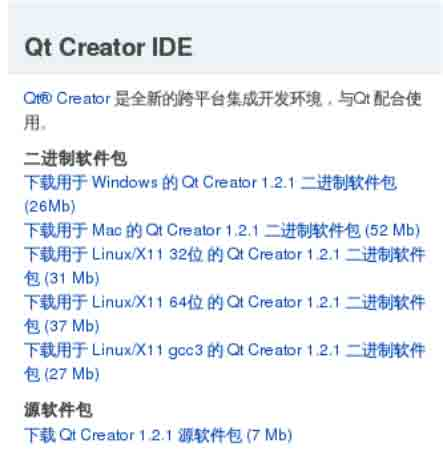

图 4-1 Qt Creator 下载界面

# 4.3 Eclipse

## 4.3 Eclipse

Eclipse 和 Qt 的结合起来使用，也是很常见的形式，Nokia 专门为此开发了插件。 Eclipse 的官方网站是：[`www.eclipse.org/，在上面可以很容易的下载到各种你需`](http://www.eclipse.org/，在上面可以很容易的下载到各种你需) 要的版本，目前的最高版本为 3.5 Galileo。

### 4.3.1 简介

Eclipse 是著名的跨平台的开源的集成开发环境（ IDE）。Eclipse 的本身只是一个框架平台，最初主要用来 Java 语言开发，但是众多插件的支持使得 Eclipse 拥有其他功能相 对固定的 IDE 软件很难具有的灵活性。许多软件开发商以 Eclipse 为框架开发自己的 IDE，比如 Nokia 的 Carbide.c++（后面我们还会讲到它），现在它已经发展成为支持其他多种计 算机语言如 C++和 Python 的优秀 IDE。

Eclipse 启动后的画面如图 4-2 所示。

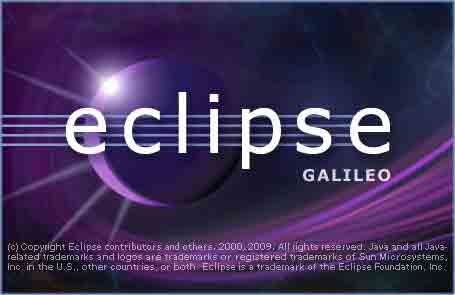

### 4.3.2 主要特点

Eclipse 的主要特点如下：

*   良好的扩展性

    图 4-2 eclipse 启动画面

    这要归功于 Eclipse 首创的插件机制，Eclipse 的设计思想是：一切皆插件。Eclipse 核心很小，其它所有功能都以插件的形式附加于 Eclipse 核心之上。Eclipse 基本内核包 括：图形 API (SWT/Jface)， Java 开发环境插件（JDT），C/C++环境插件插件（CDT）， 开发框架环境（PDE）等。

*   强大的支持

    Eclipse 最初是由 IBM 公司开发的替代商业软件 Visual Age for Java 的下一代 IDE 开 发环境，2001 年 11 月贡献给开源社区，现在它由非营利软件供应商联盟 Eclipse 基金会（Eclipse Foundation）管理。众多的业界巨头对 Eclipse 非常看好，并且持续投入巨资以支持研发和管理。

    除了商业公司的青睐，Eclipse 还得到来自世界各地的爱好者组成的众多开源社区的 支持，几乎每天都有新的插件和功能产生，而 Eclipse 基金会的管理也非常有序，基于 Eclipse 的成功应用屡见不鲜，这些都使得 Eclipse 成为最受欢迎的优秀 IDE 之一。

*   Qt 工程可以跨平台使用

    Eclipse 虽然不能解析 qmake 文件，但是使用它建立的同一个工程可以在 Windows、Linux 和 Mac OS X 使用。这就大大简化了移植应用程序的过程，与 Qt 的理念不谋而合。

*   代码提示功能突出

    与 Qdevelop 等其他 IDE 比较起来，Eclipse 没有使用 CTags 作为代码提示工具,因而在 进行代码提示的时候速度更快,CPU 资源占用更少.并且 Eclipse 中的提示内容更加的准确和 完整。

Eclipse 也有一些不足之处，主要是两点。一是耗费系统资源较多，这与它的机制和 Java 的运行效率有关；二是对 Qt 的支持还不是很完善，这与它的设计理念有关，它 的初衷 只是提供一个可扩展的框架，许多的功能还是要其他厂商或开发者自己完善。

具体使用时的感觉就是用 Eclipse 开发程序，机器要有较好的配置，内存一定要多一 些，否则程序的运行速度将比较缓慢，开发效率不高。

总的来说，Eclipse 是一个很好的 Qt IDE，它也是 qtsoftware 官方网站上推荐的 IDE 之一。良好的扩展性以及众多业界巨头的和开源社区的支持，都使 Eclipse 值得信赖和推 荐。

### 4.3.3 安装与配置

Eclipse 本身的安装比较容易，但与 Qt 结合起来就需要一定的步骤了，尤其是在 Windows 平台上面。一般很少有人在 Linux 平台上使用 Eclipse 开发 Qt 程序，这主要是由 于如果采用编译安装的方法的话，有太多的依赖问题需要解决，而如果使用发行版自带的 Eclipse 的话，又存在与 Qt 版本的对应问题。在 Mac OS X 上同样存在类似的问题，开发者 一般使用 Xcode。所以使用 Eclipse 一般是在 Windows 这个单一平台上，并且是选择 Windows XP 以上的版本。我们就以 Windows XP SP2 中文版和最新的 Qt 4.5.2 为例，向大 家介绍如何使用 Eclipse 开发 Qt 应用程序。

首先看看需要准备那些软件包，表 4-1 描述了需要安装的软件包和下载地址。

表 4-1 需要的软件包

| 软件包 | 说明 | 下载地址 |
| --- | --- | --- |
| JRE | Java 运行环境 | [`java.sun.com/javase/downloads/`](http://java.sun.com/javase/downloads/) |
| MinGW | C++编译器和调试器 | [`sourceforge.net/`](http://sourceforge.net/) |
| Qt OpenSource | Qt 库 | [`www.qtsoftware.com/downloads-cn`](http://www.qtsoftware.com/downloads-cn) |
| Eclipse | 支持 C++开发的版本 | [`www.eclipse.org/downloads`](http://www.eclipse.org/downloads) |
| Qt Eclipse Integration for C++ | Qt 与 Eclipse 的集成工具 | [`www.qtsoftware.com/developer/eclipse-integration`](http://www.qtsoftware.com/developer/eclipse-integration) |

安装过程如下：

第 1 步，确定安装顺序

由于 Eclipse 需要 JRE 才能运行，而 Qt Open Source 也依赖于 MinGW，所以我们按照下面的顺序安装软件包：JRE、MinGW、Qt Open Source 、Eclipse、Qt Eclipse Integration for C++。

第 2 步，安装 JRE

这里需要 JRE1.5 以上，我的选择是直接下载安装 JDK，其中包含了 JRE。安装方法可 以参考第二章，一路点击【Next】按钮，只是在设置安装路径时，不要选择带有空格和特 殊字符的就好。

第 3 步，安装 MinGW

MinGW 的安装也与第二章的方法相同，需要安装 DevCpp，或者选择在下面安装 Qt 时， 自动由 Qt 安装程序从网络上下载并安装，而不要自己下载安装最新的 5.1.4 版 MinGW。

第 4 步，安装 Qt 库

Qt Open Source 版可以选用 SDK，这样就不用先安装 MinGW 了。也可以选择框架，如 图 4-3 所示，在 qtsoftware 网站上，选择“下载用于 Windows 的 qt 库 4.5（60 Mb）”。 下载后的安装方法请看第二章。

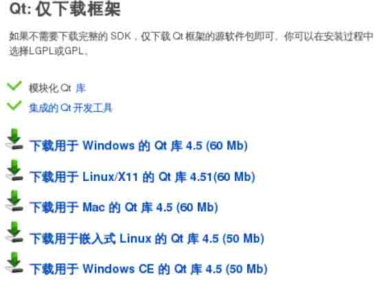

图 4-3 下载 Qt 库

第 5 步，安装 Eclipse

去网站上下载 Eclipse，由于 Eclipse 项目众多，它的网站上下载列表项变得很长，让人困惑，如图 4-4 所示，我们要下载的包是那个”Ecilpse IDE for C/C++ Developers(79 Mb)”。你下载到的文件名字类似于 eclipse-cpp-galileo-win32.zip，是一个压缩包。解 开它后，只要你安装过了 JRE，就可以运行了。

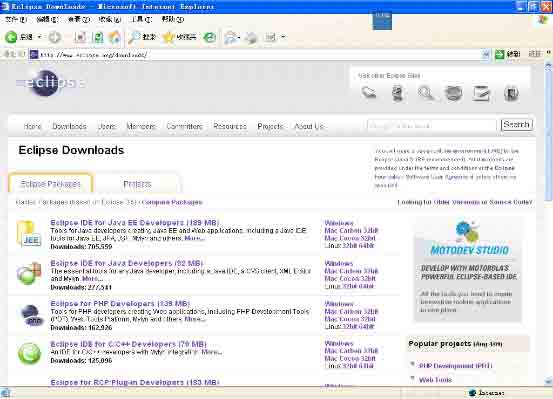

图 4-4 下载 ecilpse&CDT

接下来把它解压缩到你的目录中，为方便起见，可以把它解到某个盘符的根目录下， 比如 C 盘，因为它会创建完整的路径，如图 4-5 所示。

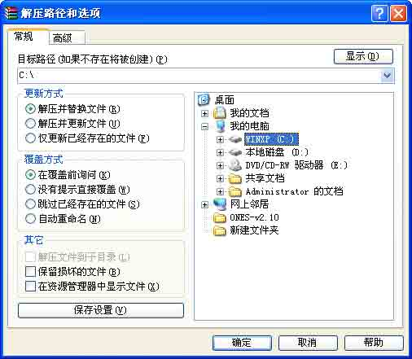

图 4-5 解压缩到根目录

这样解压缩后，我的情形是在 C 盘根目录下建立了一个 C:\eclipse 目录，如图 4-6 所 示，里面展开了所有内容，只要你前面安装了 JRE，这时候双击 eclipse.exe，就可以运行 了。

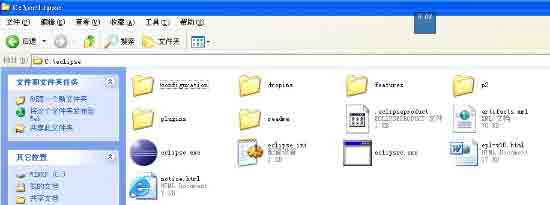

图 4-6 安装 eclipse 完毕

第 6 步，安装 Qt Eclipse Integration for C++

先到 Qt Software 网站上下载安装程序，情形如图 4-7 所示，我们需要下载 Windows 版的。

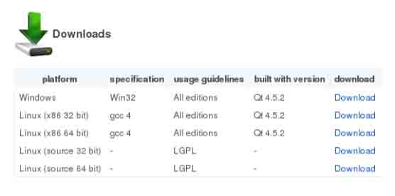

图 4-7 下载 Qt Eclipse Integration for C++

然后开始安装，中间过程基本都是一路选择默认。需要注意的是，选择 Eclipse 时需 要选择它的根路径，而 MinGW 则需要指定它的 bin 目录。如果你是采用 SDK 安装的 Qt 库， 那么你需要如图 4-8 所示进行设置。

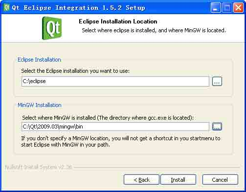

图 4-8 设置 eclipse 和 MinGW 的路径（SDK 方式安装 Qt 库）

如果采用框架方式安装，则你的设置应该如图 4-9 所示。

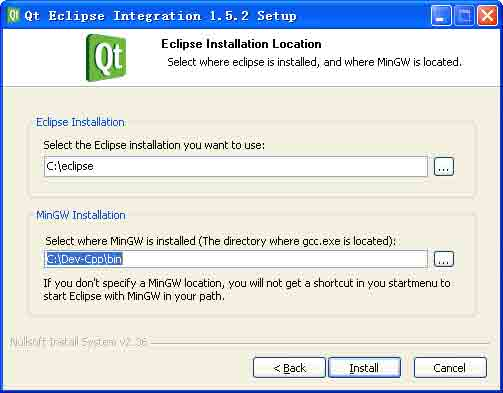

图 4-9 设置 eclipse 和 MinGW 的路径（框架方式安装 Qt 库）

接下来，就是一路按下【Next】按钮直至安装完成。 至此，Qt 和 Eclipse 的安装就完成了。

### 4.3.4 使用要领

1.软件的启动

你可以选择如下方式启动 Eclipse，依次点击菜单【开始】->【程序】->【qt eclipse integration】->【开始】，Eclipse 在弹出启动画面后，将进入如图 4-10 所示的主界面。

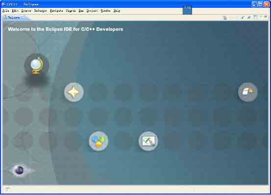

图 4-10 Ecilpse 成功启动

2.设置默认工作目录

在第一次启动 Eclipse 时，软件会要求设置默认工作路径，如图 4-11 所示在其中填入 你的路径即可。

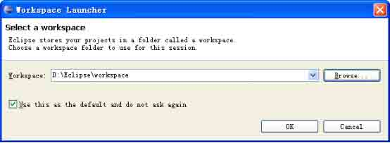

图 4-11 设置默认工作目录

小贴士：设置完默认工作目录之后，系统就不会再提出此要求了。但日后要想更改的话， 却找不到设置这一项的地方。因为 Eclipse 在第一次运行时才会去 plugins 目搜索插件， 之后就不再找了。而 Eclipse 不知道是出于什么原因，没有提供修改的方法。经过摸索， 解决方法有两种。

一种就是删除 Eclipse 的 configuration 目录，让 Eclipse 以为还是第一次启动，它 就会去搜索 plugins 找 Qt 插件了。

第二种就是加参数运行 Eclipse。在命令窗口下执行 eclipse.exe -clean 命令，Eclipse 就会清除配置文件然后重新搜索插件配置。

3.如何安装调试库

如果采用 SDK 安装 Qt 库，就已经安装了 debug 和 release 的动态库；如果采用框架方 式安装 Qt 库，默认是不安装调试库的，如需运行 Debug 模式，可以进入到 Qt 的 bin 目录 里面，输入如下命令即可编译调试库。

```cpp
qtvars.bat compile_debug 
```

或者依次点击【开始】->【程序】->【Qt by Nokia v4.5.2(OpenSource)】->【Qt4.5.2(Build Debug Libraries)】，这需要几个小时的编译时间和大约 10 个 G 的硬盘空 间，要有耐心，还要有足够的硬盘容量。

4.如何建立 Qt 工程

在主菜单上如图 4-12 所示依次点击【File】->【New】,就会出现多种可供选择的 Qt 工程类型，根据你的想法进行选择即可 。

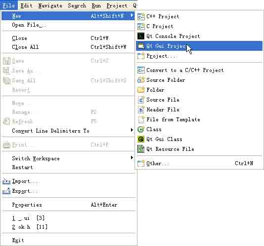

图 4-12 新建 Qt 工程

比如选择 Qt Gui Project，然后在出现的界面上放置一些常见控件，如图 4-13 所示， Qt Designer 已经无缝的集成到了 Eclipse 中。

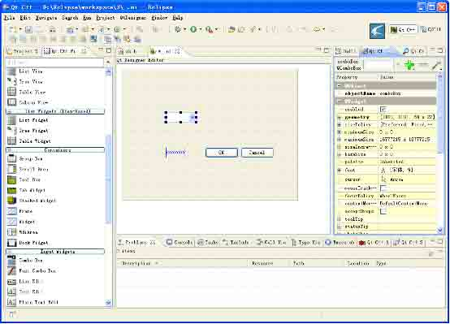

图 4-13 Eclipse 中集成 Qt Designer 4.4Visual Studio 2008（含 Express 版）与 Qt 4.5（含 4.5 的所有版本）

这里我们以 MS Visual Studio 2008 版为例，说明与 Qt 4.5 的集成使用方法，该方法 也适用于 Express 系列。VS 2005 与 Qt 4.5 的集成配置方法与此类似，只是在安装 VS 2005 时，需要打上 SP1 的补丁。我们更为推荐使用 VS 2008。据 Qt Software 透露的消息，自 Qt 4.6 开始，Qt 将提供针对 MS Visual Studio 系列 的直接安装版本，这一举措将大大简化安装配置的过程。但是，该版本内置的功能不一定能 够满足开发者的需求，所以本文介绍的编译安装方法是具有普遍意义的，希望大家能够用心 掌握。

下面以 Windows XP SP2 中文版为例，介绍如何把这两者集成使用。

第 1 步，安装 MS Visual Studio 2008

这一步里面，需要注意的有两点。一是可以选择英文版或者是中文版，在整个的安装 过程中并没有大的差异。使用中文版时，无论是 VS 2008 还是 2005 都需要安装 VS 的 SP1 包，否则会出现错误，导致安装失败。笔者个人喜欢使用英文版；二是安装时，最好选择完 全安装的方式，当然不会用到的语言和模块比如 VB 和 C#等就可以不选，VC 的所有组件要 全部安装上去。在网上好多朋友安装时出现了一些问题，很多都与 VS 安装时没有安装完全 有关。

第 2 步，安装 Qt 4.5 的源码

在官方网站的下载地址上下载 Qt 的 SDK，采用默认设置安装（不熟悉的朋友可以参阅第二章），注意版本是随时可能更新的，官网地址是： [`www.qtsoftware.com/downloads。我们这里选择`](http://www.qtsoftware.com/downloads。我们这里选择) LGPL/Free Downloads，然后选择 qt-win-opensource-src-4.5.0.zip 解压，假定解压到 E:\qt-win-opensource-src-4.5.0 ，注意解压路径不要包含空格、 中文名称以及其它特殊字符，解压后目录层次如图 4-14 所示。

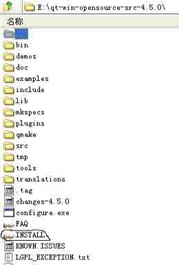

图 4-14 解压后目录层次

第 3 步，配置环境变量 主要是设置两个环境变量，使用命令行方法如下：

```cpp
set QTDIR=E:\qt-win-opensource-src-4.5.0
set path=%path%;%QTDIR%\bin 
```

使用图形化设置的方法如下：

依次点击【我的电脑】->【属性】->【高级】->【环境变量】，弹出【环境变量】设 置对话框，如图 4-15 所示。

然后点击【新建】按钮，弹出【新建用户变量】对话框，在其中的输入框中填写： “变量名” --- QTDIR “变量值” --- E:\qt-win-opensource-src-4.5.0

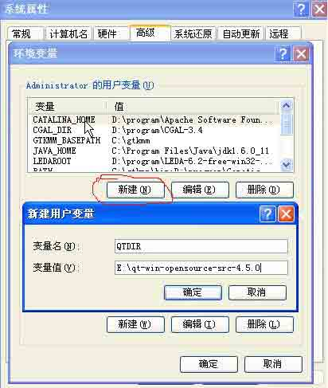

图 4-15 添加 Qt 的用户变量

与上面的步骤相似，修改 PATH 环境变量方法如下：

如图 4-16 所示，选择【PATH】变量，然后点击【编辑】按钮，在【变量值】的最后面 输入：

```cpp
;%QTDIR%\bin 
```

注意最前面有一个分号（不是中文的分号，切记）。

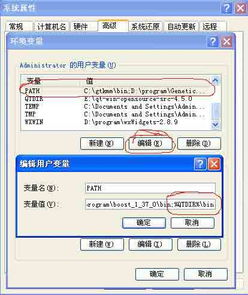

图 4-16 编辑 PATH 变量

第 4 步，使用 VS 编译 Qt 源码

最好先为 Qt 的 SDK 准备一个目录，如我的是:E:\Qt\4.5SDK。注意将磁盘格式设置为 FAT 32 格式，NTFS 格式可能会对安装过程有影响。

然后就开始编译 Qt 4.5 的源码。

通过【开始】菜单 ->【Microsoft Visual Studio 2008】->【Visual Studio Tools】, 运行 VS 2008 命令行提示，中间过程如下：

```cpp
C:\Program Files\Microsoft Visual Studio 9.0\VC&gt; cd c:\Program Files\Microsoft Visual Studio 8\Common7\Tools&gt;
C:\Program Files\Microsoft Visual Studio 8\Common7\Tools&gt; vsvars32.bat
C:\Program Files\Microsoft Visual Studio 8\Common7\Tools&gt; e:
E:\&gt; cd e:\qt\4.5sdk\qt
E:\Qt\4.5SDK\qt&gt; configure -platform win32-msvc2008 -debug-and-release
E:\Qt\4.5SDK\qt&gt; nmake 
```

使用目前主流机器配置，configure 这一步大概要用一小时。namke 大概要三个多小时。中间可能会有一些警告，可以不理会。

第 1 行和第 2 行，是配置 VC 的环境变量，如何知道环境变量已经配置好了呢？方法是在命令行下运行：

```cpp
cl.exe /? 
```

如果输出了 cl.exe 的帮助说明信息，则表示 vc 编译器环境变量设置成功。

小贴士：在命令行下，可以通过输入 set path 、 set include 和 set lib 等命令查 看 path、include、lib 环境变量的设置情况。

configure 命令主要是做两件事。

一是编译 qmake，并将编译好的 qmake.exe 拷贝到 bin 目录下（这就是要添加"%QTDIR%\bin ”到 PATH 环境变量中的原因）。

二是生成 makefile 文件（包括编译 qt 的 makefile 文件以及 examples、demos、tools 等的 makefiles 文件）。

configure 的使用是需要仔细琢磨的，可以通过加 -h 参数来看具体有哪些选项，有些 选项前面加*表示默认是选中的，+号表示由系统来判断是否支持该选项。表 4-2 列出了常 用的 configure 命令的常用参数。

表 4-2 configure 命令的常用参数

| 编译 shared 版（默认编译为 shared 版，不需要设置），并且 编译 debug 和 release 两个版本 | -debug-and-release |
| --- | --- |
| 使用 vc2008（包括 express 版） | -platform win32-msvc2008 |
| 使用 qt 自带的 zlib、gif、libpng、libmng、libtiff、 libjpeg | -qt-zlib -qt-gif -qt-libpng -qt-libmng -qt-libtiff - qt-libjpeg |
| 编译数据库插件支持 sqlite、odbc（需要相应的 C/C++头文件 和库的支持） | -plugin-sql-sqlite -plugin-sql-odbc |
| 不支持 qt3 | -no-qt3support |
| 无 mmx 指令集支持 | -no-mmx |
| 无 3dnow 指令集支持 | -no-3dnow |
| 无 sse 和 sse2 指令集支持 | -no-sse -no-sse2 |
| 无 direct3d 支持（默认不编译 direct3d） | -no-direct3d |
| 无 openssl 支持 | -no-openssl |
| 无 dbus 支持 | -no-dbus |
| 无 phonon 支持以及 phonon 向后兼容性支持 | -no-phonon -no-phonon-backend |
| 不编译 webkit 模块 | -no-webkit |
| 不支持脚本工具 scripttools | -no-scripttools |
| 不生成 sln 以及 vcproj 文件，只生成 makefile | -no-dsp -no-vcproj |

使用表中列出的参数，其对应的 configure 命令如下：

```cpp
configure -debug-and-release -platform win32-msvc2008 -qt-zlib -qt-gif -qt-libpng -qt-libmng
-qt-libtiff -qt-libjpeg -plugin-sql-sqlite -plugin-sql-odbc -no-qt3support -no-mmx -no-3dnow
-no-sse -no-sse2 -no-openssl -no-dbus -no-phonon -no-phonon-backend -no-webkit -no-
scripttools -no-dsp -no-vcproj 
```

编译完成之后，最好进行清理以节省硬盘空间，在命令行下输入：

```cpp
nmake confclean 
```

这样清理完成之后，整个 qt 解压目录大小约为 800M 左右。

第 5 步，最后，将 Qt 路径添加到 VC 编译环境中。

依次打开【工具】->【选项】->【项目和解决方案】->【VC++目录】。 在包含文件一栏添加：

```cpp
E:\qt-win-opensource-src-4.5.0\include\QtGui； E:\qt-win-opensource-src-4.5.0\include\QtCore； 
E:\qt-win-opensource-src-4.5.0\include 
```

在库文件一栏添加：

```cpp
E:\qt-win-opensource-src-4.5.0\lib 
```

将 Qt 安装路径添加到 PATH 系统环境变量中，例如：E:\qt-win-opensource-src- 4.5.0\bin（这一步可以省略，在本文的前面已经设置好了）。

第 6 步，安装 Qt for VS 的插件

要使 VS 中能新建 Qt 的项目及增加相关菜单和支持拖拉控件，还要再安装一个 Qt for VS 的插件。

在 Qt 的官网上下载该插件，可能的名字为 qt-vs-addin-1.0.2.exe（以你下载到的版 本为准）。在安装插件的时候可能会报找不到 Qt 目录，不要管它，只要找准了你刚才编译 的 Qt 目录就可以了。

安装完之后，再次打开 VS2008，就能发现已经支持 Qt 了。 第 7 步，配置和使用 VS

最后需要做的一步是在 VS 中指定使用的 Qt 目录。如果你在 Windows 上安装了多个版 本的 Qt Source，在 VS 中你还可以选择使用哪个版本的 Qt 来编译你的应用程序。

打开【工具】->【选项】->【Qt】->【Builds】，新建或选择一个 Qt 版本。

另外，通过菜单【Qt】->【Open Solution from .pro File】，可以把一个原本 Qt 的非 VS 的项目转成 VS 的项目。

至此，Qt4.5 和 MS Visual Studio 的编译环境基本上配置完成了，可以进行开发了。

# 4.5 问题与解答

## 4.5 问题与解答

问：我使用 Qt 4.5 和 Visual Studio 2008。我在编译 Qt 4.5 时总有提示：没有包 含:"windows.h"，然后就无法进行 configure，请指教是什么问题。

答：这通常是 Visual Studio 没有安装完全的缘故。你需要完整的卸载 Visual Studio 2008，再重新安装完全版本，然后再编译 Qt 就应该没有错误了。如果习惯的话， 使用英文版 Visual Studio 更好。

问：Qt4.5 + visual studio 2008 中文版的问题。我安装好后，打开 Qt 的 Example, 编译的时候报错误，错误提示如下：

```cpp
&gt;------ Build started: Project: calculatorform, Configuration: Debug Win32 ------
&gt;UIC calculatorform.ui
&gt;Moc'ing calculatorform.h...
&gt;Compiling...
&gt;main.cpp
&gt;calculatorform.cpp
&gt;Generating Code...
&gt;Linking...
&gt;LINK : fatal error LNK1181: cannot open input file 'QtCored4.lib' 
```

请帮忙解决。

答：从错误信息上推断，应该是安装过程出了问题。有几个关键地方需要注意，一是 安装 Visual Studio 时如果是中文版，要打上补丁 SP1；二是安装 Visual Studio 要完 整；三是不要安装 mingw，要使用 Visual Studio 编译 Qt；四是注意配置环境变量。五是 注意安装好集成插件。

问：可否实现在 Linux 下编译 Windows 环境下用 Qt + Visual Studio 2008 创建的工程？

答：这是可以实现的。步骤如下：

第 1 步，生成 .pro 文件。

第 2 步，在 pro 文件里面加宏 DEFINES += Linux 。

第 3 步，把整个工程拷贝到 Linux 机器上。

第 4 步，在命令行下面执行：

```cpp
qmake -makefile xxx.pro 
```

生成 Makefile 文件。

第 5 步，在命令行下面运行 make 命令，生成可执行文件。 问：Visual Studio 2005 每次调试都重新执行 moc

我的 Visual Studio 2005 没有修改任何文件, 但每次调试都会重新 moc, 非常麻烦。 不知是什么原因,请指教。

答：这个与 Qt 关系不大，是 Visual Studio 的缘故。通常是由于在你的工程中，有的 文件时间设置系统时间要靠后，就是晚了。重新调整一下时间即可。

问：Qt 4.5 与 Visual Studio 集成时候出错

我将 Qt 4.5 与 Visual Studio 2005 结合使用，在执行 nmake 后，安装了 qt-vs- addin-1.0.0.exe 这个软件。但是随后打开 VS 2005 时,出现如图 4-17 所示的提示信息。

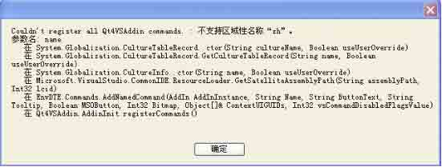

图 4-17 提示信息

然后在 Visual Studio 2005 的界面上 Qt 菜单下面没有任何的下拉菜单内容，如图 4- 18 所示。不知道是什么原因，请帮助解决一下。


图 4-18 Qt 菜单式空白的

答：你使用的是中文版的 Visual Studio，所以你需要在安装 Visual Studio 时，同时安装上它的补丁 SP1，这样就不会出现图 4-17 所示的那个问题了，或者干脆使用英文版的 Visual Studio。然后使用本章中的步骤把 Qt 与 Visual Studio 结合起来使用。有条件的 话，也可以使用 qt-vs-integration 这个系列的集成插件，它更为稳定一些。

问：我想在 Visual Studio 2008 中直接打开.ui 文件，而不是使用 Qt Designer，如 何办到？

答：这与你使用的集成插件版本有关。

到目前发布的 Qt 4.5.2 为止，如果在安装时使用的是 qt-vs-integration 就可以在 Visual Studio 2008 或者是 2005 中打开.ui 文件，但是 qt-vs-integration 这个软件不是 Open Source 的，需要有商业 license 才可以；如果使用的集成插件是 qt-vs-addin，这个 是 Open Source 的，但是在 Visual Studio 中就只能使用 Qt Designer 打开.ui 文件。

也就是说，在商业版本的 Qt 中，与 Visual Studio 结合起来使用，是可以无缝集成 的。而在 Open Source 版本的 Qt 中，与 Visual Studio 的集成使用是有一定限制的。

从 Qt Software 发布的 Qt Road Map 中可以推测，在 Qt 4.6 中这一情况有望得到改 善，即商业版和开源版 Qt 都可以与 Visual Studio 系列无缝集成。

# 4.6 总结与提高

## 4.6 总结与提高

本章主要介绍了目前 Qt4 的主流 IDE，其中最为常用的是 Qt Creator、Eclipse 和 Visual Studio 系列。如果需要在不同的平台间穿插使用，笔者建议考虑 Qt Creator 和 Eclipse，以 Qt Creator 作为首选。在单一平台 Windows 上，可以考虑 Visual Studio 系 列，这其中又以英文版的 Visual Studio 2008 最为推荐。这里再提一下 Qt Creator，越来 越多的朋友选择它是有道理的。Qt Software 官方出品、雄厚的资金和研发背景、业界巨头 的力推、强有力的社区支持、跨平台并且是开源的，清爽的界面和便捷的操作方式、吸引人 的 GPL 和 LGPL 授权方式等等，Qt Creator 的强点实在是太多，简直是集万千宠爱于一身， 无论是初学者还是资深的专家，都很难找出拒绝它的理由。 在后面的章节中，还将对 Qt Creator 的使用做更为详尽的讲解，并且程序实例都是使用 Qt Creator 完成的，希望大家 能够重点掌握。