# 第五章 使用 Qt 基本 GUI 工具

# 第五章 使用 Qt 基本 GUI 工具

**本章重点**

*   使用 Qt Designer（设计师）进行 GUI 设计
*   使用 Qt Demo 浏览 Qt 应用开发
*   使用 Qt Assistant（助手）获取在线文档与帮助

# 5.1 使用 Qt Designer 进行 GUI 设计

## 5.1 使用 Qt Designer 进行 GUI 设计

### 5.1.1 简介

Qt Designer，又被称作是 Qt 设计师，是一个所见即所得的全方位 GUI 构造器，它所 设计出来的用户界面能够在多种平台上使用。它是 Qt SDK 的一部分，也是最为重要的开发 工具之一。利用 Qt Designer，我们可以拖放各种 Qt 控件构造图形用户界面并可预览效 果。

通常一个 Qt Designer 的样子如图 5-1 所示。

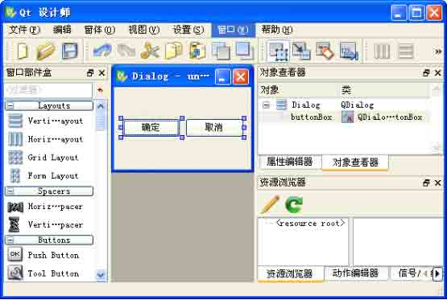

图 5-1 Qt Designer 的观感

使用 Qt Designer，开发人员既可以创建“对话框”样式的应用程序、又可以创建带有菜单、工具栏、气球帮助以及其他标准功能的 “主窗口”样式的应用程序。Qt Designer 提供了多种窗体模板，开发人员可以创建自己的模板，确保某一应用程序或某一系列应用程序界面的一致性。编程人员可以创建自己的自定义窗体，这些窗体可以轻松与 Qt Designer 集成。

Qt Designer 支持采用基于窗体的方式来开发应用程序。窗体是由用户界面 (.ui) 文 件来表示的，这种文件既可以转换成 C++ 并编译成一个应用程序，也可以在运行时加以处 理，从而生成动态用户界面。Qt 的构建系统能将用户界面的编译构建过程自动化，使设计 过程更轻松。

Qt Designer 可以轻松的与许多常见的 IDE 集成 Windows 平台的商业许可证持有人可 以在 Microsoft Visual Studio® 内充分享受到 Qt Designer 用户界面设计所带来的便 利。在 Mac OS X 中，开发人员则可在 Apple's Xcode® 环境内使用 Qt Designer。另外， Nokia 还为跨平台的 Eclipse 集成环境开发了 Qt 的集成插件，以将 Qt Designer 及其他 Qt 技术嵌入到集成环境框架中。

### 5.1.2 启动并设置 Qt Designer

要运行 Qt Designer，在 Windows 下，可单击“开始”菜单中的“Qt SDK by Nokia v2009.3(Open Source) | designer”；在 UNIX 下，可在命令行终端中输入 designer 命 令；在 Mac OS X Finder 中，只需双击 designer 即可。以 Linux 系统为例，启动 Qt Designer 通常有 2 种方法：

1.程序组启动

一般的，如果你的 Qt 是采用发行版已经编译好的 Qt 包的话，安装完毕后就已经在程 序组中设置了链接项，一般是在【开发】或是在【编程】组中。以笔者的 Red Flag 为例， 依次点击【应用程序】→【开发】→【Qt】→【Qt4 Designer–Interface Designer】 后，Qt Designer 就会启动了。

2.命令行启动

如果你是自己采用编译源代码的方式安装 Qt，并且没有设置快捷方式的话，你可以从 命令行启动 Qt Designer。方法是进入到命令行方式，或者打开一个终端，进入你 Qt 安装 的目录，以笔者的 Red Flag 为例，进入 /usr/bin/目录，输入 ./designer-qt4，即可启 动 Qt Designer。

注意，不同的 Linux 发行版的菜单设置以及可执行文件命名可能会有所不同。 3.设置 Qt Designer 启动 Qt Designer 后，首先需要需要对它进行设置。

Qt Designer 支持两种界面排列形式：一种是多个顶极窗口并列分布形式；一种是与 Windows 上常见的 IDE 类似的单窗口（即多停靠窗锚接）形式。

多个顶级窗口的样子如图 5-2 所示，Qt Designer 的各个子窗口都作为独立的顶级窗口 排列在屏幕中，用户可以自由改变其位置和尺寸大小。

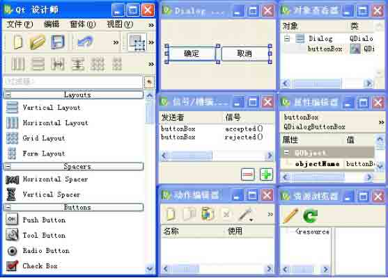

图 5-2 处于“多个顶级窗口”模式下的 Qt Designer

锚接窗口模式下的 Qt Designer 的样子如图 5-3 所示。

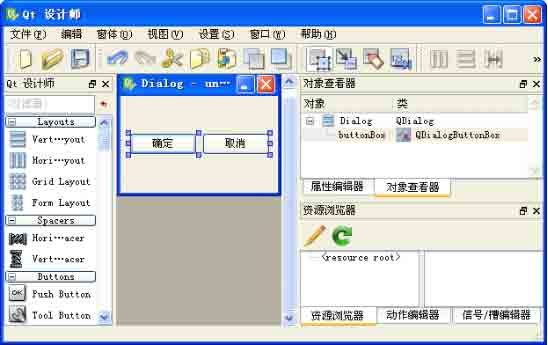

图 5-3 处于“锚接的窗口” 模式下的 Qt Designer

在 Qt4.5 版以前，Qt Designer 默认情况下以多个顶极窗口并列的形式显示，在 Qt4.5 之后，默认是锚接窗口的形式。这一改动受到了大多数开发者的欢迎，因为大家还是习惯使 用锚接窗口的界面布局形式。

如果你想变更 Qt Designer 的界面布局形式，在主菜单上依次选择【设置 】→【属性】→【外观】→【锚接的窗口/多个顶极窗口】即可。

### 5.1.3 功能说明

1.界面布局

Qt Designer 主要由窗口部件盒、对象查看器、属性编辑器、资源浏览器、动作编辑器 和信号/槽编辑器组成，它们都是锚接窗口，通常排列在窗体的两侧，也可以定制它们的位 置。如图所示，界面中间是新建立的窗体。


图 5-4 Qt Designer 的布局

2.功能项说明

表 5-1 示出了 Qt Designer 主菜单项的功能说明。

表 5-1 菜单项功能说明

| 菜单项 | 说明 |
| --- | --- |
| 文件 | 提供文件的新增、读取、存储、打印以及退出 Qt Designer 等命令 |
| 编辑 | 提供数据的剪贴、复制、查找，光标的跳转、代码补全；编辑窗口部件、编辑信号/槽、伙伴、Tab 顺序等命令 |
| 窗体 | 提供窗体属性设定、布局设置、调整 大小、预览等命令 |
| 视图 | 提供各种配置窗口、工具栏等的显示和隐藏设置等命令 |
| 设置 | 提供窗体属性设定，附加字体设定等命令 |
| 窗口 | 提供窗口的切换以及最小化等命令 |
| 帮助 | 提供调用 Qt Asssistant 等帮助命令 |

表 5-2 示出了文件工具栏功能说明。

表 5-2 文件工具栏功能说明

| 名称与图标 | 功能 |
| --- | --- |
| 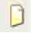 | 新建窗体 |
|  | 打开窗体 |
|  | 保存窗体 |

表 5-3 示出了编辑工具栏功能说明。

表 5-3 编辑工具栏功能说明

| 名称与图标 | 功能 |
| --- | --- |
|  | 撤销上一次操作 |
|  | 恢复操作 |
|  | 剪切 |
|  | 复制 |
| 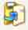 | 粘贴 |
|  | 放到后面 |
| 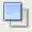 | 放到前面 |
|  | 编辑窗口部件 |
|  | 编辑信号/槽 |
|  | 编辑伙伴 |
|  | 编辑标签顺序 |

表 5-4 示出了窗体布局工具栏功能说明。

表 5-4 窗体布局工具栏功能说明

| 名称和图标 | 功能 |
| --- | --- |
|  | 设置为水平布局 |
|  | 设置为垂直布局 |
|  | 设置为分裂器水平布局 |
|  | 设置为分裂器垂直布局 |
|  | 设置为栅格布局 |
|  | 设置为表单布局 |
|  | 打破布局 |
|  | 调整大小; |

3.主要部件的使用

窗口部件盒（Widget Box）

窗口部件盒是 Qt Designer 为使用者提供的窗口部件集合，根据你安装的 Qt 包的版本 和种类的不同，窗口部件盒中部件的种类也不尽相同，通常有 Layouts、Spacers、 Buttons、Items Widgets(Model-Based)、Item Widgets(Item-Based)、Containers、Input Widgets、Display Widgets 等大类。

以笔者使用的 Qt4.5.2 开源版为例，通常一个窗口部件盒的样子如图 5-5 所示

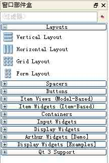

图 5-5 窗口部件盒

使用窗口部件盒的方法是用左键选中某一个部件，将它拖动到你的窗体屏幕上去，并 释放鼠标左键，这样就在界面上添加了这个部件。

属性编辑器（Property Editor） 属性编辑器是另一个非常重要的组件，当我们将界面上的窗体放置好后，就需要对各个组件的属性进行设置，通常一个属性编辑器的样子如图 5-6 所示。

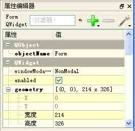

图 5-6 属性编辑器

属性编辑器的使用也是非常简单的，使用者点击界面上的某一个部件，然后在属性编 辑器中设置属性即可，属性编辑器中属性栏的项目都是以英文来显示的，只要你对常用的计 算机编程中的英文词汇有所了解，理解它们的意思并正确的设置属性并不难。我们会在后面 结合具体实例为大家讲解。

对象查看器（Object Inspector）

对象查看器用来查看和设置窗体中的各个对象及其属性。

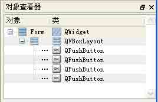

图 5-7 对象查看器

对象查看器通常与属性编辑器配合使用，一般是在设置好界面元素后，在对象查看器 中查阅各个元素的分布以及总体的布局情况，然后选中其中某个窗口部件，切换到属性编辑 器中编辑它的属性。

Qt Designer 还有几个重要的部件如资源浏览器、动作编辑器、信号 /槽编辑器等，我 们将在下面各节以及后面的各章中结合实例为大家介绍。

### 5.1.4 Qt GUI 设计基本流程

使用 Qt Designer 设计窗体十分简单,一般遵循如下的步骤。

第 1 步，启动 Qt Designer，选择要创建的应用类型。

启动 Qt Designer 后，将出现如图 5-8 所示的新建窗体对话框。

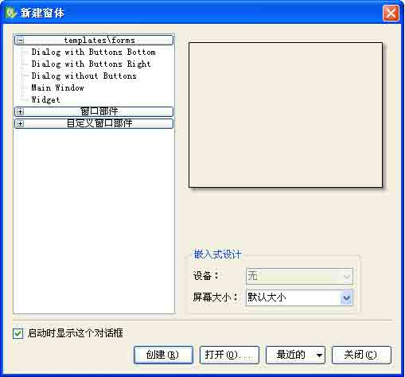

图 5-8 新建窗体对话框

Qt 4.5 默认为使用者提供了 3 大类模板供选择，即常见的窗口模板（templates\forms）、窗口部件盒自定义窗口部件。我们最为常用的是第 1 大类，其中包 括了对话框、主窗口和普通窗口部件等几种应用类型模板。这里我们以最后一项 Widget 为 例，选中它，再点击【创建】按钮，一个空白的 Widget 就创建好了,如图 5-9 所示。

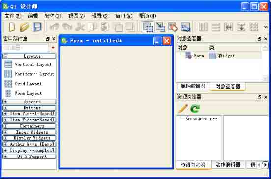

图 5-9 创建 Widget 类型界面

第 2 步，将控件从窗口部件盒拖到窗体上，然后使用标准编辑工具来选择、剪切、粘

贴窗体并重新调整大小。以图 5-10 为例说明，我们从窗口部件盒里面，拖动出 2 个 Label、2 个 LineEdit、1 个 PushButton 和 1 个 Horizontal Spacer，大致排列一下放在窗体上。

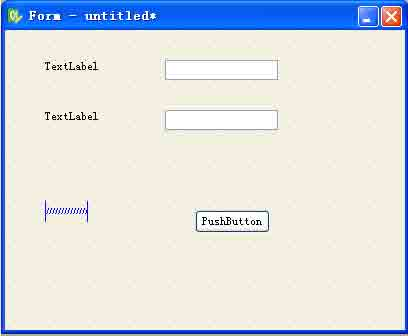

图 5-10 添加窗口部件

第 3 步，使用属性编辑器来更改窗体和每个控件的属性。

基本的属性包括窗口部件的 objectName、text 以及大小位置等。在表 5-5 中列出 了这几个窗口部件的常见属性设置，这里我仅仅举出 objectName 和 text 这两个最为 常用的属性，其它的属性设置与此类似。这样设置完成后的界面大致如图 5-11 所示的 样子。

表 5-5 窗口部件的属性设置

| 部件类别 | objectName | text(WindowTitle) |
| --- | --- | --- |
| Widget | myForm | 布局示例 |
| Label | label_name | 姓名 |
| Label | label_phone | 电话 |
| LineEdit | lineEdit_name | 无 |
| LineEdit | lineEdit_phone | 无 |
| Horizontal Spacer | horizontalSpacer | 无 |
| PushButton | pushButton_ok | 确定 |

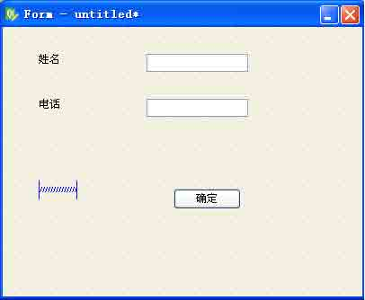

图 5-11 设置好部件属性的窗体

第 4 步，保存窗口设置，按下 Ctrl+Shift+S 组合键，在弹出的如图 5-12 所示的【窗 体另存为】对话框中输入文件名，然后点击保存按钮。

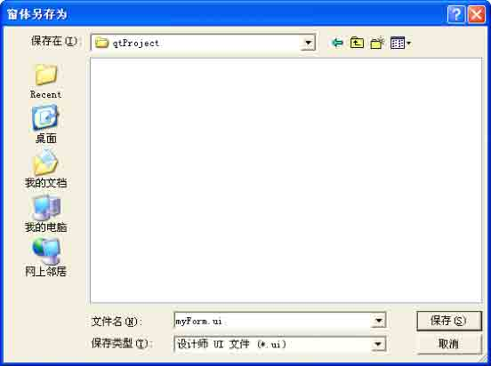

图 5-12 保存窗体

第 5 步，设置界面布局。

与我们习惯的在 MS Visual Studio 中不同，Qt Designer 在设计界面时时，不必 刻意手工调整窗体的大小和精确位置，我们只需选中窗体，并对它们运用布局。例 如，您可以选中一些按钮控件，并通过选择 【水平布局】选项将它们水平并列排放。 采用这种方法，可以使设计更快速，设计完成后，控件会根据最终用户需要的窗体大 小正确缩放。

在 Qt 4.5 中，常见的窗体布局有 6 种，表 5-6 示出了这些布局的种类和功用。

表 5-6 常见的布局类型

| 布局类型 | 作用 |
| --- | --- |
| 水平布局 | 按规则水平排列布局内的窗口部件 |
| 垂直布局 | 按规则垂直排列布局内的窗口部件 |
| 分裂器水平布局 | 按规则水平排列布局内的窗口部件，并将整体作为一个水平分裂器 |
| 分裂器垂直布局 | 按规则垂直排列布局内的窗口部件，并将整体作为一个垂直分裂器 |
| 栅格布局 | 按二维栅格的方式排列布局内的窗口部件 |
| 窗体布局中布局 | 将布局内的窗体部件分成两列，通常用于有输出输出的 GUI 场合 |

好了，有了上面的指导思想，回到我们的界面设计上来。我们同时按下 Ctrl 和 A 键，这就选中了窗体上的所有部件，在它们上面点击鼠标右键，在上下文菜单上依次 选择【布局】->【栅格布局】，我们就选中栅格布局，这时界面情形如图 5-13 所示，是不是比较美观了。其实，这样设置还是有一些问题存在，比如最好还要设置窗体的顶级布局（Top Level Layout）等。我们在后面再为大家详细讲解，这里不再深入讨 论了。

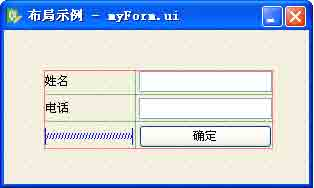

图 5-13 采用栅格布局后的效果

第 6 步，设置窗口部件的标签顺序。

说到标签顺序，大家可能听起来有些糊涂，在 Windows 平台上我们通常称作焦点顺序 或者 Tab 顺序，顾名思义，就是按下 Tab 键时，窗口焦点在这些部件间的移动顺序。

设置方法是点击工具栏上的那个带有数字图标的按钮，或者依次点击主菜单的 【编 辑】->【编辑 Tab 顺序】，这就进入了标签设置模式，如图 5-14 所示，窗体中各个具有获 得焦点能力的部件上会出现一个蓝色的小框，框内的数字表示该部件的标签顺序，即焦点顺 序。我们可以通过单击蓝色小框来修改标签顺序，被点中的小框将变为红色，完成设置后按 下 F3 键，切换回到编辑窗口部件模式。

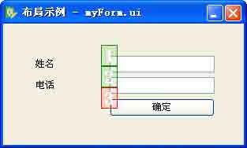

图 5-14 设置窗口部件的标签（Tab）顺序

第 7 步，设置信号与槽

按下 F4 键，或者依次点击【编辑】->【编辑信号/槽】，进入编辑信号/槽模式，如图 5-15 所示。

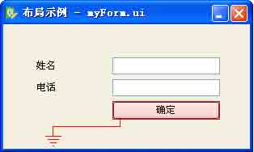

图 5-15 创建信号/槽

这时单击【确定】按钮，然后拖动鼠标，可以发现有一根红色的类似接地线形状的标志线被拖出，松开鼠标，弹出信号 /槽连接配置窗口，注意选中左下角的 【显示从 Qwidget 继承的信号和槽】按钮，界面上将列出所有可以使用的信号和槽， 如图 5-16 所示。

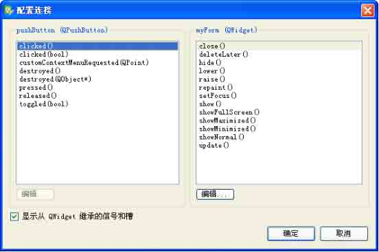

图 5-16 连接信号/槽

在这个连接配置窗口的左侧列出了【确定】按钮的所有信号，右侧列出了 myForm 这个 Widget 的所有槽，选择按钮的 clicked()信号和 myForm 的 close()槽，单击【确定】按 钮，完成设置，如图 5-17 所示。

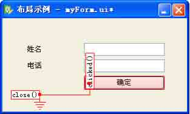

图 5-17 完成信号/槽的连接

到此，有关 Designer 的操作就结束了，它将生成一个.ui 文件。

注意，Qt Designer 有 4 种编辑模式，即编辑窗口部件模式、编辑信号 /槽模式、编辑 伙伴模式和编辑 Tab 顺序模式，其中编辑伙伴模式不常用到。

关于 Qt Designer 的使用，有非常丰富的内容，这里只是使大家有一个初步的感性认 识，在下面的各章中，笔者将结合具体实例向大家详细的一一介绍。

# 5.2 使用 Qt Assistant 获取在线文档与帮助

## 5.2 使用 Qt Assistant 获取在线文档与帮助

### 5.2.1 简介

对于大多数复杂的程序来说，在线文档和帮助是必不可少的。 Qt 通过 Qt 助手－一个 帮助文件和文档的在线阅读器，来满足这一需求。 简单的说，Qt Assistant 就是浏览 Qt 参考文档的工具，它具有强大的查询和索引功能，使用时能够比 Web 浏览器更加快速和容 易。而且它可定制，并且可随用户自己的应用程序一起发布，从而形成用户自己的帮助系 统。

开发人员可以将 Qt Assistant 部署为自有应用程序和文档集的帮助浏览器。使用 QAssistantClient 类，可以集成 Qt Assistant。Qt Assistant 使用 QTextEdit 来显示 Qt 的 HTML 参考文档；如有必要，开发人员也可以使用此类来直接实现自己的帮助浏览 器。QTextEdit 支持 HTML 4.0 的子集，它与 Qt 提供的富文本（RichText）类一起使用 时，也可以用来显示其他格式的文档。

### 5.2.2 Qt 的参考文档

Qt 的参考文档包括大约 3,100 页 HTML 文档，描述 了 Qt 的所有类和工具，并概述 了 Qt 编程的各个方面，所以对于任何一名 Qt 开发人员来说，它都是一个基本工具。 通常 任何一本 Qt 书籍都不能完全覆盖到 Qt 中所有的类和函数，同时也无法提供全部的细节。 所以如果想尽可能的从 Qt 获益，那么就应当尽可能的达到对 Qt 参考文档了如指掌的程 度。

在 Qt 的 doc/html 目录下可以找到 HTML 格式的参考文档，并且可以使用任何一种 Web 浏览器来阅读它。也可以使用 Qt 的帮助浏览器 Qt Assistant，它具有强大的查询和索引功 能，使用时能够比 Web 浏览器更加快速和容易。

另外，可以从 [`doc.trolltech.com`](http://doc.trolltech.com) 中获取 Qt 的当前版和一些早期版本的在线参考文档。这个网站也选摘了 Qt 季刊（Qt Quarterly）中的一些文章。Qt 季刊是 Qt 程序 员的时事通讯，会发给所有获得 Qt 商业许可协议的人员。

### 5.2.3 使用 Qt Assistant 1.运行 Qt Assistant

要运行 Qt Assistant，在 Windows 下，如果是采用 Qt SDK 方式安装的 Qt 库，那么你 在程序组里面是找不到 Qt Assistant 的快捷方式的，它被整合到了 Qt Creator 里面，你 可以在运行 Qt Creator 时，按下 F1 键，即可调出 Qt Assistant，或者可以去 Qt 的安装目 录下面找到 Qt Assistant 的执行文件，双击运行或者干脆为它在桌面上设置一个快捷方 式；如果使用框架方式安装 Qt 库的话，可以在程序组里面找到它的快捷方式，点击后即可 运行；在 X11 下，可在命令行终端中输入 assistant 命令；在 Mac OS X Finder 中，只需 双击 assistant 即可。

注意，上述指的是一般的情况，比如各个 Linux 发行版对 Qt Assistant 的命名也有所 不同，甚至有时路径也不完全一样。下面是个具体例子：

如果你是自己编译源代码安装的 Qt，而且没有配置快捷方式的话，可以启动命令行， 进入你的 Qt 安装目录，以笔者的 Red Flag 6.0 为例，依次键入下列命令。

```cpp
$ cd /usr/bin
$ ./assistant-qt4 
```

一般的，Qt Assistant 运行起来的效果如图 5-18 所示

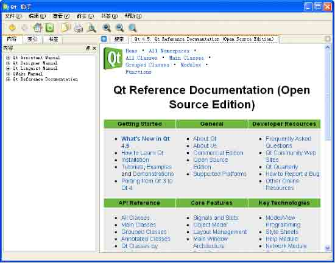

图 5-18 Qt4 Assistant

2.使用方法

其实读者朋友如果用过 Windows 上微软出品的 MSDN 的话，就会发现 Qt4 Assistant 的 界面布局与 MSDN 十分相似，操作方法也是大同小异，很容易上手。

(1) 界面布局

图示出了 Qt Assistant 的界面布局结构，它通常分为 3 个部分，最上面是主窗口，左 侧下面是内容索引窗口，右侧下面是主浏览区。

主浏览区

图 5-19 Qt4 Assistant 界面功能分布

(2) 菜单和工具栏

表 5-7 示出了 Qt Assistant 主要菜单项的功用。

表 5-7 Qt Assistant 菜单项

| 菜单 | 说明 |
| --- | --- |
| 文件 | 提供文档设置、打印等相关操作操作命令 |
| 编辑 | 提供首选项设置、复制文本、查找等操作命令 |
| 查看 | 提供工具栏、各个标签页的显隐设置，显示比例设置等操作命令 |
| 前往 | 提供登录 Qt 主页以及在 Qt Assistant 各个页面间导航等操作命令 |
| 书签 | 提供添加书签操作命令 |
| 帮助 | 提供帮助命令 |

表 5-8 示出了导航工具栏的功用。

表 5-8 Qt Assistant 导航工具栏

| 名称和图标 | 功能 |
| --- | --- |
|  | 后退 |
|  | 前进 |
|  | 登录 Qt 主页 |
|  | 同步目录 |

表 5-9 示出了文件和编辑工具栏的功用。

表 5-9 Qt Assistant 文件和编辑工具栏

| 名称和图标 | 功能 |
| --- | --- |
|  | 复制选中的文本 |
|  | 打印 |
|  | 在文本中查找 |

表 5-10 示出了查看工具栏的功用。

表 5-10 Qt Assistant 查看工具栏

| 名称和图标 | 功能 |
| --- | --- |
|  | 放大 |
|  | 缩小 |
|  | 正常大小 |

(3) 使用内容索引窗口

默认情况下，内容索引窗口分为 3 个标签页，分别是“内容”、“索引”和“书签”，如图 5-20 所示。其中最常用的是前两个。

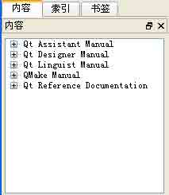

图 5-20 内容索引窗口

内容标签页分成了 5 个大类，分别对应到 Qt Assistant 操作、Qt Designer 操作、Qt Linguist 操作、QMake 使用、Qt 参考文档和例子这几项内容。

如果你能确定你在使用和开发中遇到的问题属于哪种类别的时候，使用 “内容”标签 页是合适和方便的，你只需点击选取某个大类，然后在展开的树形列表中选中某一个具体类 别，双击即可在右面的“主浏览区”内阅读详细的内容，如图 5-21 所示的是你想查看如何 使用 qmake 工具的情形。

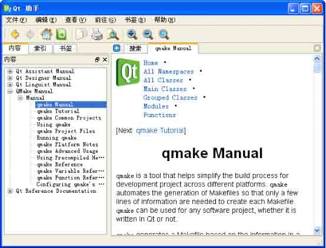

图 5-21 使用内容标签页

可以看到，在主浏览区的内容也是分层次管理起来的，读者可以根据需要进行操作。

(4) 使用“索引”标签页 “索引”标签页是使用频率很高的，因为好多时候我们并不能准确定位出现的问题是属于哪一类的情况，这时候，使用 “索引”标签页，如图 5-22 所示，在“查找”编辑框内输入你的问题或是问题概述或是包含的几个字母都可以， Qt Assistant 将列出所有符合你 的需求的类别，选中你觉得合适的类别，双击它即可在右面的主浏览区内查阅相关内容。

比如我们想浏览 Qt Demo 的情况，在编辑框内输入 qtde，这时 Qt Assistant 已经智能 的显示出了相关的索引结果，然后我们选中 qtdemo，双击它，就可以在右面的主浏览区内 查看了。

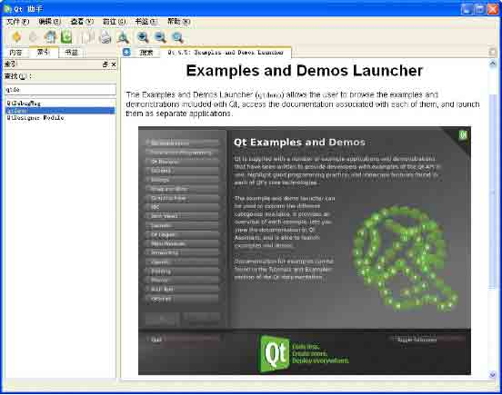

图 5-22 使用索引标签页

(5) 使用“标签”标签页

“标签”标签页也是经常会用到的，当你某次查询时觉得某条资料很有用，希望下次 再来使用，就可以使用“标签”。一个书签页的情形如图 5-23 所示。

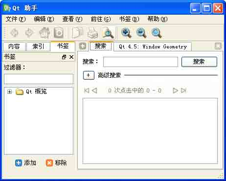

图 5-23 使用“标签”标签页

注意在窗口的左下角有一个蓝色的【添加】按钮和一个红色的【移除】按钮，它们就 是用作添加和删除书签的，你可能还注意到在右边的主浏览区内有一个 【搜索】标签页，下 面就结合这两者的使用说一下如何添加和移除标签 。

第 1 步，在右边的主浏览区内的“搜索”编辑栏内输入你想输入的字符，比如输入 qt，那么主浏览区将会把与 qt 相关的所有条目罗列出来，如图 5-24 所示

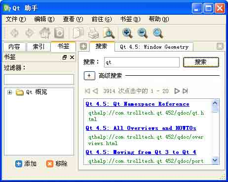

图 5-24 输入关键词进行搜索

第 2 步，你需要选中一个条目（图中蓝色的是条目），比如条目中的第 2 项，如图 5-

25 所示，系统将跳转到相应的页面

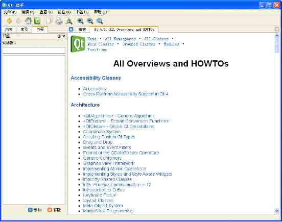

图 5-25 选中一个条目，跳转到相应界面

第 3 步，点击【添加】按钮，Qt Assistant 将弹出“添加书签”对话框，请使用者添 加书签，如图 5-26 所示。

高级配置按钮

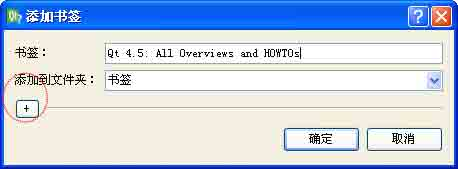图 5-26 添加书签对话框

如果没有特别要求，就可以在对话框上点击 【确定】按钮，添加书签，如图 5-27 所示。

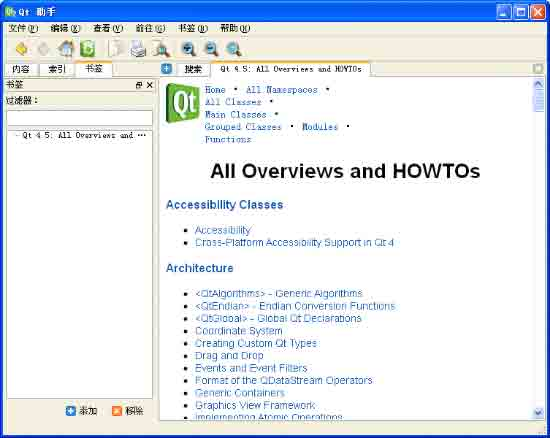

图 5-27 添加书签后的情形

如果还需要进一步定制书签，那就这样做：

第 1 步，点击【添加书签】对话框上点击那个带加号形状的按钮， 对话框将伸展开来，显示进一步的配置选项，如图 5-28 所示。

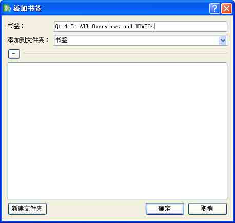

图 5-28 定制书签第 1 步－点击＋号按钮

第 2 步，点击【新建文件夹】按钮，这时默认建立了一个名为“新建文件夹”的标签类别，这个过程分别如图 5-29 和图 5-30 所示。

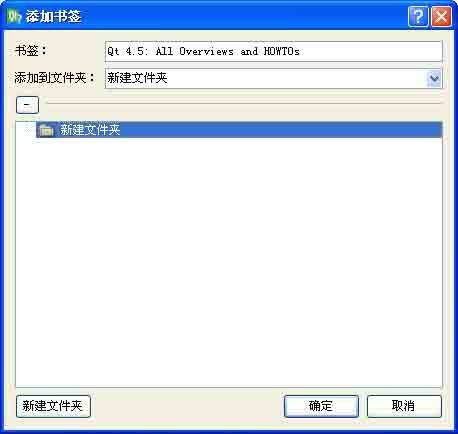

图 5-29 定制书签第 2 步－点击【新建文件夹】按钮

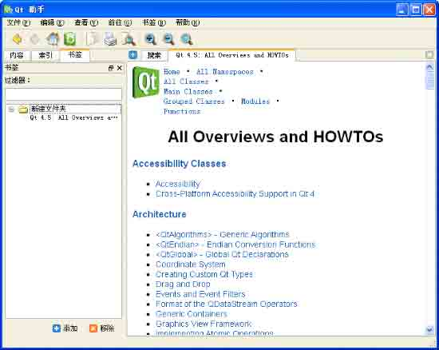

图 5-30 建立好的书签文件夹

第 3 步，在你新建立的文件夹上点击鼠标右键，弹出配置菜单，你可以选择 【删除文 件夹】或是【重命名文件夹】，如图 5-31 所示

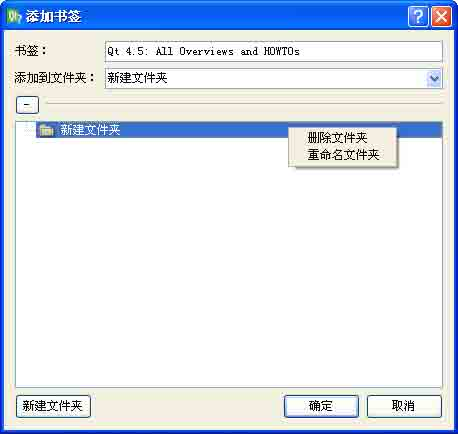

图 5-31 第 3 步－配置文件夹

第 4 步，选择【重命名文件夹】后，输入你想定义的文件夹名称，如图 5-32 所 示。

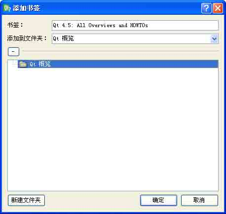

图 5-32 重命名文件夹

第 5 步，点击【确定】按钮，Qt Assistant 将为你建立一个标签，如图 5-33 所 示。


图 5-33 建立好的标签页

第 6 步，依据标签进行检索。在左侧建立好的标签页上双击， Qt Assistant 将跳转到 对应的页面，如图 5-34 所示。

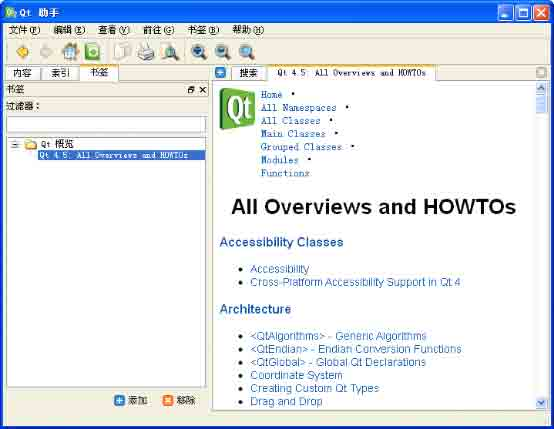

图 5-34 依据标签进行检索

第 7 步，删除标签页。选中建立好的标签，然后点击 【删除】按钮，即可删除标签； 也可以选中建立好的文件夹，然后点击 【删除按钮】，系统会出现提示信息，选择【是】按 钮即可删除整个文件夹下的所有标签，如图 5-35 所示。

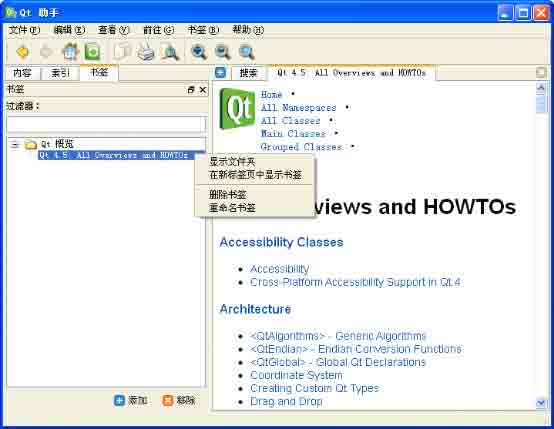

图 5-35 删除文件夹下的书签

至此，关于 Qt Assistant 的使用方法就讲解完了。Qt Assistant 在编程实践中经常会 用到，必须熟练掌握。

# 5.3 使用 Qt Demo 学习 Qt 应用程序开发

## 5.3 使用 Qt Demo 学习 Qt 应用程序开发

1.简介

Qt Demo 是 Qt 套件之一，它包含了大量的演示和示例程序，基本涵盖了 Qt 编程中的 主要类别，将它与 Qt Assistant 结合使用能够收到很好的效果。

2.运行 Qt Demo

要运行 Qt Demo，在 Windows 下，如果是可依次单击【开始】→【（所有）程序】→【Qt SDK by Nokia v2009.03(OpenSource)】→【Qt Demo】；在 X11 下，可在命令行终端 中输入 assistant 命令；在 Mac OS X Finder 中，只需双击 assistant 即可。

注意，上述指的是一般的情况，请根据你自己安装 Qt 的实际情况进行调整，如采用 SDK 方式安装和采用框架方式安装后，程序组中的指向 Qt Demo 的名字会有所不同，但区别 不大；而各个 Linux 发行版对链接 Qt Demo 的快捷方式命名也有所不同，甚至有时路径也 不完全一样。下面举个具体例子：

如果你是编译源代码来安装的 Qt，并且没有为其配置快捷方式的话，那么可以用命令 行方式运行 Qt Demo，这里以 Red Flag 6.0 为例，进入命令行界面，依次键入:

```cpp
$cd /usr/bin
$./qtdemo-qt4 
```

即可运行 Qt Demo 了。

通常 Qt Demo 运行起来的样子如图 5-36 所示，比较遗憾的是目前 Qt4 Demo 还是全英 文的，这就要求使用者对计算机相关的计算机英语有熟练的掌握，如果能够做到这一点，那 么使用 Qt4 Demo 并不是一件困难的事情。

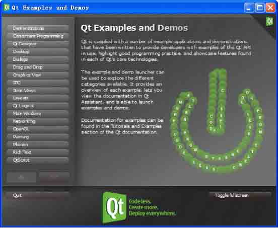

图 5-36 Qt4 Demo 的样子

3.使用 Qt Demo

Qt4 Demo 的界面十分清爽，左边列出了可供参考示例的类别，右边则是这个类别的概 述，在左下角还有导航按钮，可以在各个不同页面间跳转。

在界面的最下方中间是 Qt 的标志，左边是【退出】按钮，用于退出 Qt4 Demo，右边是 用于切换全屏显示和正常显示的按钮。

下面介绍使用使用 Qt Demo 的主要流程。

第 1 步，选择某一个大类。这里是选择【Dialogs】，方法是用鼠标左键在上面单击一下， Qt4 Demo 将跳转到该类别的页面，如图 5-37 所示。

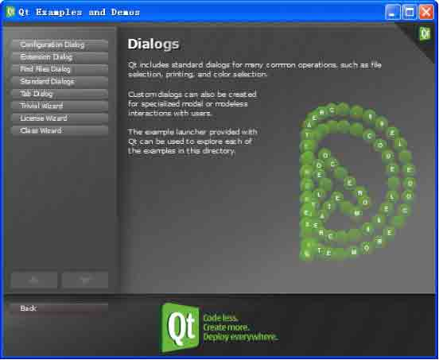

图 5-37 选择 Qt Demo 中大的类别

第 2 步，选择细分类别。在左侧的细分类别中点选一个，如 【Configuration Dialog】，如图 5-38 所示。

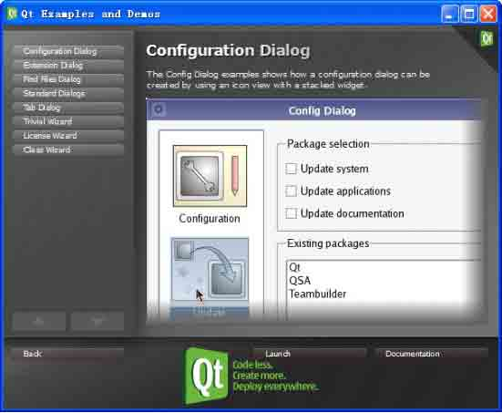

图 5-38 选中【Configuration Dialog】后的情形

第 3 步，查看示例的运行效果。点击【Lauch】按钮，Qt Demo 将运行示例程序，如图 5-39 所示。

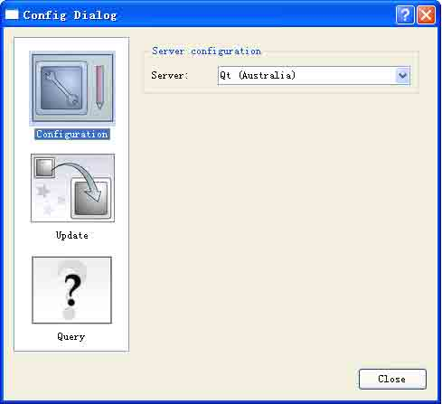

图 5-39 查看示例运行效果

第 4 步，查阅例子代码和参考文档。这实际上是和 Qt Assistant 配合起来使用的，点 击【Documentation】按钮，将调用 Qt Assistant 并切换到相应的页面，如图 5-40 所示。

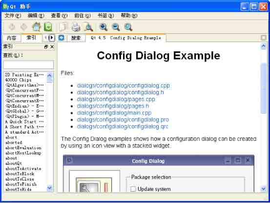

图 5-40 查看例子代码和参考文档

第 5 步，使用代码或文档。下面实际上就是 Qt Assistant 的相关操作了，进入到某一 个源代码文件中，可以浏览、复制源代码，或者稍作修改作为自己代码中的一部分。这里不 再详述，请读者自行实验。

关于 Qt Demo 的使用就就讲解到这里，请读者朋友在使用中与 Qt Assistant 结合起 来，往往能收到事半功倍的效果。

# 5.4 问题与解答

## 5.4 问题与解答

问：如何使用 Qt Assistant 浏览 Qt 类结构？

答：启动 Qt Assistant 后，点击那个 home 链接标签，就来到它的主页上的“API Reference”小节中的链接提供了浏览 Qt 类的几种不同方式，如图所示。“All Classes” 页面列表会列出 Qt API 的每一个类，而“Main Classes”页面列表只会列出那些最为常用 的类。

需要注意的是，通过继承得到的函数的文档会显示在它的基类中，例如， QPushButton 就没有它自己的 show()函数，因为它是从 QWidget 那里继承的函数，并且没有重载。

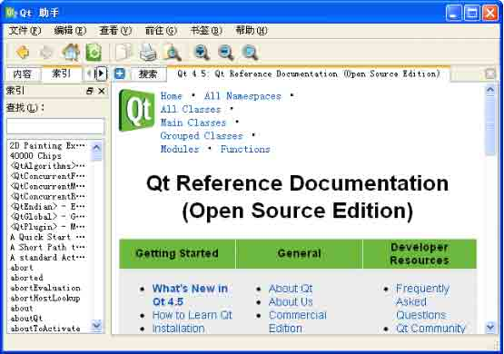

图 5-41 通过主页浏览类结构

问：如果我是使用以前版本的 Qt Designer 设计的用户界面，比如 Qt4.3.4 版，那么 它还可以用在基于 Qt4.5 版构建的工程中吗？

答：这种情况是可以的，Qt Designer 在设计之初就考虑到了这个问题，它是向下兼容 的，但如果使用的是更老的版本，比如 Qt3 甚至 Qt2 制作的界面，就不一定了。因为它们 之间的变化实在很大，尤其是从 Qt3 到 Qt4。Qt 发展到了今天，在桌面平台上，推荐你还 是尽量使用 Qt4；在嵌入式平台则要视你的平台情况选用。

# 5.5 总结与提高

## 5.5 总结与提高

能够熟练使用 Qt 基本工具是一项必需的技能。本章重点讲述了 Qt Designer、Qt Assistant 以及 Qt Demo 的使用方法和技巧，更多的经验和方法还需要读者朋友在实践中不 断的摸索和总结。

在 Qt 应用程序开发过程中，通常并不是仅仅使用某个单一的工具，而是经常需要综合 使用它们。在下一章里，我们将讲解 Qt 应用程序开发的基本方法和流程，其中的内容也会 涉及到 Qt 工具的综合使用，请大家注意结合阅读。