# 第六章 Qt 4 程序开发方法和流程

# 第六章 Qt 4 程序开发方法和流程

**本章重点**

*   掌握开发 Qt4 程序的基本流程和编译运行方式
*   熟悉 Qt4 工程文件的结构，掌握其书写方法
*   初步了解信号/槽的概念和用法
*   熟练掌握 qmake 的主要用法
*   熟练掌握 3 种主要的 Qt4 应用程序开发方法

从本章开始，我们将真正的步入 Qt4 程序的开发之旅。在经过了前面几章基础知识的 学习后，相信你已经跃跃欲试了吧。在第一节中，我们 来实现一个简单的例子，通过对它的 学习，你会对 Qt 程序开发的基本流程有一个初步的认识；在随后的 内容里面，我将向大家 介绍 Qt 程序的结构，Qt 程序开发的几种不同方法以及它们的适用场合。

本章的例子虽然简单，但它是 Qt 程序开发之旅的第一步，而这在这一章里用到了前面 介绍的许多知识和技能，通过本章也好检验一下学习前几章的效果。

# 6.1 开发方法

## 6.1 开发方法

在开发 Qt4 应用程序时，有几种常见的做法。 1.全部采用手写代码，在命令行下完成编译和运行

这种方式是最基础、最基本的，使用它的感觉有点像练武术时的扎马步，一招一式非 常清楚。它最锻炼开发者的技能，因为每一步都不能含糊，开发者需要对编译系统、 Qt 基 础知识有着非常扎实的了解。笔者熟知的许多的 Qt 编程的“老鸟”中，很多人都青睐这种 方式。它的缺点是在一般规模的应用中，还足以胜任，但如果是大型的、多人参与的工程开 发和项目研制，它就有些不方便了，比如如何协同开发、如何进行版本控制管理等等问题都 会变得难以解决。

2.在集成开发环境（IDE）中采用手写代码（包括设计界面），使用 IDE 完成编译和运行

这种方式的好处是可以借助 IDE 来管理工程要素，摒弃了手工的方式，不必太关注工程文件中的一些细节，并且可以借助调试和图形化工具来快速开发；缺点是 IDE 并不是智 能的无可挑剔，它替你完成的一些事情 往往会不如你所愿，很多情况下，你还是需要命令行工具来辅助。

3.使用 Qt Designer 设计界面，使用 IDE 完成编译和运行 这种方式也很常见，开发者使用 Qt Designer 设计界面元素，然后把工程文件的生成、管理，程序的编译运行都交给 IDE 来处理。这种方式的好处可以方便快速的对界面进行修改，在界面元素需要经常变动的情况下，效率比较高；缺点是使用 Qt Designer 生成的代码量比较庞大，由于好多都是自动生成的，阅读代码和调试程序相对比较困难。

对于初学者而言，采用第 3 种方式最容易“入门”,但基础可能打得不太扎实，因为这 些集成式的工具为开发者做了太多的事情，在它们形成的层层布幔之下，隐藏了 Qt 的核心 机制与原理，所以不太容易理解和掌握 Qt 编程的本质。所以呢，我向初学 Qt 的读者朋友 推荐第 1 种方法，先一点一点的做起，待掌握了基础技能后，再快马加鞭也不迟。

# 6.2 Hello Qt

## 6.2 Hello Qt

在这一节中，将通过一个“Hello Qt！”程序，向大家介绍 Qt4 程序编译运行的流 程，并且将采用上面所述的 3 种方法分别介绍，使大家能够对比学习。为什么选择这个 “老套”的程序呢，大家可以看到它虽然简单，却是“麻雀虽小，五脏俱全”。基本上每个 讲述编程的书籍开头不是“Hello World”就是“Welcome You”，好多世界级的大师都这么 做，肯定是有道理的，并且这已经是讲述编程的书籍的“约定俗成”了。

### 6.2.1 基本流程

1\. 成功安装 Qt 4.5

2\. 正确配置环境变量（Windows 环境通常不需要）

3\. 书写源代码

将下面的源代码保存至一个名为 helloqt.cpp 的文件，并把它放进一个名为 helloqt 的目录中，你可以使用任何一种文本编辑器完成此项工作，比如 Windows 平台的记事本， Linux 下的 vim，Mac OS X 下的 TextEdit。

4\. 生成项目文件

在命令行下，进入 helloqt 目录，输入如下命令，生成一个与平台无关的项目文件 helloqt.pro：

```cpp
qmake –project 
```

5.生成 makefile 文件

然后输入如下命令，从这个项目文件生成一个与平台相关的 makefile 文件：

```cpp
qmake helloqt.pro 
```

6.运行 make 构建程序

在 X11 以及 Mac 下，键入 make；

在 Windows 上，如果使用的是开源版的 Qt，键入 mingw32-make.exe；如果使用的是商 业版的 Qt，则输入 nmake；

7\. 运行程序

在 Windows 下，输入 helloqt，并回车运行； 在 X11 下，输入./helloqt；

在 Mac OS X 下，输入 open helloqt.app

8.结束程序

要结束该程序，可以直接单击窗口标题上的关闭按钮。

小贴士：这就是 Qt4 程序编译运行的大致顺序，上面的这个流程主要是采用命令行方式进 行的。如果你使用的是 Qt 的商业版和 Microsoft Visual C++作为开发环境，则需要使用 nmake 命令替代 make 命令。还可以通过.pro 文件创建一个 Visual C++工程文件，方法如 下：

```cpp
qmake –project
qmake –tp vc helloqt.pro 
```

然后，就可以使用 Visual C++打开生成的工程文件，继续完成编译运行的工作。

如果是在 Mac OS X 的 Xcode 里面使用 Qt，则可以打开命令行，输入如下命令来生成一 个 Xcode 工程文件，继而完成后面的工作：

```cpp
qmake –spec macx-xcode helloqt.pro 
```

最后这个程序的运行起来就像图 6-1 所示的那样。


图 6-1 Hello Qt!运行效果

### 6.2.2 源码分析

本实例实现一个“Hello Qt !”的例子，它是基于对话框的程序，界面上有一个按 钮，上面的字符是“Hello Qt!”，单击该按钮，对话框关闭，程序退出。实例效果如图所 示：

实现代码如下：

```cpp
#include &lt;QApplication&gt;
#include &lt;QPushButton&gt;
int main(int argc, char *argv[])
{
    QApplication app(argc,argv);
    QPushButton pushButton( QObject::tr("Hello Qt !") );
    pushButton.show();
    QObject::connect(&pushButton,SIGNAL(clicked()),&app,SLOT(quit()));
    return app.exec();
} 
```

第 1 行包含了 QApplication 的定义。Qt 的头文件中最为重要的两个是<QApplication>

和<QCoreApplication>。在本书后面的章节中，你会经常看到它们。所有 Qt GUI 应用程序 都需要包含<QApplication>这个文件，若使用的是非 GUI 应用程序，则需要包含

```cpp
&lt;QCoreApplication&gt;。 
```

小贴士：在 Qt4 中，对于每个 Qt 类，都有一个与该类同名并且采用大写形式的头文件，在 这个头文件中包含了对该类的定义。

第 2 行包含了按钮窗口部件的头文件。

小贴士：在 Qt4 中，头文件的包含可以采用类似于<QApplication>和<QPushButton>的形 式，也可以使用<qapplication.h>和<qpushbutton.h>的形式。为什么这么说呢，以 Windows 上安装的 Qt4.5 为例，请进入你的安装路径下的 include 目录，我的是 C:\Qt\2009.03\qt\include\QtGui，在这里你可以找到 QApplication 和 qapplication.h， 用记事本打开 QApplication 这个文件，你就会发现里面只有一行代码： #include "qapplication.h"。

第 3 行创建了应用程序的入口，Qt 程序以一个 main()函数作为入口，它有 argc 和 argv 两个参数。

第 5 行创建了一个 QApplication 对象，用来管理整个应用程序所用到的资源。每个 Qt 程序都必须有且只有一个 QApplication 对象。这个 QApplication 构造函数需要 argc 和 argv 作为参数，以支持程序的命令行参数。

第 6 行创建了一个 QPushButton 对象，它是一个窗口部件(widget)，并把它的显示文 本设置为“Hello Qt!”。

小贴士：在 Qt 和 UNIX 术语中，窗口部件（widget）通常是指用户界面中的可视化元素， 比如按钮、滚动条和菜单等都是窗口部件。该词起源于 “window gadget”这个词组，语义 有些类似于 Windows 系统中的“控件”（control）的含义，但又不尽相同。

第 7 行调用按钮对象的 show()方法，将按钮显示出来。Qt4 在创建窗口部件的时候， 通常都是隐藏不显示的，可以调用 show()方法来将它们显示出来。这种做法还有一个好 处，就是我们可以先对窗口部件的属性等进行设置，然后再显示出来，从而防止闪烁现象的 出现。

第 8 行使用了 Qt 的信号/槽机制。这一机制是这样运作的，Qt 的窗口部件可以通过发 射信号（signal）来通知应用程序，某个用户动作已经发生或者是窗口部件的某种状态发生 了变化，应用程序通过一个称为槽（ slot）的函数来做出回应和处理。以我们这个程序为 例，当用户使用鼠标左键单击那个 “Hello Qt!”按钮时，该按钮就会发射一个 clicked() 信号，根据我们的设置，QApplication 对象的 quit()槽负责响应这个信号，它执行退出应 用程序的操作。

这里大家不必深究这个内容，只需要知道“它们就是这么用的”即可。在本节的后面

会讲述信号/槽机制的用法，更为深入的内容，可以阅读第十三章。

第 9 行调用 QApplication 的 exec()方法，程序进入事件循环，等待用户的动作并适时 做出响应，这里的响应通常就是执行槽函数。 Qt 完成事件处理及显示的工作后，退出应用 程序，并返回 exec()的值。

### 6.2.3 编译运行

在 6.2.1 节里，我们已经总结了编译运行 Qt 的方法，但恐怕还是有些晦涩难懂，为了 使读者朋友看得更为清晰，现在把它图文解说一下。以 Windows 平台为例，操作系统是 Windows XP SP2 中文版，Qt 是 4.5 SDK，我们从第 4 步开始（前 3 步实在没有什么好说 的，如有不明白的，请回头去看前几章，呵呵）。

依次点击【开始】→【所有程序】→【Qt SDK by Nokia v2009.03(open source)】→【Qt Command Prompt】,启动 Qt 命令行，如图 6-2 所示，每次启动时，命令行会自动为我 们配置好 Qt 所需的环境。

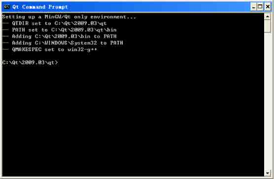

图 6-2 启动 Qt 命令行

接下来切换到你保存的程序文件目录，我这里的情形如图 6-3 所示

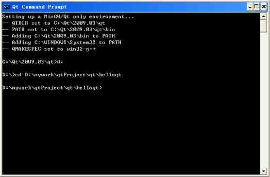

图 6-3 进入程序文件所在的目录

接下来输入 qmake –project，生成项目文件，再输入 dir/p 查看,发现生成的项目文 件名为 helloqt.pro。

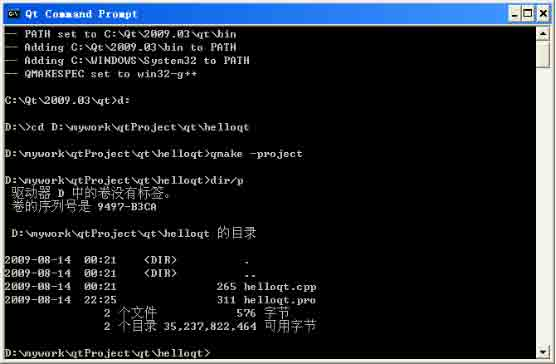

图 6-4 生成项目文件

然后输入 qmake –helloqt.pro，生成 makefile 文件。

这之后再输入 mingw32-make.exe，开始编译程序，情形如图 6-5 所示，编译成功后，将在 debug 目录下生成一个名为 helloqt.exe 的可执行文件。

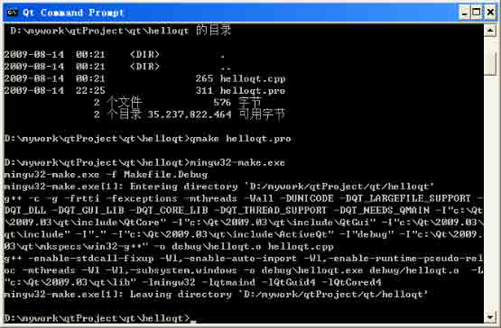

图 6-5 编译程序

进入 debug 目录，输入 helloqt,运行它，程序的样子与图 6-1 所示相同。 好了，到此我们的第一个 Qt4 程序就顺利完成了，它是基于手写代码，并且是采用命令行方式编译运行的。这就是我们所说的第 1 种方法。

### 6.2.4 第 2 种方法

这里我们以 Qt Creator（关于 Qt Creator 的详细使用方法，请见第十二章）作为 IDE，流程如下：

1\. 成功安装 Qt4.5

2\. 正确配置环境变量（Windows 环境通常不需要）

3\. 书写源代码

4\. 启动 Qt Creator

首先依次点击【开始】→【所有程序】→【Qt SDK by Nokia v2009.03(open source)】→【Qt Creator】,启动 Qt Creator。

然后依次点击主菜单的【Tools】→【Options...】,在弹出的如图所示的对话框中选 中【Qt4】→【Qt Versions】,查看 Qt Creator 识别的 Qt4 的版本情况，如果符合你的实 际情形，就直接点击【OK】按钮退出；如果不符合，你可以对它进行增、删、改，方法比较

简单，根据屏幕的提示完成即可。

注意，这一步很重要，如果 Qt Creator 没有正确识别你的 Qt4 所在的位置，那么接下 来的所有步骤都将变得没有意义。

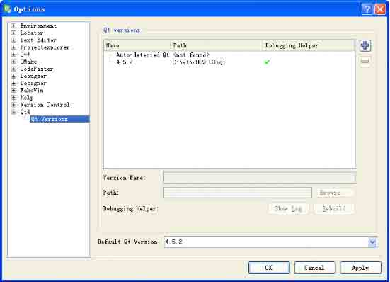

图 6-6 查看并设置 Qt4 环境

5.新建工程

依次点击【File】→【New...】→【Projects】→【Empty Qt4 Project】，如图 6-7 所示，点击【OK】按钮建立一个空的 Qt4 工程。

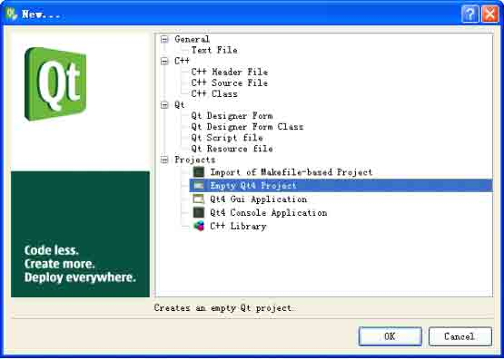

图 6-7 新建 Qt4 工程

接下来弹出的对话框会要求你设置工程的名字和所在的目录，并且会提示你不可采用 特殊的字符，如图 6-8 所示，根据笔者的经验，不要包含空格，最好不要包含中文字符， 切记！

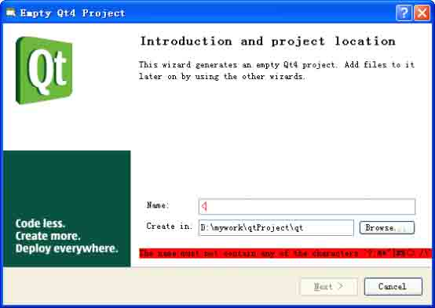

图 6-8 Qt 对于命名的要求

如图 6-9 所示，输入正确的路径和工程名字（这里是 helloqt）后,点击 Next 按钮。

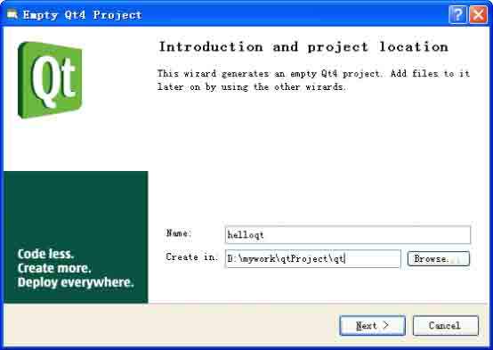

图 6-9 正确的输入工程名称和目录

接下来这一步没有什么好说的，系统向你展示了即将创建的工程的信息，如图 6-10 所 示，点击 Finish 按钮，这就生成了一个新的工程，如图 6-11 所示。

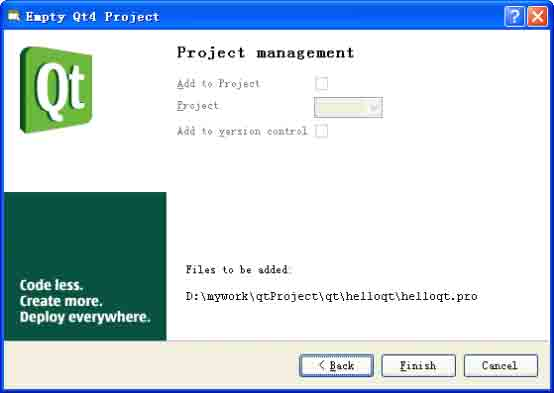

图 6-10 新工程的信息

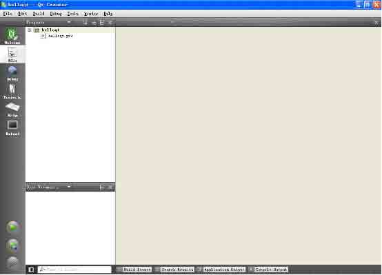

图 6-11 生成了一个新的工程

这时候的工程还是空的，我们需要向里面添加文件。有两种方法，一是添加已经存在的，还有就是新建一个。

下面先说如何添加一个已经存在的文件。 在工程目录上点击鼠标右键，在弹出的上下文菜单上选择 【Add Existing Files...】，如图 6-12 所示。

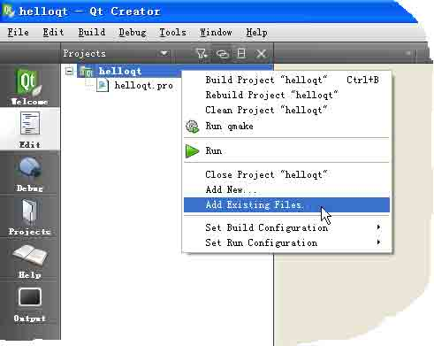

图 6-12 添加已有文件

然后找到你要添加的 helloqt.cpp 的位置，把它加入进去，这时候在工程目录里面就 多了一项你刚才添加的文件，如图 6-13 所示。

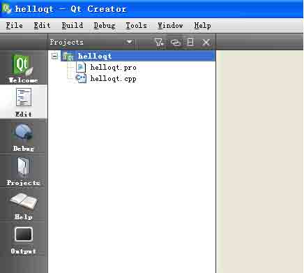

图 6-13 加入已经制作好的文件

小贴士：在 Qt Creator 中对添加已有文件采取的是“不拷贝添加”的方式，即添加完成 后，Qt4 的工程并没有把这个文件从原有的位置拷贝一份到工程目录里面，而是添加了它的 相对路径位置。这点可以通过添加文件完成后，查看 .pro 文件的内容看出来。在这一点上 Qt Creator 与 KDevelop 和 QDevelop 中有所不同，后两者都可以设置添加的方式是不拷贝 添加还是拷贝添加。

我建议还是自己先手动把文件放置在工程目录下面，然后再在 Qt Creator 中添加。一 方面便于统一管理工程文件，二来可以提高 Qt 应用程序的效率。

下面再介绍添加新文件的方法。

依次点击【File】→【New...】→【C++】→【C++ Source File】，如图 6-14 所示， 我们这里是要添加一个 C++实现文件，点击【OK】按钮，进入下一步的设置。


图 6-14 新建一个 C++实现文件

在接下来的如图 6-15 所示界面中，正确的输入文件名字，这里是 helloqt.cpp，并选 择工程的目录，然后点击 Next 按钮进入下一步。

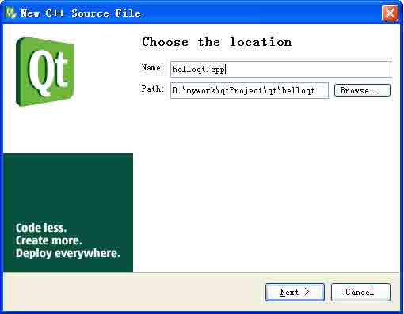

图 6-15 输入文件名

接下来，如图 6-16 所示，选择默认设置，把文件加入到 helloqt.pro 工程中，点击 Finish 按钮。

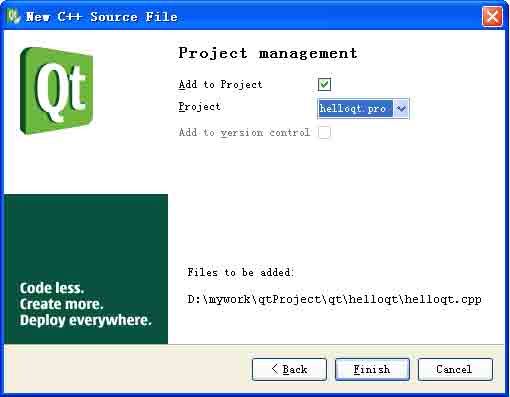

图 6-16 项目信息

这时，我们只是在工程里面加入了一个空的 C++实现文件，还需要添加内容。把 helloqt.cpp 源代码加入到如图 6-17 所示的屏幕右面的代码编辑区内。

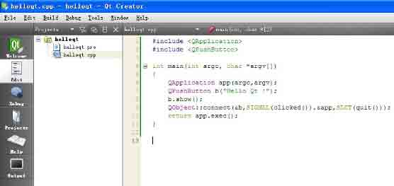

图 6-17 新文件加入后的样子

好了，编辑文件和设置工程的工作业已结束。接下来，就要开始编译源程序了，首先 运行 qmake。依次点击主菜单的【Build】→【Run qmake】,或者通过鼠标右键的上下文菜单来实现。

那么怎样才能知道 qmake 运行成功与否呢？Qt Creator 为我们提供了一个直观的查看 方式，当你运行 qmake 或者是 Build、Run 时，在 Qt Creator 的左下角会显示一个如图 6- 18 所示的运行状态进度条显示按钮，如果编译成功，它就会显示为满格的绿色；如果运行 不成功，或中途遇到 bug，它就会显示为不满格的红色，并且会提示 bug 和 warning 的数 量。

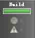

图 6-18 运行状态显示按钮

在这个进度条按钮上点击一下，就会显示出具体的状态信息，如图 6-19 所示，这个 Output 窗口显示了命令运行的过程，最后一句 ”Exited with code 0”表示成功。


图 6-19 运行 qmake 成功

接下来编译程序，依次点击主菜单的【Build】→【Build All Ctrl+Shift+B】,或者 通过鼠标右键的上下文菜单来实现，效果如图 6-20 所示。

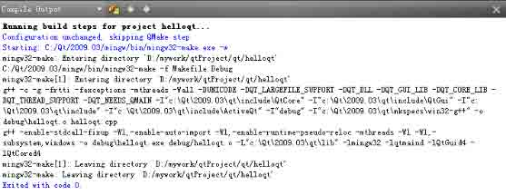

图 6-20 编译（build）成功

依次点击主菜单的【Build】→【Run Ctrl+R】,或者通过鼠标右键的上下文菜单来实 现，程序运行的效果与图 6-1 相同。

第 2 种方法的使用大致就是这样。不管是多么复杂的程序，使用它的流程都是与此类 似的。

### 6.2.5 第 3 种方法

这种方法也有两种常见的做法，一种是在单独启动的 Qt Designer 中设计程序界面， 制作完成后保存成.ui 文件（一种基于 XML 的文件格式），然后再在 IDE 中把它集成进来；

另外一种是直接在 IDE 中使用 Qt Designer，由于我们使用的 IDE 大都将 Qt Designer 的主要功能集成了进来，所以这两种做法其实区别不大，就看大家的喜好了。

下面仍以 Qt Creator 为例，使用这种方法时，一般遵循如下步骤：

*   创建窗体并在窗体中放置各种窗口部件
*   设置窗口部件的属性
*   对窗体进行布局设计
*   设置各个窗口部件的 Tab 顺序
*   创建信号和槽
*   连接信号和槽
*   编写代码（如果需要的话）
*   编译、链接、运行程序 1.建立新工程

依次点击【File】→【New...】→【Projects】→【Qt4 Gui Application】，如图 6- 14 所示，点击【OK】按钮进入下一步设置。


图 6-21 建立新工程

接下来仍旧是设置项目的名称和目录位置，正确设置即可，我们这里仍旧是 helloqt， 如图 6-22 所示，点击【Next】按钮进入下一步。

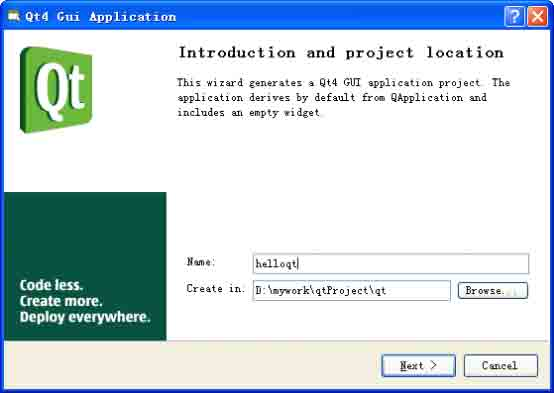

图 6-22 设置项目的名称和目录位置

接下来需要设置你的应用程序想要包含的 Qt 模块，当你选择了某个模块后，它的头文 件就会在程序中被自动包含了。如图 6-23 所示，其中 QtCore Module 和 QtGui Module 是 必需的，缺省已经选择了。我们这个程序并不需要包含其他的功能，选择缺省设置，点击【Next】按钮进入下一步。

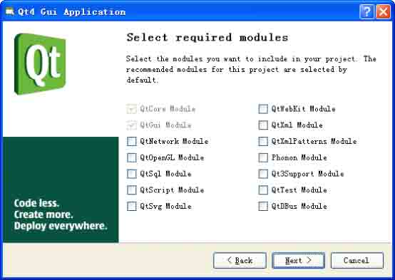

图 6-23 选择需要的 Qt 模块

下面我们需要设置应用程序的类型，这里是通过选择你建立的类的基类来体现的，共 有 3 种选择：QMainWindow、QWidget、QDialog。也就是说，我们的应用程序的骨干类是子 类化这 3 种类其中的一种。这里我们以选择基类为 QWidget，其它选项选择缺省值，如图 6-24 所示，点击【Next】按钮进入下一步。注意这里需要将 【Generate form】选项选上， 否则将不会产生.ui 文件，这就和第 2 种方法是一样的了。

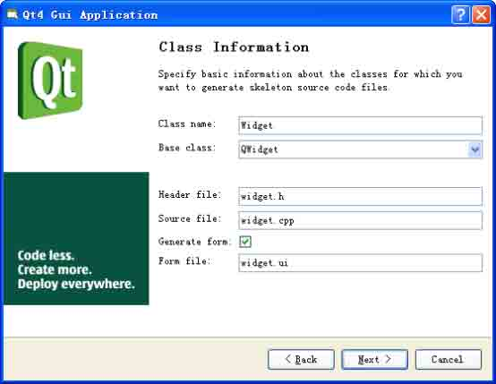

图 6-24 设置应用程序的类型

接下来展示的是要建立的工程的基本信息。我们的工程由主要由 5 个文件组成： main.cpp、widget.h、widget.cpp、widget.ui 和 helloqt.pro。其中 main.cpp 是主程序 文件，其中主要包含了 main()函数，前面我们已经讲到，它是应用程序的入口； widget.ui 是程序界面文件，它是基于 xml 格式的，它描述了界面的布局信息； widget.h 和 widget.cpp 是基于 widget.ui 产生的界面实体类；helloqt.pro 是工程文件，其中包含了 工程的基本信息，它能够被 qmake 所识别。点击【Finish】按钮，就完成了工程的设置。

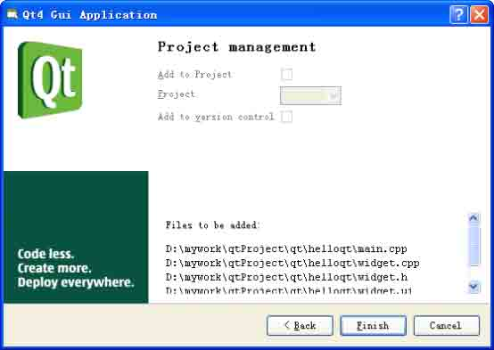

图 6-25 生成的工程信息

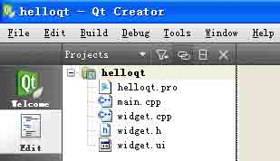

图 6-26 生成的工程概览

生成的工程如图 6-26 所示，如果想查看或修改某个文件的内容，在该文件上双击鼠标 左键即可在右面的代码浏览和编辑区内实现。

2.创建窗口部件并设置属性

用鼠标左键双击 widget.ui 文件，Qt Creator 将把 Qt Designer 打开并集成到框架 内，如图 6-27 所示，是不是很熟悉，与我们在第五章介绍的单独启动的 Qt Designer 并没 有什么不一样。

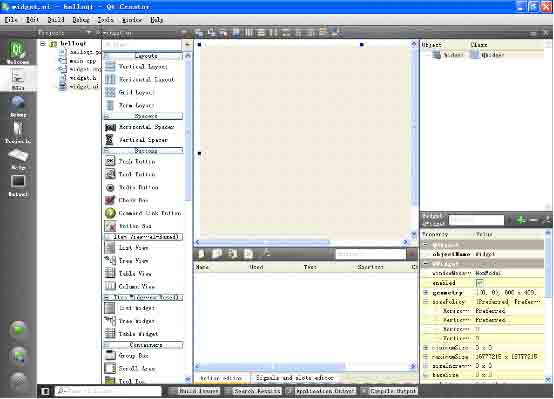

图 6-27 集成 Qt Designer 的 Qt Creator 设置 Widget 的 WindowTitle 属性为：Hello Qt!。在窗体上放置一个 Push Button 窗 体部件，并把它的 text 属性设置为：Hello Qt!。然后手动调整一下 Widget 和 Button 的 大小，不必太费力气，只要不是太难看就可。关于设置属性的方法在第五章中已经有详细的讲述，这里不再赘述。最后设置完成的界面如图 6-28 所示。


图 6-28 初步设置好的界面

3.设计布局和 Tab 顺序

由于程序的界面元素比较少，我们选择水平布局，再设置 Tab 顺序，完成后的界面如 图 6-29 所示。


图 6-29 设置布局和 Tab 顺序

4.创建并连接信号与槽

按照第五章介绍的方法，按下 F4 键，拖动鼠标左键，选择 pushButton 的 clicked()信 号，以及 Widget 的 close()槽，并连接它们，完成后的效果如图 6-30 所示。


图 6-30 创建并连接信号和槽

5.编译运行程序

依次执行 qmake、Build（或 Build All）、Run，程序运行后的效果如图 6-31 所示。


图 6-31 程序运行效果

估计读者朋友也看出来了，这个程序运行的效果与前面的不完全一样。这也正是我想 说明的，Qt Designer 并不是“为所欲为”的，比如这里我们就无法在其中设计出与第 1 种 手写代码完全一致的界面来，除非我们对其产生的代码再进行手动修改。

实际上，在进行工程开发时，尤其是面对复杂的大型应用程序时，程序员完全采用手 写代码的时候很少见，而完全使用 Qt Designer 设计界面的情形也不多，更多情况下往往 是将两者结合起来使用。但无论怎样，第 1 种方法都是最基本的，只有对 Qt 的基本原理很 清楚，对 qmake 的基本语法掌握的很熟练，才能够游刃有余的开发 Qt 应用程序。

# 6.3 几个重要的知识点

## 6.3 几个重要的知识点

1.关于信号/槽

信号/槽提供了任意两个对象间通信的机制，是 Qt 区别于其它 GUI 库的最重要的特征 之一。传统的 GUI 库往往采用回调函数来实现对象间的通信，而 Qt 的信号/槽机制要更简 单灵活。每个 Qt 对象都包含特定的信号和槽以及相应的关联定义，当有事件发生或是对象 的状态发生改变时，对应的信号就被发射出来，与其相关联的槽被执行以响应该信号，完成 处理工作。

信号与槽通常采用如下连接方式：

```cpp
connect(Object1,SIGNAL(signal),Object2,SLOT(slot)); 
```

式中，Object1 和 Object2 是两个对象，signal 是 Object1 发出的信号，slot 是用来响应 signal 信号的槽，它属于 Object2。SIGNAL()和 SLOT()是两个宏，它们是 Qt 语法中 的一部分。

关于信号/槽的深入内容，我们会在第十三章为大家详细讲解。 2.构建 Qt 应用程序的的流程在构建 Qt 应用程序时，无论你是采用手写代码，还是使用 Qt Designer 设计界面，都会遵循这个一般的顺序，就是先声明所需使用的窗口部件，接下来设置它们的属性，然后再把这些窗口部件添加到布局中，布局会自动设置它们的位置和大小。接下来根据 Qt 的信号/槽原理，创建并连接使用到的信号和槽，通过窗口部件之间的通信就可以管理用户的交互 行为。最后就是程序的编译、链接和运行，基本的顺序是 qmake –project,qmake xxx.pro,make(具体的 make 命令与平台相关),然后运行你的程序。

3.编译 Qt 应用程序的方法

我们可以选择 3 种方式来编译 Qt 应用程序：

(1) 使用 qmake

这是最常用的方式，qmake 最为重要的作用是生成与平台无关的 .pro 文件，并以此来 生成与平台相关的 makefile。

(2) 使用集成开发环境

本质上使用 IDE 也是在使用 qmake。

(3) 使用第三方的编译工具

从理论上来说，任何第三方编译工具都可以用于 Qt 的应用程序开发中，但使用可以感 知 Qt（Qt-aware）的工具会比较容易一些。常见的第三方编译工具有 CMake、Boost.Build 和 Scons 等。它们的使用相对比较复杂，不推荐初学者使用。

4.qmake 工程文件的结构

这里我们看一下 Qt Creator 为我们生成的 helloqt.pro 这个工程文件的内容。

```cpp
#-------------------------------------------------
#
# Project created by QtCreator 2009-08-16T22:31:08
#
#-------------------------------------------------
TARGET = helloqt
TEMPLATE = app
SOURCES += main.cpp\
widget.cpp
HEADERS += widget.h
FORMS += widget.ui 
```

前 5 行，也就是用#号打头的内容是 qmake 工具自动添加的注释，这里它解释了改工程文件是使用 Qt Creator 创建的以及创建的时间。

变量 TARGET 描述了目标工程文件的名称，通常就是生成的应用程序的名字。

变量 TEMPLATE 描述了生成何种形式的 makefile 文件，有 5 种常见的模板：

app 建立一个 Qt 应用程序的 makefile lib 建立一个 Qt 应用库的 makefile

subdirs 建立一个子目录下目标文件的 makefile，子目录通过变量 SUBDIRS 指定（子 目录下若有工程文件也需要指出类型）

vcapp 为 Visual Studio 生成一个工程，可在 Windows 操作系统上使用 vclib 为 Visual Studio 生成库工程，可在 Windows 操作系统上使用

变量 SOURCES 选项告诉编译器，源代码文件的相对于工程文件 helloqt.pro 的位置以 及文件名字，本程序包含两个.cpp 文件，中间用\隔开。

同理，变量 HEADERS 告诉编译器头文件的路径，变量 FORMS 告诉编译器.ui 文件的路径。

有了上面这些信息，编译系统就知道该如何编译与平台相关的 makefile 文件了。

qmake 的语法很丰富，常用的一些我们会根据应用程序的情况陆续为大家讲解，附录 B 详细 为大家介绍了 qmake 的用法。

# 6.4 问题与解答

## 6.4 问题与解答

问：初学 Linux 下的 Qt 编程，请教个大家一下关于 QT 程序的运行环境的问题。用 QT 编译好的程序，可不可以在不启动 X-Windows（KDE/GNOME）的情况下直接在 X 终端下运 行呢？

答：需要启动 X，至少要需要启动 X Server。因为 Qt 在 X11 上的运行机制是要依赖本 地原生的图形环境的。如果是 QT/E 的话只要启动了 Framebuffer 就可以了。

问：请问一下，我装好了 Dev C++ 和 QT4.2.2 自带的例子已经能够编译了，但是今天 编译一个例子就不能通过，不知道是什么问题，请指教。

我的程序是：

```cpp
#include &lt;qapplication.h&gt;
#include &lt;qlabel.h&gt;
int main(int argc, char *argv[])
{
    QApplication app(argc, argv);
    QLabel *label = new QLabel("Hello Qt!", 0);
    app.setMainWidget(label);
    label-&gt;show();
    return app.exec();
} 
```

编译后的出错信息是:

```cpp
C:\b&gt;make
mingw32-make -f Makefile.Release
mingw32-make[1]: Entering directory `C:/b'
g++ -c -O2 -O2 -frtti -fexceptions -Wall -DUNICODE -DQT_LARGEFILE_SUPPORT -DQT_D
LL -DQT_NO_DEBUG -DQT_GUI_LIB -DQT_CORE_LIB -DQT_THREAD_SUPPORT -DQT_NEEDS_QMAIN
-I"C:/Qt/4.2.2/include/QtCore" -I"C:/Qt/4.2.2/include/QtCore" -I"C:/Qt/4.2.2/in
clude/QtGui" -I"C:/Qt/4.2.2/include/QtGui" -I"C:/Qt/4.2.2/include" -I"." -I"C:/Q
t/4.2.2/include/ActiveQt" -I"release" -I"." -I"..\Qt\4.2.2\mkspecs\default" -o r
elease\hello.o hello.cpp
hello.cpp: In function `int qMain(int, char**)':
hello.cpp:8: error: 'class QApplication' has no member named 'setMainWidget'mingw32-make[1]:
*** [release\hello.o] Error 1
mingw32-make[1]: Leaving directory `C:/b'
mingw32-make: *** [release] Error 2
error: 'class QApplication' has no member named 'setMainWidget' 
```

答：setMainWidget()这个方法是 Qt 3 中的方法，而 Qt 4 中是没有的。所以从你提供的出错信息上可以判断，你机器上安装的是 Qt 4 的某个版本，而你的程序的代码是用 Qt 3 写成的。由于从 Qt 3 到 Qt 4，其语法和类库等都发生了很大的变化，很多程序是不通用 的。所以你要么使用 Qt 4 编译 Qt 4 的程序，或者都换成是 Qt 3 的。

我的建议是，如果不是维护已有项目需要的话，最好还是学习 和使用 Qt4 吧，Qt 的网 站上说，Qt 3.3 系列将维护到 July 2007，也就是后续将不会提供支持了。

问：我初学 Qt 编程，请问如何入门，有什么建议吗？现在我还无处着手。 答：对于初学者而言，建议选定最新的 Qt 版本（4.5 以上），按照本书章节的顺序同时结合 Qt Assistant 和 Qt Demo 循序渐进的学习。注意刚开始时，可以照猫画虎，把书上的例子反复体会，然后最好是带着问题去学习，中间不要忘记多泡论坛和专家的博客（本书 附录中对 Qt 的论坛和博客有详细介绍）。

问：我最近开始学习 Qt,因为需要编写一个类似 Google 地图搜索的图形界面,但是不知 道怎么下手,各位有作过类似东东的吗,给小弟一点建议,应该怎么下手作啊,谢谢了,或者有 类似的源代码给我参考一下马?

答：这方面有一些思路可供参考。可以利用 Graphics View 显示地图。使用 QGraphics View 和 QGraphicsScene 进行坐标变换，使用 QGraphics View 的 scale()方法实现地图的 缩放。如果是初学的话，建议可以学习本书并结合 Qt Demo 的例子，这样提高比较快。

# 6.5 总结与提高

## 6.5 总结与提高

在这一章里面，我们通过 Hello Qt!这个例子，向大家介绍了 Qt 应用程序编译运行的 基本步骤，以及常见的 3 种方法。它们各有优缺点。如果你刚刚使用 Qt，我希望你通读本章，然后把 3 种方法都尝试一下，重点是 Qt 应用的开发流程，以及对信号/槽的初步理解。在这个过程中，你可能会遇到一些觉得很 “奇怪”的问题，别着急，它们往往来自 Qt 的安装和配置、Qt 头文件的包含以及与平台相关的基础知识等方面，大家可以回过头再看看前几章，往往会有很大的收获，这也就是 “温故而知新”的体现。

在后面的几章里，我们还会陆续为大家介绍对话框、主窗口、布局管理等方面的内 容，它们比本章的例子要复杂一些，但不管怎样，这其中不变的是 Qt 的基本原理以及 qmake 的语法和开发应用程序的流程，希望大家能够用心体会和掌握。