# 第七章 对话框

# 第七章 对话框

**本章重点**

*   了解对话框程序的作用
*   了解 QDialog 类及其子类的继承关系
*   掌握使用手写代码子类化 QDialog 类的方法
*   掌握结合 Qt Designer 创建对话框应用程序的方法
*   掌握常见的 Qt 标准内置对话框的使用方法
*   了解模态对话框和非模态对话框的区别并能够正确使用它们

绝大多数图形用户界面应用程序都带有一个由菜单栏、工具栏构成的主窗口以及一些 对主窗口进行补充的对话框。当然，也可以创建对话框应用程序，它可以通过执行合适的动 作来直接响应用户的选择（例如，一个计算器应用程序）。

这一章讲解如何使用 Qt 创建对话框。对话框为用户提供了许多选项和多种选择，允许 用户把选项设置为他们喜欢的变量值并从中做出选择。之所以把它们称为对话框，或者简称 为“对话”，是因为它们为用户和应用程序之间提供了一种可以相互 “交谈”的交互方式。

本章将首先完全用手写代码的方式创建第一个对话框程序，以便能够说明是如何完成 这项工作的。接下来将使用 Qt Designer 类实现相同的功能。使用 Qt Designer 比手写代 码要快得多，并且可以使不同的设计测试工作以及稍后对设计的修改工作变得异常轻松。然 后将为大家介绍 Qt 内建的对话框类的使用，最后讲解一下模态对话框和非模态对话框的区 别和用法。

# 7.1 QDialog 类

## 7.1 QDialog 类

QDialog 类是对话框窗口的基类。对话框窗口是一个顶级窗口，通常用作短期任务，或 者是与用户的简短会话等场合。对话框可以分为模态对话框和非模态对话框。使用 QDialog 或其子类创建的对话框窗口通常都有一个返回值，有时候还包含了一些默认的按钮。一般情 况下，对话框窗口在其右下角都有一个用于控制其大小的伸缩手柄，在 Qt 应用程序中，这 一般可以通过调用 setSizeGripEnabled()方法来实现。

QDialog 是所有对话框类的基类，它继承自 QWidget，它的子类 有 QAbstractPrintDialog，QColorDialog，QErrorMessage， QFileDialog， QFontDialog，QInputDialog，QMessageBox， QPageSetupDialog，QPrintPreviewDialog，QProgressDialog，QWizard，以及来自 Qt3 的 Q3FileDialog，Q3ProgressDialog，Q3TabDialog，Q3Wizard。图 7-1 示意了 QDialog 及其 子类的继承关系。

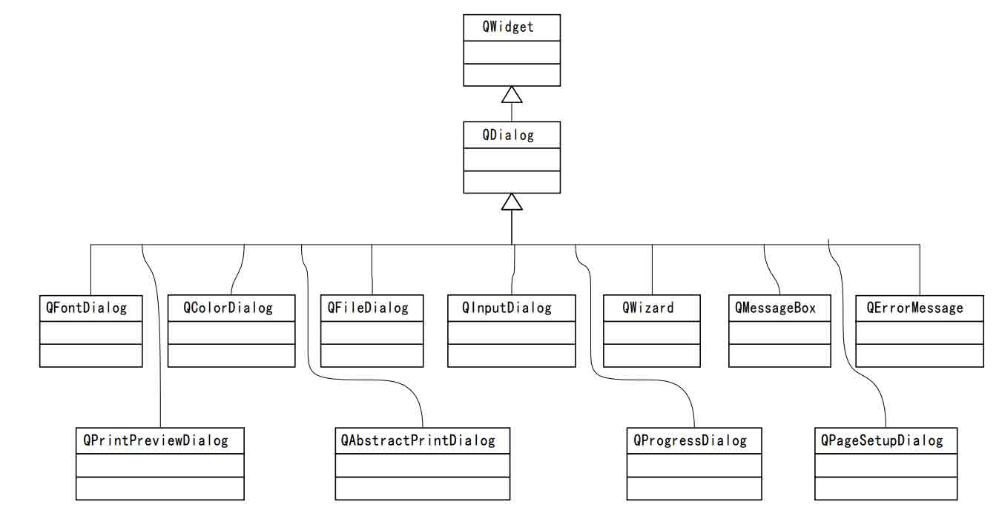

图 7-1 QDialog 类继承关系图

表 7-1 列举了 QDialog 子类的用途。

表 7-1 QDialog 子类说明

| 子类名 | 用途 |
| --- | --- |
| QAbstractPrintDialog | 提供打印机配置对话框的基本实现对话框 |
| QColorDialog | 提供指定窗体颜色的对话框 |
| QErrorMessage | 提供“错误提示”对话框 |
| QFileDialog | 提供选择文件或目录的对话框 |
| QFontDialog | 提供指定窗体的文字字体对话框 |
| QInputDialog | 提供标准输入对话框，可以方便的输入各种值 |
| QMessageBox | 提供一个模态对话框用于提示用户信息或要求用户回答问题 |
| QPageSetupDialog | 提供一个用于打印机页面设置的对话框 |
| QPrintPreviewDialog | 提供一个预览和调整打印机页面布局的对话框 |
| QProgressDialog | 提供一个长进程操作的进度回馈对话框 |
| QWizard | 提供一个“向导程序”的框架 |

在实际应用中，我们经常会用到 QColorDialog、QFileDialog、QInputDialog、 QMessageBox 等这些内置的标准对话框，在第 7.5 节里面我们将通过实例具体讲解它们的使 用要领。

# 7.2 子类化 QDialog

## 7.2 子类化 QDialog

创建基于对话框的应用程序主要是使用子类化 QDialog 的方法。在本节，我们采用这个方法创建一个稍微复杂的实例-可扩展对话框。

可扩展对话框通常只显示简单的外观，但是它还有一个切换按钮（ toggle button）， 可以让用户在对话框的简单外观和扩展外观之间来回切换。 可扩展对话框通常用于试图同时 满足普通用户和高级用户需要的应用程序中，这种应用程序通常会隐藏那些高级选项，除非 用户明确要求看到它们。

这个对话框是一个用于电子制表软件应用程序的排序对话框（ Sort 对话框），在这个 对话框中，用户可以选择一列或多列进行排序。在这个简单外观中，允许用户输入一个单一 的排序键，而在扩展外观下，还额外提供了两个排序键。 More 按钮允许用户在简单外观和 扩展外观之间切换。该实例的运行效果如图 7-2 所示。

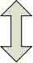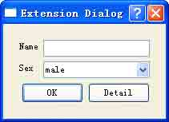

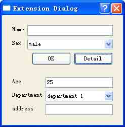

图 7-2 实例运行效果

该实例名为 extensionDlg。共有以下原生源文件：工程文件 extensionDlg.pro，主程 序文件 main.cpp，对话框类 ExtensionDlg 的头文件 extensionDlg.h，实现文件 extensionDlg.cpp。

在第六章中我们向大家介绍了创建 Qt 应用程序的基本方法，这里我们采用 Qt Creator 作为 IDE，并使用完全手写的方式完成程序的界面布局和构建。

首先当然是在 Qt Creator 中创建这个名为 extensionDlg 的项目，类型是 Empty Qt4 Project。然后在其中依次加入对话框类 ExtensionDlg 的头文件 extensionDlg.h，实现文件 extensionDlg.cpp，主程序文件 main.cpp 以及工程文件 extensionDlg.pro。这些文件的内容， 可以在 Qt Creator 的代码编辑器中完成编辑。

我们先看一下对话框类 ExtensionDlg 的头文件的内容。

```cpp
#ifndef EXTENSIONDLG_H
#define EXTENSIONDLG_H
#include &lt;QtGui&gt;
class ExtensionDlg : public QDialog
{
    Q_OBJECT
public:
    ExtensionDlg();
    void initBasicInfo();
    void initDetailInfo();
    public slots:
    void slot2Extension();
private:
    QWidget *baseWidget;
    QWidget *detailWidget;
}; 
```

第 1 行引入 QtGui 模块的头文件

第 2 行声明我们的自定义对话框类 ExtensionDlg 单公有继承自 QDialog。

第 3 行加入 Q_OBJECT 宏，程序中用到诸如信号/槽等 Qt 核心机制的时候，都要加入这 个宏。

第 4-7 行声明了构造函数和初始化基础信息和扩展信息的函数。

第 8-9 行声明公有槽 slot2Extension()，它在用户点击【Detail】按钮时被触发。

第 10-12 行声明两个私有成员变量 baseWidget 和 detailWidget，它们都是 QWidget 的 实例，分别代表伸缩前后的对话框窗体。

再来看看 ExtensionDlg 的实现文件。

```cpp
#include "extensionDlg.h"
ExtensionDlg::ExtensionDlg()
{
    setWindowTitle(tr("Extension Dialog"));
    initBasicInfo();
    initDetailInfo();
    QVBoxLayout *layout = new QVBoxLayout;
    layout-&gt;addWidget(baseWidget);
    layout-&gt;addWidget(detailWidget);
    layout-&gt;setSizeConstraint(QLayout::SetFixedSize);
    layout-&gt;setSpacing(6);
    setLayout(layout);
}
void ExtensionDlg::initBasicInfo()
{
    baseWidget = new QWidget;
    QLabel *nameLabel = new QLabel(tr("Name"));
    QLineEdit *nameEdit = new QLineEdit;
    QLabel *sexLabel = new QLabel(tr("Sex"));
    QComboBox *sexComboBox = new QComboBox;
    sexComboBox-&gt;addItem(tr("male"));
    sexComboBox-&gt;addItem(tr("female"));
    QPushButton *okButton = new QPushButton(tr("OK"));
    QPushButton *detailButton = new QPushButton(tr("Detail"));
    connect(detailButton,SIGNAL(clicked()),this,SLOT(slot2Extension()));
    QDialogButtonBox *btnBox = new QDialogButtonBox(Qt::Horizontal);
    btnBox-&gt;addButton(okButton,QDialogButtonBox::ActionRole);
    btnBox-&gt;addButton(detailButton,QDialogButtonBox::ActionRole);
    QFormLayout *formLayout = new QFormLayout;
    formLayout-&gt;addRow(nameLabel,nameEdit);
    formLayout-&gt;addRow(sexLabel,sexComboBox);
    QVBoxLayout *vboxLayout = new QVBoxLayout;
    vboxLayout-&gt;addLayout(formLayout);
    vboxLayout-&gt;addWidget(btnBox);
    baseWidget-&gt;setLayout(vboxLayout);
}
void ExtensionDlg::initDetailInfo()
{
    detailWidget = new QWidget;
    QLabel *ageLabel = new QLabel(tr("Age"));
    QLineEdit *ageEdit = new QLineEdit;
    ageEdit-&gt;setText(tr("25"));
    QLabel *deptLabel = new QLabel(tr("Department"));
    QComboBox *deptComboBox = new QComboBox;
    deptComboBox-&gt;addItem(tr("department 1"));
    deptComboBox-&gt;addItem(tr("department 2"));
    deptComboBox-&gt;addItem(tr("department 3"));
    deptComboBox-&gt;addItem(tr("department 4"));
    QLabel *addressLabel = new QLabel(tr("address"));
    QLineEdit *addressEdit = new QLineEdit;
    QFormLayout *formLayout = new QFormLayout;
    formLayout-&gt;addRow(ageLabel,ageEdit);
    formLayout-&gt;addRow(deptLabel,deptComboBox);
    formLayout-&gt;addRow(addressLabel,addressEdit);
    detailWidget-&gt;setLayout(formLayout);
    detailWidget-&gt;hide();
}
void ExtensionDlg::slot2Extension()
{
    if (detailWidget-&gt;isHidden())
    {
        detailWidget-&gt;show();
    }
    else
    {
        detailWidget-&gt;hide();
    }
} 
```

第 1-9 句是构造函数中的内容。

第 1 句设置应用程序的标题。

第 2 句调用 initBasicInfo()函数，初始化基本信息船窗体。 第 3 句调用 initDetailInfo()函数，初始化扩展信息窗体。 第 4-9 句设置窗体的布局。

第 4 句定义一个垂直布局类实体 layout。

第 5、6 两句，分别将 baseWidget 和 detailWidget 加入到布局中。

第 7、8 两句对于布局管理来说是非常常见的用法，必须熟练掌握。其中 setSizeConstraint()函数用于设置窗体的缩放模式，其默认取值是 QLayout::SetDefaultConstraint。这里取参数值为 Qlayout::SetFixedSize 是为了使窗体 的大小固定，不可经过鼠标拖动而改变大小；如果不这样设置，当用户再次点击 【Detail】按钮时，对话框将不能恢复到初始状态。 setSpacing()函数用于设置位于布局之中的窗口部件之间的间隔大小。

这里暂时不对布局管理的相关内容展开讲解，在《布局管理》这一章中将有详细的介绍。

第 9 句将刚刚设置好的布局应用加载到窗体上。

第 10-29 句是 initBasicInfo()函数体的内容。

第 10 句实例化 baseWiaget，注意 baseWidget 是全局变量。

第 11-18 句，依次定义窗体中的部件，注意在输入字符时，前面都加上了 tr()函数。 第 19 句对于整个程序来说是关键，它使用信号 /槽机制连接了 detailButton 的单击信号和窗口类 ExtensionDlg 的 slot2Extension()函数，这就使得整个对话框变得可伸缩。

第 20-22 行示范了 QDialogButtonBox 类的用法，它用于创建一个符合当前窗口部件样 式的一组按钮，并且它们被排列在某种布局之中。在 Qt Designer 中，最为常见的用法是 从窗口部件盒里面把默认的那个 QDialogButtonBox 窗口部件拖到界面上来，不过显然这并 不如使用代码来得方便。

第 20 行的 Qt::Horizontal 实参表示创建水平方向的按钮组合。

第 21、22 两行把两个按钮加入到这个组合之中。其中的 QDialogButtonBox::ActionRole 参数表示创建的按钮具有实际的功能，单击它可以引起对话框的某种变化。该参数可以有很 多不同的值，使得这些按钮具有不同的功能，它们都被包含在 QDialogButtonBox::ButtonRole 这个枚举值之中。

第 23-29 行设置窗体的布局。窗体的顶级布局是一个垂直布局，而其中嵌套了一个表 单布局。

第 23-25 行是设置表单布局的常用方法，表单布局常用于窗体界面元素可以整齐的分 成两列的情况。addRow()方法用于向布局中加入整行的界面元素。

第 26-29 行定义窗体的顶级布局，并将其两个元素 formLayout 和 btnBox 依次加入其中。

小贴士：布局也是一种窗口部件，认识到这一点很关键。

第 30-47 行定义了 initDetailInfo()函数。其实现过程与 initBasicInfo()函数大同 小异。只是需要注意第 47 行，正是由于对 detailWidget 调用了 hide()函数，才使得程序 初始时，显示的是基本信息，而将扩展信息隐藏了起来。 hide()函数用于将窗口隐藏起来， 它是 Qt 默认的槽函数之一，其原型如下：

```cpp
void QWidget::hide () [slot] 
```

它的作用等同于调用 setVisible(false)函数。

第 48-55 行定义了 slot2Extension()函数。前面讲到，它是我们自定义的槽函数，在 点击【Detail】按钮时，将被触发。它的内容很简单，就是判断扩展窗口是否被隐藏，如果被隐藏，就显示它；否则就隐藏它。 isHidden()函数用于判断窗体的显示窗体的显隐状态。

然后就可以像下面这样书写主函数。第 1 句是必需的。第 2-4 句定义 ExtensionDlg 的 对象，并模态的显示这个窗体。

```cpp
#include &lt;QApplication&gt;
#include "extensionDlg.h"
int main(int argc, char * argv[])
{
    QApplication app(argc,argv);
    ExtensionDlg exDlg;
    exDlg.show();
    return app.exec();
} 
```

最后就是书写项目文件 ExtensionDlg.pro 了。

```cpp
TEMPLATE = app
TARGET =
DEPENDPATH += .
INCLUDEPATH += .
# Input
HEADERS += extensionDlg.h
SOURCES += extensionDlg.cpp main.cpp 
```

第 1 句，表示程序的类型是 app。

第 2 句中 TARGET 指定可执行文件或库的基本文件名，其中不包含任何的扩展、前缀或 版本号，默认的就是当前的目录名。

第 4 句中，INCLUDEPATH 指定 C++编译器搜索全局头文件的路径。 第 5 句是注释。

第 6 句中，HEADERS 指定工程的 C++头文件（.h）。多个头文件的情况下，用空格隔 开。

第 7 句中,SOURCES 指定工程的 C++实现文件（.cpp），多个头文件的情况下，用空格隔开。

qmake 的语法规则是比较简明的，详细情况请参阅附录。 好了，到此我们就完成了使用子类化的方法创建自定义对话框窗口程序。这其中有几点还想再强调一下，一是要明白所谓子类化自 QDialog 类就是指通过继承自 QDialog 类来创建自定义的对话框类；二是要知道如果程序中用到了 Qt 的核心机制（如信号/槽），不 要忘记在类的声明处的第一行加入 Q_OBJECT 宏；三是要掌握判断和控制显隐对话框的方法；四是掌握定义窗口界面元素的方法（先定义，再设置其属性）；五是了解布局管理的基本方法（后面还会学到）；六是要掌握书写工程文件的基本方法。七是掌握 Qt Creator 的基本用法。

在下一节，我们将采用 Qt Designer 完成这个程序界面的布局，大家将会了解到，有 时候使用 Qt Designer 设计界面会方便一些。

# 7.3 快速设计对话框

## 7.3 快速设计对话框

（续上面的例子，使用 Qt Designer 设计界面） 在这一节中将通过使用 Qt Designer 来创建与上一节相同的可扩展对话框 ，并且使用 Qt Creator 作为 IDE 来管理这个工程。

我们将在 Qt Designer 中创建这个对话框的扩展外观，并且在运行时根据需要隐藏 扩 展信息。这个窗口看起来有些复杂，但在 Qt Designer 中可以轻易的完成它。

第 1 步，新建 Qt Creator 工程。

首先启动 Qt Creator，依次单击菜单项【File】->【New】，在弹出的对话框中选择工 程类型为【Empty Qt4 Project】，如图 7-3 所示。点击【Next】按钮进入下一步。


图 7-3 创建新工程

然后，像图 7-4 那样设置工程名称和存放的路径（根据自己的情况调整）。点击【Next】按钮进入下一步。

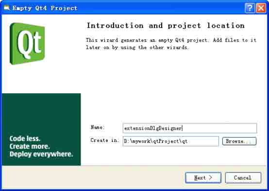

图 7-4 设置项目名称和存放的位置

在弹出的如图 7-5 所示的对话框中，点击【Finish】按钮完成工程的创建。

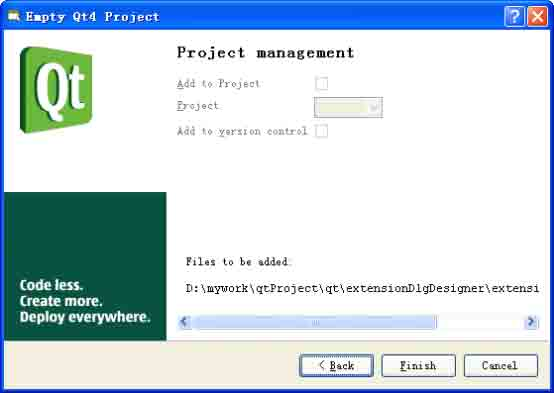

图 7-5 完成工程的创建

第 2 步，启动 Qt Designer，新建窗体。

依次单击菜单【File】->【New Form】，如图 7-6 所示，在【新建窗体】对话框中选 择【Dialog without Buttons】模板。

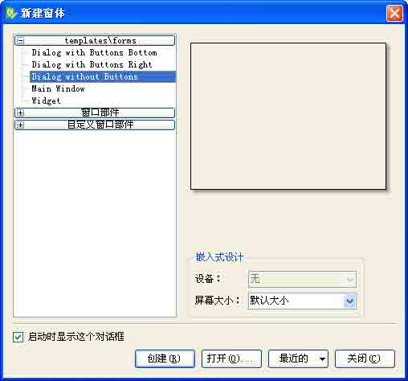

图 7-6 第 2 步 新建窗体

第 3 步，创建【基本信息】窗体的界面元素。

创建一个 GroupBox 部件，使它足够大，将它的 objectName 属性修改为 basicGroupBox，将它的 title 属性设置为 Basic。

接下来在 basicGroup 部件的内部创建下述的各个部件。 创建【Name】和【Sex】标签，使它们上下排列，将它们的 objectName 属性分别设置为 nameLabel 和 sexLabel，将它们的 text 属性分别设置为 Name 和 Sex。

再创建 Name 标签对应的编辑框，从窗口部件盒中拖出 LineEdit 控件。把它的 objectName 属性设置为 nameLineEdit。

创建 Sex 标签对应的组合框，从窗口部件盒中拖出 ComboBox 窗口部件，把它的 objectName 属性设置为 sexComboBox。

接下来为 Sex 标签对应的组合框创建列表项，方法是双击该组合框，如图 7-7 所示，在【编辑组合框】对话框中添加。

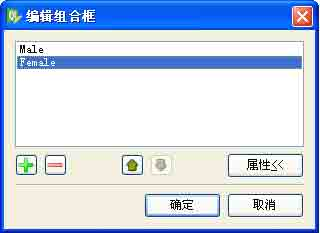

图 7-7 编辑组合框

创建【OK】按钮并把它拖放到【Sex】标签的下方。将它的 objectName 属性修改为 okButton，并将它的 defaults 属性设置为 true。

创建【Detail】按钮并将它拖放到 OK 按钮的水平右方，将它的 objectName 属性修改 为 detailButton,并将它的 defaults 属性设置为 true。

接下来，再创建一个垂直分隔符并把它拖放到 【Basic】分组框的下方。 不必刻意调整各个窗口部件的位置，只需大致排列一下即可。布置好后的情形如图 7-8 所示。

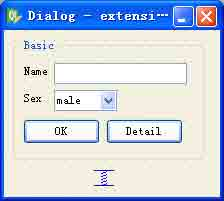

图 7-8 第 3 步 创建基本信息窗体的界面元素

第 4 步，设置【基本信息】窗体的布局。

单击【OK】按钮，按下 Shift 键后再单击【Detail】按钮，然后单击工具栏上的【Lay Out Horizontally】按钮，设置一个水平布局。

选中【Name】和【Sex】标签，以及它们对应的 LineEdit 窗口部件，然后单击工具栏 上的【Lay Out In a Form】按钮，设置为表单布局。

最后点击【Basic】分组框，然后单击工具栏上的【Lay Out Vertically】按钮，设置一个垂直布局。

设置到这里的界面情形如图 7-9 所示。

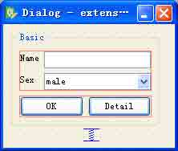

图 7-9 第 4 步 基本信息界面布局

第 5 步，创建【扩展信息】窗体界面元素。 拖动窗体的右下角，使其足够高和宽，以便能够容纳所有的界面元素。 创建一个 GroupBox 部件，使它足够大，将它的 objectName 属性修改为 extensionGroupBox，将它的 title 属性设置为 Extension。

像创建【基本信息】窗体界面元素那样，依次创建 Age 标签、Department 标签、 Address 标签以及和它们对应的 LineEdit 和 ComboBox，并把它们放入到 extensionGroupBox 分组框之中。

为 Department 标签对应的 ComboBox 添加列表项。 这样设置后的界面情形如图 7-10 所示。

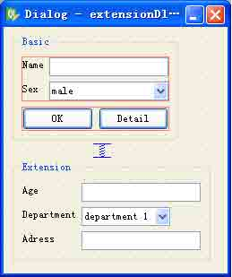

图 7-10 第 4 步 设置【扩展信息】窗体界面元素。

第 6 步，设置【扩展信息】窗体布局。

选中【Age】、【Department】和【Adress】标签，以及它们对应的编辑框、组合框窗 口部件，然后单击工具栏上的【Lay Out In a Form】按钮，设置为表单布局。

选中【Extension】分组框，然后单击工具栏上的【Lay Out Vertically】按钮，设置 为垂直布局，如图 7-11 所示。

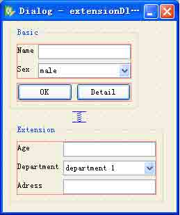

图 7-11 第 6 步 设置【扩展信息】信息窗体布局

第 7 步，设置窗体的顶级（Top Level）布局。 用鼠标左键点击窗体，注意不要选中任何窗口部件，然后单击工具栏上的 【Lay Out Vertically】按钮，设置窗体的顶级布局为一个垂直布局，如图 7-12 所示。

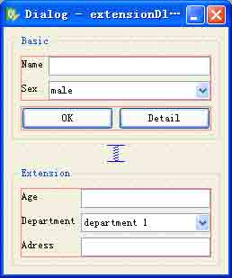

图 7-12 第 7 步 设置窗体的顶级布局

小贴士：如果没能生成你所希望的那种布局效果，或者是不小心做错了，那么总是可以随时先通过单击菜单项【Edit】->【Unto】，或者是【Form】->【Break Layout】，然后再重 新放置这些要摆放的窗口部件，最后试着对它们重新布局，直到满意为止。

第 8 步，设置 Tab 顺序。

单击菜单项【编辑】->【编辑 Tab 顺序】，或者点击工具栏上对应的按钮，像图 7-13 所示那样编辑 Tab 顺序。

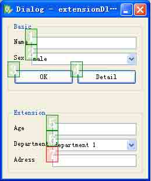

图 7-13 第 8 步 设置 Tab 顺序

第 9 步，设置信号/槽

按下 F3 键，离开 Tab 顺序设置模式，进入窗口编辑模式。 现在，窗体设计已经完成，可以开始着手设置一些信号 /槽的连接来实现窗体的功能了。Qt Designer 允许我们在构成同一窗体的不同部分内的窗口部件之间建立连接。我们需要建立两个连接。

单击菜单项【编辑】->【编辑信号/槽】，或者按下 F4 键，进入 Qt Designer 的信号- 槽连接设置模式。窗体中各个窗口部件之间的连接用蓝色箭头表示，如图 7-14 所示。并且 它们也会同时在 Qt Designer 的信号/槽编辑器窗口中显示出来。

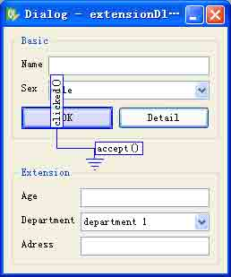

图 7-14 窗体中各个部件的连接是蓝色的线

小贴士：要在两个窗口部件之间建立连接，可以单击作为发射器的窗口部件并且拖动所产 生的红色箭头线到作为接收器的窗口部件上，然后松开鼠标按键。这时会弹出一个对话框， 可以从中选择建立连接的信号和槽。

要建立的第一个连接位于 okButton 按钮和窗体的 accept()槽之间。把从 okButton 按 钮开始的红色箭头线拖动到窗体的空白区域，然后松开按键，这样会弹出图所示的设置连接 对话框（Configure Connection dialog）。从该对话框中选择 clicked()作为信号，选择 accept()作为槽，然后单击 OK 按钮，如图 7-15 所示。

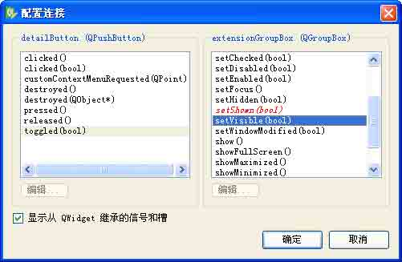

图 7-15 连接按钮的 clicked()信号和窗体的 accept()槽

要建立的第 2 个连接位于【Detail】按钮和【extensionGroupBox】群组框之间。在这 两个窗口部件之间拖动红色箭头线，然后选择 toggled(bool)作为信号，选择 setVisible(bool)作为槽，如图 7-15 所示。

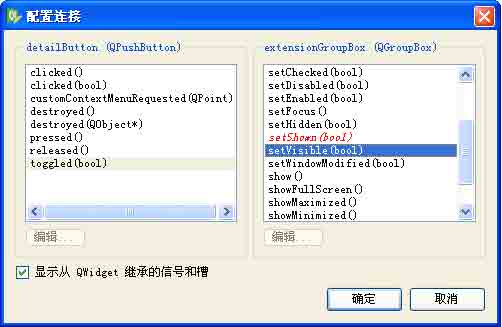

图 7-15 连接按钮的 toggled(bool)槽和分组框的 setVisible(bool)槽

小贴士：默认情况下，setVisible(bool)槽不会显示在 Qt Designer 的槽列表中，但是选 中了【显示从 Qwidget 继承的信号和槽】选项，就可以看到这个槽了。

最后设置完成的信号和槽如图 7-16 所示。

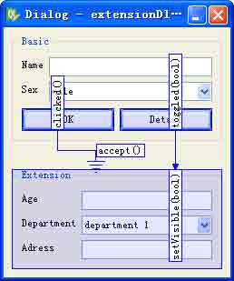

图 7-16 设置完成的信号和槽的情形

第 10 步，保存文件。

将这个对话框保存在前面建立的工程目录下，即 extensionDlgDesigner 目录里面，文 件名为 extensionDlgDesigner.ui。接下来要给这个窗体添加代码，将使用多重继承的方法。

首先用如下内容创建一个 extensionDlg.h 文件：

```cpp
#ifndef EXTENSIONDLG_H
#define EXTENSIONDLG_H
#include &lt;QDialog&gt;
#include "ui_extensionDlg.h"
Class ExtensionDlg:public QDialog,public Ui::Dialog
{
    Q_OBJECT
public:
    ExtensionDlg(QWidget *parent = 0);
};
#endif 
```

这里采用的是多重继承的方法，而 Q_OBJECT 宏则是必需的，并且要放在类声明体内最为靠前的地方。

然后再创建 extension.cpp 文件，以下是其内容：

```cpp
#include &lt;QtGui&gt;
#include "extensionDlg.h"
ExtensionDlg::ExtensionDlg(QWidget *parent)
:QDialog(parent)
{
    setupUi(this);
    this-&gt;extensionGroupBox-&gt;hide();
    mainVerticalLayout-&gt;setSizeConstraint(QLayout::SetFixedSize);
} 
```

第 1 行调用 setupUi()函数初始化窗体界面元素的布局。

第 2 行表示隐藏了扩展信息窗体，直到用户点击了 【Detail】按钮才显示出来。

第 3 行把窗体布局的 sizeConstraint 属性设置为 QLayout::SetFixedSize，这样会使 用户不能再重新修改这个对话框窗体的大小。前面也讲过，这样一来，布局就会负责对话框 重新定义大小的职责，并且也会在显示或者隐藏子窗口部件的时候自动重新定义这个对话框 的大小，从而可以确保对话框总是能以最佳的尺寸显示出来。

最后用下面的代码创建 main()函数，主要就是显示这个对话框。

```cpp
#include "extensionDlg.h"
#include &lt;QApplication&gt;
int main(int argc,char *argv[])
{
    QApplication app(argc,argv);
    ExtensionDlg *dlg = new ExtensionDlg;
    dlg-&gt;show();
    return app.exec();
} 
```

添加完这些文件后，可以看看工程文件 extensionDlgDesigner.pro 的内容，这是 Qt Creator 根据程序的情况自动为我们添加好的。

```cpp
HEADERS += extensionDlg.h
SOURCES += extensionDlg.cpp \
main.cpp
FORMS += extensionDlgDesigner.ui 
```

程序最后的运行效果如图 7-17 所示，可以看出与手动编写代码的情形是一致的。

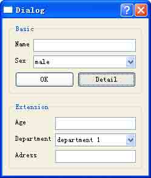

图 7-17 程序运行效果

到此，关于扩展对话框的构建就讲解完了。设计一个扩展对话框并不比设计一个简单 对话框困难：所需要的就是一个切换按钮、一些信号 -槽连接以及一个不可以改变尺寸大小 的布局。

小贴士：在实际的应用程序中，控制扩展对话框的按钮通常会在只显示了基本对话框时显 示为 Advanced>>，而在显示了扩展对话框时才显示为 Advanced<<。这在 Qt 中非常容易实 现，只需在单击这个按钮时调用 QPushButton 的 setText()函数即可。

通过这个例子，我们讲述了通过子类化构建自定义对话框的方法，以及使用 Qt Designer 辅助设计对话框的方法，在工程实践中，这两种方法往往是结合使用的。

扩展阅读：在 Qt 中，无论是使用手工编码的方式还是使用 Qt Designer，都可以轻松的创建另一种常用的可以改变形状的对话框：多页对话框。可以通过多种不同的方式创建这种对话框：

QTabWidget 的用法就像它自己的名字一样。它提供了一个可以控制内置 QStackedWidget 的 Tab 栏。

QListWidget 和 QStackedWidget 可以一起使用，将 QListWidget::currentRowChanged()信号与 QStackedWidget::setCurrentIndex()槽连接， 然后再利用 QListWidget 的当前项就可以确定应该显示 QStackedWidget 中的哪一页。

与上述 QListWidget 的用法相似，也可以将 QTextWidget 和 QStackedWidget 一起 使用。

在后面的《布局管理》一章中，我们将讲解 QStackedWidget 类。

# 7.4 常见内建（built in）对话框的使用

## 7.4 常见内建（built in）对话框的使用

内建对话框又被称为是标准对话框。Qt 提供了一整套内置的窗口部件和常用对话框， 如文件选择、字体选择、颜色选择、消息提示对话框等，它们为应用程序提供了与本地平台 一致的观感，可以满足大多数情况下的使用需求。Qt 对这些标准对话框都定义了相应的 类，使用者可以很方便的使用它们。标准对话框在软件设计过程中使经常需要使用的，必须 熟练掌握。

下面我们首先介绍 QInputDialog 、QColorDialog、QFontDialog、、QMessageBox 这 几种标准对话框的使用要领，然后再通过一个实例做示范。

### 7.4.1 标准输入框（QInputDialog）

本小节讲解如何使用标准输入框。在 Qt 中，构建标准输入框通常使用 QinputDialog 类。QInputDialog 类提供了一种简单方便的对话框来获得用户的单个输入信息。目前 Qt 提 供了 4 种数据类型的输入，可以是一个字符串、一个 int 类型数据、一个 double 类型数据 或者是一个下拉列表框的条目。此外，一般情况下在输入框的附近应该放置一个标签窗口部 件，告诉用户需要输入什么样的值。一个标准输入框的样子如图 7-18 所示。

经常使用的方法有 4 个：getText()，getInt()， getDouble()和 getItem()，它们都 是 QInputDialog 类的静态方法，使用起来也非常简便，请看下面的示例代码。

```cpp
bool ok;
QString text = QInputDialog::getText(this, tr("User Name"),
    tr("Please input new name"), QLineEdit::Normal,
    QDir::home().dirName(), &ok);
if (ok && !text.isEmpty())
{
    textLabel-&gt;setText(text);
} 
```

这段代码将弹出一个对话框请用户输入 "User name"的值，如图 7-18 所示。如果用户按下 OK 按钮，则 ok 的值将为 true，反之将为 false。

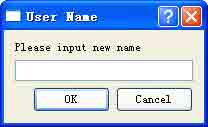

图 7-18 标准输入框

### 7.4.2 标准颜色对话框（QColorDialog）

标准颜色选择对话框被用来为应用程序指定颜色。比如，在一个绘图应用程序中选择 画刷的颜色等。一个典型的标准颜色对话框如图 7-19 所示。

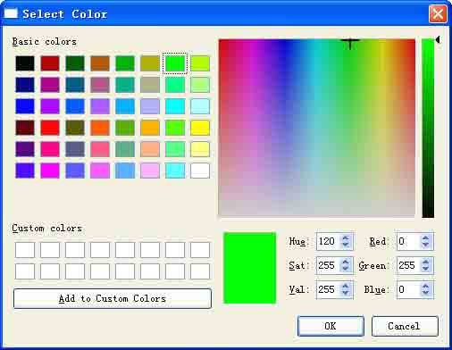

图 7-19 典型的标准颜色对话框

我们经常使用 QColorDialog 类的静态方法 getColor()来创建标准颜色选择对话框。在 其中除了为用户提供了颜色选择面板外，还可以允许用户选择不同的透明度的颜色。

在使用 QColorDialog 类之前，需要引入其头文件声明。

```cpp
#include &lt;QColorDialog&gt; 
```

getColor()方法有两种原型，第一种如下：

```cpp
QColor QColorDialog::getColor ( const QColor & initial, QWidget * parent,
    const QString & title,ColorDialogOptions options = 0 ) [static] 
```

该方法以 parent 为父窗体，以 initial 为默认颜色，以 title 为窗口标题（如果不指 定的话，将显示为"Select Color"）创建一个模态的颜色对话框，允许用户选择一个字体，并将其返回。如果用户点击了【Cancel】按钮，则返回一个非正常值。这可以通过 bool QColor::isValid () const 方法来校验，如果字体正常则返回值为 ture；反之则返回 false。

另外，通过配置不同的 options 参数能够对颜色对话框的观感进行定制。 options 的取 值来自枚举值 QColorDialog::ColorDialogOption，它也是 Qt4.5 以后引入的，其含义如表 7-2 所示。

表 7-2 枚举值 QColorDialog::ColorDialogOption 的含义

| 常量 | 值 | 说明 |
| --- | --- | --- |
| QColorDialog::ShowAlphaChannel | 0x00000001 | 允许用户选择颜色的 alpha 值 |
| QColorDialog::NoButtons | 0x00000002 | 不显示 OK 和 Cancel 按钮 |
| QColorDialog::DontUseNativeDialog | 0x00000004 | 使用 Qt 的标准颜色对话框。比如在 Mac OS X 系统中不使用 Apple 的原 生颜色面板 |

实际中最为常用的是下面这种，它是第一种原型的重载版本。

```cpp
QColor QColorDialog::getColor ( const QColor & initial =
    Qt::white, QWidget * parent = 0 ) [static] 
```

一个创建标准颜色对话框的示例代码如下：

```cpp
QColor color = QColorDialog::getColor(Qt::green, this);
if(color.isValid())
{
    colorLabel-&gt;setText(color.name());
    colorLabel-&gt;setPalette(QPalette(color));
    colorLabel-&gt;setAutoFillBackground(true);
} 
```

第 1 句创建标准颜色选择对话框。

第 2 句判断颜色是否有效。

第 3 句设置 colorLabel 显示的文本是用户从标准颜色对话框中选择的颜色的名字。

第 4 句通过 setPalette()方法设置 colorLabel 的调色板信息。setPalette()方法经常用于此 种场合。

第 5 句也很重要，setAutoFillBackground()方法用于设置窗体能够自动填充背景。

### 7.4.3 标准字体对话框（QFontDialog）

标准字体对话框为用户选择字体提供了便捷的途径。 其常见的情形如图 7-20 所示。

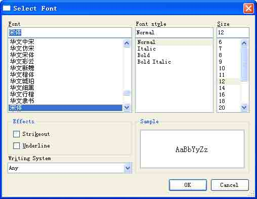

图 7-20 标准字体对话框

通常有两种方式创建字体对话框，一种是使用 QFontDialog 类的构造函数，一种是使用 QFontDialog 类的静态方法 getFont()。在使用 QFontDialog 类之前，应加入其头文件声明：

```cpp
#include &lt;QFontDialog&gt; 
```

1.构造函数第一种原型

```cpp
QFontDialog::QFontDialog ( QWidget * parent = 0 ) 
```

它将创建一个标准的字体对话框。其中 parent 参数默认即是上下文环境中的父窗口。

这之后可以使用 setCurrentFont()方法来指定初始的字体。该方法是 Qt4.5 以后引进的，一个 示例代码如下：

```cpp
QFontDialog fontDlg;
fontDlg.setCurrentFont( QFont(“Times”,12) ); 
```

2.构造函数第二种原型

```cpp
QFontDialog::QFontDialog ( const QFont & initial, QWidget * parent = 0 ) 
```

它将使用 parent 作为父窗体，使用 initial 作为默认选择的字体来创建一个标准的字体对话框。该方法是 Qt4.5 以后引进的。一个示例代码如下：

```cpp
QFontDialog fontDlg(QFont(“Times”,12),this); 
```

3.使用静态方法 getFont()

它有 6 种原型，最为常用的是

```cpp
QFont QFontDialog::getFont ( bool * ok, const QFont & initial, QWidget * parent,
    const QString & title,FontDialogOptions options ) [static] 
```

它创建一个模态的字体选择框，并把用户选择的字体作为返回值。

如果用户点击了【OK】按钮，被用户选择的字体就会被返回。如果用户按下了【Cancel】按钮，那么 initial 将被返回。

它的各个参数的含义是这样的，parent 指定了字体对话框的父窗口，title 是该字体对话 框的标题栏显示的内容，initial 是对话框建立时初始选择的字体。如果 ok 是非空的，当用 户选择了【OK】按钮时，它将被置为 true，当用户选择了【Cancel】按钮时，它将被置为 false。一个示例代码如下：

```cpp
bool ok;
QFont font = QFontDialog::getFont(&ok, QFont("Times", 12), this);
if (ok)
{
    // font is set to the font the user selected
}
else
{
    // the user canceled the dialog; font is set to the initial
    // value, in this case Times, 12.
} 
```

这段代码调用 getFont()方法时，对 title 和 options 参数使用了默认值。

也可以使用下面示例的代码直接在某个窗口部件内部使用字体对话框。当用户按下【OK】按钮时，被选中的字体将被使用，当用户按下 【Cancel】按钮时，将仍然使用原来 的字体。

```cpp
myWidget.setFont(QFontDialog::getFont(0, myWidget.font())); 
```

小贴士：在字体对话框运行期间，不要删除 parent 指定的父窗口。如果你想这么做的话，就不要使用 getFont()方法来创建字体对话框，而是使用它的构造函数来实现。

下面一种原型也会经常用到，它同样也是 QFontDialog 类的静态方法：

```cpp
QFont QFontDialog::getFont ( bool * ok, QWidget * parent = 0 ) [static] 
```

它以 parent 为父窗体创建一个模态的字体对话框，并且返回一个字体。如果用户点击了【OK】按钮，则被选中的字体将被返回，并且 ok 参数将被置成 true；如果用户点击了【Cancel】按钮，则 Qt 默认字体将被返回，ok 参数将被置成 false。

一个创建标准字体对话框的示例代码如下：

```cpp
bool ok;
QFont font = QFontDialog::getFont(&ok, this);
if (ok)
{
    // font is set to the font the user selected
}
else
{
    // the user canceled the dialog; font is set to the default
    // application font, QApplication::font()
} 
```

这里同样注意，在使用该方法创建的字体对话框运行期间，不要删除其父窗体。

### 7.4.4 标准消息对话框（QMessageBox）

在程序开发中，经常会遇到各种各样的消息框来给用户一些提示或提醒， Qt 提供了 QMessageBox 类来实现此项功能。在使用 QMessageBox 类之前，应加入其头文件声明：

```cpp
#include &lt;QMessageBox&gt; 
```

Question 消息框、Information 消息框、Warning 消息框和 Critical 消息框的用法大同小异，这些消息框一般都包含一条提示信息、一个图标以及若干个按钮，它们的作用都是给用 户提供一些提醒或一些简单的询问。按图标的不同可以区分为表 7-3 所示的 4 个级别。

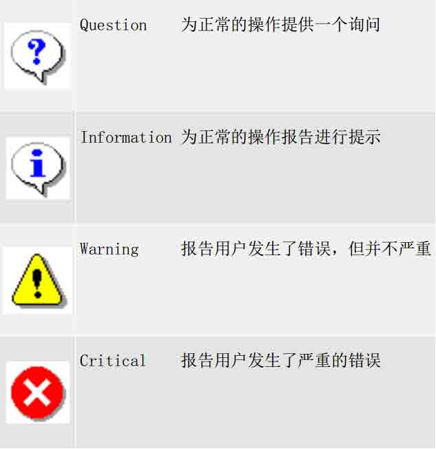

表 7-3 预定义图标的含义

通常有两种方法可以用来创建标准消息对话框。一种是采用 “基于属性的”API，一种是 使用 QMessageBox 的静态方法。这两种方法各有所长，使用静态方法是比较 容易的，但是缺乏灵活性，并且针对用户给出的提示信息不够丰富 ，并且不能自定义消息对话框里面的按钮提示信息。因此，“基于属性的”API 的方法更值得推荐。

1\. 基于属性的 API 方法 这种方法的要领如下。

第 1 步，创建一个 QMessageBox 的实例

第 2 步，设置必要的属性信息，通常只需设置 message text 属性即可。 第 3 步，调用 exec()方法显示这个消息框。

下面是一段示例代码。

```cpp
QMessageBox msgBox;
msgBox.setText(tr("The document has been modified."));
msgBox.exec(); 
```

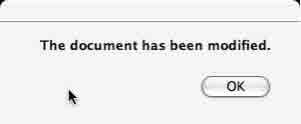

图 7-21 显示一个提示框

这将创建一个提示框，如图 7-21 所示。上面只有一个 OK 按钮，用户必须点击它才能 使该对话框消失，从而结束对话，并且消除模态对话框对交互的阻塞。

2\. 使用 QMessageBox 类的静态方法 这种方法使用起来比较简单，一句程序就可以实现，下面 这段示例代码是从下一节中的例子里面来的：

```cpp
QMessageBox::StandardButton reply;
reply = QMessageBox::critical(this, tr("QMessageBox::critical()"),
    MESSAGE,
    QMessageBox::Abort | QMessageBox::Retry | QMessageBox::Ignore);
if (reply == QMessageBox::Abort)
{
    criticalLabel-&gt;setText(tr("Abort"));
}
else if (reply == QMessageBox::Retry)
{
    criticalLabel-&gt;setText(tr("Retry"));
}
else
{
    criticalLabel-&gt;setText(tr("Ignore"));
} 
```

第 1 句声明一个 QMessageBox::StandardButton 类型变量， QMessageBox::StandardButton 是一个枚举量，它包含了 QMessageBox 类默认提供的按 钮提示信息，如 OK、Help、Yes、No、Abort、Retry、Ignore 等。

第 2 句调用 QMessageBox 的静态方法 QMessageBox::critical()创建一个 critical 类型 的消息对话框，上面一些提示信息和三个按钮，其效果如图 7-22 所示。

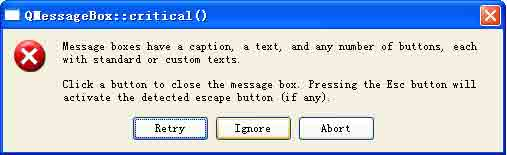

图 7-22 使用静态方法创建标准消息对话框

第 3-8 句则是根据用户选择的按钮不同而把返回值赋给对应的标签部件的文本显示。

### 7.4.5 实例：标准对话框的使用

下面以一个实例来说明上面这些内置对话框的使用方式和它们之间的区别。本实例主要包含了 7 种类型的消息框，包括 Question 消息框、Information 消息框、Warning 消息框、Critical 消息框、About 消息框、About Qt（关于 Qt）消息框以及 Custom（自定义） 消息框。当用户点击各个按钮时，将创建对应的标准对话框，程序的运行效果如图 7-23 所 示。

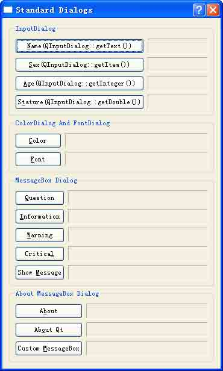

图 7-23 综合实例运行效果

我们先来看一下 Dialog 类的头文件。

```cpp
#ifndef DIALOG_H
#define DIALOG_H
#include &lt;QDialog&gt;
QT_BEGIN_NAMESPACE
class QLabel;
class QGroupBox;
class QErrorMessage;
QT_END_NAMESPACE
class Dialog : public QDialog
{
    Q_OBJECT
public:
    Dialog(QWidget *parent = 0);
private slots:
    void getAge();
    void getStature();
    void getSex();
    void getName();
    void getColor();
    void getFont();
    void getCriticalMessage();
    void getInformationMessage();
    void getQuestionMessage();
    void getWarningMessage();
    void getErrorMessage();
    void getAboutMessage();
    void getAboutQtMessage();
    void getCustomMessage();
private:
    QLabel *nameLabel;
    QLabel *sexLabel;
    QLabel *ageLabel;
    QLabel *statureLabel;
    QLabel *colorLabel;
    QLabel *fontLabel;
    QLabel *criticalLabel;
    QLabel *informationLabel;
    QLabel *questionLabel;
    QLabel *warningLabel;
    QLabel *errorLabel;
    QLabel *aboutLabel;
    QLabel *aboutQtLabel;
    QLabel *customLabel;
    QErrorMessage *errorMessageDialog;
};
#endif 
```

在文件开始处，首先引入了 QDialog 类的声明，然后前置声明程序中用到的 Qt 类。 Dialog 类公有单继承自 QDialog,接下来为其声明若干个私有槽函数和私有成员变量。

小贴士：类的成员变量尽量声明为私有的。

在 Dialog 类的实现文件的最开始处定义一个宏 MESSAGE，它保存了后面 MessageBox 类 的实例用到的提示信息。

```cpp
#include &lt;QtGui&gt;
#include "dialog.h"
#define MESSAGE \
Dialog::tr("&lt;p&gt;Message boxes have a caption, a text, " \
"and any number of buttons, each with standard or custom texts." \
"&lt;p&gt;Click a button to close the message box. Pressing the Esc button " \
"will activate the detected escape button (if any).") 
```

然后看一下构造函数。

```cpp
 Dialog::Dialog(QWidget *parent)
: QDialog(parent)
{
    //! [1]
    setWindowTitle(tr("Standard Dialogs"));
    errorMessageDialog = new QErrorMessage(this);
    int frameStyle = QFrame::Sunken | QFrame::Panel;
    //! [1]
    //! [2]
    //Name
    nameLabel = new QLabel;
    nameLabel-&gt;setFrameStyle(frameStyle);
    QPushButton *nameButton = new PushButton(tr("&Name(QInputDialog::getText())"));
    //Sex
    sexLabel = new QLabel;
    sexLabel-&gt;setFrameStyle(frameStyle);
    QPushButton *sexButton = new QPushButton(tr("&Sex(QInputDialog::getItem())"));
    //Age
    ageLabel = new QLabel;
    ageLabel-&gt;setFrameStyle(frameStyle);
    QPushButton *ageButton = new pushButton(tr("&Age(QInputDialog::getInteger())"));
    //Stature
    statureLabel = new QLabel;
    statureLabel-&gt;setFrameStyle(frameStyle);
    QPushButton *statureButton = new
    QPushButton(tr("S&tature(QInputDialog::getDouble())"));
    //setup inputdialog groupbox
    QGroupBox *inputDialogGBox = new QGroupBox(tr("Input Dialog"));
    QGridLayout *inputDialogGridLayout = new QGridLayout;
    inputDialogGridLayout-&gt;setColumnStretch(1, 1);
    inputDialogGridLayout-&gt;setColumnMinimumWidth(1, 100);
    inputDialogGridLayout-&gt;addWidget(nameButton, 0, 0);
    inputDialogGridLayout-&gt;addWidget(nameLabel, 0, 1);
    inputDialogGridLayout-&gt;addWidget(sexButton, 1, 0);
    inputDialogGridLayout-&gt;addWidget(sexLabel, 1, 1);
    inputDialogGridLayout-&gt;addWidget(ageButton, 3, 0);
    inputDialogGridLayout-&gt;addWidget(ageLabel, 3, 1);
    inputDialogGridLayout-&gt;addWidget(statureButton, 4, 0);
    inputDialogGridLayout-&gt;addWidget(statureLabel, 4, 1);
    inputDialogGBox-&gt;setLayout(inputDialogGridLayout);
    //! [2]
    //! [3]
    //Color
    colorLabel = new QLabel;
    colorLabel-&gt;setFrameStyle(frameStyle);
    QPushButton *colorButton = new QPushButton(tr("&Color"));
    //Font
    fontLabel = new QLabel;
    fontLabel-&gt;setFrameStyle(frameStyle);
    QPushButton *fontButton = new QPushButton(tr("&Font"));
    //setup color&font Dialog groupbox
    QGroupBox *colorAndFontDlgGBox = new QGroupBox(tr("Color Dialog And Font
    Dialog"));
    QGridLayout *colorAndFontDlgGLayout = new QGridLayout;
    colorAndFontDlgGLayout-&gt;setColumnStretch(1, 1);
    colorAndFontDlgGLayout-&gt;addWidget(colorButton, 0, 0);
    colorAndFontDlgGLayout-&gt;addWidget(colorLabel, 0, 1);
    colorAndFontDlgGLayout-&gt;addWidget(fontButton, 1, 0);
    colorAndFontDlgGLayout-&gt;addWidget(fontLabel, 1, 1);
    colorAndFontDlgGBox-&gt;setLayout(colorAndFontDlgGLayout);
    //! [3]
    //! [4]
    //Question MessageBox
    questionLabel = new QLabel;
    questionLabel-&gt;setFrameStyle(frameStyle);
    QPushButton *questionButton = new QPushButton(tr("&Question"));
    //Information MessageBox
    informationLabel = new QLabel;
    informationLabel-&gt;setFrameStyle(frameStyle);
    QPushButton *informationButton = new QPushButton(tr("&Information"));
    //Warning MessageBox
    warningLabel = new QLabel;
    warningLabel-&gt;setFrameStyle(frameStyle);
    QPushButton *warningButton = new QPushButton(tr("&Warning"));
    //Critical MessageBox
    criticalLabel = new QLabel;
    criticalLabel-&gt;setFrameStyle(frameStyle);
    QPushButton *criticalButton = new QPushButton(tr("Critica&l"));
    //Error MessageBox
    errorLabel = new QLabel;
    errorLabel-&gt;setFrameStyle(frameStyle);
    QPushButton *errorButton = new QPushButton(tr("Show &Message"));
    //setup messageBox dialog groupbox
    QGroupBox *messageBoxDlgGBox = new QGroupBox(tr("MessageBox Dialog"));
    QGridLayout *messageBoxDlgGLayout = new QGridLayout;
    messageBoxDlgGLayout-&gt;setColumnStretch(1, 1);
    messageBoxDlgGLayout-&gt;addWidget(questionButton, 0, 0);
    messageBoxDlgGLayout-&gt;addWidget(questionLabel, 0, 1);
    messageBoxDlgGLayout-&gt;addWidget(informationButton, 1, 0);
    messageBoxDlgGLayout-&gt;addWidget(informationLabel, 1, 1);
    messageBoxDlgGLayout-&gt;addWidget(warningButton, 2, 0);
    messageBoxDlgGLayout-&gt;addWidget(warningLabel, 2, 1);
    messageBoxDlgGLayout-&gt;addWidget(criticalButton, 3, 0);
    messageBoxDlgGLayout-&gt;addWidget(criticalLabel, 3, 1);
    messageBoxDlgGLayout-&gt;addWidget(errorButton, 4, 0);
    messageBoxDlgGLayout-&gt;addWidget(errorLabel, 4, 1);
    messageBoxDlgGBox-&gt;setLayout(messageBoxDlgGLayout);
    //! [4]
    //! [5]
    //About MessageBox
    aboutLabel = new QLabel;
    aboutLabel-&gt;setFrameStyle(frameStyle);
    QPushButton *aboutButton = new QPushButton(tr("A&bout"));
    //AboutQt MessageBox
    aboutQtLabel = new QLabel;
    aboutQtLabel-&gt;setFrameStyle(frameStyle);
    QPushButton *aboutQtButton = new QPushButton(tr("Ab&out Qt"));
    //custom MessageBox
    customLabel = new QLabel;
    customLabel-&gt;setFrameStyle(frameStyle);
    QPushButton *customButton = new QPushButton(tr("Custom M&essageBox"));
    //setup about dialog groupbox
    QGroupBox *aboutMessageDlgGBox = new QGroupBox(tr("About And Custom MessageBox
    Dialog"));
    QGridLayout *aboutMessageBoxDlgGLayout = new QGridLayout;
    aboutMessageBoxDlgGLayout-&gt;setColumnStretch(1, 1);
    aboutMessageBoxDlgGLayout-&gt;addWidget(aboutButton, 0, 0);
    aboutMessageBoxDlgGLayout-&gt;addWidget(aboutLabel, 0, 1);
    aboutMessageBoxDlgGLayout-&gt;addWidget(aboutQtButton, 1, 0);
    aboutMessageBoxDlgGLayout-&gt;addWidget(aboutQtLabel, 1, 1);
    aboutMessageBoxDlgGLayout-&gt;addWidget(customButton, 2, 0);
    aboutMessageBoxDlgGLayout-&gt;addWidget(customLabel, 2, 1);
    aboutMessageDlgGBox-&gt;setLayout(aboutMessageBoxDlgGLayout);
    //! [5]
    //! [6]
    //connect signals and slots
    connect(ageButton, SIGNAL(clicked()), this, SLOT(getAge()));
    connect(statureButton, SIGNAL(clicked()), this, SLOT(getStature()));
    connect(sexButton, SIGNAL(clicked()), this, SLOT(getSex()));
    connect(nameButton, SIGNAL(clicked()), this, SLOT(getName()));
    connect(colorButton, SIGNAL(clicked()), this, SLOT(getColor()));
    connect(fontButton, SIGNAL(clicked()), this, SLOT(getFont()));
    connect(criticalButton, SIGNAL(clicked()), this, SLOT(getCriticalMessage()));
    connect(informationButton, SIGNAL(clicked()),this,
    SLOT(getInformationMessage()));
    connect(questionButton, SIGNAL(clicked()), this, SLOT(getQuestionMessage()));
    connect(warningButton, SIGNAL(clicked()), this, SLOT(getWarningMessage()));
    connect(errorButton, SIGNAL(clicked()), this, SLOT(getErrorMessage()));
    connect(aboutButton, SIGNAL(clicked()), this, SLOT(getAboutMessage()));
    connect(aboutQtButton, SIGNAL(clicked()), this, SLOT(getAboutQtMessage()));
    connect(customButton, SIGNAL(clicked()), this, SLOT(getCustomMessage()));
    //! [6]
    //! [7]
    //Setup MainLayout
    QVBoxLayout *mainLayout = new QVBoxLayout;
    mainLayout-&gt;addWidget(inputDialogGBox);
    mainLayout-&gt;addWidget(colorAndFontDlgGBox);
    mainLayout-&gt;addWidget(messageBoxDlgGBox);
    mainLayout-&gt;addWidget(aboutMessageDlgGBox);
    setLayout(mainLayout);
    //! [7]
} 
```

在代码块[1]中，首先为应用程序设置标题栏，接着定义了一个 QErrorMessage 的实例，然后定义一个 QFrame 类的实例，用作应用程序窗口部件的风格。关于 QFrame，这里重 点讲解一下。

专题：关于 QFrame 类的使用

一般继承自 QWidget 的类都可以设置它的 frame 属性。比如 QLabel 类的窗口在默认情 况下拥有一个平面的（flat）观感，而 QProgressBar 类的窗口则拥有一个向下凹陷（sunken）的观感。当然这些都是可以通过设置它们的 frame 而改变的。下面是一段示意代码，演示了如何设置窗口部件的 frame。

```cpp
QLabel label(...);
label.setFrameStyle(QFrame::Panel | QFrame::Raised);
label.setLineWidth(2);
QProgressBar pbar(...);
label.setFrameStyle(QFrame::NoFrame); 
```

一个窗口部件的 frame 有两个重要的属性，一个是 shapes，一个是 style。

style 由 QFrame::Shape 和 QFrame::Shadow 枚举值共同来指定，它们可以使设置了 frame 的窗口部件与其他的区分开来。一般可以使用 setFrameStyle()方法来设置 frame 的 属性，而使用 frameStyle()方法来读取该设置。

setFrameStyle()的原型如下：

```cpp
void QFrame::setFrameStyle ( int style ) 
```

它的作用就是设置该窗口部件的 frame 为 style。

常见的各种应用程序的 frame 的观感如图 7-24 所示。

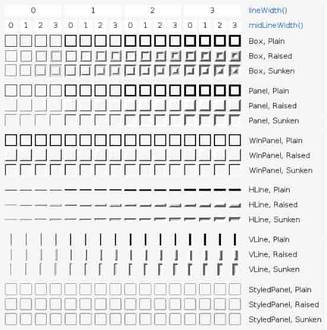

图 7-24 各种 frame 组合起来的效果

在代码块[2]-[5]中，创建了程序中用到的各种窗口部件，然后把它们分类放到几个分 组框中，最后为分组框设置了布局。这其中的重点是 QGroupBox 类的使用，它用作创建分 组框，请看下面的专题讲解。

专题：QGroupBox 类的使用

QGroupBox 为构建分组框提供了支持。分组框通常带有一个边框和一个标题栏，作为容 器部件来使用，在其中可以布置各种窗口部件。分组框的标题通常在上方显示，其位置可以 设置为靠左、居中、靠右、自动调整这几种方式之一。位于分组框之中的窗口部件可以获得 应用程序的焦点。

位于分组框之内的窗口部件被称作是它的子窗口，通常使用 addWidget()方法把子窗口 部件加入到分组框之中。

使用分组框的一般步骤如下：

1\. 实例化分组框对象

使用 QGroupBox 构造函数来实例化分组框对象，示例代码如下：

```cpp
QGroupBox *groupBox = new QGroupBox(tr("Exclusive Radio Buttons")); 
```

2\. 创建位于分组框之中的子窗口部件

同样使用该窗口部件的构造函数来实现，示例代码如下：

```cpp
QRadioButton *radio1 = new QRadioButton(tr("&Radio button 1")); 
```

3\. 创建一个布局

这个布局就是后面要设置在分组框之上的布局， Qt 提供的常见布局类型比如水平布 局、垂直布局、栅格布局、表单布局等都可以，目前还不支持分裂器布局。示例代码如下：

```cpp
QVBoxLayout *vbox = new QVBoxLayout; 
```

4\. 把第 2 步创建的子窗口部件加入到第 3 步创建的布局之中

一般使用 addWidget()或者 insertWidget()方法把子窗口部件加入到布局之中。示例 代码如下：

```cpp
QVBoxLayout *vbox = new QVBoxLayout;
vbox-&gt;addWidget(radio1); 
```

5\. 把第 3 步创建的布局应用到分组框上

最后，使用 setLayout()方法把布局应用到分组框上，示例代码如下：

```cpp
groupBox-&gt;setLayout(vbox); 
```

注意，创建分组框及其内部的子窗口部件时，以上次序不要改变。当分组框内部没有

子窗口部件时，是无法为其应用布局的。再有就是，要牢固记得 QGroupBox 是 QWidget 的 子类，QWidget 的公有方法，它的对象都可以使用，它本身就是一个窗口部件。最后，一般 情况下，在应用程序中只要使用了分组框，就要为它应用一个布局，请读者朋友注意体会。

下面是一个示例程序片段，它演示了创建分组框并为其设置布局的过程。

```cpp
QGroupBox *groupBox = new QGroupBox(tr("Exclusive Radio Buttons"));
QRadioButton *radio1 = new QRadioButton(tr("&Radio button 1"));
QRadioButton *radio2 = new QRadioButton(tr("R&adio button 2"));
QRadioButton *radio3 = new QRadioButton(tr("Ra&dio button 3"));
radio1-&gt;setChecked(true);
QVBoxLayout *vbox = new QVBoxLayout;
vbox-&gt;addWidget(radio1);
vbox-&gt;addWidget(radio2);
vbox-&gt;addWidget(radio3);
vbox-&gt;addStretch(1);
groupBox-&gt;setLayout(vbox); 
```

代码块[6]设置程序中的信号和槽的连接

代码块[7]设置程序总的布局。 接下来看一下设置年龄的函数 getAge()。

```cpp
void Dialog::getAge()
{
bool ok;
int age = QInputDialog::getInteger(this,tr("User Age"),
tr("Please input age"),ageLabel-&gt;text().toInt(),0,150,1,&ok);
if(ok)
{
    ageLabel-&gt;setText(QString(tr("%1")).arg(age));
}
} 
```

静态方法 QInputDialog::getInteger 用于创建基于整数的标准输入框。

QString 的 toInt()方法原型如下：

```cpp
int QString::toInt ( bool * ok = 0, int base = 10 ) const 
```

它的作用是以 base 为基准将字符串转化为整数。如果 base 等于 0，则表示将使用 C 语 言规定的转换方法，即如果字符串是以 0x 开头的，则转换成 16 进制的整数；如果字符串是以 0 开头的，则转换成 8 进制整数，其它情况则转换成 10 进制整数。一般我们使用十进 制整数的时候较多。

再看一下设置性别的函数 getSex()是如何定义的。

```cpp
void Dialog::getSex()
{
    QStringList items;
    items &lt;&lt; tr("male") &lt;&lt; tr("female");
    bool ok;
    QString sex = QInputDialog::getItem(this,tr("Sex"),
    tr("Please select sex"),items,0,false,&ok);
    if (ok)
    {
        sexLabel-&gt;setText(sex);
    }
} 
```

其中，QStringList 类用于容纳一些列的字符串对象。操作符 <<的原型如下：

```cpp
QStringList & QStringList::operator&lt;&lt; ( const QString & str ) 
```

它的作用于 append()方法相同，将 str 附加到已知的字符串列表中，并返回该列表的引用。

设置字体的函数 getFont()是这样定义的。

```cpp
void Dialog::getFont()
{
bool ok;
QFont font = QFontDialog::getFont(&ok, QFont(fontLabel-&gt;text()), this);
if (ok)
{
    fontLabel-&gt;setText(font.key());
    fontLabel-&gt;setFont(font);
}
} 
```

第 3 行调用 getFont()方法创建标准字体对话框。

第 5 行设置 fontLabel 的文本是 font 的文本描述。QFont 的 key()方法的原型如下：

```cpp
QString QFont::key () const 
```

它返回该字体的文本描述代码。

第 6 行设置 fontLabel 的字体为用户选中的 font。 现在看看自定义消息对话框的方法，在 getWarningMessage()方法中有很好的示范。

```cpp
void Dialog::getWarningMessage()
{
    QMessageBox msgBox(QMessageBox::Warning, tr("QMessageBox::warning()"),
    MESSAGE, 0, this);
    msgBox.addButton(tr("Save &Again"), QMessageBox::AcceptRole);
    msgBox.addButton(tr("&Continue"), QMessageBox::RejectRole);
    if (msgBox.exec() == QMessageBox::AcceptRole)
    {
        warningLabel-&gt;setText(tr("Save Again"));
    }
    else
    {
        warningLabel-&gt;setText(tr("Continue"));
    }
} 
```

首先使用构造函数而不是静态方法创建 QMessageBox 的实例。然后使用 addButton()方法为消息对话框添加按钮。QMessageBox::AcceptRole()和 QMessageBox::RejectRole()是 枚举变量 QMessageBox::ButtonRole 的取值之一，该枚举变量描述了按钮在消息对话框中 的作用。QMessageBox::AcceptRole 表示当用户单击该按钮时，将导致对话框被接受，类似 于 OK 按钮的作用，而 QMessageBox::RejectRole()表示当用户单击该按钮时，将导致对话 框被拒绝，类似于 Cancel 按钮的作用。

# 7.5 模态对话框与非模态对话框

## 7.5 模态对话框与非模态对话框

模态对话框（Modal Dialog）与非模态对话框（Modeless Dialog）的概念不是 Qt 所 独有的，在各种不同的平台下都存在。又有叫法是称为模式对话框，无模式对话框等。

所谓模态对话框就是在其没有被关闭之前，用户不能与同一个应用程序的其他窗口进 行交互，直到该对话框关闭。对于非模 态对话框，当被打开时，用户既可选择和该对话框进 行交互，也可以选择同应用程序的其他窗口交互。

在 Qt 中，显示一个对话框一般有两种方式，一种是使用 exec()方法，它总是以模态来 显示对话框；另一种是使用 show()方法，它使得对话框既可以模态显示，也可以非模态显 示，决定它是模态还是非模态的是对话框的 modal 属性。

在 Qt 中，Qt 的模态与非模态对话框选择是通过其属性 modal 来确定的。我们来看看 modal 属性，其定义如下：

```cpp
modal : bool 
```

默认情况下，对话框的该属性值是 false，这时通过 show()方法显示的对话框就是非模态的。而如果将该属性值设置为 true，就设置成了模态对话框，其作用于把 QWidget::windowModality 属性设置为 Qt::ApplicationModal。

而使用 exec()方法显示对话框的话，将忽略 modal 属性值的设置并把对话框设置为模 态对话框。

一般使用 setModal()方法来设置对话框的 modal 属性。 我们总结一下设置对话框为模态的方法。

如果要设置为模态对话框，最简单的就是使用 exec()方法，示例代码如下：

```cpp
MyDialog myDlg;
myDlg.exec(); 
```

也可以使用 show()方法，示例代码如下：

```cpp
MyDialog myDlg;
myDlg.setModal(true);
myDlg.show(); 
```

如果要设置为非模态对话框，必须使用 show()方法，示例代码如下：

```cpp
MyDialog myDlg;
myDlg.setModal(false);//或者 myDlg.setModal();
myDlg.show(); 
```

再次强调，目前有的朋友对于模态对话框和非模态对话框的认识有误解，认为使用 show()方法显示的就是非模态对话框，这是不正确的。 小贴士：有时候，我们需要一个对话框以非模态的形式显示，但又需要它总在所有窗口的最前面，这时可以通过如下代码设置：

```cpp
MyDialog myDlg;
myDlg.setModal(false);//或者 myDlg.setModal();
myDlg.show();
//关键是下面这行
myDlg.setWindowFlags(Qt::WindowStaysOnTopHint); 
```

# 7.6 问题与解答

## 7.6 问题与解答

问：内建对话框的控件怎么改文本？

比如说 QMessageBox::critical(this, QObject::tr("警告！"), QObject::tr("请正 确输入！"));我要把显示的 OK 按钮文本改为“确定”，怎么获得 OK 的指针？

答：在本章前面已经讲到，这种情况下不要使用 QMessageBox 类的静态方法，下面是 一个类似这种需求时的示例代码：

```cpp
QMessageBox msgBox;
QPushButton *connectButton = msgBox.addButton(tr("Connect"), QMessageBox::ActionRole);
QPushButton *abortButton = msgBox.addButton(QMessageBox::Abort);
msgBox.exec();
if (msgBox.clickedButton() == connectButton)
{
    // connect
}
else if (msgBox.clickedButton() == abortButton)
{
    // abort
} 
```

注意重点是 QMessageBox 类的 addButton()方法的使用，其原型可以通过查阅帮助获得。

问：能不能通过对话框的 Title 索引它？

比如我有一个主窗口，其中打开了几个子窗口，我是否可以通过它们的标题来得到它们的指针，继而引用它们？

答：从你的表述来看，你的问题可以归结为如何通过子窗口的 windowTitle 属性来索 引并控制不同的子窗口。

实际上我们很少通过 windowTitle 属性来区分子窗口，因为往往这个属性的值并不是 唯一的，而是可能重复的。所以我们一般是通过 objectName 这个属性来索引不同的子窗 口，继而可以获得其它的属性值，包括 windowTitle。

可以通过 QObject::findChild()、QObject::findChildren()或者是 qFindChild()、 qFindChildren()方法来索引子窗口，请看下面的例子，一个 QPushButton 类对象，它的 objectName 属性为"button1"，下面的代码使用 findChild()方法获得了这个子窗口的指针。

```cpp
QPushButton *button = parentWidget-&gt;findChild&lt;QPushButton *&gt;("button1"); 
```

要获得父窗口的所有子窗口，可以使用 findChildren()方法，下面的代码取得了 parentWidget 的所有类别为 QPushButton 的子窗口：

```cpp
QList&lt;QPushButton *&gt; allPButtons = parentWidget.findChildren&lt;QPushButton *&gt;(); 
```

需要注意的是 QObject::findChild()、QObject::findChildren()不能与 MSVC6 一起使用，如果要与 MSVC6 配合，则可以换成 qFindChild()、qFindChildren()，它们实现相同的功能。

问：请问我在 Qt Designer 里面设置一个 OKbutton，我将信号 clicked()和槽 accept()相连 接,但为什么运行后点它实现的是关闭对话框的功能呢

答：可以看一下 accept()这个槽的定义：

```cpp
void QDialog::accept () [virtual slot]
//Hides the modal dialog and sets the result code to Accepted. 
```

确切说，它是隐藏（hide）这个对话框，看起来的效果是关闭了这个对话框，但是在对话框关闭后，其对象仍然存在，并没有被销毁。 问：如何创建一个不带标题栏的 QMessageBox？ 答：可以使用下面的代码创建，不是使用 QMessageBox 类的静态方法。

```cpp
QMessageBox mgb ;
mgb.setWIndowFlags(Qt::FrameLessTopHint) ;
mgb.exec() ; 
```

问：如何让一个对话框总在所有窗口的最前面显示？

答：最简单的方法只需添加一句代码：

```cpp
this-&gt;setWindowFlags(Qt::WindowStaysOnTopHint); 
```

问：在 Qt4 中如何为对话框设置背景？

答：这个问题值得总结一下。大致有以下的思路和方法：

1.重写 paintEvent()事件

在该事件中用画笔 QPainter 重画整个背景。该方法比较复杂，不建议初学者采 用。

2.使用调色板类 QPalette

```cpp
//以下代码中 pWidget 为指向要设置的 widget 的指针。
QPalette palette = pWidget-&gt;palette();
palette-&gt;setBrush(QPalette::Active,QPalette::Window,QBrush(Qt::red))
pWidget-&gt;setPalette(palette);
pWidget-&gt;setAutoBackground(true); 
```

推荐使用这种方法，大家可以查看一下 setBrush()方法的定义：

```cpp
Palette::setBrush ( ColorGroup group, ColorRole role, const QBrush &brush ) 
```

这个是一个重载版本，最为重要的是第二个参数，可以设置许多不同的类型。举例来说， 如果 pWidget 指向的是一个 QListWidget 或者 QTextEdit 对象，如果把第二个参数设置 成 QPalette::Text，则是设置其中文字的颜色；如果第二个参数是 QPalette::BrightText，则是设置该对象被选中时，其文字的颜色；如果第二个参数 QPalette::Bright 则表示设置选中该 对象时，高亮背景的颜色或者图片。该函数的功能是很强大的。

3.使用样式表。

```cpp
pWidget-&gt;setStyleSheet("background-color:blue;"); //设置背景颜色 pWidget-&gt;setStyleSheet("background-image:url(:/folder/show.bmp);"); //设置背景图片 
```

此外，还有一些很有意思的方法，比如用 setHtml(),insetHtml()这种用 HTML 语言的方式来指定的等等，大家可以多查查帮助文档搜索一下 。

4.具体例子

```cpp
//设置为固定颜色
QPalette pal = pWidget-&gt;palette();
pal.setColor(QPalette::Background, QColor(0,0,0)); //黑色
pWidget-&gt;setPalette( pal );
//背景图片
QPalette pal = pWidget-&gt;palette();
pal.setBrush( QPixmap(图片文件名) ); //黑色
pWidget-&gt;setPalette( pal ); 
```

# 7.7 总结与提高

## 7.7 总结与提高

对话框为用户提供了许多选项和多种选择，允许用户把选项设置为他们喜欢的变量值并从中做出选择。

本章介绍了如何在 Qt 中创建基于对话框的应用程序。对话框是应用程序中最为常见的 类型之一，因此必须熟练掌握创建对话框的基本方法和技巧，对于基本的概念必须清楚，比 如 QDialog 及其派生类的使用、常见内建对话框的应用以及模态和非模态对话框的区别等 等。对于初学者而言，使用 Qt Creator 作为 IDE，结合 Qt Designer 创建对话框是一种常 见的做法，优点是上手比较快，布局结构可以边修改边预览，但是在工程应用中，比较复杂 的布局通常是采用手工编写代码完成的。所以，笔者还是建议在学习的时候，尽量采用手写 代码子类化 QDialog 的方法完成项目。