# 第九章 Qt 样式表与应用程序观感

# 第九章 Qt 样式表与应用程序观感

**本章重点**

*   掌握设置应用程序观感的方法
*   了解 Qt 窗口部件的样式
*   了解 Qt 样式表的作用
*   掌握 Qt 样式表的基本语法
*   掌握样式表与 Qt Designr 的集成使用
*   了解子类化 QStyle 类的方法
*   掌握不使用样式表改变应用程序观感的方法

Qt 样式表是专为设置应用程序的观感（ look and feel）而生的，它是从 Qt 4.2 开始引 入的描述窗口部件观感的强大机制 ，允许你按照自己的需求定制应用程序的观感 。并且从 Qt 4.5 开始，Qt 样式表全面支持 Mac OS X 平台。

Qt 样式表的设计灵感主要来自于 HTML 的层叠样式表（Cascading Style Sheets,CSS）， 但它同时适用于窗口部件。在介绍 Qt 样式表之前，我们先来看看什么是应用程序的外观（或 者叫做观感）。

# 9.1 应用程序的观感

## 9.1 应用程序的观感

相信大家已经发现，Qt 应用程序在每一个所支持的平台上都可以看起来像原生的本地程 序一样。Qt 是通过模拟各个平台的观感来实现这一点的 ，而不是使用特定的平台或者工具包 的窗口部件集。图 9-1 显示了在不同平台下的 Qt 组件中的 ComboBox 的观感。

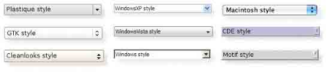

### 9.1.1 应用程序的风格

图 9-1 窗口部件在不同平台上的观感

每个应用程序都有自己的样式（Style）。运行于 KDE 下的 Qt/X11 应用程序的默认样式 是 Plastique，而运行于 GNOME 下的应用程序的默认样式是 Cleanlooks。这些样式使用了渐 变和抗锯齿效果，以用来提供一种时尚的观感。运行 Qt 应用程序的用户可以通过使用命令行 参数-style 覆盖原有的默认样式。例如，在 X11 下，要想使用 Motif 样式来运行名为 app 的 程序，只需要简单的输入以下命令即可：

```cpp
./app –style motif 
```

与其他样式不同，Windows XP、Windows Vista 和 Mac 所特有的样式只能在它们的本地平台上有效，因为它们需要依赖相应平台的主题引擎。

还有另外的一种样式 QtDotNet，它来自于 Qt Solutions 模块。你也可以创建出自己所 特别喜好的与众不同的样式，这部分内容已经超出了本书讨论的范围，如有需要请参阅相关 文档。

### 9.1.2 如何设置样式

要设置整个应用程序的样式，可以调用 QApplication::setStyle()方法，或者由用户在 应用程序运行时输入-style 命令行参数来指定：

```cpp
./myapplication -style motif 
```

如果没有显式的指定，那么 Qt 将根据用户的平台和桌面环境自行选择最为合适的样式 。

如果要单独设置某个窗口部件的样式，可以对其调用 QWidget::setStyle()方法。

# 9.2 QStyle 类的使用

## 9.2 QStyle 类的使用

说到样式表，就不可避免的要谈到 Qt 的样式（Qt Style）。

在 Qt 样式表出现之前，我们主要是通过子类化 QStyle 类或者预定义一个样式，例如 QWindowStyle，来定制应用程序的观感，而 Qt 本身也是使用这种方法来为它所支持的不同平 台提供特定的观感的。

QStyle 类的应用比较广泛。它封装了 GUI 应用程序所使用的观感样式，是一个抽象基类。 Qt 包含了一系列的 QStyle 的子类，它们模拟了在各种不同平台上的 GUI 界面的观感，这些 观感可以通过设置 QWindowStyle、QMacStyle、QMotifStyle 等样式来实现,而且在我们调用 QtGui 这个模块时，如果事先没有显式的指定，那么 Qt 会自动判断环境并选择最为适合的样 式。此外，样式也可作为插件来被应用程序使用。

下面我们使用 Qt Creator 结合代码，创建一个实例，大家从中可以学习到使用 QStyle 类配置应用程序的观感的方法。

### 9.2.1 实例-使用 QStyle

本实例的代码见 styleCreator 实例。

第 1 步，创建项目。

启动 Qt Creator，在弹出的【New...】对话框中选择 Empty Qt4 Project 类型，如图所 示，点击【OK】按钮进入到下一步的设置界面。


图 9-2 选择项目类型

然后，在弹出的【Empty Qt4 Project】对话框里为项目设置名称和保存位置，这里项 目名称为 styleCreator。注意，名称和保存的位置中都不要含有空格、特殊字符和中文字符。 图 9-3 和图 9-4 显示了这个设置的过程。

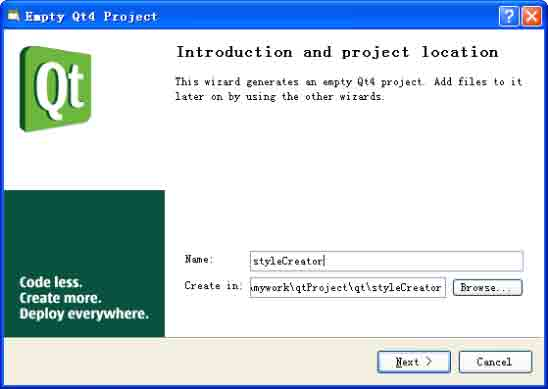

图 9-3 设置项目名称和要保存的位置

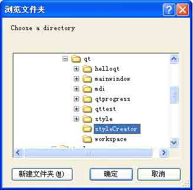

图 9-4 设置项目保存的位置

这之后，一路选择默认设置即可完成项目的创建。如果读者朋友对使用 Qt Creator 的 使用有不熟悉的地方，可以参见第六章和第十二章。

第 2 步，设计界面。

我们在 Qt Designer 中设计出来的界面布局如图 9-5 所示，具体的布局结构可以从对象 查看器中得到，不再赘述。

界面设置完成后，将其保存在第 1 步创建的项目目录下面，名为 styleCreator.ui。


图 9-5 界面布局

第 3 步，书写并向项目中添加文件。

本项目中共有 styleCreator.pro、main.cpp、myWidget.h、myWidget.cpp、和 styleCreator.h 这几个原生源文件。首先要向项目中加入这几个文件，一般有两种方法 。一种是直接在 Qt Creator 中定义、书写并加入；一种是在 Qt Creator 之外书写好，然后再加入进来。我们以 main.cpp 为例，简要介绍这两种方法。

第一种方法介绍如下，如图 9-6 所示，首先依次点击【File】→【New】，在弹出的【New...】 对话框中选择要新建的类型，这里是 C++ Source File。然后，点击【OK】按钮，进入到下 一步设置。

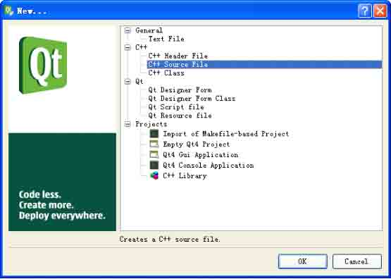

图 9-6 新增 C++源文件

在接下来弹出的【Chose the location】对话框中设置新建文件的名称和要保存的位置 ， 这里要选中第 1 步创建好的项目的位置。如图 9-7 所示。点击【Next】按钮进入下一步。

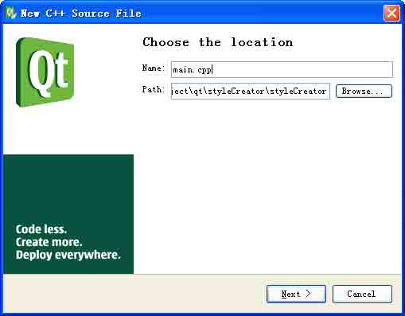

图 9-7 选择文件的位置

接下来，在弹出的【Project management】对话框中选中那个 Add to Project 复选框， 并选择第 1 步创建好的项目 Project 名称。如图 9-8 所示，点击【Finish】按钮完成新文件 的添加。

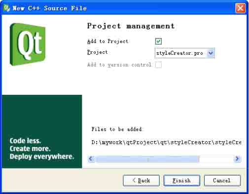

图 9-8 选择项目名称

第 2 种方法介绍如下，如图 9-9 所示，在 Qt Creator 中的项目栏上点击鼠标右键，选 择 Add Existing Files...菜单项，将你在项目外面书写好的文件加入到项目中。对于前面 使用 Qt Designer 做好的 styleCreator.ui 文件，我们使用这种方法把它加入到项目中。

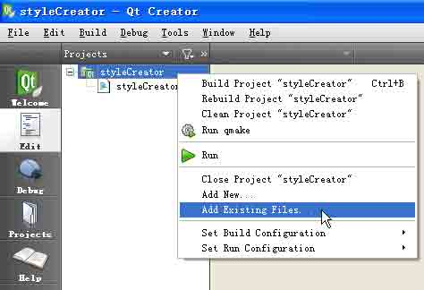

图 9-9 使用右键菜单添加文件

第 3 步，书写代码。 我们选择使用多继承的方法，从原生界面文件实体类中派生出一个自定义类 myWidget，首先看一下头文件。

```cpp
#ifndef MYWIDGET_H
#define MYWIDGET_H
#include &lt;QDialog&gt;
#include "ui_styleCreator.h"
class myWidget:public QDialog,public Ui::Dialog
{
    Q_OBJECT
public:
    myWidget( QDialog *parent = 0 );
public slots:
    void slotChangeStyle(QString);
};
#endif // MYWIDGET_H 
```

首先要包含 QDialog 类的声明，接下来再加入对 ui_styleCreator.h 的包含。

注意声明 myWidget 类的方法，是多继承自 QDialog 类和定义在 ui_styleCreator.h 中定义的 Ui::Dialog 这个实体类。

由于程序中要用到 Qt 的核心机制-信号/槽，所以必须加上 Q_OBJECT 这个宏。然后声明 构造函数和一个公有槽。

再来看一下类的定义文件。

```cpp
#include "myWidget.h"
#include &lt;QtGui&gt;
myWidget::myWidget(QDialog *parent)
:QDialog(parent)
{
    setupUi(this);
    setWindowTitle(tr("Change Window Look And Feel"));
    comboBox-&gt;addItems(QStyleFactory::keys());
    this-&gt;spinBox-&gt;setRange(0,9);
    this-&gt;lineEdit-&gt;setText(tr("Hello Qt Style,We Can Change It!"));
    this-&gt;lineEdit-&gt;setReadOnly(true);
    this-&gt;textEdit-&gt;setText("Hello Qt!\n Qt by Nokia is the standard framework for developing high-performance cross-platform applications.Qt provides single-source portability across Microsoft Windows, Mac OS X, Linux, all major commercial Unix variants, and embedded Linux. On embedded Linux, the Qt API is available as Qtopia Core.");
    this-&gt;tableWidget-&gt;setRowCount(3);
    tableWidget-&gt;setColumnCount(3);
    connect(comboBox,SIGNAL(activated(QString)),this,SLOT(slotChangeStyle(QString)));
    slotChangeStyle(QStyleFactory::keys()[5]);
}
void myWidget::slotChangeStyle(QString style)
{
    QApplication::setStyle(QStyleFactory::create(style));
    QApplication::setPalette(QApplication::style()-&gt;standardPalette());
} 
```

下面我们讲解一下这些代码的作用。

第 1、2 两行引入头文件。

第 5 行初始化界面布局，该句一般放在构造函数的开头。

第 6 行设置程序标题，注意在字符串前面要用到 tr()函数，使程序满足国际化的要求。 第 7 行向组合框中加入具体的项值。

QStyleFactory 类用来创建 QStyle 对象。使用 QStyleFactory 的静态方法 QStyleFactory::keys()可以获得与具体平台无关的内置的样式，以及与平台有关的部分样式。与平台无关的样式主要包括"windows", "motif", "cde", "plastique" 和"cleanlooks"等风格，与平台有关的主要包括"windowsxp", "windowsvista" 和"macintosh"等几种样式。 此外，书写样式时，注意它们的名称是大小写敏感的。

第 8 行为滑块部件设定滑动的范围。

第 9 行设置编辑框要显示的文本内容。

第 10 行设置编辑框内容为只读。

第 11 行设置文本框显示的文本内容。

第 12 行设置表格部件的行数为 3 行。

第 13 行设置表格部件的列数为 3 列。

第 14 行连接组合框的触发信号和窗体的 slotChangeStyle 槽。 第 15 行像调用普通函数一样，调用 slotChangeStyle 槽函数。 第 17-21 行是 slotChangeStyle 槽的定义。

其中第 19 行通过调用 QApplication::setStyle()方法来设置应用程序的样式，该方法 是 QApplication 类的静态函数，其原型如下：

```cpp
void QApplication::setStyle ( QStyle * style ) [static] 
```

该方法的形参是 QStyle 类的对象，在本程序中，它的实参是通过

QStyleFactory::create()方法来获得的。该方法原型如下：

```cpp
QStyle * QStyleFactory::create ( const QString & key ) [static] 
```

其形参是 QString 的对象，返回值是 QStyle 的对象，该方法是 QStyleFactory 类的静态方法。

第 20 行调用 QApplication::setPalette()方法设置应用程序的颜色组合。该方法是 QApplication 类的静态方法，其原型如下：

```cpp
void QApplication::setPalette ( const QPalette & palette, const char * className = 0 ) [static] 
```

它的作用是将应用程序原有的颜色组合用 palette 来替换。如果 className 被指定不为空，那么该方法将仅对该参数对应的窗口部件起作用；如果 className 取默认值 0，则 该方法将影响整个儿应用程序中的窗体部件的颜色组合，并且将之前在应用程序中设定的颜色组合替换掉。

最后像下面这样书写 main.cpp 文件内容，主要是将自定义的窗口部件显示出来。

```cpp
#include &lt;QApplication&gt;
#include &lt;QWidget&gt;
#include"ui_styleCreator.h"
#include"myWidget.h"
int main(int argc, char * argv[])
{
    QApplication app(argc,argv);
    myWidget widget;
    widget.show();
    return app.exec();
} 
```

通过这个实例，我们可以看到使用 QStyle 类来设置应用程序或窗口部件的样式是比较简便的。

在 Qt 应用程序中，QStyle 类的使用非常广泛。本章只是向大家介绍了经常会用到的基 本功能，其它的如如何创建一个自定义的样式、如何使用这个自定义的样式、怎样使自定义 的窗口部件感知这个样式等内容都是比较深入的话题，读者朋友可以在掌握本 节内容的基础 上，有选择的学习。

# 9.3 样式表概述

## 9.3 样式表概述

样式表的出现并不是要取代子类化 QStyle 类的方法。事实上，样式表在 Qt 的风格之上 起作用（如果使用了样式表，QWidget::style()返回的 QStyle 为”style sheet”），提供 了比 QPalette（用来设置窗口部件的颜色组合）更为灵活、强大的机制。

### 9.3.1 基本语法

样式表的语法和 HTML CSS 基本是一致的。Qt 的样式表对大小写不敏感，但对类名、对 象名和属性名大小写敏感。如下示例设置了所有 QTextEdit 对象背景是黄色的，所有 QPushBox 对象文本为绿色：

```cpp
QTextEdit {background:yellow}
QPushBox {color:green} 
```

1.样式规则

样式表包含一系列的规则，一个样式规则由选择符和定义组成。选择符（ selector）确 定有哪些窗口部件受规则影响，定义说明了在窗口部件上应用哪些属性。

例如：

```cpp
QRadioButton {color:red} 
```

在这条规则里，QRadioButton 是选择符，{color:red}是定义。这条规则说明了 QRadioButton 和它的子类应该使用红色作为前景色。

几个选择符可以使用一个定义，使用逗号分隔选择符。如：

```cpp
QPushButton,QCheckEdit,QComboBox {color:red} 
```

定义由一个或多个属性和值对组成，中间用分号隔开，如：

```cpp
QPushButton { color:red;background-color:white } 
```

2.选择符类型

Qt 支持所有 CSS2 中所有的选择符，表 9-1 给出了常用的选择符。

表 9-1 常用的选择符

| 选择符 | 示例 | 可以匹配的窗口部件 |
| --- | --- | --- |
| 通配 | * | 所有窗口部件 |
| 类型 | QLabel | 给定类的实例，包括其子类 |
| 属性 | QComboBox[editable=”true”] | 所有可以编辑的给定类的实例 |
| 类 | .QCheckBox | 给定类的实例，而不包括其子类 |
| 标识 | QRadioButton#red | 对象名为 red 的给定类的对象 |
| 子孙对象 | QWidget QToolButton | 所有是 QWidget 的子孙对象的 QToolButton 对象 |
| 子对象 | QWidget>QGroupBox | 所有是 QWidget 的直接子对象的 QGroupBox 对象 |

3.子控件

对于复杂控件，可以访问它的子控件。如 QCheckBox 上的下拉按钮，QSpinBox 上的向上 和向下箭头。如：

```cpp
QComboBox::drop-down { image:url (myarrow.jpg) } 
```

上面的代码使用了自定义的下拉按钮图像。 ::是 CSS3 中的伪元素。

4.伪状态

选择符可以包含伪状态来表示窗口部件的状态。伪状态在选择符之后，以冒号分隔 ，下面定义了当鼠标在 QPushButton 上悬停时的规则：

```cpp
QPushButton : hover {color : white } 
```

5.冲突解决

当不同的规则应用到相同的属性时，样式表就产生了冲突。在这种情况下，特定的规则 比通用的规则优先；伪状态比没有伪状态的优先；如果级别相同，则最后一个规则优先。冲 突解决按照 CSS2 规范进行。

6.层叠

样式表可以在 Qapplication 这个级别设置，也可以在父窗口部件，子窗口部件级别设 置。实际应用样式时，则合并者几个级别的样式。当有冲突时，窗口部件自身的样式优先使 用，接下来是父窗口部件，祖先窗口部件，依次类推。

7.盒子模型

窗口部件盒子窗口部件支持背景（background）、边框（border）、边距（margin）、填衬（padding），图 9-10 显示了样式表的盒子模型。

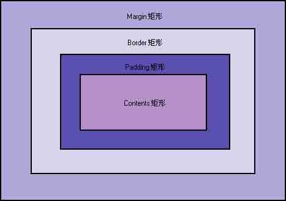

图 9-10 Qt 样式表的盒子模型

这个模型可以指定 4 个影响布局的矩形，从而绘制一个自定义的窗口部件：

(1) contents 矩形位于最里面。它是绘制窗口部件内容（如文字或图片）的地方。

(2) padding 矩形包围 contents 矩形。它负责由 padding 属性指定填充操作。

(3) border 矩形包围 padding 矩形。它为边界预留空间。

(4) margin 矩形在最外边，它包围 border 矩形，负责任何指定的边缘空白区域。 对于没有 padding、border 和 margin 的普通窗口部件，这 4 个矩形重合在一起。

# 9.4 使用样式表

## 9.4 使用样式表

使用样式表通常有两种做法，一种是设置全局的样式表，通过调用 QApplication::setStyleSheet()方法来实现；一种是在指定的窗口部件上使用样式表 ，这可以通过调用 QWidget::setStyleSheet()方法来实现。如果你为同一个部件或应用程序指定了 多种不同的样式表（比如有的设置字体颜色，有的设置界面背景），那么 Qt 将会自动将它们 的效果组合起来，这也被称作是样式表的层叠（ cascading）。

注意，Qt 样式表目前尚不支持用户自定义的 QStyle 样式，在后续的版本中有望获得支 持。也就是说，当你的应用程序中含有子类化自 QStyle 类的样式时，在 Qt 4.5 以前的版本 中就不要再同时设置样式表了。

### 9.4.1 与 Qt Designer 集成使用

在 Qt Designer 中，可以很方便的设置样式表并浏览其效果。可以在 Qt Designer 设计 的界面之中的任意窗口部件上点击鼠标右键，在弹出的上下文菜单上选择 “改变样式表”，如 图 9-11 所示。

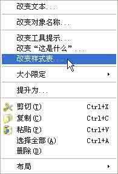

图 9-11 改变样式表的上下文菜单

接下来将弹出名为【编辑样式表】的对话框，如图 9-12 所示。其中有 4 个下拉按钮， 分别是添加资源、添加渐变、添加颜色和添加字体， 使用它们可以细化设置情况。

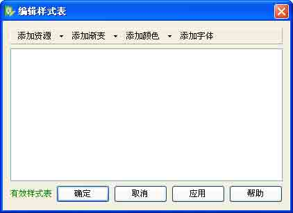

图 9-12 【编辑样式表】对话框

举个例子，依次点击添加颜色和添加字体按钮，为窗口部件设置颜色和字体的样式 。其 结果如图 9-13 所示。

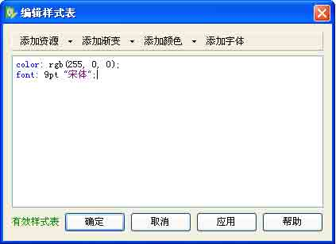

图 9-13 添加字体和设置颜色

从 Qt 4.2 开始， Qt Designer 内置了针对样式表的语法高亮和语法有效性校验支持 。 语法有效性指示器位于【编辑样式表】窗体的左下角。样式表的语法有效的话，将以绿色字 体指示出来“有效样式表”，如图 9-14 所示。

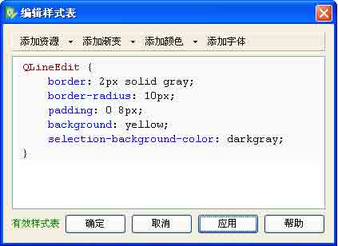

图 9-14 样式表设置正确

当你按下【确定】或者【应用】按钮，Qt Designer 将立即把基于新的样式表的程序外 观展现在面前。

语法不正确的话，将以红色字体指示出来“无效样式表”，如图 9-15 所示。

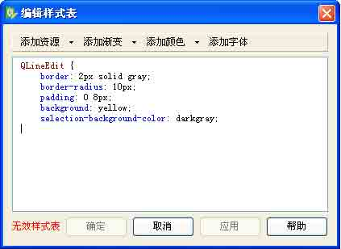

图 9-15 样式表的语法不正确

现在，我们举个具体的小例子，也算是一个练习题吧。打开 Qt Designer，在界面上放 置两个 Label、一个 LineEdit 和一个 ComboBox 窗口部件。通过使用右键菜单来改变各个窗 口部件的样式表，最终完成的界面情形如图 9-16 所示，大家可以自行尝试如何实现这个界面 布局，多试几遍就可以的。（提示：要把 LineEdit 设置成如图 9-16 所示的圆角形式，需要加 入语句 border-style:outset;）


图 9-16 一个具体的例子

### 9.4.2 实例：样式表的应用

下面我们以一个实例来讲解样式表的应用。这个例子取材于 Qt Demo，比较复杂，有一 定难度，基本上覆盖了前面几章讲述的各种技能点，主要包括：

*   如何自定义 Qt 的样式表
*   如何在应用程序中应用样式表
*   如何不使用样式表来设置应用程序的样式
*   如何使用单继承法从.ui 文件创建派生类
*   如何自定义资源集文件
*   如何使信号和槽自动连接
*   如何在两个窗口之间建立关联
*   元对象系统方法的使用

这个程序名字叫 stylesheet，其运行后的效果如图 9-17 所示。


图 9-17 实例运行效果

该例子基于主窗口样式，有些类似于我们在网上所常见的填写个人资料的网站注册程序。

程序有两个主菜单，依次点击【File】->【Edit Style】菜单项，将弹出如图 9-18 所示的设置样式表的对话框，在其中内置了几种样式供选择，使用者也可以在编辑框中输入自 定义的样式。设置完成后，主界面的窗口部件的样式将依此相应的变化 。里面的 Coffee 样式自定义了 push button、frames 和 tooltip，但使用了下层的风格 （例如这里是 Windows XP 风格）来绘制 checkbox，combobox 和 radio button。Pagefold 风格完全重新定义了对话框 中使用的所有控件的外观，从而实现了一种独特的，平台无关的外观。

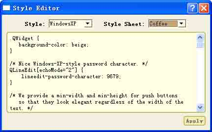

图 9-18 样式表编辑器

这个程序里面包含如下原生源文件：

```cpp
mainwindow.ui
stylesheeteditor.ui
stylesheet.qrc
/qss/coffee.qss
/qss/default.qss
/qss/pagefold.qss
/images/*.jpg
mainwindow.h
mainwindow.cpp
stylesheeteditor.h
stylesheeteditor.cpp 
```

其中，mainwindow.ui 和 stylesheeteditor.ui 分别是主程序和样式编辑器的界面布局 文件，是使用 Qt Designer 制作的。Stylesheet.qrc 是资源集文件，在其中描述了程序中用 到的样式表文件和图片文件的位置和名称 。在 qss 文件夹中包含了 3 个.qss 文件，它们描述 了程序中用到的样式，我们的程序将读取它们并转换成样式表 。在 images 文件夹中放置了程 序中用到的图片文件。mainwindow.h 和 mainwindow.cpp 构成了程序中的主程序类，而 stylesheeteditor.h 和 stylesheeteditor.cpp 构成了样式编辑器类。

下面我们就结合源代码为大家讲解这个程序的功能是怎样实现的。 首先看看 mainwindow.h

```cpp
#ifndef MAINWINDOW_H
#define MAINWINDOW_H
#include &lt;QtGui&gt;
#include "ui_mainwindow.h"
class StyleSheetEditor;
class MainWindow : public QMainWindow
{
    Q_OBJECT
public:
    MainWindow();
private slots:
    void on_editStyleAction_triggered();
    void on_aboutAction_triggered();
private:
    StyleSheetEditor *styleSheetEditor;
    Ui::MainWindow ui;
};
#endif 
```

第 1、2 和第 16 行一起构成了头文件的预定义卫哨 ，这样做的目的是为了防止程序中重复定义或包含头文件，是严谨的编程风格，建议大家遵循这一范例的做法。

第 3 行引入 QtGui 模块的声明，它包含了 QMainWindow 类的定义。 第 4 行引入 ui_mainwindow.h 的声明。

第 5 行采用前置声明的方式引入样式编辑器类 StyleSheetEditor。 第 6 行声明主程序类 MainWindow 单公有继承自 QMainWindow 类。 第 7 行时必需的，因为要用到 Qt 的核心机制，如信号/槽机制等。 第 8、9 行声明 MainWindow 类的构造函数。

第 10-12 行声明私有槽，它们的命名遵循了 Qt 信号/槽的“自动关联规则”。

第 13-15 行声明了私有成员，它们分别是样式编辑器类的对象和主程序界面类的对象 。 从这里也可以看出，我们对.ui 文件的引入将采用单继承的方式。

下面再来看一下 mainwindow.cpp 文件的内容。

```cpp
#include "mainwindow.h"
#include "stylesheeteditor.h"
MainWindow::MainWindow()
{
    ui.setupUi(this);
    ui.nameLabel-&gt;setProperty("class", "mandatory QLabel");
    styleSheetEditor = new StyleSheetEditor(this);
    statusBar()-&gt;addWidget(new QLabel(tr("Ready")));
    connect(ui.exitAction, SIGNAL(triggered()), qApp, SLOT(quit()));
    connect(ui.aboutQtAction, SIGNAL(triggered()), qApp, SLOT(aboutQt()));
}
void MainWindow::on_editStyleAction_triggered()
{
    styleSheetEditor-&gt;show();
    styleSheetEditor-&gt;activateWindow();
}
void MainWindow::on_aboutAction_triggered()
{
    QMessageBox::about(this, tr("About Style sheet"),
    tr("The &lt;b&gt;Style Sheet&lt;/b&gt; example shows how widgets can be styled "
    "using &lt;a href=\"http://doc.trolltech.com/4.5/stylesheet.html\"&gt;Qt "
    "Style Sheets&lt;/a&gt;. Click &lt;b&gt;File|Edit Style Sheet&lt;/b&gt; to pop up the "
    "style editor, and either choose an existing style sheet or design "
    "your own."));
} 
```

第 1、2 两行引入程序中用到的头文件声明。

第 4 行初始化界面布局，setupUi()函数一般要放在构造函数内的第一行。 第 5 行设置 nameLabel 的属性，setProperty()方法的原型如下：

```cpp
bool QObject::setProperty ( const char * name, const QVariant & value ) 
```

它将对象的 name 的属性值设置为 value。对于本句来说，就是把 nameLabel 的 class 属性值设置为"mandatory QLabel"，这将使得该窗口部件被突出显示。

第 6 行实例化 styleSheetEditor 类的对象，其父窗口为 MainWindow。

第 7 行为状态栏添加一个窗口部件，显示 "Ready"字样，即汉语的“就绪“。

第 8、9 行分别连接菜单项 exitAction 和 aboutQtAction 的触发信号 triggered()和全局对象 qApp 的 quit()槽和 aboutQt()槽。

第 10-12 行定义了 on_editStyleAction_triggered()槽函数。 第 11 行显示样式编辑器窗口。

第 12 行调用 activateWindow()方法把样式编辑器窗口设置为活动窗口。 activateWindow()方法的原型如下：

```cpp
void QWidget::activateWindow () 
```

它用来把某个顶层窗口设置为当前的活动窗口。

小贴士：活动窗口与如何设置活动窗口 所谓活动窗口就是当前能够拥有键盘输入焦点的，可见的顶层窗口。 activateWindow()方法的作用与用鼠标单击顶层窗口的标题栏的效果是一样的。在 X11 上，这个效果并不确定，因为它依赖于具体的窗口管理器，如果要确保某窗口为活动窗口，

最好是在调用 activateWindow()方法之后再调用 raise()方法，后者本身也是 Qt 内置的一个 槽函数。但无论如何，在这之前都需要确保该窗口首先是可见的，否则将没有任何效果。

在 Windows 平台上，这种情形又有些差异。因为 Microsoft 不允许一个应用打断由另一 个应用建立起来的和用户的对话（即交互过程 ），所以 activateWindow()被调用后，该窗口 部件可能还是不能成为顶层的活动窗口，而只是它的标题栏变为高亮，以告诉用户该窗口部 件的状态发生了某些变化。这一点，请读者朋友在使用时注意。

如果想知道某窗口是否为活动窗口，可以调用 isActiveWindow()方法。 前面我们曾经讲到过 Qt 核心机制中的“资源集文件“。现在我们看一下如何在 Qt Creator 中书写或配置资源集文件。

在 Qt Creator 中用鼠标双击资源集文件，将打开资源集文件编辑器，在资源集编辑器中可以增加或删除文件、节点等，其操作比较方便，一目了然。如图 9-19 所示。

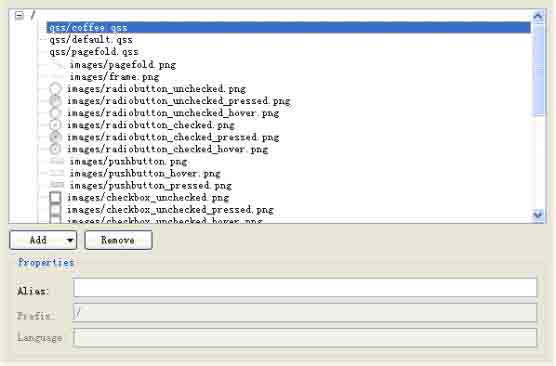

图 9-19 资源集文件编辑器

我们再来看一下 stylesheeteditor.h 文件的内容。

```cpp
#ifndef STYLESHEETEDITOR_H
#define STYLESHEETEDITOR_H
#include &lt;QDialog&gt;
#include "ui_stylesheeteditor.h"
class StyleSheetEditor : public QDialog
{
    Q_OBJECT
public:
    StyleSheetEditor(QWidget *parent = 0);
private slots:
    void on_styleCombo_activated(const QString &styleName);
    void on_styleSheetCombo_activated(const QString &styleSheetName);
    void on_styleTextEdit_textChanged();
    void on_applyButton_clicked();
private:
    void loadStyleSheet(const QString &sheetName);
    Ui::StyleSheetEditor ui;
};
#endif 
```

第 1 行声明 StyleSheetEditor 类单公有继承自 QDialog。

第 5-9 行声明了程序中的私有槽，命名遵循了 Qt 信号/槽的“自动关联规则”。

第 11 行声明了私有方法 loadStyleSheet()，它用来从.qss 文件中读取内容并转化问样式表。 第 12 行声明了私有成员变量 ui。

再来看一下 stylesheeteditor.cpp。

```cpp
#include &lt;QtGui&gt;
#include "stylesheeteditor.h"
StyleSheetEditor::StyleSheetEditor(QWidget *parent)
: QDialog(parent)
{
    ui.setupUi(this);
    QRegExp regExp(".(.*)\\+?Style");
    QString defaultStyle = QApplication::style()-&gt;metaObject()-&gt;className();
    if (regExp.exactMatch(defaultStyle))
    {
        defaultStyle = regExp.cap(1);
    }
    ui.styleCombo-&gt;addItems(QStyleFactory::keys());
    ui.styleCombo-&gt;setCurrentIndex(ui.styleCombo-&gt;findText(defaultStyle,
    Qt::MatchContains));
    ui.styleSheetCombo-&gt;setCurrentIndex(ui.styleSheetCombo-&gt;findText("Coffee"));
loadStyleSheet("Coffee");
}
void StyleSheetEditor::on_styleCombo_activated(const QString &styleName)
{
    qApp-&gt;setStyle(styleName);
    ui.applyButton-&gt;setEnabled(false);
}
void StyleSheetEditor::on_styleSheetCombo_activated(const QString &sheetName)
{
    loadStyleSheet(sheetName);
}
void StyleSheetEditor::on_styleTextEdit_textChanged()
{
    ui.applyButton-&gt;setEnabled(true);
}
void StyleSheetEditor::on_applyButton_clicked()
{
    qApp-&gt;setStyleSheet(ui.styleTextEdit-&gt;toPlainText());
    ui.applyButton-&gt;setEnabled(false);
}
void StyleSheetEditor::loadStyleSheet(const QString &sheetName)
{
    QFile file(":/qss/" + sheetName.toLower() + ".qss");
    file.open(QFile::ReadOnly);
    QString styleSheet = QLatin1String(file.readAll());
    ui.styleTextEdit-&gt;setPlainText(styleSheet);
    qApp-&gt;setStyleSheet(styleSheet);
    ui.applyButton-&gt;setEnabled(false);
} 
```

第 3-6 行调用 Qt 中的正则表达式来取得默认的样式。

第 3 行定义一个正则表达式变量 regExp。

第 4 行是 Qt 元对象机制（ Meta-Object System）的应用。

首先通过 style()方法获得应用程序的样式，然后利用 Qt 元对象机制获取元对象信息。 style()方法是 QApplication 类的静态方法，其原型如下：

```cpp
QStyle * QApplication::style () [static] 
```

它将返回应用程序的样式对象。

这里简单的讲解一下 Qt 元对象机制，详细的内容请见第十三章。

Qt 的元对象系统是 Qt 的核心机制之一，Qt 的信号/槽机制、属性系统、运行时型别信息 等机制都是以元对象系统为基础的。在应用程序中，每一个 QObject 的子类都会有一个单独的 Qt 元对 象实例， 这个实例 中保存了 该类所有 的元对象 信息，该 实例可以 通过调用 QObject::metaObject()方法来得到。

而 QMetaObject 被称作是 Qt 的元对象类，它包含了 Qt 对象的元信息。

QObject::metaObject()方法的原型如下：

```cpp
const QMetaObject * QObject::metaObject () const [virtual] 
```

可以看到，它返回本对象的指向其元对象的指针。 用来获取元对象信息的方法有很多，本程序中用到的 className()是其中的一种，它返回类 的名字。

第 5、6 两行应用正则表达式的校验来获得 defaultStyle 的值。

第 8 行是为 styleCombo 设置当前下拉框列表中的默认选项。 findText()是 QcomboBox 类的方法，其原型如下：

```cpp
int QComboBox::findText ( const QString & text, Qt::MatchFlags flags =
Qt::MatchExactly | Qt::MatchCaseSensitive ) const 
```

它在 QComboBox 对象的 item 列表中搜索与 text 相匹配的项的索引值，如果没有相匹配的项，则返回-1，该值是 int 型的。flags 参数给出了搜索的方法，即如何与 text 相匹配。

flags 的值取自枚举值 Qt::MatchFlag，后者描述了在一个模型中搜索时可以遵循的匹配原 则，如表 9-2 所示。

表 9-2 MatchFlag 的取值

| 常量 | 值 | 说明 |
| --- | --- | --- |
| Qt::MatchExactly | 0 | 执行 QVariant 匹配（QVariant 可以看做是 Qt 的最常用变量类型的联合体） |
| Qt::MatchFixedString | 8 | 执行按字符匹配。注意这种方式默认情况下不区分大小写，只有同时指定 Qt::MatchCaseSensitive 才区分大小写。 |
| Qt::MatchContains | 1 | 搜索条件包含在（QComboBox 的下拉列表）项目中 |
| Qt::MatchStartsWith | 2 | 匹配条件是与项的开头相匹配，即“以 XXX 开头” |
| Qt::MatchEndsWith | 3 | 搜索的条件与项的结尾相匹配，即“以 XXX 为结尾” |
| Qt::MatchCaseSensitive | 16 | 执行大小写敏感匹配搜索 |
| Qt::MatchRegExp | 4 | 以一个正则表达式为匹配条件执行按字符匹配搜素，注意这种方式不区分大 小写，除非同时指定 Qt::MatchCaseSensitive 条件。 |
| Qt::MatchWildcard | 5 |
| Qt::MatchWrap | 32 | 执行类似“令牌环”式的搜索，对每一个项都要经过验证 |
| Qt::MatchRecursive | 64 | 执行递归搜索 |

所有上述这些标记符号都是 QFlags< MatchFlag >的一部分，它们之间的组合可以用 OR 来连接，在程序中即是使用|符号。这些标记符号经常与 QRegExp 类结合使用。

第 9 行与第 8 行同理，设置 styleSheetCombo 的当前项为 Coffee，也即当前的样式表的 名称为 Coffee。

紧接着，第 10 行调用 loadStyleSheet()方法相应的设置应用程序的样式表为 Coffee。 第 21-27 行是 loadStyleSheet()方法的定义。

第 22 行使用 QFile 类的对象根据实参取得 Coffee 样式表对应的.qss 文件全名，即带路 径的 Coffee.qss。

第 23 行以只读方式打开 Coffee.qss 文件。

第 24 行读取文件的全部内容。QLatin1String 类的构造函数原型如下：

```cpp
QLatin1String::QLatin1String ( const char * str ) 
```

注意它的参数是 const char * str，而不是 QString 类的对象。

小贴士：QLatin1String 类的使用

关于 QLatin1String 类的使用有很多话题。这里只讲一下最为基本的部分。 QLatin1String 类为采用 ASCII/Latin-1 编码形式的字符串操作提供了一个轻量级的封装。

通常在操作字符串时，Qt 推荐开发者尽量不要直接使用 QString 类，因为它的速度比较慢。替代的方法一种是使用 const char*，使用它可以避免创建一个临时的 QString 对象， 这样就节省了开销。很多 QString 的成员函数如 insert()、replace()、index()等都接受 const char*作为参数或返回值。举个例子，在下面的所有的示例代码中假设变量 str 是 QString 类型。

```cpp
if (str == "auto" || str == "extern"
    || str == "static" || str == "register")
{
    ...
} 
```

上面和下面的两段代码实现了相同的操作 。由于下面的代码在执行期间创建了 4 个临时的 QString 变量并且对字串值进行了深度拷贝，增大了程序运行的开销，所以上面这段代码 的执行速度就要明显的快于下面这段代码。

```cpp
if (str == QString("auto") || str == QString("extern")
    || str == QString("static") || str == QString("register"))
{
    ...
} 
```

如果使用 QLatin1String 类，代码可以写成下面这样，书写起来比较费力气些，但是代码执行的效率很高，比使用 QString::fromLatin1()要快得多。

```cpp
if (str == QLatin1String("auto")
    || str == QLatin1String("extern")
    || str == QLatin1String("static")
    || str == QLatin1String("register")
{
    ...
} 
```

基本上在各种场合都可以使用 QLatin1String 来代替 QString，就像下面代码中示例的这种用法。

```cpp
QLabel *label = new QLabel(QLatin1String("MOD"), this); 
```

第 25 行使用 setPlainText()方法把 styleTextEdit 要显示的内容设置为样式表文件的内容。

第 26 行设置应用程序的样式表。 代码段中的其它部分比较简单，不再赘述了。

再来看一看 main.cpp 的内容。

```cpp
#include &lt;QtGui&gt;
#include "mainwindow.h"
int main(int argc, char *argv[])
{
    Q_INIT_RESOURCE(stylesheet);
    QApplication app(argc, argv);
    MainWindow window;
    window.show();
    return app.exec();
} 
```

这里第 1 行最为重要，要使用资源集文件，就要使用 Q_INIT_RESOURCE 宏。

小贴士：Q_INIT_RESOURCE 宏的使用 Q_INIT_RESOURCE 宏的原型如下：

```cpp
void Q_INIT_RESOURCE ( name ) 
```

该宏的作用是初始化在 name 指定的.qrc 文件中的资源文件。通常，Qt 在应用程序初始化时自动加载资源。注意，在某些平台上使用静态链接库时，必须使用 Q_INIT_RESOURCE() 宏来存储资源。

举个例子，如果应用程序中用到的资源文件列在名为 myapp.qrc 的资源集文件中，那么 为了确保资源在应用程序初始化时被加载，你需要确保在主程序的 main()中加上下面这句：

```cpp
Q_INIT_RESOURCE(myapp); 
```

有两点需要注意，一是参数 name 的命名必须符合标准 C++对于变量命名的规范，不可以含有不合适的字符。

第二，该宏不能用在名字空间里面。它必须在 main()主函数中被调用。如果必须在名字 空间中使用，可以使用下面的示例代码。

```cpp
inline void initMyResource() { Q_INIT_RESOURCE(myapp); }
namespace MyNamespace
{
    ...
    void myFunction()
    {
        initMyResource();
    }
} 
```

项目文件 stylesheet.pro 可以像下面这样书写。

```cpp
TEMPLATE = app
TARGET =
DEPENDPATH += .
INCLUDEPATH += .
# Input
HEADERS += mainwindow.h stylesheeteditor.h
FORMS += mainwindow.ui stylesheeteditor.ui
SOURCES += main.cpp mainwindow.cpp stylesheeteditor.cpp
RESOURCES += stylesheet.qrc 
```

第 1 行表明应用程序的模板为 app。第 5 行是注释，第 9 行表明要包含用到的资源集文件。

通过本实例，大家可以看到，样式表是一种在运行时解释的普通文本文件 ，使用它们不

需要具备编程知识。我们可以在应用程序级别和窗口级别设置样式表。 另外，如果在不同的 级别都设置了样式表，则应用程序将继承所有有效的样式，你看到的程序样子是这些效果的 叠加，这被称作是样式表效果的层叠（ cascading）。

# 9.5 问题与解答

## 9.5 问题与解答

问：CSS 样式表的命令是否不能完全适用于 Qt 中？

答：在 Qt 中，样式表文件可以存成.qss 文件。QSS 在设计时参考了 CSS 的设计，但两 者在语法、属性等方面有些差别，所以 CSS 不能完全适用于 Qt。

问：在 Qt 中如何读取 CSS 样式表中的某个属性的具体值？ 答：在本章里面已经介绍过，样式表是一种在运行时解释的普通文本文件 ，通常可以保存成.qss 文件。可以使用 QFile 类读取、设置其中的内容，具体请参考本章的实例。

问：用 Qt Designer 的样式表添加图片和用 drawPixmap()函数实现显示图片哪个效果 更好？

答：drawPixmap()函数使用了缓冲技术，消耗的系统资源比较少。通常情况下，使用样 式表不如直接调用 drawPixmap()函数来绘图效率高。尤其是在嵌入式系统中，在系统资源有 限的情况下，尽量不要使用样式表。但是 样式表也有优势，就是它易于控制和使用，在系统 资源比较丰富的情况下，比如桌面环境，也可酌情使用。

问：如何给应用程序中的某一个窗口部件单独设置样式表 ，我怎么设置都没有效果？这 是 QT 帮助文档里自带的说将 stylesheet 应用到具体对象上的方法，但似乎不起作用。

```cpp
ID Selector
QPushButton#okButton
Matches all QPushButton instances whose object name is okButton. 
```

答： 会起作用的，可能文档中的一个关键点你没有注意到，请看下面的示例

```cpp
QDialog myDialog;
myDialog.setObjectName("mydialog");//如果要对这个对象单独设 stylesheet 的话一定要设置它的
objectName 
```

然后再像下面这样写就可以了：

```cpp
QDialog#mydialog {background-image: url(2.bmp); 
```

# 9.6 总结与提高

## 9.6 总结与提高

本章主要讲述了以下内容，希望大家能够熟练掌握。

*   什么是应用程序的观感
*   什么是 Qt 样式表
*   样式表的作用
*   样式表的基本语法
*   样式表与 Qt Designer 的结合使用
*   使用样式表设置应用程序或其子部件的观感
*   综合使用 QStyle 类和 Qt 样式表的方法

由于 Qt 样式表的引入，定制 Qt 部件的外观样式变得非常简单。 无论你是想仅仅修改 一个现有部件的外观，还是想从零开始设计一套全新的界面风格 ， 现在都有了一种新的方法 而不必再去继承并实现一个 QStyle 的子类。使用 Qt 的样式表，再结合布局管理的相关技巧， 我们就可以随心所欲的设计应用程序的用户界面了。