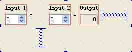
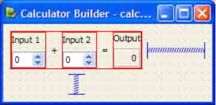
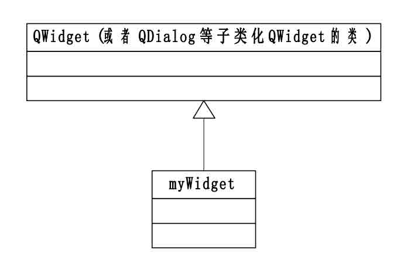
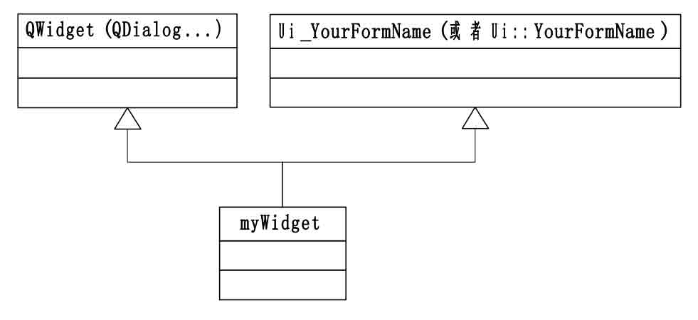

# 第十章 在程序中使用.ui 文件

**本章重点**

*   了解 uic 的使用方法
*   了解 Ui_YourFormName.h 文件的组成
*   熟练掌握在编译时加入处理.ui 文件的方法，包括直接使用法、单继承法和多继承法
*   掌握在运行是加入处理.ui 文件的方法，主要是动态加载的方法
*   熟练掌握信号与槽实现自动关联的方法

当应用程序被构建时，使用 Qt 提供的构建工具，如 qmake 和 uic，可以把使用 Qt Designer 创建的用户界面（.ui 文件）集成进工程里面，并自动生成相对应的文件和代码。Qt 提供了 两种引入和处理.ui 文件的方法：一种是在编译时引入处理（Compile Time Form Processing）， 一种是在运行时引入处理（Run Time Form Processing）。前者又可以有 3 种做法：直接使用 法、单继承法和多继承法；而后者是动态的加载 .ui 文件，这需要借助 QtUiTools 模块来完 成。

首先让我们先来了解一下 Qt 提供的的 uic 工具。

# 10.1 uic 的使用

## 10.1 uic 的使用

uic 的全称是 User Interface Compiler for the Qt GUI toolkit，顾名思义，它就 是.ui 文件编译器，也是 Qt 提供的工具之一。它的主要功用可以用一句话来概括，就是读取 由 Qt Designer 制作的用户界面文件（即.ui 文件），并生成相对应的 C++头文件。该头文件 的形式是 Ui_YourFormName.h。

使用方法如下：

```cpp
uic [options] &lt;uifile&gt; 
```

对应到我们的实例即可写成：

```cpp
uic [options] YourFormName.ui 
```

其中，[options]选项内容如表 10-1 所示

表 10-1 uic 命令行选项

| Option | 描 述 |
| --- | --- |
| -o <file> | 输出到<file>中，而不是采用标准输出，其中 file 为文件名 |
| -tr <func> | 使用<func> 来翻译字符串，以代替 tr()的使用 |
| -p | 不产生重复包含的卫哨 |
| -h | 显示 options 列表和使用方法，相当于 uic 的帮助 |
| -v | 显示 uic 的版本号 |

小贴士：现在我们一般不直接使用 uic，当使用 qmake 时，uic 会在需要时被 qmake 自动调 用。

# 10.2 Ui_YourFormName.h 文件的组成

## 10.2 Ui_YourFormName.h 文件的组成

我们了解了 uic 工具的使用方法和公用，现在来看看它为我们生成的 C++头文件的组成 是什么样的，里面的“构件”又有哪些功用，这对我们理解后面几节的内容有着重要的作用 。

我们将使用 Qt Designer 创建一个界面文件，名为 calculatorform.ui，这个程序主要 是完成简单的加法计算功能。该界面的元素组合如图 10-1 所示。



图 10-1 使用 Qt Designer 制作的界面

怎样做到在不使用 qmake 的情况下，就可以产生对应的头文件呢，我们遵循上一节介绍 的方法，在 Qt 的命令行下面输入如下命令：

```cpp
uic –o ui_calculatorform.h calculatorform.ui 
```

小贴士：再次提醒，以 Windows XP 操作系统为例，进入 Qt 命令行的方法是：依次点击【开始】->【所有程序】->【Qt SDK by Nokia v2009.03 (open source)】->【Qt Command Prompt】。然后切换到你的.ui 文件所在的目录，执行上述命令即可。

以下是据此生成的 ui_calculatorform.h 文件的完整内容，我将分段向大家讲解。

```cpp
/********************************************************************************
** Form generated from reading ui file 'calculatorform.ui'
**
** Created: Sun Sep 6 22:34:26 2009
** by: Qt User Interface Compiler version 4.5.2
**
** WARNING! All changes made in this file will be lost when recompiling ui file!
********************************************************************************/ 
```

这一段代码是 uic 工具自动生成的注释内容，它记录了该 C++头文件对应的原始.ui 文件的名字以及产生的时间和使用的 uic 的版本。最后一行提示内容很重要，它明确的告诉我们，不要手动修改该文件内容，因为在下次运行 qmake 或者 uic 时，它们会被覆盖掉。所以，我们如果需要对文件内容做修改，那么到 Qt Designer 中修改界面元素就行了，uic 会把所 有的改动反映出来。

```cpp
#ifndef UI_CALCULATORFORM_H
#define UI_CALCULATORFORM_H
#include &lt;QtCore/QVariant&gt;
#include &lt;QtGui/QAction&gt;
#include &lt;QtGui/QApplication&gt;
#include &lt;QtGui/QButtonGroup&gt;
#include &lt;QtGui/QGridLayout&gt;
#include &lt;QtGui/QHeaderView&gt;
#include &lt;QtGui/QLabel&gt;
#include &lt;QtGui/QSpacerItem&gt;
#include &lt;QtGui/QSpinBox&gt;
#include &lt;QtGui/QVBoxLayout&gt;
#include &lt;QtGui/QWidget&gt; 
```

上面这段的开头两句加上该文件结尾的 #endif // UI_CALCULATORFORM_H 这句构成了完整的防止头文件重复定义的卫哨，这是很好的编程规范，我们在自己书写代码时，也要遵循 这种严谨的做法。

后面的几句加入了程序中用到的窗口部件以及变量的头文件 。请大家注意它们的用法也 是非常规范的，正是许多 C++大师所提倡的“用到什么就包含什么，不用的就不包含 ”的做 法的应用典范。笔者发现有很多的朋友不论什么情况，都喜欢加入一句 #include <QtGui>或 者#include <QtCore>，这固然省事，因为它们包含了这两个模块下的所有子模块的定义 ，但 是这样一来，就降低了程序的编译速度，使得性能下降。

```cpp
QT_BEGIN_NAMESPACE
class Ui_CalculatorForm
{
public:
QGridLayout *gridLayout;
QSpacerItem *spacerItem;
QLabel *label_3_2;
QVBoxLayout *vboxLayout;
QLabel *label_2_2_2;
QLabel *outputWidget;
QSpacerItem *spacerItem1;
QVBoxLayout *vboxLayout1;
QLabel *label_2;
QSpinBox *inputSpinBox2;
QLabel *label_3;
QVBoxLayout *vboxLayout2;
QLabel *label;
QSpinBox *inputSpinBox1; 
```

上面这段代码中，首先用 QT_BEGIN_NAMESPACE 宏表示开始进入名字空间。然后定义了一个名为 Ui_CalculatorForm 的类，它实际上是界面的实体类，界面上的所有元素都被定义 为相应的窗口部件的实例，并且它们一定是被定义为 public,即公有的成员，这将使得后面的 Ui 名字空间内的派生类能够继承它们。

```cpp
void setupUi(QWidget *CalculatorForm)
{
    if (CalculatorForm-&gt;objectName().isEmpty())
        CalculatorForm-&gt;setObjectName(QString::fromUtf8("CalculatorForm"));
    CalculatorForm-&gt;resize(400, 300);
    QSizePolicy sizePolicy(static_cast&lt;QSizePolicy::Policy&gt;(5),
    static_cast&lt;QSizePolicy::Policy&gt;(5));
    sizePolicy.setHorizontalStretch(0);
    sizePolicy.setVerticalStretch(0);
    sizePolicy.setHeightForWidth(CalculatorForm-&gt;sizePolicy().hasHeightForWidth());
    CalculatorForm-&gt;setSizePolicy(sizePolicy);
    gridLayout = new QGridLayout(CalculatorForm);
    #ifndef Q_OS_MAC
    gridLayout-&gt;setSpacing(6);
    #endif
    #ifndef Q_OS_MAC
    gridLayout-&gt;setMargin(9);
    #endif
    gridLayout-&gt;setObjectName(QString::fromUtf8("gridLayout"));
    gridLayout-&gt;setObjectName(QString::fromUtf8(""));
    spacerItem = new QSpacerItem(40, 20, QSizePolicy::Expanding, QSizePolicy::Minimum);
    gridLayout-&gt;addItem(spacerItem, 0, 6, 1, 1);
    label_3_2 = new QLabel(CalculatorForm);
    label_3_2-&gt;setObjectName(QString::fromUtf8("label_3_2"));
    label_3_2-&gt;setGeometry(QRect(169, 9, 20, 52));
    label_3_2-&gt;setAlignment(Qt::AlignCenter);
    gridLayout-&gt;addWidget(label_3_2, 0, 4, 1, 1);
    vboxLayout = new QVBoxLayout();
    #ifndef Q_OS_MAC
    vboxLayout-&gt;setSpacing(6);
    #endif
    vboxLayout-&gt;setMargin(1);
    vboxLayout-&gt;setObjectName(QString::fromUtf8("vboxLayout"));
    vboxLayout-&gt;setObjectName(QString::fromUtf8(""));
    label_2_2_2 = new QLabel(CalculatorForm);
    label_2_2_2-&gt;setObjectName(QString::fromUtf8("label_2_2_2"));
    label_2_2_2-&gt;setGeometry(QRect(1, 1, 36, 17));
    vboxLayout-&gt;addWidget(label_2_2_2);
    outputWidget = new QLabel(CalculatorForm);
    outputWidget-&gt;setObjectName(QString::fromUtf8("outputWidget"));
    outputWidget-&gt;setGeometry(QRect(1, 24, 36, 27));
    outputWidget-&gt;setFrameShape(QFrame::Box);
    outputWidget-&gt;setFrameShadow(QFrame::Sunken);
    outputWidget-&gt;setAlignment(Qt::AlignAbsolute|Qt::AlignBottom|Qt::AlignCenter|Qt::AlignHCenter
    |Qt::AlignHorizontal_Mask|Qt::AlignJustify|Qt::AlignLeading|Qt::AlignLeft|Qt::AlignRight|Qt::
    AlignTop|Qt::AlignTrailing|Qt::AlignVCenter|Qt::AlignVertical_Mask);
    vboxLayout-&gt;addWidget(outputWidget);
    gridLayout-&gt;addLayout(vboxLayout, 0, 5, 1, 1);
    spacerItem1 = new QSpacerItem(20, 40, QSizePolicy::Minimum, QSizePolicy::Expanding);
    gridLayout-&gt;addItem(spacerItem1, 1, 2, 1, 1);
    vboxLayout1 = new QVBoxLayout();
    #ifndef Q_OS_MAC
    vboxLayout1-&gt;setSpacing(6);
    #endif
    vboxLayout1-&gt;setMargin(1);
    vboxLayout1-&gt;setObjectName(QString::fromUtf8("vboxLayout1"));
    vboxLayout1-&gt;setObjectName(QString::fromUtf8(""));
    label_2 = new QLabel(CalculatorForm);
    label_2-&gt;setObjectName(QString::fromUtf8("label_2"));
    label_2-&gt;setGeometry(QRect(1, 1, 46, 19));
    vboxLayout1-&gt;addWidget(label_2);
    inputSpinBox2 = new QSpinBox(CalculatorForm);
    inputSpinBox2-&gt;setObjectName(QString::fromUtf8("inputSpinBox2"));
    inputSpinBox2-&gt;setGeometry(QRect(1, 26, 46, 25));
    vboxLayout1-&gt;addWidget(inputSpinBox2);
    gridLayout-&gt;addLayout(vboxLayout1, 0, 3, 1, 1);
    label_3 = new QLabel(CalculatorForm);
    label_3-&gt;setObjectName(QString::fromUtf8("label_3"));
    label_3-&gt;setGeometry(QRect(63, 9, 20, 52));
    label_3-&gt;setAlignment(Qt::AlignCenter);
    gridLayout-&gt;addWidget(label_3, 0, 1, 1, 1);
    vboxLayout2 = new QVBoxLayout();
    #ifndef Q_OS_MAC
    vboxLayout2-&gt;setSpacing(6);
    #endif
    vboxLayout2-&gt;setMargin(1);
    vboxLayout2-&gt;setObjectName(QString::fromUtf8("vboxLayout2"));
    vboxLayout2-&gt;setObjectName(QString::fromUtf8(""));
    label = new QLabel(CalculatorForm);
    label-&gt;setObjectName(QString::fromUtf8("label"));
    label-&gt;setGeometry(QRect(1, 1, 46, 19));
    vboxLayout2-&gt;addWidget(label);
    inputSpinBox1 = new QSpinBox(CalculatorForm);
    inputSpinBox1-&gt;setObjectName(QString::fromUtf8("inputSpinBox1"));
    inputSpinBox1-&gt;setGeometry(QRect(1, 26, 46, 25));
    vboxLayout2-&gt;addWidget(inputSpinBox1);
    gridLayout-&gt;addLayout(vboxLayout2, 0, 0, 1, 1);
    retranslateUi(CalculatorForm);
    QMetaObject::connectSlotsByName(CalculatorForm);
} // setupUi 
```

上面这段代码是界面实体类的公有方法 setupUi()的内容。这是最为重要的一个成员函数，它完成了整个界面的构造和布局，代码的内容比较简单，遵循了我们前面反复讲到的使 用 Qt 编程的基本步骤，即先声明要使用到的窗口部件，然后实例化它们，再为它们设置属 性和方法。

QMetaObject::connectSlotsByName(CalculatorForm);这一句是需要重点说明的，因为 它实现了 CalculatorForm 界面实体类中的信号与槽机制。这个方法的原型是：

```cpp
void QMetaObject::connectSlotsByName ( QObject * object ) [static] 
```

它是 QMetaObject 类的静态方法，作用是递归搜索 object 对象及子对象，然后将其中相匹配的信号与槽连接起来。所谓相匹配的信号与槽，就是要求槽函数的书写形式如下所示：

```cpp
void on_&lt;object name&gt;_&lt;signal name&gt;(&lt;signal parameters&gt;); 
```

从编程人员的角度来看，只要将槽函数遵循上面的书写形式 ，就能够实现信号和槽的自动关联，而无需手写代码显式的完成。

再举个例子，假设我们的界面实体类中含有一个子对象，它的类型是 QPushButton，它 的 objectName 属性被设置为 btn1。那么为了使槽函数与信号 clicked()能够自动关联，我们 必须将槽函数写成如下形式：

```cpp
void on_button1_clicked(); 
```

小贴士：QMetaObject 类是 Qt 元对象系统（Meta-Object System）的组成部分，是实现信号/槽机制、运行时类型信息以及 Qt 属性系统的基础。在一个应用程序中所有的 QObject 子类 都会创建一个属于自己的单独的 QMetaObject 的实例，并且这个实例存储了该子类的所有元 对象信息。这些通常包括类名（class name）、超类名（superclass name）、属性信息（properties）、信号与槽（signals and slots）等。

关于 Qt 的元对象系统，我们会在后面的第十三章作详细介绍。

在后面我们会介绍编译时处理.ui 文件的 3 种方法：直接使用法、单继承法和多继承法。 无论使用它们中的哪一种，都要显式的调用 setupUi()这个方法来完成界面元素的构造和布 局，而它的参数就是你自定义的窗体类，这一点请大家在阅读时注意。

```cpp
void retranslateUi(QWidget *CalculatorForm)
{
    CalculatorForm-&gt;setWindowTitle(QApplication::translate("CalculatorForm", 
        "Calculator Form", 0, QApplication::UnicodeUTF8));
    label_3_2-&gt;setText(QApplication::translate("CalculatorForm", "=", 0,
        QApplication::UnicodeUTF8));
    label_2_2_2-&gt;setText(QApplication::translate("CalculatorForm", "Output", 0,
        QApplication::UnicodeUTF8));
    outputWidget-&gt;setText(QApplication::translate("CalculatorForm", "0", 0,
        QApplication::UnicodeUTF8));
    label_2-&gt;setText(QApplication::translate("CalculatorForm", "Input 2", 0,
        QApplication::UnicodeUTF8));
    label_3-&gt;setText(QApplication::translate("CalculatorForm", "+", 0,
        QApplication::UnicodeUTF8));
    label-&gt;setText(QApplication::translate("CalculatorForm", "Input 1", 0,
        QApplication::UnicodeUTF8));
    Q_UNUSED(CalculatorForm);
} // retranslateUi 
```

以上这段是 retranslateUi 方法的定义，它使得应用程序具备了支持国际化的能力 。其 中调用了 translate()方法，它是在 Qt 4.5 以后新引入的。

```cpp
namespace Ui {
    class CalculatorForm: public Ui_CalculatorForm {};
} // namespace Ui
QT_END_NAMESPACE
#endif // UI_CALCULATORFORM_H 
```

上面这段代码定义了名字空间 Ui，在其内部声明了一个名为 CalculatorForm 的类，它单公有继承自界面实体类 Ui_CalculatorForm，这就使得它继承了界面实体类的所有公有成 员。声明名字空间的用意是防止混淆命名。

注意，这个类的名字是与你的.ui 文件中 Form 的 objectName 的属性值相一致的。在后面的章节里，我们都要与这个类打交道，而不与界面实体类 Ui_CalculatorForm 发生联系，这样做就使得应用程序的界面设计与代码尽可能的分离开来，是现代编程思想的体现。

# 10.3 编译时加入处理.ui 文件的方法

## 10.3 编译时加入处理.ui 文件的方法

编译时加入处理.ui 文件通常可以采用 3 种方式：直接使用法、单继承法和多继承法。 下面我们就以 Calculator Form 这个程序为例，分别介绍这 3 种方式的使用。 Calculator Form 程序主要实现了简单的加法计算功能，在 Qt Designer 中绘制的用户界面如图 10-2 所示。



图 10-2 Calculator Form 的.ui 文件

### 10.3.1 直接使用法

本小节例子的代码是来自源码包中的 calculatorform-direct 实例。

1.使用要点

这种方法的要领是创建一个子类化 QWidget 的自定义类，把它作为“容器”来存放在 calculatorform.ui 中描绘的窗体。

2.实例讲解

我们的应用程序工程中通常包含一个 main.cpp 文件以及一个.ui 文件。 如果全部采用手写代码的话，我们需要在 qmake 工程文件.pro 中加入几行：

```cpp
TEMPLATE = app
FORMS = calculatorform.ui
SOURCES = main.cpp 
```

第 2 句告诉 qmake 使用 uic 编译 calculatorform.ui 文件，这将生成

ui_calculatorform.ui 文件,通过前面对该文件内容的分析，我们知道这个文件中有一个界 面实体类，其中包含所有的界面元素的描述和配置情况 ，并且 qmake 为我们生成了一个单公有继承自这个界面实体类的一个子类 - CalculatorForm，它位于 Ui 名字空间中。

qmake 将据此生成 ui_calculatorform.h 文件，我们需要在 SOURCES 变量中列出的文件 加入这个文件的声明（这里只有 main.cpp 文件）：

```cpp
#include "ui_calculatorform.h" 
```

在 main()函数中我们创建了一个标准的 QWidget 实例，并把它作为容器用来“存放”在 calculatorform.ui 中描述的窗体。

```cpp
int main(int argc, char *argv[])
{
    QApplication app(argc, argv);
    QWidget *widget = new QWidget;
    Ui::CalculatorForm ui;
    ui.setupUi(widget);
    widget-&gt;show();
    return app.exec();
} 
```

Ui:: CalculatorForm 即是单公有继承自界面实体类的子类，它继承了界面实体类的公有方法 setupUi()，我们调用它实现界面元素的布置。

运行一下这个程序，大家就会发现问题了，它并没有完成加法计算的功能。这种方法的 局限性暴露了出来，由于在 Qt4 中，Qt Designer 只能完成基本的系统内置的信号与槽的连 接功能，而不再提供代码编辑功能，那么我们需要自定义信号和槽时，往往就无能为力了。 这就需要使用单继承法和多继承法来实现与用户的交互，因为它们可以通过代码操纵窗体元 素。

### 10.3.2 单继承法

本小节例子的代码是来自源码包中的 calculatorform 实例。

1.使用要点

这种做法的要领是，子类化窗体的基类（如 QWidget 或者 QDialog 等），并在该自定义 类中定义一个私有（private）成员变量，该变量是由 uic 工具生成的基于 Qt Designer 生成 的.ui 文件的界面类的实例，其形式为：

```cpp
private: Ui_YourFormName ui 
```

或者：

```cpp
private:Ui::YourFormName ui 
```

接下来，在该自定义类的构造函数中构造和初始化界面元素（使用 setupUi()函数），这之后，便可以通过实例 ui 来使用界面中的各个部件。



图 10-3 单继承方式的类关系图

2.实例讲解

我们仍然以 Calculator Form 为例，讲解这种方式的用法。首先介绍完全手写代码的方 法，了解了这个后，你可以尝试在 IDE 里面如 Qt Creator 来完成，这就比较容易了。

在引用 Ui::CalculatorForm 之前，我们需要加入由 uic 生成的 C++头文件的声明：

```cpp
#include "ui_calculatorform.h" 
```

在工程文件中也要加入 calculatorform.h 这个头文件：

```cpp
HEADERS = calculatorform.h 
```

现在看一下我们这个子类的声明：

```cpp
class CalculatorForm : public QWidget
{
    Q_OBJECT
public:
    CalculatorForm(QWidget *parent = 0);
private slots:
    void on_inputSpinBox1_valueChanged(int value);
    void on_inputSpinBox2_valueChanged(int value);
private:
    Ui::CalculatorForm ui;
}; 
```

第 1 行声明了 CalculatorForm 这个类公有继承自 QWidget，接下来第 9、10 两行声明了一个私有的 ui 变量，以后就由它来完成对应用程序界面的创建 、布置以及信号与槽的关联。再看看构造函数：

```cpp
CalculatorForm::CalculatorForm(QWidget *parent)
: QWidget(parent)
{
    ui.setupUi(this);
} 
```

前面讲过，setupUi()是重要的函数，我们一般在类的构造函数中调用它，由它来完成窗体的界面元素的布局和设置。

接下来，就可以使用 ui 变量来访问界面元素了，请看下面的示例代码：

```cpp
void CalculatorForm::on_inputSpinBox1_valueChanged(int value)
{
    ui.outputWidget-&gt;setText(QString::number(value + ui.inputSpinBox2-&gt;value()));
} 
```

这种方式的优点是，应用程序能够控制用户界面的外观和显示方式 ，并能够与用户进行交互；此外，还可以使用同样的一个 .ui 文件来生成多个不同的自定义界面类，也就是可以 重用 Qt Designer 绘制的用户界面。尤其是当我们需要由一个已经存在的用户界面上派生出多个类似的界面类时，这种方法非常有效。

### 10.3.3 多继承法

本小节例子的代码是来自源码包中的 multipleinheritance 实例。

1.使用要点

这种做法的要领是，从使用 Qt Designer 设计的界面实体类（Ui::YourFormName）和 QWidget 或者 QDialog 及其子类中多继承派生一个自定义界面类，其形式为：

```cpp
class myWidget : public QWidget,public Ui_YourFormName
{
    Q_OBJECT
public:
    myWidget( QWidget *widget = 0 );
} 
```

或者这样写：

```cpp
class myWidget : public QWidget,public Ui::YourFormName
{
    Q_OBJECT
public:
    myWidget( QWidget *widget = 0 );
} 
```

这样，我们就可以在 myWidget 这个子类中直接使用界面类的成员，也可以显式的设置信号与槽的连接。比如你在界面中布置了一个 pushButton 类，它的 ObjectName 属性为 pushButton。那么，在程序中就可以这样使用：

```cpp
pushButton-&gt;setText(tr(“Add”)); 
```

大家看看，是不是非常的简便。下面这张 UML 图显示了多继承法中的类关系图。



图 10-4 多继承方式-类关系图

2.实例讲解

我们这个实例名叫 Multiple Inheritance ，完成简单的加法计算功能，.ui 界面文 件与前述相同。

先来看看 calculatorform.h 头文件中的内容：

```cpp
#include "ui_calculatorform.h"
class CalculatorForm : public QWidget, private Ui::CalculatorForm
{
    Q_OBJECT
public:
    CalculatorForm(QWidget *parent = 0);
private slots:
    void on_inputSpinBox1_valueChanged(int value);
    void on_inputSpinBox2_valueChanged(int value);
}; 
```

首先需要加入由 uic 根据 calculatorform.ui 生成的 ui_calculatorform.h 头文件，因为我们自定义的 CalculatorForm 类的基类之一的 Ui::CalculatorForm 是在该文件中定义的。 在这里我们选择私有继承自 Ui::CalculatorForm 的原因是，以后不准备再以 CalculatorForm 类为基类来创建派生类，因而需要确保界面元素保持私有。当然，你也可以选择公有或者保 护继承，那么就可以再以 CalculatorForm 为基类，继续派生。

接下来与使用单继承方式类似的，我们在构造函数中调用 setupUi()方法完成界面元素 的初始化和布局。

```cpp
CalculatorForm::CalculatorForm(QWidget *parent)
: QWidget(parent)
{
    setupUi(this);
} 
```

接下来，我们可以像前几章中介绍的完全用手写代码的方式创建窗体那样直接访问界面元素，而无需 ui 前缀了，请看下面的示例代码：

```cpp
void CalculatorForm::on_inputSpinBox1_valueChanged(int value)
{
    outputWidget-&gt;setText(QString::number(value + inputSpinBox2-&gt;value()));
}
void CalculatorForm::on_inputSpinBox2_valueChanged(int value)
{
    outputWidget-&gt;setText(QString::number(value + inputSpinBox1-&gt;value()));
} 
```

主函数可以这样编写：

```cpp
int main(int argc, char *argv[])
{
    QApplication app(argc, argv);
    CalculatorForm calculator;
    calculator.show();
    return app.exec();
} 
```

在 main()函数中，我们依次实例化 QApplication 和 CalculatorForm 的对象，然后调用 show()函数来显示窗体。

从以上对 3 种继承方式的分析可见，多继承方式可直接对 ui 页面上的控件或函数进行 操作调用，代码编写更加清晰、简洁；而使用单继承方式，在操作 ui 页面上的控件时需要 加上 ui 对象前缀，编写代码较为繁琐。但对于程序中所需用到的 ui 页面较多时，使用单继 承方式则要简便很多。因此，在实现较为复杂的多窗口程序时，可以优先考虑使用单继承法。 而直接使用法一般采用的比较少。

# 10.4 运行时加入处理.ui 文件的方法

## 10.4 运行时加入处理.ui 文件的方法

借助 Qt 提供的 QtUiTools 模块以及其中的 QUiLoader 类我们可以实现在运行时获取并 加载.ui 文件。我们可以使用任何 QIODevice 的实例来读取用户界面架构，通常使用 QFile 类的实例。QUiLoader::load() 方法读取了.ui 文件中包含的界面架构并将它赋予一个 QWidget 子类化的实例。

本节介绍的实例名为 calculatorbuilder，仍然实现简单的加法计算功能，只不过是采 用动态加载.ui 文件的方法完成的。

要实现动态加载 ui，首先需在程序中包含 QtUiTools 模块的头文件：

```cpp
#include &lt;QtUiTools&gt; 
```

然后新建一个.qrc 文件，描述.ui 文件的路径：

```cpp
&lt;!DOCTYPE RCC&gt;&lt;RCC version="1.0"&gt;
&lt;qresource prefix="/forms"&gt;
&lt;file&gt;calculatorform.ui&lt;/file&gt;
&lt;/qresource&gt;
&lt;/RCC&gt; 
```

将弹出子窗口的.ui 文件放在工程目录下。

接下来，在程序的.pro 文件中手动加入以下两行代码：

```cpp
CONFIG += uitools
RESOURCES += calculatorbuilder.qrc 
```

我们对下面的重点代码进行讲解。

```cpp
QUiLoader loader;
QFile file(":/forms/calculatorform.ui");
file.open(QFile::ReadOnly);
QWidget *formWidget = loader.load(&file, this);
file.close(); 
```

第 1 行新建一个 QUiLoader 实例。

第 2 行指定所需.ui 文件的路径，新建一个 QFile 实例。 第 3 行以只读方式打开此文件。

第 4 行调用 QUiLoader 对象的 load()函数将.ui 文件装载到一个 QWidget 对象中，并将 此 QWidget 对象返回。

第 5 行关闭文件。

大家应该看出来了，采用动态加载.ui 文件的方式的最大好处是我们随时可以调整用户 界面的布局和显示，而不用重新编译应用程序。

# 10.5 信号与槽的自动连接

## 10.5 信号与槽的自动连接

信号与槽可以通过使用手写代码显式的实现关联 ，也可以运用 QMetaObject 类规定的槽 函数命名范式来实现自动关联。

### 10.5.1 显式关联

首先我们来看一下，不使用“自动关联规则”的情形。

在下面这段代码里面，我们定义了一个对话框类，它有一个私有的槽 checkValues()， 它用来检验用户提供的值是否正确。

```cpp
class ImageDialog : public QDialog, private Ui::ImageDialog
{
    Q_OBJECT
public:
    ImageDialog(QWidget *parent = 0);
private slots:
    void checkValues();
}; 
```

在这个对话框类的构造函数中，我们把 Cancel 按钮的 clicked()信号与对话框类的 reject()槽关联起来，把 OK 按钮的 clicked()信号与对话框类的 checkValues()槽关联起来， 这都是通过手写代码显式的实现的。

```cpp
ImageDialog::ImageDialog(QWidget *parent)
: QDialog(parent)
{
    setupUi(this);
    okButton-&gt;setAutoDefault(false);
    cancelButton-&gt;setAutoDefault(false);
    ...
    connect(okButton, SIGNAL(clicked()), this, SLOT(checkValues()));
}
void ImageDialog::checkValues()
{
    if (nameLineEdit-&gt;text().isEmpty())
    {
        (void) QMessageBox::information(this, tr("No Image Name"),
        tr("Please supply a name for the image."), QMessageBox::Cancel);
    }
    else
    {
        accept();
    }
} 
```

### 10.5.2 自动关联

下面的例子演示了信号与槽自动关联的具体实现过程 。我们只需按照下面的标准格式定 义槽函数，这之后，uic 将会根据 QMetaObject 类制定的规则，生成界面实体类的 setupUi() 函数的内容，并完成信号与槽的关联，这一过程是隐藏在背后实现的，我们也无需过多关心。

```cpp
void on_&lt;object name&gt;_&lt;signal name&gt;(&lt;signal parameters&gt;); 
```

我们通过定义私有槽函数 on_okButton_clicked()即实现了 OK 按钮的 clicked()信号和槽的连接。

```cpp
class ImageDialog : public QDialog, private Ui::ImageDialog
{
    Q_OBJECT
public:
    ImageDialog(QWidget *parent = 0);
private slots:
    void on_okButton_clicked();
}; 
```

信号与槽的自动连接机制提供了一种槽函数的命名范式，它简化了程序设计者的工作 ，使得用户界面设计变得有章可循并且充满乐趣。笔者建议读者朋友尽量采用这种方法来设 计 Qt 用户界面。

# 10.6 问题与解答

## 10.6 问题与解答

问：动态加载方式与编译时加载.ui 文件的方式，在原理上有什么不同？ 答：从原理上来讲，动态加载方式并不需要通过 uic 把.ui 文件转换成 C++代码，它是程序运行时的时候使用 QUiLoader 类载入该文件的，而编译时加载.ui 文件的方法，是需要借助 uic 把.ui 文件中的内容转化为 C++代码的，并生成 ui_xxx.h 文件。就像下面这种方式：

问：使用动态加载方式时，我如何访问窗体中的各个子窗口部件呢？ 答：可以通过调用全局函数 qFindChild<T>()来访问这个窗体中的各个子窗口部件，举例如下：

```cpp
ui_findButton = qFindChild&lt;QPushButton*&gt;(this, "findButton");
ui_textEdit = qFindChild&lt;QTextEdit*&gt;(this, "textEdit");
ui_lineEdit = qFindChild&lt;QLineEdit*&gt;(this, "lineEdit"); 
```

在我们提供的 calculatorbuilder 例子里面有这个函数的具体用法，大家可以参考 ，更为详细的内容请查看 Qt Assistant。

也可以使用 QObject::findChild<T>来访问这个窗体中的各个子窗口部件，举例如下：

```cpp
QButton *button = myWidget-&gt;findChild&lt; 
QButton *&gt;( tr(“ok”) );
if (button)
{
    ...
} 
```

这里的 findChild<T>()函数是一个模板成员函数，它可以返回与给定的名字和类型相匹配的子对象。注意，由于受编译器的制约，它不能在 MS VC6 中使用。

# 10.7 总结与提高 本章主要讲解了以下内容：

## 10.7 总结与提高 本章主要讲解了以下内容：

*   uic 的使用方法
*   ui_yourformname.h 文件的组成和功用
*   在编译时加入处理.ui 文件的方法，包括直接使用法、单继承法和多继承法
*   在运行时加入处理.ui 文件的方法，主要是动态加载的方法
*   这些方法的优缺点以及最佳使用场合
*   掌握信号与槽实现自动关联的方法

这其中的关键是理解 ui_xxx.h 文件的组成和功用，以及怎样根据应用程序的特点灵活 的选择最适合的集成.ui 文件的方法。根据笔者的体会，当应用程序的规模较大，并且界面 繁多时，使用单继承法比较合适；而应用程序界面比较少时，使用多继承法则较好，或者使 用动态加载.ui 文件的方法也可；而直接使用.ui 文件的情形比较少见。建议读者朋友把本章 中举的例子都逐一实验一下，以达到熟能生巧的目的。