# 第十二章 使用 Qt Creator

# 第十二章 使用 Qt Creator

**本章重点**

*   了解 Qt Creator 支持的平台和版本情况
*   了解 Qt Creator 的组成和主要特点
*   掌握 Qt Creator 的几种不同模式和操作方法
*   掌握 Qt Creator 各个组成部分的操作方法
*   掌握使用 Qt Creator 开发应用程序的流程和基本步骤

# 12.1 Qt Creator 概览

## 12.1 Qt Creator 概览

Qt Creator 是 Nokia 出品的 Qt4“官方”的跨平台 IDE，它能够在 Linux、Mac OS X 以 及 Windows 等绝大多数平台上使用，它的界面简洁大方、操作便捷顺畅，是广大 Qt 开发人员 的首选 IDE 之一。

我以写书时最新的 Qt Creator1.2.1 版为例，向大家详细介绍它的使用方法。 当你安装了 Qt SDK 后，Qt Creator 就已经安装到了你的系统中了。你也可以单独安 装 Qt Creator，但是我并不推荐这种做法，因为你在开发时仍然需要 Qt SDK 中的其它内容。有

关 Qt Creator 的安装这部分内容，请参看第四章。

### 12.1.1 支持的平台

Qt Creator 支持以下平台或更高的平台版本。

*   Windows XP Service Pack 2
*   Windows Vista
*   (K)Ubuntu Linux 5.04
*   (K)Ubuntu Linux 7.04 32 位和 64 位版本
*   Mac OS 10.4 及更高版本

小贴士：如果在以上平台采用源代码编译的方式安 装 Qt Creator 的话，需要使用 Qt 4.5.0 或更高的版本。笔者也建议读者朋友尽量使用 Qt 4.5.0 及以上的版本。

### 12.1.2 主要特点

Qt Creator 包含有如下重要特性：

1\. 高度智能的代码编辑器 支持代码高亮以及自动完成功能。

2\. Qt 4 工程向导（Project Wizard）

使用 Project Wizard，用户可以轻松创建基于控制台的应用程序 、GUI 应用程序以及 C++ 类库等多种类型的工程。

3\. 集成帮助功能

在 Qt Creator 中可以查阅相关的 Qt 文档和示例程序。

4\. 集成 Qt Designer 功能

无缝集成了 Qt Designer，使用者不用单独打开 Qt Designer 即可完成用户界面的创建 工作。用户只需在 Project Explorer 中双击.ui 文件，即可调用集成的 Qt Designer 完成编 辑工作。

5\. 模块间智能导航功能

用户可以通过使用快捷键，来准确定位文件信息以及在不同的模块间导航。

6\. qmake 工程文件格式化功能

支持将.pro 文件作为工程描述文件。

7\. 集成调试器

可以使用 GNU 的 GDB（开源版）以及 Microsoft 的 CDB 作为调试器（商业版）。

# 12.2 Qt Creator 的组成

## 12.2 Qt Creator 的组成

Qt Creator 主要由菜单（Menu Bar）、模式选择器（Mode Selectors）、项目浏览器（Project Inspector）、代码编辑器（Code Editor）、输出面板（Output Panes）、边栏（Sidebars）、 快速导航面板（Quick Open Pane）等组件构成。

在图 12-1 中显示了 Edit 模式下，Qt Creator 主要的组成部件以及布局情况。其它模式 下的组成和布局我们将结合模式选择器（ Mode Selectors）讲解。

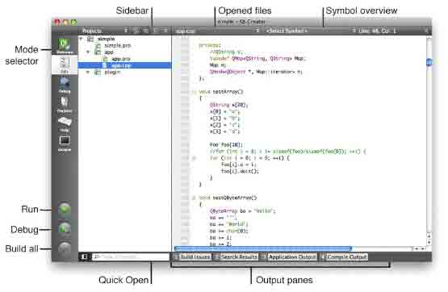

图 12-1 Qt Creator 布局架构

### 12.2.1 模式选择器（Mode Selectors）

Qt Creator 有 6 种工作模式可供开发者选择，分别是: Welcome, Edit, Debug, Projects, Help, 和 Output。

模式选择器允许开发者在处理不同的任务时可以快速的切换工作模式，比如编辑代码 、 浏览帮助、设置编译器环境等。在切换时，你可以通过在界面左边的模式选择器分栏上单击 鼠标左键，或者使用相对应的快捷键。当你使用特定模式下才有的动作时，也会使你自动切 换到相应的模式，比如当你依次单击菜单 Debug/Start Debugging 时，Qt Creator 将自动切 换到 Debug 模式下。

1.欢迎模式（ Welcome Mode ）

如图 12-2 所示，在该模式下 Qt Creator 显示一个欢迎屏幕。在这个模式下，你可以快 速的载入最近的人机对话或者是独立的项目 ，也可以向 Qt Creator 项目组提供反馈意见，甚 至加入到 Qt Creator 项目组中，成为其中的一员。

这个屏幕分为 3 个专栏：Getting Started、Develop 和 Community。在 Getting Started 专栏下，你可以学习 Qt Creator 的使用以及 Qt4 编程的相关知识和技能；在 Develop 专栏 下，你可以快速的恢复与 Qt Creator 的上一次对话过程，也可以打开新近使用的项目或者创 建一个新的项目；在 Community 专栏下，你可以获取 Qt Labs 网站上的新闻，也可以访问流 行的 Qt 站点。

当你在命令行下面调用 Qt Creator 时，在不附加额外的参数的情况下将进入到这个欢 迎模式下。

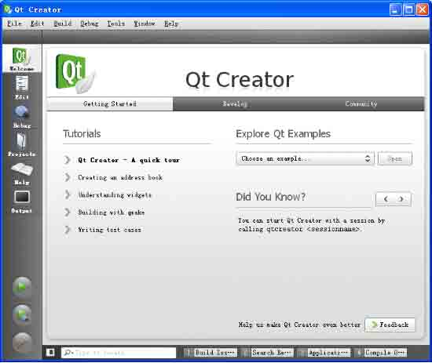

图 12-2 欢迎模式界面

2.编辑模式（ Edit Mode ）

如图 12-3 所示，在 Edit 模式下，你可以编辑项目和源代码文件，在模式选择器右边一 点的边栏（sidebar）上点击，你就可以在不同的文件中导航了。

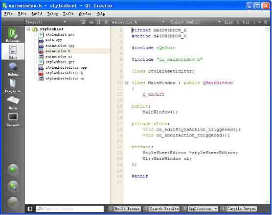

图 12-3 编辑模式界面

3.调试模式（ Debug Mode ）

如图 12-4 所示，Qt Creator 提供了多种不同的方式辅助程序员查看应用程序运行的状 态来调试程序。后面我们会结合具体例子讲解。

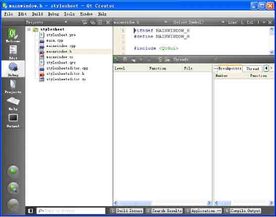

图 12-4 调试模式界面

4.项目模式（ Projects Mode ）

如图 12-5 所示，在项目模式下，首先你可以查看所有项目的列表，并可设置以哪一个 项目为当前的活动项目。然后可以选定项目，针对构建（build），运行（run）以及代码编辑 器等多个方面进行详细设置。

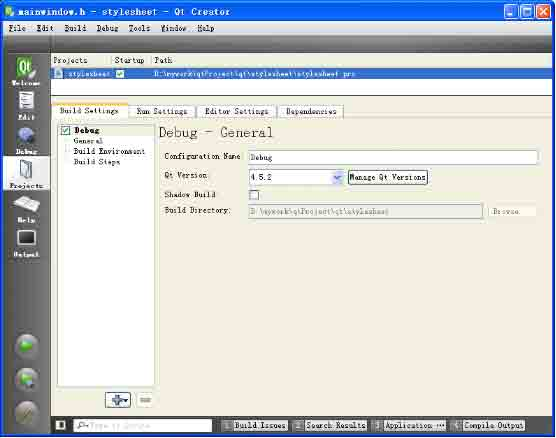

图 12-5 项目模式界面

5.帮助模式（ Help Mode）

如图 12-6 所示，主要是无缝集成了 Qt 的文档和示例中的相关内容，你可以不必另行打 开 Qt Assistant，就可以在 Qt Creator 的 Help 模式下获得帮助。

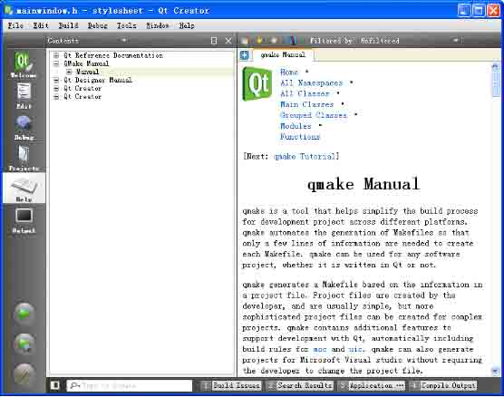

图 12-6 帮助模式界面

6.输出模式（Output Mode）

如图 12-7 所示，你可以在 Output 模式下，观察各种流程的细节，比如 qmake 以及应 用程序的编译、构建情况。这些信息你也可以再输出面板里面获得（ Output Panes）。

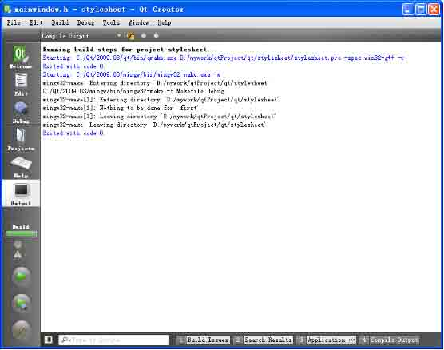

图 12-7 输出模式界面

### 12.2.2 输出面板（Output Panes）

Qt Creator 的输出面板主要由 4 个子面板组成，分别是： Build Issues, Search Results,Application Output,和 Compile Output。它们在所有的模式下均可以使用。

1.构建过程和结果（Build Issues）子面板

如图 12-8 所示，该面板主要显示与构建相关的信息，例如警告信息、错误信息等等， 并且指出了该产生该信息的具体位置以及可能的原因。

图 12-8 构建的流程与结果（Build Issues）

2.搜索结果（Search Results）子面板 该面板提供了执行搜索动作后的结果输出显示 ，搜索的范围可以是全局的，也可以是具体局部的，比如你可以在某一个指定的文档中搜索某个词组，也可以把范围扩大到所有项目或者是电脑上的硬盘目录等等。举例来说，我们在 TextFinder 目录下面搜索含有 “TextFinder”这个词，如图 12-9 所示即是搜索的结果显示。

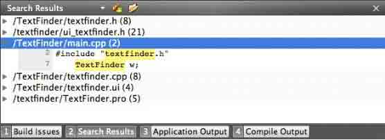

图 12-9 搜索结果（Search Results）

3\. 应用程序输出子面板

如图 12-10 所示，应用程序输出子面板显示了应用程序的运行状态 ，包括正常运行以及 Debug 模式下的信息，比如你可以在程序中调用 qDebug()函数来查看输出情况。

图 12-10 应用程序（构建结果）的输出（Application Output）

4\. 编译（Compile）子面板

如图 12-11 所示，编译子面板显示了所有来自编译器的输出信息 ，实际上它包含了更为 详细的输出信息，包括 Build Issues 子面板显示的信息。

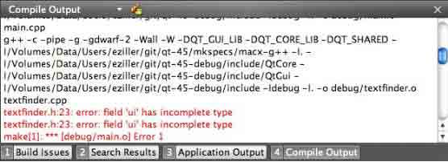

图 12-11 编译情况的输出（Compile Output）

### 12.2.3 代码编辑器（Code Editor）

代码编辑器辅助开发者创建、编辑代码，并可在其间导航。它具有代码高亮、代码自动完成、上下文提示以及内嵌代码错误指示等特性。

1\. 属性设置

可以依次点击【Tools】→【Options...】→【Text Editors】，来设置代码编辑器的各 种属性。

图 12-12 显示了如何设置 Font&Colors（字体和颜色）属性。


图 12-12 设置代码编辑器的字体颜色（Font&Colors）属性

图 12-13 显示了如何设置 Behavior（行为）属性。

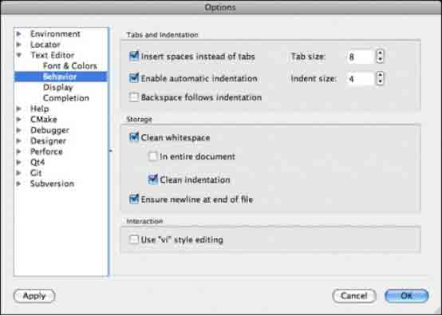

图 12-13 设置代码编辑器的行为（Behavior）属性

图 12-14 显示了如何设置 DisPlay（显示）属性。

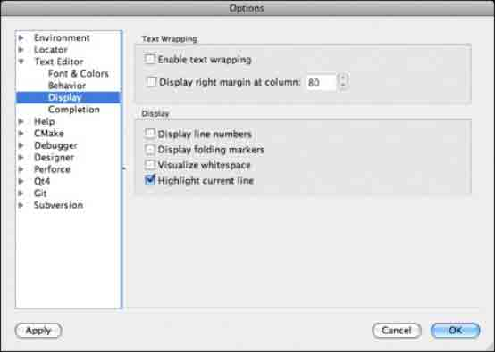

图 12-14 设置代码编辑器的展现（Display）等属性

图 12-15 显示了如何设置 Completion（代码完成）属性。

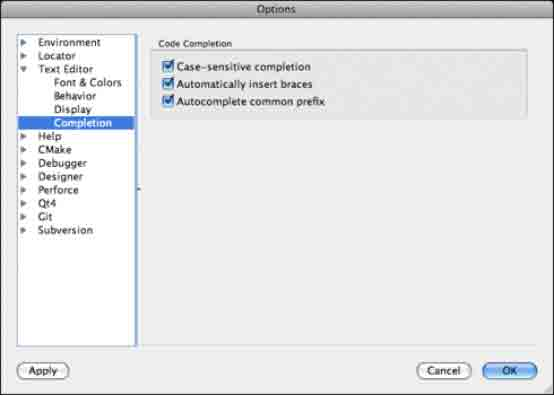

图 12-15 设置代码编辑器的自动完成（Completetion）等属性

2\. 快捷键

Qt Creator 的代码编辑器支持很多的快捷键，表列出了常用的一部分：

表 12-1 代码编辑器支持的快捷键

*   代码块间导航 Ctrl+[和 Ctrl+]，一般我们常用在比如在{}代码块间导航
*   选中代码块/取消选中代码块/选中上级代码块 Ctrl+U / Ctrl+Shift+U / 再次按下 Ctrl+U
*   向上/向下移动某行代码 Ctrl+Shift+Up / Ctrl+Shift+Down
*   代码自动完成 Ctrl+Space
*   格式化缩进 Ctrl+I
*   代码块折叠/展开 Ctrl+< / Ctrl+>
*   声明注释或取消注释 Ctrl+/
*   删除一行代码 Shift+Del
*   在类的头文件和实现文件间切换 F4
*   增大或缩小字体的大小 Ctrl 键+鼠标滚轮
*   在声明和定义之间转换 F2 和 Shift+F2 键适用于名字空间、类、方法、变量、宏等.
*   切换到外部的编辑器 依次点击菜单 Edit -> Advanced-> Open in external editor

3\. 代码完成功能（ Code Completion ）

当你在代码编辑器中输入某个词组时，系统会自动弹出一个上下文提示窗口 ，里面列举了可能符合你的意图的完整代码，这个上下文提示窗口又被称为是 “代码完成提示盒子”，其中常见的类别有类、名字空间、方法、变量、宏以及关键字等。表 12-2 显示了这些常见类别 以及所对应的图标。

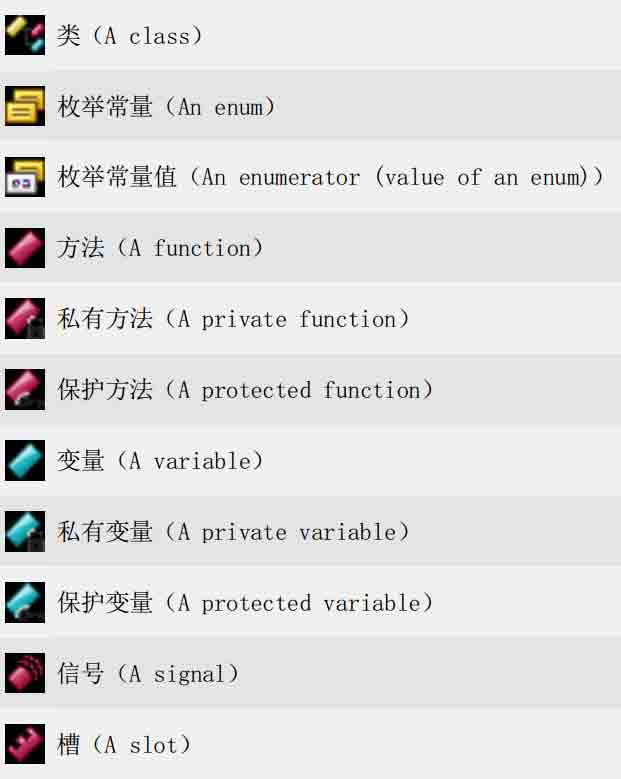

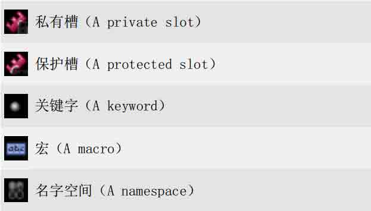

表 12-2 常见类别图标

### 12.2.4 会话管理器（ Session Management ）

在 Qt Creator 中，一个会话（session）指的是用户与 Qt Creator 交互的一次过程， 可以包括加载的项目、打开的文件以及代码编辑器的设置等等 。当你运行 Qt Creator 时，你 已经开启了一个的对话，Qt Creator 会将它记录下来。如图 12-16 所示，你可以依次点击【File】→【Session】→【Session Manager...】来创建和管理对话。

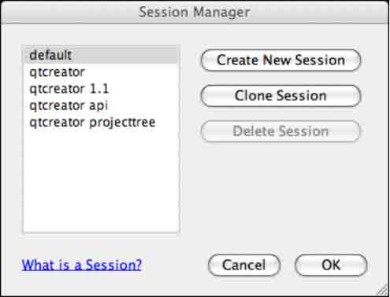

图 12-16 会话管理器

要在不同的对话间切换，你可以依次点击【File】→【Session】来切换实现，如图 12-17 所示。如果你没有创建新的对话，并且没有选择任何对话，那么 Qt Creator 将一直使用默认 的对话。

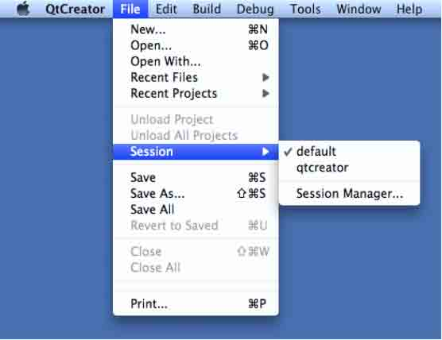

图 12-17 切换会话

### 12.2.5 Qt 帮助集成功能（ Qt Help Integration ）

在 Qt Creator 中使用帮助，有两种主要的方式，一种是随时按下 F1 键，一种是切换到 Help 模式下，Qt Creator 使用插件的方式将 Qt 的文档和示例集成进来。图 12-18 示例了使 用 F1 键的方式，你可以选中某个词或者类名，甚至整条句子等，然后按下 F1 键，在 Qt Creator 的右边将增加一个面板，在里面显示了文档中有关条款的内容。


图 12-18 查阅帮助

### 12.2.6 Qt 设计师集成功能（ Qt Designer Integration ）

如图 12-19 所示，在使用 Qt Creator 开发应用程序时，常见的用法是用鼠标左键双击.ui 文件，即可打开 Qt Creator 的 Qt Designer 集成功能。你可以看到，Qt Creator 已经与 Qt Designer 完全集成在一起了。这样你就可以在不单独运行 Qt Designer 时，在 Qt Creator 中完成应用程序界面的设计，并且与 Qt Creator 的项目管理以及其它功能在一起获得对 Qt 项目的完整把握。

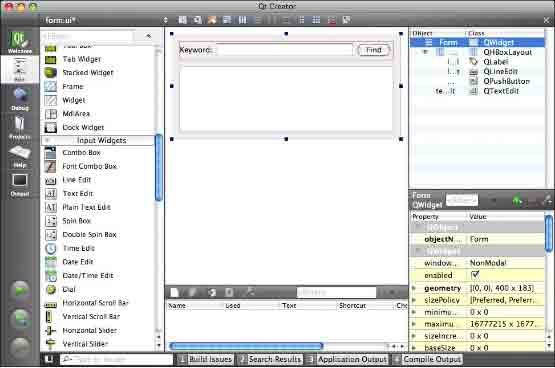

图 12-19 在 Qt Creator 中集成 Qt Designer

# 12.3 快捷键和常用技巧

## 12.3 快捷键和常用技巧

众所周知，有的开发者喜欢使用鼠标完成常用的操作 ，而有些开发者更喜欢使用键盘快捷键。Qt Creator 的操作简单明了，它为主要的功能提供了对应的快捷键组合以及导航 ，这将帮助开发者提高开发效率。

Qt Creator 提供了丰富的快捷键来辅助开发者加快开发进程 。下表中列出了常用的快捷键。

表 11-3 快捷键和常用技巧

| 功能 | 快捷键 |
| --- | --- |
| 激活 Welcome 模式（Activate Welcome mode） | Ctrl + 1 |
| 激活 Edit 模式（Activate Edit mode） | Ctrl + 2 |
| 激活 Debug 模式（Activate Debug mode） | Ctrl + 3 |
| 激活 Projects 模式（Activate Projects mode） | Ctrl + 4 |
| 激活 Help 模式（Activate Help mode） | Ctrl + 5 |
| 激活 Output 模式（Activate Output mode） | Ctrl + 6 |
| 查找（Find） | Ctrl + F |
| 查找下一个（Find next） | F3 |
| 回到代码编辑器（Go back to the code editor） | Esc |
| 跳转至代码的某一行（Go to a line） | Ctrl + L |
| 在页面间导航（Navigate between pages） | Alt + Left, Alt+ Right |
| 启动调试（Start debugging） | F5 |
| 停止调试（Stop debugging） | Shift + F5 |
| 在代码的声明和定义之间切换（Toggle code declaration and definition） | F2 |
| 在类的头文件和实现文件之间切换（Toggle header file and source file） | F4 |
| 切换到边栏（Toggle Side Bar） | Alt + 0 |
| 切换到 Build Issues 面板（Toggle Build Issues pane） | Alt + 1 |
| 切换到 Search Results 面板（Toggle Search Results pane） | Alt + 2 |
| 切换到 Application Output 面板（Toggle Application Output pane） | Alt + 3 |
| 切换到 Compile Output 面板（Toggle Compile Output pane） | Alt + 4 |

小贴士：就笔者的体会，把键盘与鼠标操作结合起来使用，往往效率最高，因此熟悉主要功 能的快捷键是很有必要的。但大家也不必强求自己非要掌握和使用哪种方式 ，只要熟能生巧， 顺其自然就好。

# 12.4 Qt Creator 构建系统的设置

## 12.4 Qt Creator 构建系统的设置

Qt Creator 的构建系统是建立在 qmake 和 make 基础之上的，设置 Qt Creator 的构建系 统，本质上就是对 qmake 和 make 进行设置，只不过是以图形界面形式完成。

对 Qt Creator 构建系统的设置，默认情况下其实是对 qmake 的设置，只不过 Qt Creator 为我们提供了 GUI 界面，使得这些工作变得简单和生动起来，这就需要切换到 Projects 模式， 方法是使用鼠标或者按下 Ctrl+4 组合键，当然前提是你已经打开了一个工程。如图 12-20 所示。


图 12-20 切换到 Projects 模式

默认情况下，Qt Creator 创建 debug 和 release 两个版本，它们都使用 Default Qt Version，每一个版本都有【General】、【Build Environment】、【Build Steps】三个分栏， 你可以在其中设置相关的内容。

在介绍如何设置之前，先了解几个常用术语。

表 11-4 常用术语

| 术语 | 含义 |
| --- | --- |
| Auto-detected | Qt 如果你在系统的 PATH 目录中设置了 Qt 的目录，那么 qmake 将自动发现这个版本，称为 Auto-detected Qt。 |
| Default | Qt 它默认就是 Auto-detected Qt。如果你在 PATH 中没有设置 Qt 的目录，那么 Qt Creator 将把自动寻找到的 Qt4 版本作为 Default Qt，并且你在创建新的工程时，将采用这个版本。你可以依次点击主菜单的 Tools -> Options -> Qt 4 -> Default Qt Version. 中查看 Default Qt。 |
| Project | Qt 这 是 你 的 具 体 项 目 采 用 的 Qt 版 本 。 你 可 以 通 过 依 次 点 击 Build&Run -> Build Settings -> Build Configurations 来查看并设置它。默认情况下，它等同于 Default Qt。 |
| Shadow Build | 它的机理类似于大家所熟悉的影子模式，可以命名为“以影子模式构建（项目）”采用这种模式构建时，将在 一个与你的项目的源代码目录不同的目录下进行，而你的工程源目录将是 “干净”的，不会有任何的改动。 当你的工程设置需要频繁变更时，使用影子模式以适应各种情况是最佳的选择。 |

在【General】标签页中，如图 12-20 所示，你可以为项目选择 Qt 的版本，要不要使用 Shadow Build 等。

在【Build Environment】标签页中，如图 12-21 所示，你可以为 Qt Creator 设置环境， 如常见的 PATH、QTDIR、LIB 变量等，当你使用 SDK 方式安装 Qt，安装程序会把这些环境为 你设置好，不必手动修改。

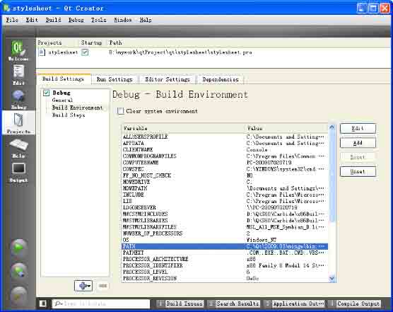

图 12-21 设置【Build Environment】标签页

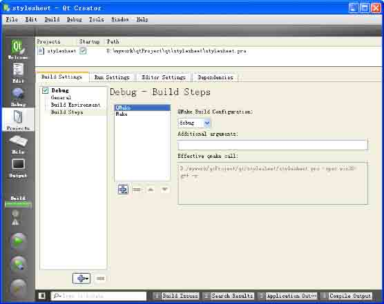

图 12-22 设置【Build Steps】标签页

在【Build Steps】标签页中，如图 12-22 所示，你可以为 Qt Creator 配置 qmake 和 make 的属性，更进一步的，你可以自定义编译的具体步骤。

# 12.5 处理项目间依赖关系（ Dependencies ）

## 12.5 处理项目间依赖关系（ Dependencies ）

如果你在一次对话中加载了多个项目，你就可以设置它们之间的依赖关系 ，这也将影响你的项目的构建顺序。具体做法是打开 Dependencies 标签页，在其中选中你的依赖，如图 12-23 所示，我们同时载入了两个项目： textfinder 和 stylesheet，并以 textfinder 工程 为当前工程（active project），点击 Dependencies 标签页，选中 stylesheet 前面的复选框，这时 textfinder 工程就以 stylesheet 为依赖了。

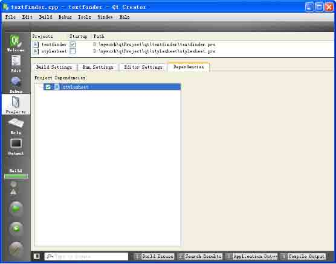

图 12-23 设置项目间的依赖关系

# 12.6 Qt 多版本共存时的管理

## 12.6 Qt 多版本共存时的管理

Qt Creator 允许使用多个 Qt4 版本，并且可以在不同的版本间快速切换。

当 Qt Creator 启动时，它首先会根据环境变量 PATH 中设定的目录寻找 Qt4，这个被自 动找出来的 Qt4 版本称作“Auto-detected Qt”。术语“version of Qt”指的通常也是 Auto-detected Qt。当然了，读者朋友如果只是安装了一个版本的 Qt4，并且准备只使用这 一种的话，只需要正确的设定 PATH 变量，而无需手动配置 Qt 的版本了（如果使用 SDK 方式 安装，就更为简便，Qt4 SDK 会自动设置环境变量），这一节就可以略过不看。 表 12-4 列出 了与此有关的常用术语，了解它们的含义很有必要。

此外，也可以自由的添加或删除不同的 Qt 版本。方法是依次点击菜单【Tools】→【Options...】→【Qt4】→【Qt Versions】，如图 11-24 所示，如果是在 Windows 平台上 使用 MinGW 作为编译器，那么需要告诉 Qt Creator 你的 MinGW 安装到了什么地方，当然如果是使用 SDK 方式安装的 Qt，则无这一步的必要。设置它的方法是依次点击 【Tools】→【Options...】→【Qt4】→【Qt Versions】→【MinGw Directory】。

如果编译安装 Qt 时是专为 Microsoft Visual C++的，那么 Qt Creator 将自动为你设置 好这些环境变量。

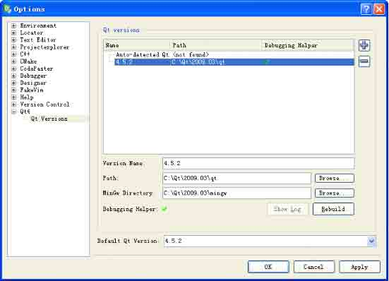

图 12-24 设置 Qt 的版本

小贴士: 上述这些设置也可以在上一节讲到的配置工程的构建系统中完成，请读者自行验 证。

# 12.7 使用定位器在代码间快速导航

## 12.7 使用定位器在代码间快速导航

Qt Creator 提供了一个定位器，它位于 Qt Creator 窗体的底部，它是一个智能的编辑 框（line edit）,你可以使用它在你的项目内部或硬盘上执行不同的定位（搜索）任务，如 可以定位文件、类、方法等等。与其它我们以前熟悉的 IDE 中的“搜索”器或定位器不同的 是，当你用鼠标左键在编辑框中点击时，它将弹出一个上下文窗口。如图 12-25 所示。

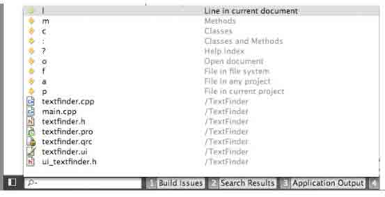

图 12-25 定位器的上下文窗口

### 12.7.1 如何定位文件

直接举例子吧，假设你想打开项目中 main.cpp 这个文件，那么你可以使用鼠标在定位 器上点击或者按下 Ctrl+K 键，在其中输入文件名即 main.cpp，然后按下回车键。Qt Creator 将使用代码编辑器打开它。你也可以不输入全称，而是输入关键字，或者加上 *和?这样的通 配符，这时定位器将会把所有符合条件的信息罗列出来，请你选择。在其中选择你满意的项 目，完成定位即可。

### 12.7.2 如何设置过滤条件

你可以为定位器设置许多不同的过滤条件 （Filters），这样你就可以执行各种不同的定位任务。下面列出了一些常用的过滤条件。

*   在你的硬盘上的任意文件（将通过文件系统查找）
*   在你定义的子目录结构中的文件
*   在你的工程文件（.pro）中提到的文件，如头文件、实现文件、资源文件、资源集 文件以及.ui 文件
*   任何打开的文档
*   在你的项目中的定义或引用的类或方法
*   在 Qt 文档中的帮助主题
*   在你的代码编辑器中的任意指定的一行代码

那么如何使用这些过滤条件呢，方法按下 Ctrl+K 键或者使用鼠标，激活定位器，然后输入冒号:，接着输入一个空格，在这个空格之后输入你的定位前缀 。举个例子，假如你需要定位 QDataStream 这个类的定义，那么就在激活定位器后，依次输入冒号、空格以及 QDataStream，如图 12-26 所示。定位器将为你列出找到的相关信息 ，选中其中的一项，按下回车键即可定位到 QDataStream 的定义，（也可使用鼠标操作，请读者自行验证）。如图 12-27 所示。

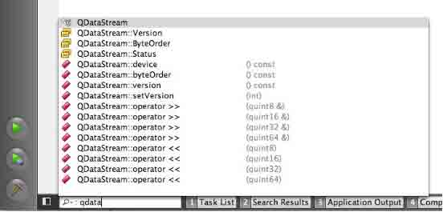

图 12-26 输入过滤条件

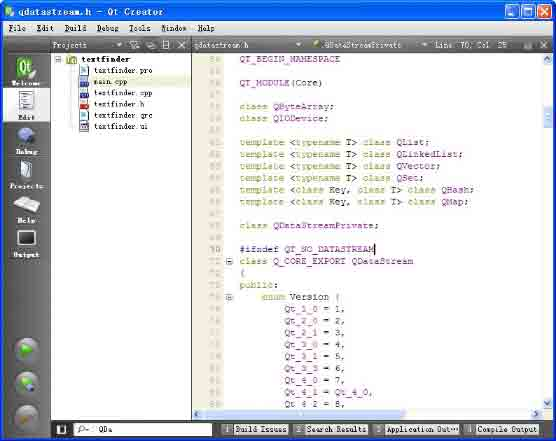

图 12-27 在代码编辑器中查看

如果你觉得系统内置的这些过滤条件不能满足你的要求，那么你可以自己定义一个 。方 法是用鼠标点击定位器上的那个用来搜索的 按钮，然后在弹出的上下文菜单上选择【Configure...】，如图 12-28 所示。

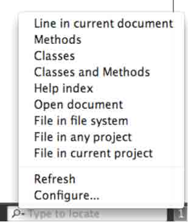

图 12-28 自定义过滤条件上下文菜单

接下来在弹出的对话框中点击【Add】按钮，创建一个新的过滤条件。这将弹出【Filter Configuration】对话框，如图 12-29 所示，为你的过滤条件起一个名字，选择搜索目录，设 置可能的文件后缀名，最后再设置关键字的前缀。

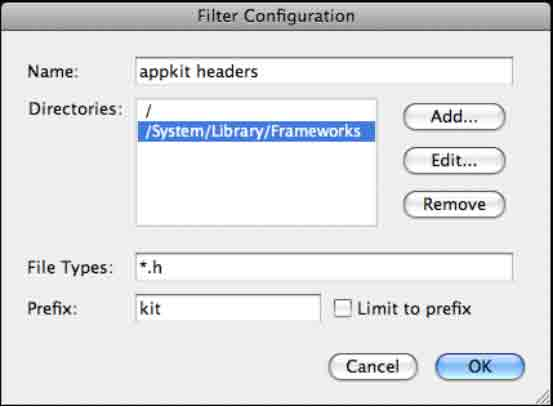

图 12-29 增加新的过滤条件

设置完成后，关闭这个对话框。定位器将按照你指定的过滤条件查找适合的信息并缓存 起来。但是定位器的前端显示还没有更新，所以你需要按图 12-28 所示的上下文菜单中的【Refresh】选项来完成后台缓存和前端显示的同步。

表 12-5 列出了常见过滤条件的操作方法以及示意的屏幕截图。

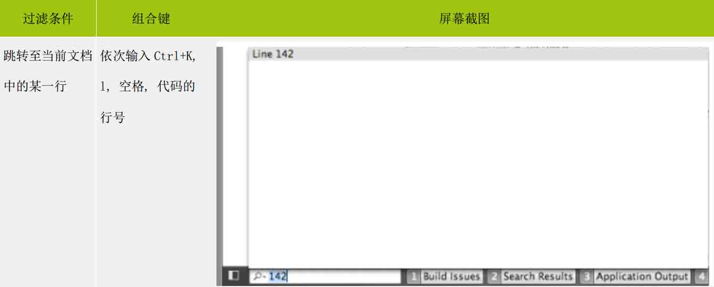 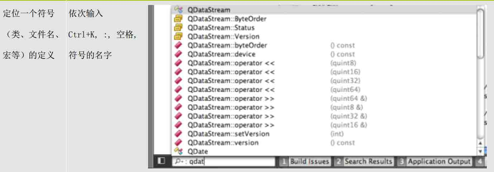 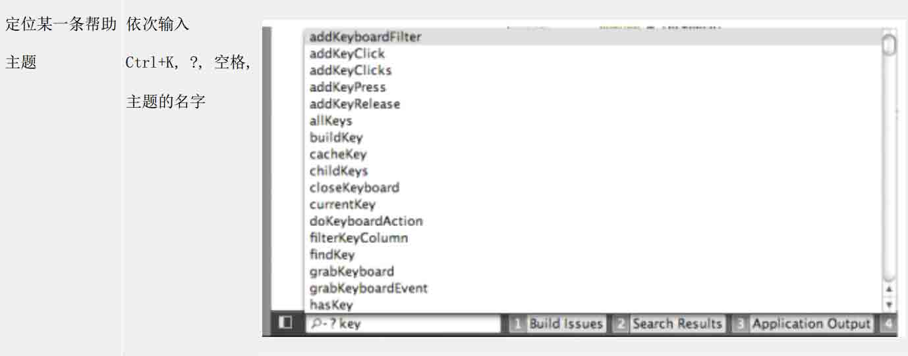 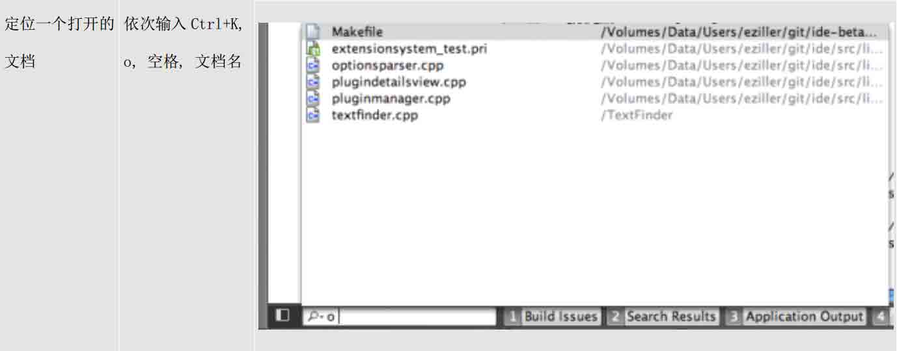 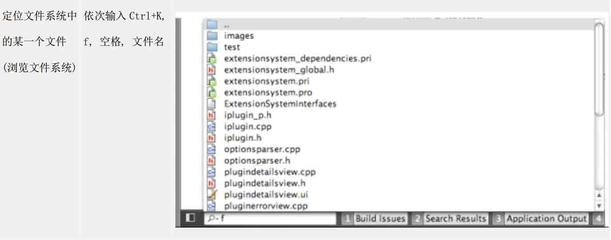 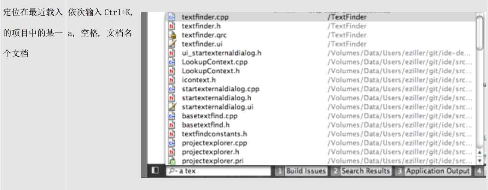 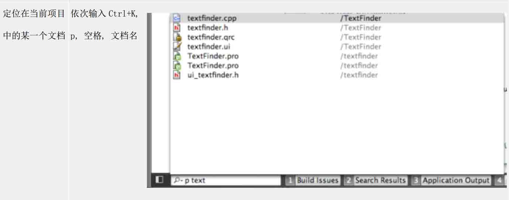 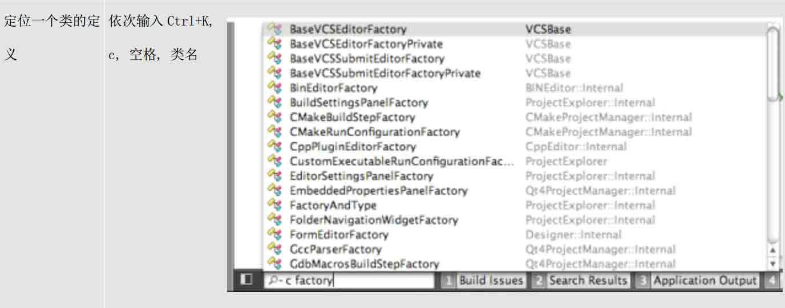 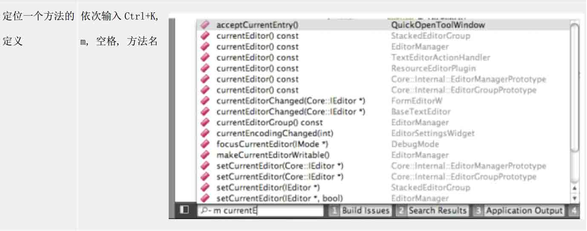

表 12-5 常见过滤条件的操作方法和示意图

# 12.8 如何创建一个项目

## 12.8 如何创建一个项目

第 1 步,创建项目 要创建一个新项目，可以依次点击菜单 【File】→【New...】→【Projects】，你可以创建下列几种项目类型:

*   Qt4 Console Application – 控制台应用程序
*   Qt4 Gui Application – GUI 应用程序（主要是含有界面布局的类型）
*   C++ Library – C++库

这里我们创建一个基于 Qt4 Gui Application 类型的例子，如图 12-30 所示，点击【OK】 按钮进入下一步。

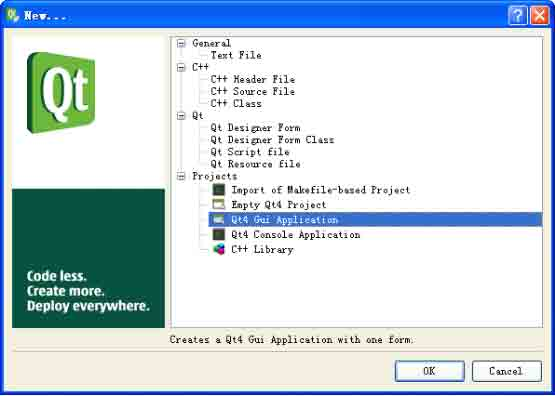

图 12-30 第 1 步 - 创建一个新的项目

第 2 步，设置项目名称和保存位置

接下来，如图 12-31 所示，我们设置项目的名称和路径。注意，项目的名称和路径中尽 量不要包含空格和其它特殊的字符，切记！设置完成后，点击 【Next】按钮进入下一步。

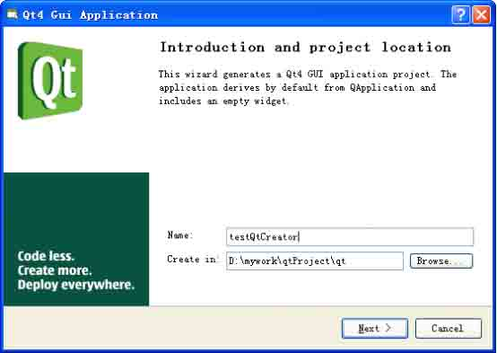

图 12-31 第 2 步 – 设置项目名称和存放位置

第 3 步，选择需要的 Qt 模块

如图 12-32 所示，在其中罗列的选项中勾选你需要的 Qt 模块，由于我们创建的是 GUI 应用程序，因此”Qt Core Moudle”和”Qt Gui Moudle”模块是默认必须选择的，其它的 可以根据需要选择。选择完后，点击 Next 按钮进入下一步。

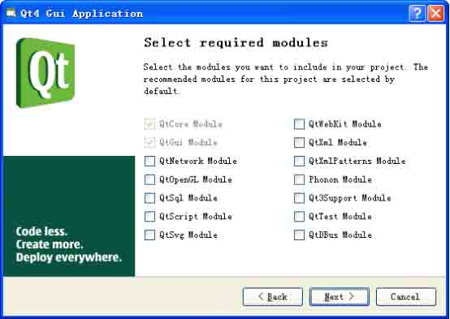

图 12-32 第 3 步 – 选择必需的 Qt 模块

第 4 步，指定类信息

如图 12-33 所示，这里最重要的是指定类的名称，类的头文件、实现文件以及 .ui 文件 的名称会随之改变。还有就是要指定你的类的基类，如 QMainWindow、QWidget 等，可以从下 拉列表框中选择。设置完成后，点击 Next 按钮进入下一步。

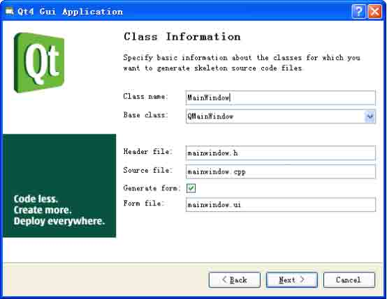

图 12-33 第 4 步 – 指定类信息

第 5 步，完成项目的创建

如图 12-34 所示，到了这一步，请仔细屏幕中列出的所有文件是否符合你的要求 ，如果 不符，可以点击 Back 按钮，回去重新设置。如果确认无误，点击 Finish 按钮完成项目的创 建。

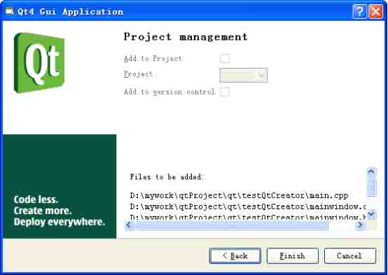

图 12-34 第 5 步 – 完成项目的创建

# 12.9 实例讲解

## 12.9 实例讲解

在本节中，我们以程序 textfinder 为例，向大家详细讲解使用 Qt Creator 创建应用程 序的全过程，我们将使用 Qt Creatro 创建工程和代码，并使用 Qt Designer 创建用户界面。 如果你对如何使用 Qt Designer 还不太熟悉的话，建议回头看看前几章。这个例子的运行效 果如图 12-35 所示。

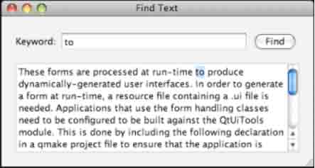

图 12-35 程序运行效果

### 12.9.1 程序运行内部机理

图 12-36 是笔者画的一个本程序的运行内部机理示意图 ，从中可以清晰的看到各个组件 式是如何配合起来完成程序运行的。

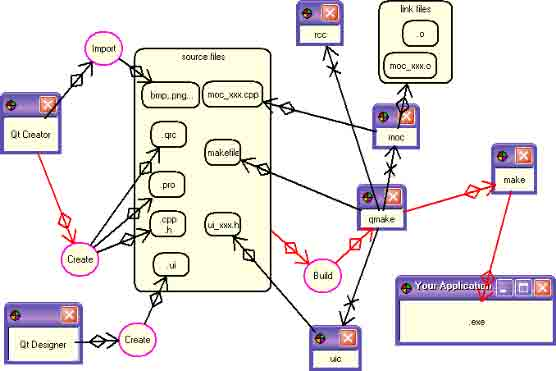

图 12-36 程序的内部机理

### 12.9.2 设置环境

在前面我们已经讲到，如果你是采用 SDK 安装的 Qt4，那么正常情况下，安装程序已经 自动为你设置好了所需的环境。如果你依次点击菜单【Tools】→【Options...】→【Qt4】， 却发现没有找到任何正确的 Qt 版本，那么你需要自行设置 Path 环境变量，这个步骤与平台 相关：

*   在 Windows 和 Linux 下面：依次点击菜单【Tools】→【Options...】→【Qt4】。
*   在 Mac OS X 上面：依次点击菜单【Qt4】→【Preferences】。 小贴士：如果你使用 Visual Studio 编译 Qt,再单独安装 Qt Creator，那么 Qt Creator 中 环境变量的设置与 Visual Studio 中将保持一致。

### 12.9.3 创建并组织项目

接下来按照上一节所述的步骤创建项目并组织好项目文件。注意这里我们要选择 QWidget 作为基类。在我们的项目中，应该包含如下文件：

*   textfinder.h
*   textfinder.cpp
*   main.cpp
*   textfinder.ui
*   textfinder.pro

其中，.h 和.cpp 文件包含了程序运行所必需的基本代码，而 .pro 文件已经完成了。在接下来的步骤中，我们将使用 Qt Designer 设计界面，并添加完成功能所必须的代码。

### 12.9.4 设计用户界面

在你的项目浏览器（Project Explorer）中双击 textfinder.ui ，将打开集成的 Qt Designer，在里面完成对用户界面的设计，并依照表 12-6 列出的内容设置各个元素的属性，完成后的情形如图 12-37 所示。

表 12-6 界面元素属性

| 窗口部件 | 名称（objectName） |
| --- | --- |
| QLabel | 无 |
| QLineEdit | lineEdit |
| QPushButton | findButton |
| QTextEdit | textEdit |
| QGridLayout | 无 |
| QVBoxLayout | 无 |

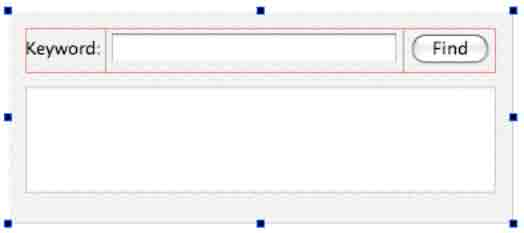

图 12-37 界面布局

该界面元素的布局方式如下：Keyword 标签和旁边的 lineEdit 以及最右边的 Find 按钮 使用 QGridLayout 组合，再与下面的 textEdit 使用 QVBoxLayout 组合。

### 12.9.5 头文件

接下来我们看看 textfinder.h 这个头文件时怎样写的。由于我们的用户界面只有一 个，所以决定采用单继承的方式使用 .ui 文件，这就需要添加一个私有的成员变量： Ui::TextFinder *ui；我们需要添加一个私有的槽函数，以执行查找操作，它是 on_findButton_clicked()；我们还需要一个私有成员函数 loadTextFile()，用来读取并显 示我们在文本框中输入的文本文件的内容。以下是头文件中这部分的代码：

```cpp
private slots:
    void on_findButton_clicked();
private:
    Ui::TextFinder *ui;
    void loadTextFile(); 
```

### 12.9.6 实现文件

现在我们看看如何书写实现文件，这其中的关键是 loadTextFile()方法：

```cpp
void TextFinder::loadTextFile()
{
    QFile inputFile(":/input.txt");
    inputFile.open(QIODevice::ReadOnly);
    QTextStream in(&inputFile);
    QString line = in.readAll();
    inputFile.close();
    ui-&gt;textEdit-&gt;setPlainText(line);
    QTextCursor cursor = ui-&gt;textEdit-&gt;textCursor();
    cursor.movePosition(QTextCursor::Start, QTextCursor::MoveAnchor, 1);
} 
```

在上面这段代码中，我们首先使用一个 QFile 类的对象来加载文本文件，并使用 QTextStream 来读取它的内容，最后使用 setPlainText()方法来显示它。在实现文件开头要 加入下面的头文件声明：

```cpp
#include &lt;QtCore/QFile&gt;
#include &lt;QtCore/QTextStream&gt; 
```

在 on_findButton_clicked()中，我们获得了搜索的字符串并使用 find()方法在整个文本文 件中搜索该字符串，下面是实现代码：

```cpp
void TextFinder::on_findButton_clicked()
{
    QString searchString = ui-&gt;lineEdit-&gt;text();
    ui-&gt;textEdit-&gt;find(searchString, QTextDocument::FindWholeWords);
} 
```

这之后，我们需要在类的构造函数中调用 loadTextFile()这个方法，注意它应放在 setupUi()方法的后面，切记！

```cpp
TextFinder::TextFinder(QWidget *parent)
: QWidget(parent), ui(new Ui::TextFinder)
{
    ui-&gt;setupUi(this);
    loadTextFile();
} 
```

由于我们对槽函数的命名方式符合“自动关联”的规则，所以 on_findButton_clicked()槽 会被自动调用。我们在本书的前几章讲过，这是由于 uic 工具生成的 ui_textfinder.h 文件中加 入了下面这行代码的缘故，这里再次提出以加深印象。

```cpp
QMetaObject::connectSlotsByName(TextFinder); 
```

### 12.9.7 资源集文件

我们需要一个资源集文件（.qrc）来描述程序用到的资源，以前我们介绍的主要是如何 加入图标、图像文件，这次看看如何加入文本文件。其实方法是类似的，在项目浏览器（Project Explorer）中右键点击项目，在上下文菜单中选择【Add New ...】 →【Qt】→【Qt Resource File】，将弹出【New Resource file】对话框。

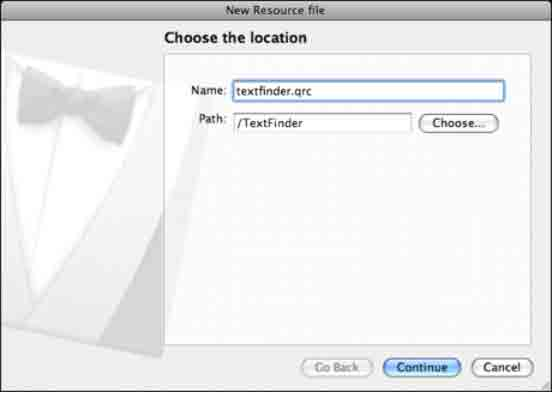

图 12-38 New Resource file 对话框

如图 12-38 所示，填入文件名字和路径，然后点击 Continue 按钮,进入下一步。

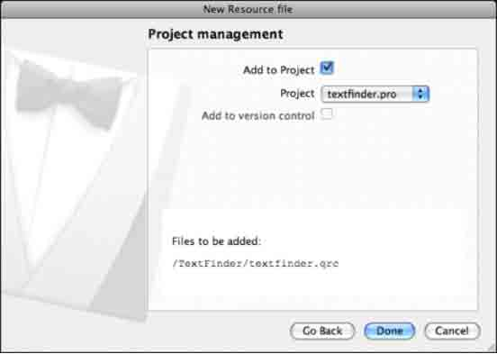

图 12-39 选择工程并加入文件

如图 12-39 所示，选中一个项目以加入资源集文件，这里是 textFinder，并确保选中【Add to Project】，然后点击【Done】按钮。

如图 12-40 所示，你的资源集文件将被资源编辑器（ Resource Editor）打开并显示出 来，首先点击【Add】按钮，在下拉项中选择【Add Prefix】,这将添加一个斜线；接下来再 次点击【Add】按钮，这次选择【Add File】,找到 input.txt 文件的位置并添加它。

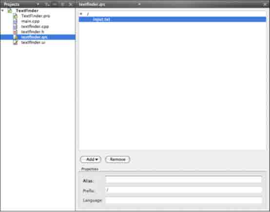

图 12-40 编辑资源集文件

### 12.9.8 编译运行程序

现在，所有必需的文件和准备工作都已完成，你可以按下 Ctrl+R 组合键或者点击 图标来编译运行你的程序了，程序运行的效果大致如图 12-35 所示。

# 12.10 使用 Qt Creator 调试程序

## 12.10 使用 Qt Creator 调试程序

Qt Creator 集成了强大的调试器，提供了丰富多样的调试功能和选项，足以满足开发者 的需要。

### 12.10.1 调试器引擎

Qt Creator 本身并没有调试器，它必须借助其它的调试器引擎，并为它们提供了一个图 形化的前端界面。表 12-7 示出了在所支持的平台上，Qt Creator 使用的调试器。

表 12-7 Qt Creator 使用的调试器引擎

| 平台 | 编译器 | 调试器引擎 |
| --- | --- | --- |
| Linux, Unixes, Mac OS | gcc | GNU Symbolic Debugger (gdb) |
| Windows/MinGW | gcc | GNU Symbolic Debugger (gdb) |
| Windows | Microsoft Visual C++ | Compiler Debugging Tools for Windows/Microsoft Console Debugger (CDB) |

在 Qt Creator 中，你可以使用调试器前端界面逐行单步或逐过程调试程序，设置断点 ，检查堆栈中的内容，查看局部或全局变量的值等等，这些和我们常见的调试器提供的功能并无二致。而上述的原生信息，Qt Creator 会以清晰、简明的方式展现给程序员，这将使得原 本令人生畏的调试工作变得简单而有趣。

除了像堆栈查看器、局部变量和观察器、寄存器查看器等这些主流 IDE 都会提供的功能 外，Qt Creator 还提供了许多的功能以帮助开发者提高效率。由于调试器前端对 Qt 的内部 机制了如指掌，所以当程序出现问题时，它能够明晰描述症状。

表 12-8 示出了这些调试器引擎在单独安装时的一些需要注意的事项。

表 12-8 调试器引擎的相关信息

| 调试器引擎 | 注意事项 |
| --- | --- |
| GDB（X11 平台） | 需要 GDB6.8 或以上版本 |
| GDB 或 CDB | 可以从 Microsoft Developer Network 上自由下载 CDB，版本 6.10 以上，注意区分 32 位和 64 位版；（Windows 平台） 如果在 Windows 上使用 SDK 方式安装 Qt4 开源版，那么仍将使用 GDB 作为调试器引擎；如果使用 Microsoft Visual C++的编译器编译安装 Qt Creator，那么将使用 CDB 作为调试器引擎,并且默认情 况下，Qt Creator 将会检查%ProgramFiles%\Debugging Tools for Windows 这个路径下是否包含了所有需要的 调试器引擎的头文件。 |

### 12.10.2 与调试器交互

在 Debug 模式下时，Qt Creator 提供了许多的锚接窗口来辅助开发者与程序进行交互 。 常见的一些被设置为缺省可见的，不常使用的则缺省被隐藏。你可以依次点击【Debug】 →【View】来配置它们的显隐。

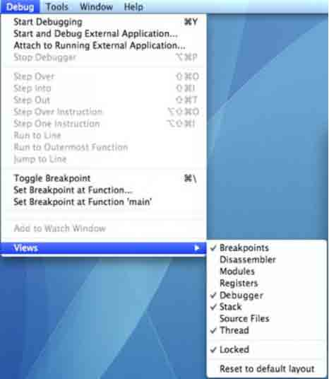

图 12-41 设置常见辅助视图的显隐

如图 12-41 所示，你可以通过点击【Locked】菜单项来锁住或解锁你的锚接窗口的布局 ， 就像设置这些锚接窗口的显隐一样。你的锚接窗口的位置将被 Qt Creator“记住”，下次启 动时它将根据上次的记忆来布局。

### 12.10.3 断点

你可以在断点视图（ Breakpoints view ）中查看断点。无论你的程序是否在运行和 调试中，断点视图都是默认并且随时可见的 。如图 12-42 所示，你可以在【Breakpoints】视图中查看断点设置的情况。图 12-43 显示了详细的断点信息。

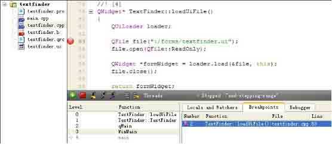

图 12-42 在【Breakpoints】视图中查看断点


图 12-43 断点的详细信息

所谓断点，就是由程序开发者设定的一系列条件 ，但程序以调试方式运行时，一旦符合 引发断点的“条件”，程序便中断执行，此后程序开发者便可以检视程序在运行时的状态 ，继 而控制程序的运行，直至找出问题所在。

在 Qt Creator 中，我们通常可以把断点与源代码文件或者其中的某一行关联起来，也 可以把它放在某个方法的起始处（通常指定义处 ）。下面是设置断点的具体“规则”：

*   在某一行代码设置断点--在代码行行号的左边缘处点击鼠标左键或者按下 F9 键（在 Mac OS X 系统中是 F8 键）
*   在某一个函数处设置断点—依次点击菜单【Debug】 ->【Set Breakpoint at Function... 】，在其中输入函数的名字

你可以这样去掉一个断点：

*   在代码编辑器内断点标识处用鼠标左键再次点击
*   在断点视图中选中某个断点，并按下 Delete 键
*   在断点视图内点击鼠标右键，在弹出的上下文窗口中选择 【Delete Breakpoint】 小贴士：断点可以在任意时刻设置-在程序开始调试之前和正在调试之时均可。断点的设置 也会作为一部分被当前的会话所保存。

### 12.10.4 程序的调试运行

要在调试模式下启动运行一个 Qt 应用程序，你可以依次点击菜单项【Debug】 →【Start Debugging】，或者按下 F5 键即可。Qt Creator 将检查程序代码或设置是否有更新，并在必要时重新编译项目，然后调试器将接管并启动程序的运行。

提示：Qt 应用程序在调试模式下启动运行时，往往需要一段时间，从几秒到若干分钟 不等，这取决于你的机器的配置以及程序的复杂程度（比如应用了 QtWebKit 模块的程序可能 要多花费一些时间）。

当程序调试运行未遇到断点时，它与直接运行状态并无区别。开发者可以依次点击菜单 项【Debug】 →【Interrupt】或者直接按下如图所示的调试器状态栏上的 【Interrupt】按 钮来中断程序的运行，这与程序在运行时遇到断点而停下来的效果是一样的 ,如图 12-44 所 示。


图 12-44 调试器状态栏上的【Interrupt】按钮

当程序中断时，Qt Creator 将做如下的事情：

*   获得程序中断处在堆栈中的地址
*   获得局部变量的值
*   检视并更新观察器（Watchers）视图内容

更新 Registers 、Modules 以及 Disassembler 视图 这时我们可以在 Debugger 视图中检视到程序更为详细的状态。

要结束调试状态，可以按下 Shift+F5 键。按下 F10 键可以进入逐行调试状态，按下 F11 键进入逐过程调试状态，按下 F5 键可以使程序运行到下一个断点处，如果后面没有断点了， 程序将完整的运行起来，这种情况仍然是在调试状态下的运行。

### 12.10.5 堆栈视图（Stack View）

当被调试的程序在断点处中断时，Qt Creator 将在堆栈视图中显示出程序到达断点处之 前所经历的那些函数。这些函数对应到被称作是“堆栈框架节点”，每一个节点对应一个函数。 如图 12-45 所示，Qt Creator 显示了这些函数所在的文件名、在源代码里面的行号。

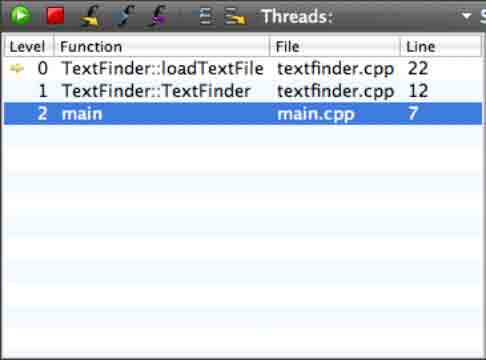

图 12-45 堆栈视图

有些情况下，不是所有的框架节点都能够准确的对应到源代码中的一个位置 ，因而也就 没有相应的调试信息，这些调试框架将被灰色显示。

当你在堆栈视图里面显示的某一行处使用鼠标左键双击时 ，代码编辑器将跳转至相应的 代码行，Qt Creator 将更新局部变量和观察器视图，就像把断点设置到这个地方而程序正好 在这里中断时的情形一样。

### 12.10.6 线程视图（Thread View）

当我们调试一个多线程应用程序时，如图 12-46 所示，线程视图（thread view）和调 试器状态栏上的”Thread”组合框（见图 12-47）被用来在不同线程间切换，这时堆栈视图（stack view）也将会随着做出相应的调整。


图 12-46 线程视图


图 12-47 调试器状态栏上的 Thread 组合框

### 12.10.7 局部变量和观察器视图（Locals and Watchers View）

当程序在调试器的控制下中断时，Qt Creator 将取得堆栈里面的最上层框架节点的相关 信息并把它们显示在局部变量和观察器视图里面。

局部变量和观察器视图通常由一个树形结构组成 ，里面有许多的一级节点，第二级节点 等等层次的数据，比如数据结构和类等信息就不是显示在第一级节点里面的。要查看更为详 细的信息，可以逐级点开这些节点前面的 “+”号。

你也可以在局部变量和观察器中更改变量的内容（比如常见的 int 和 float 值），以界 定你想确定的变量值的限值。这可以通过双击 ”Value”栏，并在可编辑区填入你的新的取 值，然后按下回车键（Enter 或 Return 键），之后再接着调试程序。

小贴士：你对观察器里面项目的设置将被保存到这次会话里面 ，下次打开对话时，这些设置 仍然有效。

### 12.10.8 模块视图（Modules Views）

默认情况下，模块视图也是不显示的。它的主要作用是使开发者了解程序中用到了那些模块，严格意义上来说，它不应该是在调试模式下才有的功能。一个常见的模块视图如图 12-48 所示。

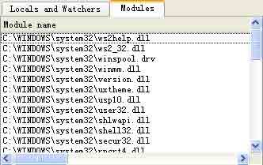

图 12-48 模块视图

### 12.10.9 反汇编和视图（Disassembler View）和寄存器视图（Registers View）

默认情况下，反汇编视图和寄存器视图是隐藏的。反汇编视图显示了断点处所在的函数的反汇编代码，如图 12-49 所示；寄存器视图显示了当前 CPU 的寄存器的状态，如图 12-50 所示，当你需要对程序的底层（与系统硬件接触）进行检视和控制时，这两个视图尤其有用。 当我们使用逐过程调试的方法时，经常会用到它们。

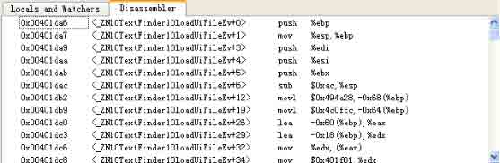

图 12-49 反汇编视图

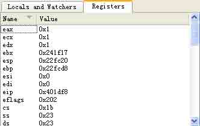

图 12-50 寄存器视图

### 12.10.10 程序调试实例

在我们的这个 TextFinder 例子里面，我们要使用 QString 读取一个文本文件，然后再 用一个 QTextEdit 把它的内容显示出来。在其中我们定义了一个 QString 类型的变量 line， 然后在附近设置一个断点，用来查看 line 变量的内容，请大家跟着我的步骤进行调试。

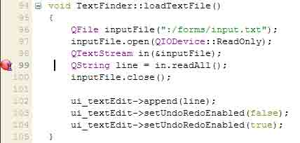

图 12-51 设置断点

首先是设置断点，如图 12-51 所示，将光标移动到选定的位置，按下 F9 键，或者在行号前点击鼠标左键完成断点的设置。然后按下 F5 键，启动调试。

如图 12-52 所示，在调试模式（Debug Mode）下,我们可以在断点视图（Breakpoints View）中查看已经设置的断点情况。要取消断点，可以再次点击 F9 键。

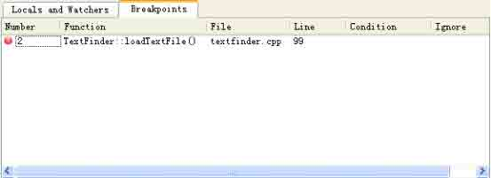

图 12-52 查看断点设置情况

可以在局部变量和观察器视图中查看变量的内容，如图 12-53 所示，显示了 line 等变 量的内容。

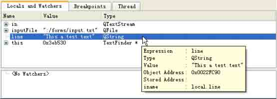

图 12-53 查看 line 变量的内容

下面是我们的程序中的槽函数 on_findButton_clicked()的代码，我们将修改代码中的 部分内容，形成一个小的逻辑错误，然后示范调试的步骤。原始正确的代码如下：

```cpp
QString searchString = ui_lineEdit-&gt;text();
QTextDocument *document = ui_textEdit-&gt;document();
bool found = false;
if (isFirstTime == false)
    document-&gt;undo();
if (searchString == "")
{
    QMessageBox::information(this, tr("Empty Search Field"),
        "The search field is empty. Please enter a word and click Find.");
}
else
{
    QTextCursor highlightCursor(document);
    QTextCursor cursor(document);
    cursor.beginEditBlock();
    QTextCharFormat plainFormat(highlightCursor.charFormat());
    QTextCharFormat colorFormat = plainFormat;
    colorFormat.setForeground(Qt::red);
    while (!highlightCursor.isNull() && !highlightCursor.atEnd())
    {
        highlightCursor = document-&gt;find(searchString, highlightCursor,
        QTextDocument::FindWholeWords);
        if (!highlightCursor.isNull())
        {
            found = true;
            highlightCursor.movePosition(QTextCursor::WordRight,
            QTextCursor::KeepAnchor);
            highlightCursor.mergeCharFormat(colorFormat);
        }
    }
    cursor.endEditBlock();
    isFirstTime = false;
    if (found == false)
    {
        QMessageBox::information(this, tr("Word Not Found"),
            "Sorry, the word cannot be found.");
    }
} 
```

我们将第 6 行改为：

```cpp
if (searchString != "") 
```

大家注意，改动之处是把 比较运算符==变成了!=，这时运行程序，无论你输入任何有效的字符，程序的运行结果总是与你的预期相反。那么就需要设置断点，调试程序了。在第 一行处按下 F9 键，然后按下 F5 键开始调试，如图 12-54 所示，使用鼠标点击调试器工具栏 上的常用按钮或者按下对应的快捷键，执行逐行调试或逐过程调试均可，如图 11-54 所示。 程序单步执行到第 6 行时，你将会发现这个逻辑错误。把它更正过来，再次调试程序即可 。

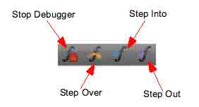

图 12-54 调试器工具栏

至此，关于 Qt Creator 的使用的介绍就结束了。要想掌握好 Qt Creator，使之成为你 的左膀右臂，就需要多实践，多总结。

# 12.11 问题与解答

## 12.11 问题与解答

问：如何在各个模式间快速切换？

答：可以使用 Ctrl+1, Ctrl+2 这样的组合快捷键来切换模式。 问：如何在命令行使用 Qt Creator 并打开工程？ 可以通过在命令行输入如下命令来调用 Qt Creator 并打开工程： Qt Creator xxx.pro

问：如何显隐边栏（sidebar）？

在 Edit 和 Debug 模式下，你可以通过按下 Ctrl+0 组合键来显隐边栏。 问：Qt Creator 是否支持不使用 qmake 创建的工程呢？

答：从 Qt Creator 1.1 版（包含在 Qt 4.5.1 中）开始，就可以支持其它的通用工程了（即不是使用 qmake 或 CMake 创建的工程），这时候，Qt Creator 将仅仅作为一个代码编辑 器使用。你可以在 Project Settings 页面下设置你要使用的编译系统。

问：我的程序代码没有问题（经过检查了 ），为什么我在调试时发现某些变量的值在有 时候变得非常奇怪，而到最后又好了。

答：gdb，以及采用它作为调试器引擎的 Qt Creator 的相应版本对 Linux 和 Mac OS X 平台上应用程序的编译做了优化。由于这些优化措施可能会导致函数过程的重组甚至会移动 某些局部变量在堆栈或堆中的位置。所以，你在局部变量和观察器视图中可能会看到某些远 离期望值的代码。，由于 gcc 对运行时正在初始化的局部变量并没有提供足够的调试信息 ，所 以有时候你在 Qt Creator 的局部变量和观察器中查看某个变量的值时 ，发现系统提示“超出 范围”。

# 12.12 总结与提高

## 12.12 总结与提高

Qt Creator 是 Qt4 应用开发中的首选 IDE。本章采用图文结合的形式，全面讲解了 Qt Creator 的使用方法和步骤。这些内容都是在项目开发中经常用到的必会技能，希望读者朋 友熟练掌握。

Qt Creator 还有许多高级的功能，比如如何使用 CMake（而不是使用 qmake）构建项目、 如何在其中使用版本控制软件等等，它们已经超出了本书的范围，有兴趣的读者可以有针对性学习这些内容。