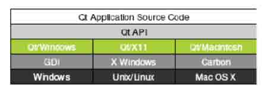

# 第十三章 Qt 核心机制与原理

# 第十三章 Qt 核心机制与原理

**本章重点**

*   了解 Qt 和 C++的关系
*   掌握 Qt 的信号/槽机制的原理和使用方法
*   了解 Qt 的元对象系统
*   掌握 Qt 的架构
*   理解 Qt 的事件模型，掌握其使用的时机

信号与槽、元对象系统、事件模型是 Qt 机制的核心，如果您想要掌握 Qt 编程，就需 要对它们有比较深入的了解。本章重点介绍了信号与槽的基本概念和用法、元对象系统、 Qt 的事件模型，以及它们在实际使用过程中应注意的一些问题。

# 13.1 Qt 对标准 C++的扩展

## 13.1 Qt 对标准 C++的扩展

标准 C＋＋对象模型为面向对象编程提供了有效的实时支持，但是它的静态特性在一 些领域中表现的不够灵活。事实上， GUI 应用程序往往对实时性和灵活性都有着很高的要 求。Qt 通过其改进的对象模型在保持 C＋＋执行速度的同时提供了所需要的灵活性。

Qt 相对于标准 C＋＋增添的特性主要有以下体现：

*   支持对象间通信信号与槽机制
*   支持可查询和可设计的动态对象属性机制
*   事件和事件过滤器
*   国际化支持
*   支持多任务的定时器
*   支持按层检索的对象树
*   受保护指针
*   动态类型转换

这些内容是 Qt 核心机制的重要组成部分，在下面的章节中，笔者将有选择的向大家介 绍它们。

# 13.2 信号与槽

## 13.2 信号与槽

信号和槽机制是 Qt 的核心机制之一，要掌握 Qt 编程就需要对信号和槽有所了解。信号和槽是一种高级接口，它们被应用于对象之间的通信，它们是 Qt 的核心特性，也是 Qt 不同于其它同类工具包的重要地方之一。

在我们所了解的其它 GUI 工具包中，窗口小部件(widget)都有一个回调函数用于响应 它们触发的动作，这个回调函数通常是一个指向某个函数的指针。在 Qt 中用信号和槽取代 了上述机制。

1.信号（signal）

当对象的状态发生改变时，信号被某一个对象发射（ emit）。只有定义过这个信号的类或者其派生类能够发射这个信号。当一个信号被发射时，与其相关联的槽将被执行，就象一个正常的函数调用一样。信号-槽机制独立于任何 GUI 事件循环。只有当所有的槽正确返 回以后，发射函数（emit）才返回。

如果存在多个槽与某个信号相关联，那么，当这个信号被发射时，这些槽将会一个接 一个地被执行，但是它们执行的顺序将会是不确定的，并且我们不能指定它们执行的顺序。

信号的声明是在头文件中进行的，并且 moc 工具会注意不要将信号定义在实现文件 中。Qt 用 signals 关键字标识信号声明区，随后即可声明自己的信号。 例如，下面定义了 几个信号：

```cpp
signals:
void yourSignal();
void yourSignal(int x); 
```

在上面的语句中，signals 是 Qt 的关键字。接下来的一行 void yourSignal(); 定义了信号 yourSignal，这个信号没有携带参数；接下来的一行 void yourSignal(int x);定义 了信号 yourSignal(int x)，但是它携带一个整形参数，这种情形 类似于重载。

注意，信号和槽函数的声明一般位于头文件中，同时在类声明的开始位置必须加上 Q_OBJECT 语句，这条语句是不可缺少的，它将告诉编译器在编译之前必须先应用 moc 工具 进行扩展。关键字 signals 指出随后开始信号的声明，这里 signals 用的是复数形式而非 单数，siganls 没有 public、private、protected 等属性，这点不同于 slots。另外， signals、slots 关键字是 QT 自己定义的，不是 C++中的关键字。

还有，信号的声明类似于函数的声明而非变量的声明，左边要有类型，右边要有括 号，如果要向槽中传递参数的话，在括号中指定每个形式参数的类型，当然，形式参数的个 数可以多于一个。

从形式上讲,信号的声明与普通的 C++函数是一样的，但是信号没有定义函数实现。另 外，信号的返回 类型都是 void，而 C++函数的返回值可以有丰富的类型。

注意，signal 代码会由 moc 自动生成，moc 将其转化为标准的 C++语句，C++预处理 器会认为自己处理的是标准 C++源文件。所以大家不要在自己的 C++实现文件实现 signal。

2.槽（slot）

槽是普通的 C++成员函数，可以被正常调用，不同之处是它们可以与信号（ signal）相 关联。当与其关联的信号被发射时，这个槽就会被调用。槽可以有参数，但槽的参数不能有 缺省值。

槽也和普通成员函数一样有访问权限。槽的访问权限决定了谁可以和它相连。 通常， 槽也分为三种类型，即 public slots、private slots 和 protected slots。

public slots：在这个代码区段内声明的槽意味着任何对象都可将信号与之相连接。 这对于组件编程来说非常有用：你生成了许多对象，它们互相并不知道，把它们的信号和槽 连接起来，这样信息就可以正确地传递，并且就像一个小孩子喜欢玩耍的铁路轨道上的火车 模型，把它打开然后让它跑起来。

protected slots：在这个代码区段内声明的槽意味着当前类及其子类可以将信号与之 相关联。这些槽只是类的实现的一部分，而不是它和外界的接口。

private slots：在这个代码区段内声明的槽意味着只有类自己可以将信号与之相关 联。这就是说这些槽和这个类是非常紧密的，甚至它的子类都没有获得连接权利这样的信 任。

通常，我们使用 public 和 private 声明槽是比较常见的，建议尽量不要使用 protected 关键字来修饰槽的属性。此外，槽也能够声明为虚函数。

槽的声明也是在头文件中进行的。例如，下面声明了几个槽：

```cpp
public slots:
void yourSlot();
void yourSlot(int x); 
```

注意，关键字 slots 指出随后开始槽的声明，这里 slots 用的也是复数形式。

3.信号与槽的关联

槽和普通的 C++成员函数几乎是一样的－可以是虚函数；可以被重载；可以是共有的、 保护的或是私有的，并且也可以被其它 C++成员函数直接调用；还有，它们的参数可以是任 意类型。唯一不同的是：槽还可以和信号连接在一起，在这种情况下，每当发射这个信号的 时候，就会自动调用这个槽。

connect()语句看起来会是如下的样子：

```cpp
connect(sender,SIGNAL(signal),receiver,SLOT(slot)); 
```

这里的 sender 和 receiver 是指向 QObject 的指针，signal 和 slot 是不带参数的函数 名。实际上，SIGNAL()宏和 SLOT()会把它们的参数转换成相应的字符串。

到目前为止，在已经看到的实例中，我们已经把不同的信号和不同的槽连接在了一 起。但这里还需要考虑一些其他的可能性。

(1) 一个信号可以连接多个槽

```cpp
connect(slider,SIGNAL(valueChanged(int)),spinBox,SLOT(setValue(int)));
connect(slider,SIGNAL(valueChanged(int)),this,SLOT(updateStatusBarIndicator(int))); 
```

在发射这个信号的时候，会以不确定的顺序一个接一个的调用这些槽。

(2) 多个信号可以连接同一个槽

```cpp
connect() 
```

无论发射的是哪一个信号，都会调用这个槽。

(3) 一个信号可以与另外一个信号相连接

```cpp
connect(lineEdit,SIGNAL(textChanged(const Qstring &)),this,SIGNAL(updateRecord(const Qstring &))); 
```

当发射第一个信号时，也会发射第二个信号。除此之外，信号与信号之间的连接和信 号与槽之间的连接是难以区分的。

(4) 连接可以被移除

```cpp
disconnect(lcd,SIGNAL(overflow()),this,SLOT(handleMathError())); 
```

这种情况较少用到，因为当删除对象时， Qt 会自动移除和这个对象相关的所有连接。

(5) 要把信号成功连接到槽（或者连接到另外一个信号），它们的参数必须具有相同的顺序 和相同的类型

```cpp
connect(ftp,SIGNAL(rawCommandReply(int,const QString&)),this,SLOT(processReply(int,const QString &))); 
```

(6) 如果信号的参数比它所连接的槽的参数多，那么多余的参数将会被简单的忽略掉

```cpp
connect(ftp,SIGNAL(rawCommandReply(int,const Qstring &)),this,SLOT(checkErrorCode(int))); 
```

还有，如果参数类型不匹配，或者如果信号或槽不存在，则当应用程序使用调试模式 构建后，Qt 会在运行时发出警告。与之相类似的是，如果在信号和槽的名字中包含了参数 名，Qt 也会发出警告。

信号和槽机制本身是在 QObject 中实现的，并不只局限于图形用户界面编程中。这种 机制可以用于任何 QObject 的子类中。

当指定信号 signal 时必须使用 Qt 的宏 SIGNAL()，当指定槽函数时必须使用宏 SLOT()。如果发射者与接收者属于同一个对象的话，那么在 connect 调用中接收者参数可 以省略。

例如，下面定义了两个对象：标签对象 label 和滚动条对象 scroll，并将 valueChanged()信号与标签对象的 setNum()相关联，另外信号还携带了一个整形参数，这样标签总是显示滚动条所处位置的值。

```cpp
QLabel *label = new QLabel;
QScrollBar *scroll = new QScrollBar;
QObject::connect( scroll, SIGNAL(valueChanged(int)),
label, SLOT(setNum(int)) ); 
```

4.信号和槽连接示例

以下是 QObject 子类的示例：

```cpp
class BankAccount : public QObject
{
    Q_OBJECT
public:
    BankAccount() { curBalance = 0; }
    int balance() const { return curBalance; }
public slots:
    void setBalance(int newBalance);
signals:
    void balanceChanged(int newBalance);
private:
    int currentBalance;
}; 
```

与多数 C++ 类的风格类似，BankAccount 类拥有构造函数、balance() “读取”函数 和 setBalance() “设置”函数。它还拥有 balanceChanged() 信号，帐户余额更改时将 发出此信号。发出信号时，与它相连 的槽将被执行。

Set 函数是在公共槽区中声明的，因此它是一个槽。槽既可以作为成员函数，与其他 任何函数一样调用，也可以与信号相连。以下是 setBalance() 槽的实现过程：

```cpp
void BankAccount::setBalance(int newBalance)
{
    if (newBalance != currentBalance)
    {
        currentBalance = newBalance;
        emit balanceChanged(currentBalance);
    }
} 
```

语句 emit balanceChanged(currentBalance);将发出 balanceChanged() 信号，并使 用当前新余额作为其参数。

关键字 emit 类似于“signals”和“slots”，由 Qt 提供，并由 C++ 预处理器转换成标准 C++ 语句。

以下示例说明如何连接两个 BankAccount 对象：

```cpp
BankAccount x, y;
connect(&x, SIGNAL(balanceChanged(int)), &y, SLOT(setBalance(int)));
x.setBalance(2450); 
```

当 x 中的余额设置为 2450 时，系统将发出 balanceChanged() 信号。y 中的 setBalance() 槽收到此信号后，将 y 中的余额设置为 2450。一个对象的信号可以与多个 不同槽相连，多个信号也可以与特定对象中的某一个槽相连。参数类型相同的信号和槽可以 互相连接。槽的参数个数可以少于信号的参数个数，这时多余的参数将被忽略。

5.需要注意的问题

信号与槽机制是比较灵活的，但有些局限性我们必须了解，这样在实际的使用过程中才能够做到有的放矢，避免产生一些错误。下面就介绍一下这方面的情况。

(1) 信号与槽的效率是非常高的，但是同真正的回调函数比较起来，由于增加了灵活 性，因此在速度上还是有所损失，当然这种损失相对来说是比较小的，通过在一台 i586- 133 的机器上测试是 10 微秒（运行 Linux），可见这种机制所提供的简洁性、灵活性还是 值得的。但如果我们要追求高效率的话，比如在实时系统中就要尽可能的少用这种机制。

(2) 信号与槽机制与普通函数的调用一样，如果使用不当的话，在程序执行时也有可能 产生死循环。因此，在定义槽函数时一定要注意避免间接形成无限循环，即在槽中再次发射 所接收到的同样信号。

(3) 如果一个信号与多个槽相关联的话，那么，当这个信号被发射时，与之相关的槽被 激活的顺序将是随机的，并且我们不能指定该顺序。

(4) 宏定义不能用在 signal 和 slot 的参数中。

(5) 构造函数不能用在 signals 或者 slots 声明区域内。

(6) 函数指针不能作为信号或槽的参数。

(7) 信号与槽不能有缺省参数。

(8) 信号与槽也不能携带模板类参数。

6.小结

从 QObject 或其子类(例如 Qwidget)派生的类都能够使用信号和槽机制。这种机制本身 是在 QObject 中实现的，并不只局限于图形用户界面编程中：当对象的状态得到改变时， 它可以某种方式将信号发射(emit)出去，但它并不了解是谁在接收这个信号。槽被用于接收 信号，事实上槽是普通的对象成员函数。槽也并不了解是否有任何信号与自己相连接。而 且，对象并不了解具体的通信机制。这实际上是 “封装”概念的生动体现，信号与槽机制 确保了 Qt 中的对象被当作软件的组件来使用,体现了“软件构件化”的思想。

# 13.3 元对象系统

## 13.3 元对象系统

Qt 的元对象系统是一个基于标准 C＋＋的扩展，能够使 C＋＋更好的适应真正的组件 GUI 编程。它为 Qt 提供了支持对象间通信的信号与槽机制、实时类型信息和动态属性系统等方面的功能。

元对象系统在 Qt 中主要有以下三部分构成：QObject 类、Q_OBJECT 宏和元对象编译 器 moc。

1.元对象系统机制

Qt 的主要成就之一是使用了一种机制对 C++进行了扩展，并且使用这种机制创建了独 立的软件组件。这些组件可以绑定在一起，但任何一个组件对于它所要连接的组件的情况事 先都不了解。

这种机制称为元对象系统（meta-object system），它提供了关键的两项技术：信号－槽以及内省（introspection）。内省功能对于实现信号和槽是必需的，并且允许应用程 序的开发人员在运行时获得有关 QObject 子类的“元信息”（meta-information），包括 一个含有对象的类名以及它所支持的信号和槽的列表。这一机制也支持属性（广泛用于 Qt 设计师中）和文本翻译（用于国际化），并且它也为 QtScirpt 模块奠定了基础。

标准 C++没有对 Qt 的元对象系统所需要的动态元信息提供支持。 Qt 通过提供一个独立 的 moc 工具解决了这个问题，moc 解析 Q_OBJECT 类的定义并且通过 C++函数提供可供使用 的信息。由于 moc 使用纯 C++来实现它的所有功能，所以 Qt 的元对象系统可以在任意 C++ 编译器上工作。

这一机制是这样工作的：

(1) Q_OBJECT 宏声明了在每一个 QObject 子类中必须实现的一些内省函数，如 metaObject()、QMetaObject::className()、tr()、qt_metacall()，以及其它一些函数。

(2) Qt 的 moc 工具生成了用于由 Q_OBJECT 声明的所有函数和所有信号的实现。

(3) 像 connect()和 disconnect()这样的 QObject 的成员函数使用这些内省函数来完成 它们的工作。

由于所有这些工作都是由 qmake 和 QObject 类自动处理的，所以很少需要再去考虑这 些事情，如果想进一步了解的话，也可以阅读一下有关 QMetaObject 类的文档和由 moc 生 成的 C++源代码文件，可以从中看出这些实现工作是如何进行的。

2.元对象工具（moc）

Qt 的信号和槽机制是采用标准 C++ 来实现的。该实现使用 C++ 预处理器和 Qt 所包括 的 moc（元对象编译器）。元对象编译器读取应用程序的头文件，并生成必要的代码，以支 持信号和槽机制。

qmake 生成的 Makefiles 将自动调用 moc，所有需要使用 moc 的编译规则都会给自动 的包含到 Makefile 文件中 。开发人员无需直接使用 moc 编辑、甚至无需查看生成的代码。

除了处理信号和槽以外，moc 还支持 Qt 的翻译机制、属性系统及其扩展的运行时类型 信息。比如，Q_PROPERTY()宏定义类的属性信息，而 Q_ENUMS()宏则定义在一个类中的枚举 类型列表。 Q_FLAGS()宏定义在一个类中的 flag 枚举类型列表，Q_CLASSINFO()宏则允许 你在一个类的 meta 信息中插入 name/value 对。它还使 C++ 程序进行运行时自检成为可 能，并可在所有支持的平台上工作。

元对象编译器 moc（meta object compiler）对 C++文件中的类声明进行分析并产生用 于初始化元对象的 C++代码，元对象包含全部信号和槽的名字以及指向这些函数的指针。

moc 读 C++源文件，如果发现有 Q_OBJECT 宏声明的类，它就会生成另外一个 C++源文 件，这个新生成的文件中包含有该类的元对象代码。例如，假设我们有一个头文件 mysignal.h，在这个文件中包含有信号或槽的声明，那么在编译之前 moc 工具就会根据该 文件自动生成一个名为 mysignal.moc.h 的 C++源文件并将其提交给编译器；类似地，对应 于 mysignal.cpp 文件 moc 工具将自动生成一个名为 mysignal.moc.cpp 文件提交给编译 器。

3.需要注意的问题

元对象代码是 signal/slot 机制运行所必须的。用 moc 产生的 C++源文件必须与类实现 文件一起进行编译和连接，或者用 #include 语句将其包含到类的源文件中。moc 并不扩展 #include 或者#define 宏定义,它只是简单的跳过所遇到的任何预处理指令。

# 13.4 Qt 的架构

## 13.4 Qt 的架构

Qt 的功能是建立在它所支持平台的底层 API 之上的，这使 得 Qt 非常灵活和高效。 Qt 使应用程序可与单平台的应用程序配套。

Qt 是一个跨平台的框架，它使用本地样式的 API 严格遵循每个支持平台中的用户界 面原则。Qt 绘制了 GUI 应用程序所需的几乎所有控件，并且开发人员可以通过重新实现虚 函数的方式来扩展或自定义所有这些控件。 Qt 的窗体能够精确模拟支持平台的观感，开发 人员还可以生成自己的自定义样式，为其应用程序提供具有鲜明特色的外观。

Qt 在它所支持的不同平台中使用底层 API。这与传统的“分层”跨平台工具套件不 同，传统工具套件是指在单个平台工具套件中使用的简单封装（例如，在 Windows 中使用 MFC；在 X11 中使用 Motif）。通常，分层工具套件速度较慢，其原因在于：库函数的每次 调用都会产生许多要经过不同 API 层的附加调用。分层工具套件往往会受到基本工具套件 的功能和行为的限制，导致应用程序中出现隐性错误。

Qt 做到了非常专业地支持各种平台 ，并且可以充分利用各种平台的优点。通过使用单 个源代码树，Qt 应用程序可以编译成每个目标平台的可执行程序。尽管 Qt 是一个跨平台 的框架，但与许多平台特定的工具套件相比， Qt 完全面向对象，更易于学习，更具有高效 性，这使得许多开发人员在开发单个平台时也更倾向于使用 Qt。

1.X11

Qt/X11 使用 Xlib 直接与 X 服务器通信。Qt 不使用 Xt（X Toolkit，即：X 工具套件）、Motif、Athena 或其他任何工具套件。

Qt 支持各种 Unix ：AIX®、FreeBSD®、HP-UX、Irix®、Linux、NetBSD、OpenBSD 和 Solaris。有关 Qt 所支持的编译器和操作系统版本的最新列表信息，请访问 NOKIA 公司网 站。

Qt 应用程序自动适应用户的窗口管理器或桌面环境，并且在 Motif、CDE、GNOME 和 KDE 下具有桌面环境本身的观感。这与大多数 Unix 工具套件相反，这些套件总是把用户限 制在套件自身观感下。Qt 全面支持 Unicode。Qt 应用程序自动支持 Unicode 和非 Unicode 字体。Qt 将多种 X 字体组合在一起，可显示多语言文本。

Qt 的字体处理功能十分强大，可以在所有已安装的字体中搜索当前字体中不存在的字符。

Qt 可以充分利用 X 扩展程序。对于反锯齿字体、alpha 混合字体和矢量图形，Qt 支持 RENDER 扩展程序。Qt 还为 X 输入方法提供了现场编辑功能。Qt 可以 使用传统的多头 显示适配器和 Xinerama 支持多个屏幕。



图 13-1 支持桌面平台中的 Qt 架构概览图

2.Microsoft Windows

Qt/Windows 使用 Win32® API 和 GDI 用于事件和绘图原语。Qt 不使用 MFC 或任何 其他工具套件。特别地，Qt 不使用缺乏灵活性的“常见”控件上，而是采用功能更强大的 可自定义的控件（如果不是特殊应用， Qt 使用 Windows 本身的文件和打印对话框） 。

使用 Windows 的客户可以在 Windows 98、NT4、ME、2000、XP 和 Vista 中使用 Microsoft Visual C++® 和 Borland C++来创建 Qt 应用程序。

Qt 为 Windows 版本执行运行检查， 并使用提供的最高级功能。 例如， 只有 WindowsNT4、2000、XP 和 Vista 支持旋转文本；Qt 则在所有 Windows 版本中都支持旋转 文本，并在可能的情况下使用了操作系统本身的支持。 Qt 开发人员还可以避免处理不同版 本 Windows API 中的差异。

Qt 支持 Microsoft 的可访问界面。与 Windows 中的常见控件不同，您可以扩展 Qt 控件， 而不会丢失 Qt 基本控件的可访问或者说是固有信息。另外，我们也可以制作和使 用自定义控件。Qt 支持 Microsoft Windows 下多个屏幕显示。

3.Mac OS X

Qt 将 Cocoa® 和 Carbon® API 组合在一起用来支持 Mac OS X。

Qt/Mac 引入了布局并直接支持国际化，允许采用标准化方式访问 OpenGL，并使用 Qt Designer 提供了功能强大的可视化设计。Qt 使用事件循环处理文件和异步套接字的输入输 出。Qt 提供了稳定的数据库支持。开发人员可以使用流行的面向对象的 API 来创建 Macintosh 应用程序，该 API 具有综合文档和全部的源代码。

Macintosh 开发人员可以在自己喜欢的平台上创建应用程序，在其他受支持的平台 中，只需进行简单的重编译，即可显著扩大应用程序市场。 Qt 支持 Mac OS X 中通用的二 进制，这意味着可以为基于 Intel CPU 和 PowerPC CPU 的 Mac 创建 Qt 应用程序。

# 13.5 Qt 的事件模型

## 13.5 Qt 的事件模型

1.事件的概念

应用程序对象将系统消息接收为 Qt 事件。应用程序可以按照不同的粒度对事件加以 监控、过滤并做出响应。

在 Qt 中，事件是指从 QEvent 继承 的对象。Qt 将事件发送给每个 QObject 对象，这 样对象便可对事件做出响应。也就是说， Qt 的事件处理机制主要是基于 QEvent 类来实现 的，QEvent 类是其他事件类的基类。当一个事件产生时， Qt 就会构造一个 QEvent 子类的 实例来表述该事件，然后将该事件发送到相应的对象上进行处理。

编程人员可以对应用程序级别和对象级别中的事件进行监控和过滤。

2.事件的创建

大多数事件是由窗口系统生成的，它们负责向应用程序通知相关的用户操作，例如： 按键、 鼠标单击或者重新调整窗口大小。也可以从编程角度来模拟这类事件。在 Qt 中大 约有 50 多种事件类型，最常见的事件类型是报告鼠标活动、按键、重绘请求以及窗口处理 操作。编程人员也可以添加自己的活动行为，类似于内建事件的事件类型。

通常，接收方如果只知道按键了或者松开鼠标按钮了，这是不够的。例如，它还必须 知道按的是哪个键，松开的是哪个鼠标按钮以及鼠标所在位置。每一 QEvent 子类均提供事 件类型的相关附加信息，因此每个事件处理器均可利用此信息采取相应处理。

3.事件的交付

Qt 通过调用虚函数 QObject::event() 来交付事件。出于方便起见， QObject::event()会将大多数常见的事件类型转发给专门的处理函数，例如： QWidget::mouseReleaseEvent()和 QWidget::keyPressEvent()。开发人员在编写自己的控 件时，或者对现有控件进行定制时，可以轻松地重新实现这些处理函数。

有些事件会立即发送，而另一些事件则需要排队等候，当控制权返回至 Qt 事件循环 时才会开始分发。Qt 使用排队来优化特定类型的事件。例如， Qt 会将多个 paint 事件压 缩成一个事件，以便达到最大速度。

通常，一个对象需要查看另一对象的事件，以便可以对事件做出响应或阻塞事件。这可以通过调用被监控对象的 QObject::installEventFilter() 函数来实现。实施监控对象 的 QObject::eventFilter() 虚函数会在受监控的对象在接收事件之前被调用。

另外，如果在应用程序的 QApplication 唯一实例中安装一个过滤器，则也可以过滤 应用程序的全部事件。系统先调用这类过滤器，然后再调用任何窗体特定的过滤器。开发人 员甚至还可以重新实现事件调度程序 QApplication::notify()，对整个事件交付过程进行 全面控制。

4.事件循环模型

Qt 的主事件循环能够从事件队列中获取本地窗口系统事件，然后判断事件类型，并将 事件分发给特定的接收对象 。 主 事 件 循 环 通 过 调 用 QCoreApplication::exec() 启 动 ， 随 着 QCoreApplication::exit()结束，本地的事件循环可用利用 QEventLoop 构建。作为事件分发器的 QAbstractEventDispatcher 管理着 Qt 的事件队列，事件分发器 从窗口系统或其他事件源接收事件，然后将他们发送给 QCoreApplication 或 QApplication 的实例进行处理或继续分发。QAbstractEventDispatcher 为事件分发提供了 良好的保护措施。

一般来说，事件是由触发当前的窗口系统产生的，但也可以通过使用 QCoreApplication::sendEvent()和 QCoreApplication::postEvent()来手工产生事件。需 要说明的是 QCoreApplication::sendEvent()会立即发送事件， QCoreApplication::postEvent()则会将事件放在事件队列中分发。如果需要在一个对象初 始化完成之际就开始处理某种事件，可以将事件通过 QCoreApplication::postEvent()发 送。

通过接收对象的 event()函数可以返回由接收对象的事件句柄返回的事件，对于某些 特定类型的事件如鼠标（触笔）和键盘事件，如果接收对象不能处理，事件将会被传播到接 收对象的父对象。需要说明的是接收对象的 event()函数并不直接处理事件，而是根据被分 发过来的事件的类型调用相应的事件句柄进行处理。

5\. 自定义事件

一般有下列 5 种方式可以用来处理和过滤事件，每种方式都有其使用条件和使用范围。

(1) 重载 paintEvent()、 mousePressEvent()等事件处理器（event handler）

重新实现像 mousePressEvent(), keyPressEvent()和 paintEvent()这样的 event handler 是目前处理 event 所采用的最常见的方法，这种方法比较容易掌握。

(2) 重载 QcoreApplication::notify()函数

这种方式能够对事件处理进行完全控制。也就是说，当你需要在事件处理器 (event handler)之前得到所有事件的话，就可以采用这个方法，但是这样一来，因为只有一个 notify()函数，所以每次只能有一个子类被激活。这与事件过滤器不同，因为后者可以有任意数目并且同时存在。

(3) 在 QCoreApplication::instance()也即在 qApp 上安装事件过滤器

这样就可处理所有部件（widget）上的所有事件，这和重载 QCoreApplication::notify()函数的效果是类似的。 一旦一个 event filter 被注册到 qApp(唯一的 QApplication 对象), 程序里发到其它对象的事件在发到其它的 event filter 之前,都要首先发到这个 eventFilter 上，不难看出，这个方法在调试（debugging）应用程序时也是非常有用的。

(4) 重载 QObject::event()函数

通过重新实现的 event()函数，我们可以在事件到达特定部件的事件过滤器（ event handler）前处理 Tab 事件。需要注意的是，当重新实现某个子类的 event()的时候,我们 需要调用基类的 event()来处理不准备显式处理的情况。

(5) 在选定对象（Object）上安装事件过滤器(event filter)

该对象需要继承自 QObject ,这样就可以处理除了 Tab 和 Shift-Tab 以外的所有事 件。当该对象用 installEventFilter()注册之后,所有发到该对象的事件都会先经过监测它 的 event filter。如果该 object 同时安装了多个 event filter,那么这些 filter 会按照 “后进先出”的规则依次被激活, 即顺序是从最后安装的开始，到第一个被安装的为止。

6.事件与信号的区别 需要注意，我们不应该混淆“事件”和“信号”这两个概念。

(1) 使用场合和时机不同 一般情况下，在“使用”窗口部件时，我们经常需要使用信号，并且会遵循信号与槽的机制；而在“实现”窗口部件时，我们就不得不考虑如何处理事件了。举个例子，当使用 QPushButton 时，我们对于它的 clicked()信号往往更为关注，而很少关心促成发射该信 号的底层的鼠标或者键盘事件。但是，如果要实现一个类似于 QPushButton 的类，我们就需要编写一定的处理鼠标和键盘事件的代码，而且在必要的时候，仍然需要发射和接收 clicked()信号。

(2) 使用的机制和原理不同

事件类似于 Windows 里的消息，它的发出者一般是窗口系统。相对信号和槽机制，它 比较“底层”，它同时支持异步和同步的通信机制，一个事件产生时将被放到事件队列 里，然后我们就可以继续执行该事件 “后面”的代码。事件的机制是非阻塞的。

信号和槽机制相对而言比较“高层”，它的发出者一般是对象。从本质上看，它类似 于传统的回调机制，是不支持异步调用的。

举个例子，在 QApplication 中有两个投送事件的方法：postEvent ()和 sendEvent()，它们分别对应 Windows 中的 PostMessage()和 SendMessage()，就是是异步 调用和同步调用， 一个等待处理完后返回，一个只发送而不管处理完与否就返回。

在应用中，涉及到底层通信时，往往使用事件的时候比较多，但有时也会用到信号和槽。

(3) 信号与槽在多线程时支持异步调用

在单线程应用时，你可以把信号与槽看成是一种对象间的同步通信机制，这是因为在 这种情况下，信号的释放过程是阻塞的，一定要等到槽函数返回后这个过程才结束，也就是 不支持异步调用。

从 Qt4 开始，信号和槽机制被扩展为可以支持跨线程的连接，通过这种改变，信号与 槽也可以支持异步调用了，这方面的内容涉及到多线程的很多知识，读者感兴趣的话，可以 参阅《C++ GUI Qt4 编程》中的相关内容。

# 13.6 构建 Qt 应用程序

## 13.6 构建 Qt 应用程序

利用一套工具，Qt 开发人员可以简化在所有支持平台中构建应用程序的流程。描述应 用程序、库和插件的项目文件被用来为每个平台生成适当的 makefile。

.pro 文件描述了各个项目，该文件以文本方式概述了源文件、头文件、 Qt Designer 窗体以及其他资源。这些资源都是由 qmake 工具来处理的，以便为每个平台中的项目生成 适当的 Makefile。

项目文件可描述 Qt 的所有库、工具以及示例。例如，只需以下三行即可描述 Qt 4 的 HTTP 示例：

```cpp
HEADERS += httpwindow.h
SOURCES += httpwindow.cpp main.cpp
QT += network 
```

前两个定义将构建此示例所需的头文件和源文件告知 qmake； 而最后一个定义则确保 使用 Qt 的网络连接库。使用项目文件语法，开发人员可以使用配置选项对编译流程进行精 细调节，并可为不同的部署环境编写各种有条件的编译规则。

此外，使用项目文件可以描述处于目录树层次较深位置的项目。 例如，Qt 示例位于顶 级 examples 目录内的目录树中。examples.pro 文件要求 qmake 深入到含有下列行的各类 示例的目录中：

```cpp
TEMPLATE = subdirs
SUBDIRS = dialogs draganddrop itemviews layouts linguist \
mainwindows network painting richtext sql \
threads tools tutorial widgets xml 
```

支持条件编译意味着 Windows 示例程序只有在 windows 操作系统下的 Qt windows 版 本时才会被编译。

```cpp
win32:!contains(QT_EDITION, OpenSource|Console):SUBDIRS += activeqt 
```

使用 qmake 编译项目时，编译套件中的其他工具自动会提供 Qt 的所有增强功能：moc 将处理头文件以启用信号和槽；rcc 将编译指定的资源； 而 uic 则可用来根据用户界面创建代码。

pkg-config 集成支持预编译头文件，可以生成 Visual Studio 项目文件；以及其他高 级功能，可以支持开发人员在针对常见项目组件使用跨平台构建系统的同时，还支持其利用 与平台特定相关的工具。

更为深入的信息，请参考本书的附录，那里有 qmake 以及 make 命令的详细介绍。 13.7 问题与解答

问：什么情况下可以断开信号与槽的关联？ 答：有 3 种情况需要断开信号与槽的关联： 1.断开与某个对象相关联的任何对象

这似乎有点不可理解，事实上，当我们在某个对象中定义了一个或者多个信号，这些 信号与另外若干个对象中的槽相关联，如果我们要切断这些关联的话，就可以利用这个方 法，非常之简洁。

```cpp
disconnect( myObject, 0, 0, 0 ); 
```

或者

```cpp
myObject-&gt;disconnect(); 
```

2.断开与某个特定信号的任何关联

```cpp
disconnect( myObject, SIGNAL(mySignal()), 0, 0 ) 
```

或者

```cpp
myObject-&gt;disconnect( SIGNAL(mySignal()) ) 
```

3.断开两个对象之间的关联。

```cpp
disconnect( myObject, 0, myReceiver, 0 ) 
```

或者

```cpp
myObject-&gt;disconnect( myReceiver ) 
```

在 disconnect 函数中 0 可以用作一个通配符，分别表示任何信号、任何接收对象、接 收对象中的任何槽函数。但是发射者 sender 不能为 0，其它三个参数的值可以等于 0。

问：Qt 的元对象系统还有哪些功能？

答: 除了提供在对象间进行通讯的机制外，元对象系统还包含以下几种功能：

1.QObject::metaObject() 方法

它获得与一个类相关联的 meta-object。

2.QMetaObject::className() 方法

在运行期间返回一个对象的类名，它不需要本地 C++编译器的 RTTI(run-time type information)支持。

3.QObject::inherits() 方法

它用来判断生成一个对象类是不是从一个特定的类继承出来，当然，这必须是在 QObject 类的直接或者间接派生类当中。

4.QObject::tr() and QObject::trUtf8()

这两个方法为软件的国际化翻译字符串 。

5.QObject::setProperty() and QObject::property()

这两个方法根据属性名动态的设置和获取属性值 。

除了以上这些功能外，它还使用 qobject_cast()方法在 QObject 类之间提供动态转 换，qobject_cast()方法的功能类似于标准 C++的 dynamic_cast()，但是 qobject_cast() 不需要 RTTI 的支持，在一个 QObject 类或者它的派生类中，我们可以不定义 Q_OBJECT 宏。如果我们在一个类中没有定义 Q_OBJECT 宏，那么在这里所提到的相应的功能在这个类 中也不能使用，从 meta-object 的观点来说，一个没有定义 Q_OBJECT 宏的类与它最接近的 那个祖先类是相同的，那就是说， QMetaObject::className() 方法所返回的名字并不是这 个类的名字，而是与它最接近的那个祖先类的名字。 所以，我们强烈建议，任何从 QObject 继承出来的类都定义 Q_OBJECT 宏。

问：在 Qt 中怎么响应事件，比如鼠标点击事件，键盘敲击事件等。

答：你需要在程序中重载下列函数，具体可以查阅 Qt Assistant。

```cpp
mousePressEvent(QMouseEvent *event)
{
    //要做的事
}
keyPressEvent(QkeyEvent *event)
{
    //要做的事（键盘）
} 
```

# 13.7 总结与提高

## 13.7 总结与提高

信号与槽作为核心机制在 Qt 编程中有着广泛的应用，相对于传统的对象间调用的通信 机制，它巧妙的避免了对象间的耦合，更适合于组件编程。本章首先介绍了信号与槽的基本 概念和用法、元对象系统以及在实际使用过程中应注意的一些问题，在本章的后半部分，介 绍了 Qt 的架构以及构建 Qt 程序的所必需的组件。

如何学习这些看起来有些枯燥的原理性的知识呢？ 作者的体会是,在初学的时候，不必钻研过于深入的原理和机制问题，在以后的学习实践中不断的结合体会，这时翻回头再来学习一些较为深入的知识，就容易的多。