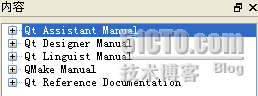

# 五、API 文档的使用

今天来说一下有关 Qt API 文档的使用。因为 Qt 有一个商业版本，因此它的文档十分健全，而且编写良好。对于开发者来说，查看文档时开发必修课之一——没有人能够记住那么多 API 的使用！

在 Qt 中查看文档是一件很简单的事情。如果你使用 QtCreator，那么左侧的 Help 按钮就是文档查看入口。否则的话，你可以在 Qt 的安装目录下的 bin 里面的 assistant.exe 中看到 Qt 的文档。在早期版本中，Qt 的文档曾以 HTML 格式发布，不过在 2009.03 版中我没有找到 HTML 格式的文档，可能 Qt 已经把它全部换成二进制格式的了吧？——当然，如果你全部安装了 Qt 的组件，是可以在开始菜单中找到 assistant 的！

assistant 里面的文档有很多项：

其中，第一个是帮助的帮助:-)；第二个是 Qt Designer 的帮助；第三个是 Qt Linguist 的帮助；第四个是 QMake 的帮助；最后一个是 Qt 的 API 文档，在 QtCreator 中默认打开的就是这部分。

不过，关于文档的内容这里实在不好阐述，因为整个文档太大了，我也并没有看过多少，很多时候都是随用随查，就好像是字典一样——谁也不会天天没事抱着本字典去看不是？还有就是这里的文档都是英文的，不过如果是做开发的话，了解一些英文还是很有帮助的，不是吗？

本文出自 “豆子空间” 博客，请务必保留此出处 [`devbean.blog.51cto.com/448512/194031`](http://devbean.blog.51cto.com/448512/194031)