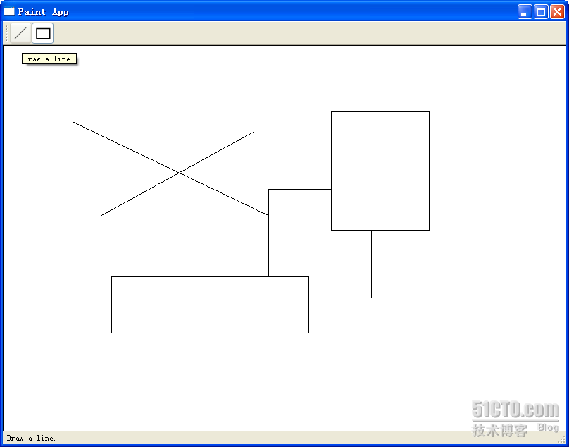

# 三十一、一个简易画板的实现(QWidget)

说实话，本来我是没有打算放一个很大的例子的，一则比较复杂，二来或许需要很多次才能说得完。不过，现在已经说完了绘图部分，所以计划还是上一个这样的例子。这里我会只做出一个简单的画板程序，大体上就是能够画直线和矩形吧。这样，我计划分成两种实现，一是使用普通的 QWidget 作为画板，第二则是使用 Graphcis View Framework 来实现。因为前面有朋友说不大明白 Graphics View 的相关内容，所以计划如此。

好了，现在先来看看我们的主体框架。我们的框架还是使用 Qt Creator 创建一个 Gui Application 工程。

简单的 main()函数就不再赘述了，这里首先来看 MainWindow。顺便说一下，我一般不会使用 ui 文件，所以这些内容都是手写的。首先先来看看最终的运行结果：



或许很简单，但是至少我们能够把前面所说的各种知识串连起来，这也就达到目的了。

现在先来看看 MainWindow 的代码：

mainwindow.h

```cpp
 #ifndef MAINWINDOW_H 

 #define MAINWINDOW_H 

 #include <QtGui> 

 #include "shape.h" 

 #include "paintwidget.h" 

class MainWindow : public QMainWindow 
{ 
        Q_OBJECT 

public: 
        MainWindow(QWidget *parent = 0); 

signals: 
        void changeCurrentShape(Shape::Code newShape); 

private slots: 
        void drawLineActionTriggered(); 
        void drawRectActionTriggered(); 

}; 

 #endif // MAINWINDOW_H
```

mainwindow.cpp

```cpp
 #include "mainwindow.h" 

MainWindow::MainWindow(QWidget *parent) 
        : QMainWindow(parent) 
{ 
        QToolBar *bar = this->addToolBar("Tools"); 
        QActionGroup *group = new QActionGroup(bar); 

        QAction *drawLineAction = new QAction("Line", bar); 
        drawLineAction->setIcon(QIcon(":/line.png")); 
        drawLineAction->setToolTip(tr("Draw a line.")); 
        drawLineAction->setStatusTip(tr("Draw a line.")); 
        drawLineAction->setCheckable(true); 
        drawLineAction->setChecked(true); 
        group->addAction(drawLineAction); 

        bar->addAction(drawLineAction); 
        QAction *drawRectAction = new QAction("Rectangle", bar); 
        drawRectAction->setIcon(QIcon(":/rect.png")); 
        drawRectAction->setToolTip(tr("Draw a rectangle.")); 
        drawRectAction->setStatusTip(tr("Draw a rectangle.")); 
        drawRectAction->setCheckable(true); 
        group->addAction(drawRectAction); 
        bar->addAction(drawRectAction); 

        QLabel *statusMsg = new QLabel; 
        statusBar()->addWidget(statusMsg); 

        PaintWidget *paintWidget = new PaintWidget(this); 
        setCentralWidget(paintWidget); 

        connect(drawLineAction, SIGNAL(triggered()), 
                        this, SLOT(drawLineActionTriggered())); 
        connect(drawRectAction, SIGNAL(triggered()), 
                        this, SLOT(drawRectActionTriggered())); 
        connect(this, SIGNAL(changeCurrentShape(Shape::Code)), 
                        paintWidget, SLOT(setCurrentShape(Shape::Code))); 
} 

void MainWindow::drawLineActionTriggered() 
{ 
        emit changeCurrentShape(Shape::Line); 
} 

void MainWindow::drawRectActionTriggered() 
{ 
        emit changeCurrentShape(Shape::Rect); 
}
```

应该说，从以往的学习中可以看出，这里的代码没有什么奇怪的了。我们在 MainWindow 类里面声明了一个信号，changeCurrentShape(Shape::Code)，用于按钮按下后通知画图板。注意，QActio 的 triggered()信号是没有参数的，因此，我们需要在 QAction 的槽函数中重新 emit 我们自己定义的信号。构造函数里面创建了两个 QAction，一个是 drawLineAction，一个是 drawRectAction，分别用于绘制直线和矩形。MainWindow 的中心组件是 PainWidget，也就是我们的画图板。下面来看看 PaintWidget 类：

paintwidget.h

```cpp
 #ifndef PAINTWIDGET_H 

 #define PAINTWIDGET_H 

 #include <QtGui> 

 #include <QDebug> 

 #include "shape.h" 

 #include "line.h" 

 #include "rect.h" 

class PaintWidget : public QWidget 
{ 
        Q_OBJECT 

public: 
        PaintWidget(QWidget *parent = 0); 

public slots: 
        void setCurrentShape(Shape::Code s) 
        { 
                if(s != currShapeCode) { 
                        currShapeCode = s; 
                } 
        } 

protected: 
        void paintEvent(QPaintEvent *event); 
        void mousePressEvent(QMouseEvent *event); 
        void mouseMoveEvent(QMouseEvent *event); 
        void mouseReleaseEvent(QMouseEvent *event); 

private: 
        Shape::Code currShapeCode; 
        Shape *shape; 
        bool perm; 
        QList<Shape*> shapeList; 
}; 

 #endif // PAINTWIDGET_H
```

paintwidget.cpp

```cpp
 #include "paintwidget.h" 

PaintWidget::PaintWidget(QWidget *parent) 
        : QWidget(parent), currShapeCode(Shape::Line), shape(NULL), perm(false) 
{ 
        setSizePolicy(QSizePolicy::Expanding, QSizePolicy::Expanding); 
} 

void PaintWidget::paintEvent(QPaintEvent *event) 
{ 
        QPainter painter(this); 
        painter.setBrush(Qt::white); 
        painter.drawRect(0, 0, size().width(), size().height()); 
        foreach(Shape * shape, shapeList) { 
                shape->paint(painter); 
        } 
        if(shape) { 
                shape->paint(painter); 
        } 
} 

void PaintWidget::mousePressEvent(QMouseEvent *event) 
{ 
        switch(currShapeCode) 
        { 
        case Shape::Line: 
                { 
                        shape = new Line; 
                        break; 
                } 
        case Shape::Rect: 
                { 
                        shape = new Rect; 
                        break; 
                } 
        } 
        if(shape != NULL) { 
                perm = false; 
                shapeList<<shape; 
                shape->setStart(event->pos()); 
                shape->setEnd(event->pos()); 
        } 
} 

void PaintWidget::mouseMoveEvent(QMouseEvent *event) 
{ 
        if(shape && !perm) { 
                shape->setEnd(event->pos()); 
                update(); 
        } 
} 

void PaintWidget::mouseReleaseEvent(QMouseEvent *event) 
{ 
        perm = true; 
}
```

PaintWidget 类定义了一个 slot，用于接收改变后的新的 ShapeCode。最主要的是，PaintWidget 重定义了三个关于鼠标的事件：mousePressEvent，mouseMoveEvent 和 mouseReleaseEvent。

我们来想象一下如何绘制一个图形：图形的绘制与鼠标操作息息相关。以画直线为例，首先我们需要按下鼠标，确定直线的第一个点，所以在 mousePressEvent 里面，我们让 shape 保存下 start 点。然后在鼠标按下的状态下移动鼠标，此时，直线就会发生变化，实际上是直线的终止点在随着鼠标移动，所以在 mouseMoveEvent 中我们让 shape 保存下 end 点，然后调用 update()函数，这个函数会自动调用 paintEvent()函数，显示出我们绘制的内容。最后，当鼠标松开时，图形绘制完毕，我们将一个标志位置为 true，此时说明这个图形绘制完毕。

为了保存我们曾经画下的图形，我们使用了一个 List。每次按下鼠标时，都会把图形存入这个 List。可以看到，我们在 paintEvent()函数中使用了 foreach 遍历了这个 List，绘制出历史图形。foreach 是 Qt 提供的一个宏，用于遍历集合中的元素。

最后我们来看看 Shape 类。

shape.h

```cpp
 #ifndef SHAPE_H 

 #define SHAPE_H 

 #include <QtGui> 

class Shape 
{ 
public: 

        enum Code { 
                Line, 
                Rect 
        }; 

        Shape(); 

        void setStart(QPoint s) 
        { 
                start = s; 
        } 

        void setEnd(QPoint e) 
        { 
                end = e; 
        } 

        QPoint startPoint() 
        { 
                return start; 
        } 

        QPoint endPoint() 
        { 
                return end; 
        } 

        void virtual paint(QPainter & painter) = 0; 

protected: 
        QPoint start; 
        QPoint end; 
}; 

 #endif // SHAPE_H
```

shape.cpp

```cpp
 #include "shape.h" 

Shape::Shape() 
{ 
}
```

Shape 类最重要的就是保存了 start 和 end 两个点。为什么只要这两个点呢？因为我们要绘制的是直线和矩形。对于直线来说，有了两个点就可以确定这条直线，对于矩形来说，有了两个点作为左上角的点和右下角的点也可以确定这个矩形，因此我们只要保存两个点，就足够保存这两种图形的位置和大小的信息。paint()函数是 Shape 类的一个纯虚函数，子类都必须实现这个函数。我们现在有两个子类：Line 和 Rect，分别定义如下：

line.h

```cpp
 #ifndef LINE_H 

 #define LINE_H 

 #include "shape.h" 

class Line : public Shape 
{ 
public: 
        Line(); 

        void paint(QPainter &painter); 
}; 

 #endif // LINE_H
```

line.cpp

```cpp
 #include "line.h" 

Line::Line() 
{ 
} 

void Line::paint(QPainter &painter) 
{ 
        painter.drawLine(start, end); 
}
```

rect.h

```cpp
 #ifndef RECT_H 

 #define RECT_H 

 #include "shape.h" 

class Rect : public Shape 
{ 
public: 
        Rect(); 

        void paint(QPainter &painter); 
}; 

 #endif // RECT_H
```

rect.cpp

```cpp
 #include "rect.h" 

Rect::Rect() 
{ 
} 

void Rect::paint(QPainter &painter) 
{ 
        painter.drawRect(start.x(), start.y(), 
                                         end.x() - start.x(), end.y() - start.y()); 
}
```

使用 paint()函数，根据两个点的数据，Line 和 Rect 都可以绘制出它们自身来。此时就可以看出，我们之所以要建立一个 Shape 作为父类，因为这两个类有几乎完全相似的数据对象，并且从语义上来说，Line、Rect 与 Shape 也完全是一个 is-a 的关系。如果你想要添加颜色等的信息，完全可以在 Shape 类进行记录。这也就是类层次结构的好处。

代码很多也会比较乱，附件里面是整个工程的文件，有兴趣的朋友不妨看看哦！ 本文出自 “豆子空间” 博客，请务必保留此出处 [`devbean.blog.51cto.com/448512/193918`](http://devbean.blog.51cto.com/448512/193918)