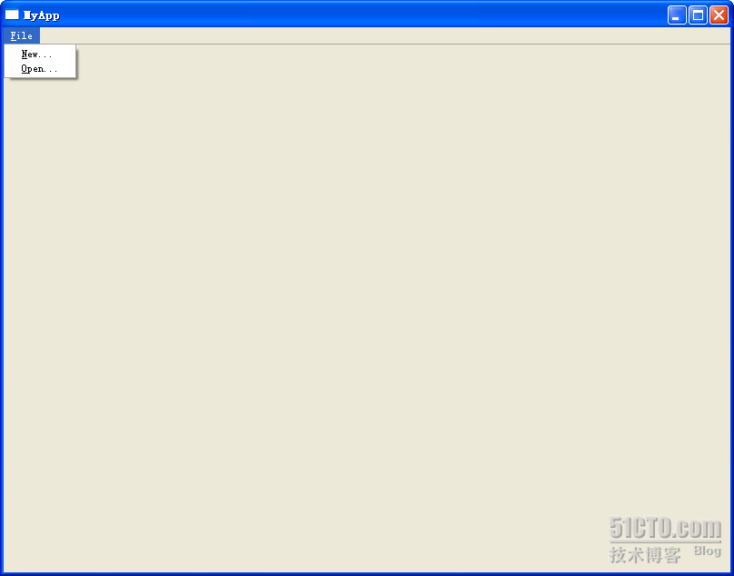
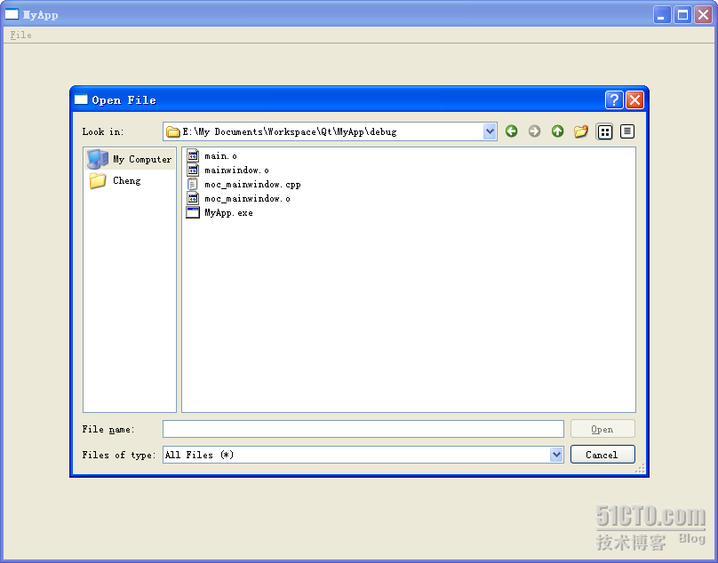
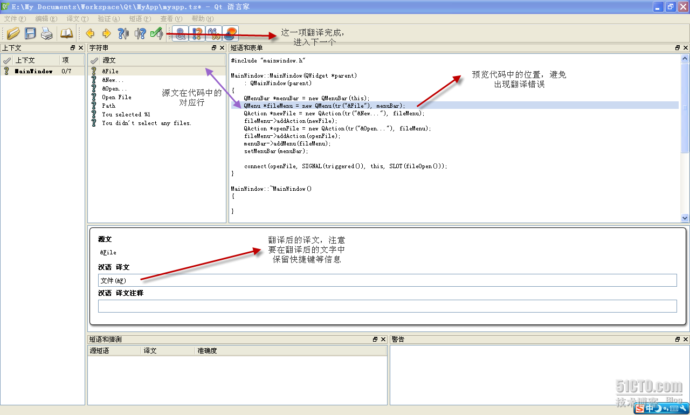
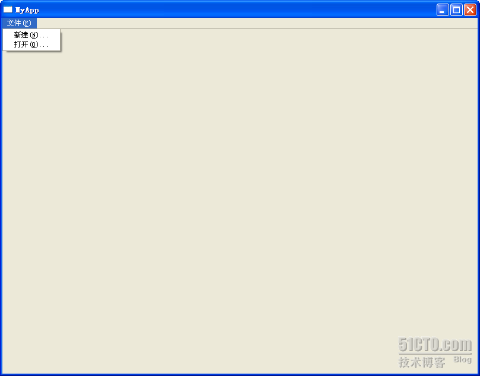

# 三十三、国际化(上)

2D 绘图部分基本告一段落，还在想下面的部分要写什么，本来计划先说下 view-model 的相关问题，但是前面看到有朋友问关于国际化的问题，所以现在先来说说 Qt 的国际化吧！

Qt 中的国际化的方法有很多，常用的有使用 QTextCodec 类和使用 tr()函数。前者将编码名称写到代码里面，除非你使用 Unicode 编码，否则国际化依然是一个问题；后者就不会有这个问题，并且这也是 Qt 推荐的做法。因此，我们主要来说使用 tr()函数的方法进行应用程序的国际化。

我们先来看一个很简单的 MainWindow。为了清楚起见，这里只给出了 cpp 文件的内容：

```cpp

 #include "mainwindow.h" 

MainWindow::MainWindow(QWidget *parent) 
        : QMainWindow(parent) 
{ 
        QMenuBar *menuBar = new QMenuBar(this); 
        QMenu *fileMenu = new QMenu(tr("&File"), menuBar); 
        QAction *newFile = new QAction(tr("&New..."), fileMenu); 
        fileMenu->addAction(newFile); 
        QAction *openFile = new QAction(tr("&Open..."), fileMenu); 
        fileMenu->addAction(openFile); 
        menuBar->addMenu(fileMenu); 
        setMenuBar(menuBar); 

        connect(openFile, SIGNAL(triggered()), this, SLOT(fileOpen())); 
} 

MainWindow::~MainWindow() 
{ 

} 

void MainWindow::fileOpen() 
{ 
        QFileDialog *fileDialog = new QFileDialog(this); 
        fileDialog->setWindowTitle(tr("Open File")); 
        fileDialog->setDirectory("."); 
        if(fileDialog->exec() == QDialog::Accepted) { 
                QString path = fileDialog->selectedFiles()[0]; 
                QMessageBox::information(NULL, tr("Path"), tr("You selected\n%1").arg(path)); 
        } else { 
                QMessageBox::information(NULL, tr("Path"), tr("You didn't select any files.")); 
        } 
}
```

这是一个很简单的类，运行结果想必大家也都非常清楚：就是一个主窗口，上面有一个菜单栏，一个 File 菜单，里面有两个菜单项：



之所以把运行图贴出来，是为了大家能够看清，在代码中的&符号实际在界面中显示成为一条下划线，标记出这个菜单或者菜单项的快捷键。按照代码，当我们点击了 Open 时，会弹出一个打开文件的对话框：



这里的 slot 里面的代码在前文中已经详细介绍过。也许你会问，为什么要用这种麻烦的写法呢？因为我们曾经说过，使用 static 函数实际上是直接调用系统的对话框，而这种构造函数法是 Qt 自己绘制的。这对我们后面的国际化是有一定的影响的。

好了，都已经准备好了，下面开始进行国际化。所谓国际化，实际上不仅仅是把界面中的各种文字翻译成另外的语言，还有一些工作是要进行书写方式、货币等的转换。比如，阿拉伯书写时从右向左的，这些在国际化工作中必须完成。但是在这里，我们只进行最简单的工作，就是把界面的文字翻译成中文。

首先，我们需要在 pro 文件中增加一行：

```cpp

TRANSLATIONS += myapp.ts
```

myapp.ts 是我们需要创建的翻译文件。这个文件的名字是任意的，不过后缀名需要是 ts。然后我们打开命令提示符，进入到工程所在目录，比如我的是 E:\My Documents\Workspace\Qt\MyApp，也就是 pro 文件所在的文件夹，然后输入命令

```cpp

lupdate MyApp.pro
```

，如果你出现的是命令不存在，请注意将 Qt 的 bin 目录添加到环境变量中。此时，如果更新的数目，说明 ts 文件创建成功：


最后一行是说，找到 7 个需要翻译的原文字，0 个已经存在。也就是说，这个文件是新建的。这时你会在工程目录下找到这个 myapp.ts 文件。也许你会奇怪，为什么这里还会说已存在的数目呢？因为 Qt 这个工具很智能的能够识别出已经存在的文字和修改或新增的文字，这样在以后的工作中就不需要一遍遍重复翻译以前的文字了。这也就是为什么这个工具的名字是“lupdate”的原因，因为它是“update”，而不仅仅是生成。

如果你有兴趣的话，可以用记事本打开这个 ts 文件，这个文件实际上是一个 XML 文件，结构很清晰。不过，我们要使用专业的翻译工具进行翻译。Qt 提供了一个工具，Qt Linguist，你可以在开始菜单的 Qt 项下面的 Tools 中找到。用它可以打开我们的 ts 文件，然后进行我们的翻译工作：



完全翻译完成后保存文件，然后在文件菜单下有个“发布”。点击这个按钮，工程目录下会有一个 myapp.qm 文件，这就是我们翻译得到的文件。Qt 的 qm 文件实际上是二进制格式的，因此它经过了高度的优化，体积很小。

下面我们要修改 main()函数，使之加载这个 qm 文件：

```cpp

int main(int argc, char *argv[]) 
{ 
        QApplication a(argc, argv); 
        QTranslator qtTranslator; 
        qtTranslator.load("myapp.qm"); 
        a.installTranslator(&qtTranslator); 
        MainWindow w; 
        w.resize(800, 600); 
        w.show(); 
        return a.exec(); 
}
```

注意，QTranslator 类实际是在 QtCore 下面的。代码还是很清晰：创建一个 QTranslator 对象，然后加载 qm 文件，然后将这个对象安装到 QApplication 类。好了，现在大功告成，重新编译后运行下程序吧！

咦？怎么还是英文的？哪里有错误了呢？这里往往令人疑惑，其实，这是由于我们使用 load()函数加载 qm 文件时使用的是相对路径，这样直接 load(“myapp.qm”)，其实会在当前编译后的 exe 所在目录下寻找这个 qm 文件，所以，只要我们把 qm 文件同 exe 放在同一目录下，再次运行：



现在，这个界面已经是中文了吧！其实，这一小细节已经说明，qm 文件其实是动态加载到 exe 文件中的，而不是直接编译进去的。这一点为我们进行动态切换语言提供了基础。

本文出自 “豆子空间” 博客，请务必保留此出处 [`devbean.blog.51cto.com/448512/193918`](http://devbean.blog.51cto.com/448512/193918)