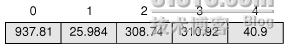

# 三十五、Qt 容器类之顺序存储容器

本来计划先来说下 model/view 的，结果发现 model/view 涉及到一些关于容器的内容，于是就把容器部分提前了。

容器 Containers，有时候也被称为集合 collections，指的是能够在内存中存储其他特定类型的对象的对象，这种对象一般是通用的模板类。C++提供了一套完整的解决方案，成为标准模板库 Standard Template Library，也就是我们常说的 STL。

Qt 提供了它自己的一套容器类，这就是说，在 Qt 的应用程序中，我们可以使用标准 C++的 STL，也可以使用 Qt 的容器类。Qt 容器类的好处在于，它提供了平台无关的行为，以及隐式数据共享技术。所谓平台无关，即 Qt 容器类不因编译器的不同而具有不同的实现；所谓“隐式数据共享”，也可以称作“写时复制 copy on write”，这种技术允许在容器类中使用传值参数，而不会发生额外的性能损失。Qt 容器类提供了类似 Java 的遍历器语法，同样也提供了类似 STL 的遍历器语法，以方便用户选择自己习惯的编码方式。最后一点，在一些嵌入式平台，STL 往往是不可用的，这时你就只能使用 Qt 提供的容器类，除非你想自己创建。

今天我们要说的是“顺序储存容器”。所谓顺序存储，就是它存储数据的方式是一个接一个的，线性的。

第一个顺序存储容器是 QVector<t>，即向量。QVector<t>是一个类似数组的容器，它将数据存储在连续内存区域。同 C++数组不同之处在于，QVector<t>知道它自己的长度，并且可以改变大小。对于获取随机位置的数据，或者是在末尾处添加数据，QVector<t>的效率都是很高的，但是，在中间位置插入数据或者删除数据，它的效率并不是很高。在内存中 QVector<t>的存储类似下图(出自 C++ GUI Programming with Qt4, 2nd Edition)：</t></t></t></t></t>



同 STL 的 vector<t>类类似，QVector<t>也提供了[]的重载，我们可以使用[]赋值：</t></t>

```cpp

QVector<double> v(2); 
v[0] = 1.1; 
v[1] = 1.2;
```

如果实现不知道 vector 的长度，可以创建一个空参数的 vector，然后使用 append()函数添加数据：

```cpp

QVector<double> v; 
v.append(1.1); 
v.append(1.2);
```

在 QVector<t>类中，<<也被重载，因此，我们也可以直接使用<<操作符：</t>

```cpp

QVector<double> v; 
v << 1.1 << 1.2;
```

注意，如果 QVector<t>中的数据没有被显式地赋值，那么，数据项将使用加入类的默认构造函数进行初始化，如果是基本数据类型和指针，则初始化为 0.</t>

QLinekdList<t>是另外一种顺序存储容器。在数据结构中，这是一个链表，使用指针连接起所有数据。它的内存分布如下(出自 C++ GUI Programming with Qt4, 2nd Edition)：</t>


正如数据结构中所描述的那样，QLinkedList<t>的优点是数据的插入和删除很快，但是随机位置值的访问会很慢。与 QVector<t>不同，QLinkedList<t>并没有提供重载的[]操作符，你只能使用 append()函数，或者<<操作符进行数据的添加，或者你也可以使用遍历器，这个我们将在后面内容中详细描述。</t></t></t>

QList<t>是一个同时拥有 QVector<t>和 QLinkedList<t>的大多数有点的顺序存储容器类。它像 QVector<t>一样支持快速的随机访问，重载了[]操作符，提供了索引访问的方式；它像 QLinkedList<t>一样，支持快速的添加、删除操作。除非我们需要进行在很大的集合的中间位置的添加、删除操作，或者是需要所有元素在内存中必须连续存储，否则我们应该一直使用 Qlist<t>。</t></t></t></t></t></t>

QList<t>有几个特殊的情况。一个是 QStringList，这是 QList<qstring>的子类，提供针对 QString 的很多特殊操作。QStack<t>和 QQueue<t>分别实现了数据结构中的堆栈和队列，前者具有 push(), pop(), top()函数，后者具有 enqueue(), dequeue(), head()函数。具体情况请查阅 API 文档。</t></t></qstring></t>

另外需要指出的一点是，我们所说的模板类中的占位符 T，可以使基本数据类型，比如 int，double 等，也可以指针类型，可以是类类型。如果是类类型的话，必须提供默认构造函数，拷贝构造函数和赋值操作符。Qt 的内置类中的 QByteArray，QDateTime，QRegExp，QString 和 QVariant 是满足这些条件的。但是，QObject 的子类并不符合这些条件，因为它们通常缺少拷贝构造函数和赋值操作符。不过这并不是一个问题，因为我们可以存储 QObject 的指针，而不是直接存储值。T 也可以是一个容器，例如：

```cpp

QList<QVector<int> > list;
```

注意，在最后两个>之间有一个空格，这是为了防止编译器把它解析成>>操作符。这个空格是必不可少的，切记切记！

下面我们来看一个类(出自 C++ GUI Programming with Qt4, 2nd Edition)：

```cpp

class Movie 
{ 
public: 
        Movie(const QString &title = "", int duration = 0); 

        void setTitle(const QString &title) { myTitle = title; } 
        QString title() const { return myTitle; } 
        void setDuration(int duration) { myDuration = duration; } 
        QString duration() const { return myDuration; } 

private: 
        QString myTitle; 
        int myDuration; 
};
```

我们能不能把这个类放进 Qt 容器类呢？答案是肯定的。下面我们来对照着前面所说的要求：第一，虽然这个类的构造函数有两个参数，但是这两个参数都有默认值，因此，像 Movie()这种写法是允许的，所以，它有默认构造函数；第二，这个类表面上看上去没有拷贝构造函数和赋值操作符，但是 C++编译器会为我们提供一个默认的实现，因此这个条件也是满足的。对于这个类而言，默认拷贝构造函数已经足够，无需我们自己定义。所以，我们可以放心的把这个类放进 Qt 的容器类。

本文出自 “豆子空间” 博客，请务必保留此出处 [`devbean.blog.51cto.com/448512/193918`](http://devbean.blog.51cto.com/448512/193918)