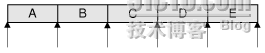

# 三十六、Qt 容器类之遍历器和隐式数据共享

前面说过，Qt 容器类提供了两种遍历器：Java 风格的和 STL 风格的。前者比较容易使用，后者则可以用在一些通过算法中，功能比较强大。

对于每一个容器类，都有与之相对应的遍历器：只读遍历器和读写遍历器。只读遍历器有 QVectorIterator<t>，QLinkedListIterator<t>和 QListIterator<t>三种；读写遍历器同样也有三种，只不过名字中具有一个 Mutable，即 QMutableVectorIterator<t>，QMutableLinkedListIterator<t>和 QMutableListIterator<t>。这里我们只讨论 QList 的遍历器，其余遍历器具有几乎相同的 API。</t></t></t></t></t></t>

Java 风格的遍历器的位置如下图所示(出自 C++ GUI Programming with Qt4, 2nd Edition)：



可以看出，Java 风格的遍历器，遍历器不指向任何元素，而是指向第一个元素之前、两个元素之间或者是最后一个元素之后的位置。使用 Java 风格的遍历器进行遍历的典型代码是：

```cpp

QList<double> list; 
// ... 
QListIterator<double> i(list); 
while (i.hasNext()) { 
        doSomethingWith(i.next()); 
}
```

这个遍历器默认指向第一个元素，使用 hasNext()和 next()函数从前向后遍历。你也可以使用 toBack()函数让遍历器指向最后一个元素的后面的位置，然后使用 hasPrevious()和 previous()函数进行遍历。

这是只读遍历器，而读写遍历器则可以在遍历的时候进行增删改的操作，例如：

```cpp

QMutableListIterator<double> i(list); 
while (i.hasNext()) { 
        if (i.next() < 0.0) 
                i.remove(); 
}
```

当然，读写遍历器也是可以从后向前遍历的，具体 API 和前面的几乎相同，这里就不再赘述。

对应于 Java 风格的遍历器，每一个顺序容器类 C<t>都有两个 STL 风格的遍历器：C<t>::iterator 和 C<t>::const_iterator。正如名字所暗示的那样，const_iterator 不允许我们对遍历的数据进行修改。begin()函数返回指向第一个元素的 STL 风格的遍历器，例如 list[0]，而 end()函数则会返回指向**最后一个之后的元素**的 STL 风格的遍历器，例如如果一个 list 长度为 5，则这个遍历器指向 list[5]。下图所示 STL 风格遍历器的合法位置：</t></t></t>


如果容器是空的，begin()和 end()是相同的。这也是用于检测容器是否为空的方法之一，不过调用 isEmpty()函数会更加方便。

STL 风格遍历器的语法类似于使用指针对数组的操作。我们可以使用++和--运算符使遍历器移动到下一位置，遍历器的返回值是指向这个元素的指针。例如 QVector<t>的 iterator 返回值是 T * 类型，而 const_iterator 返回值是 const T * 类型。</t>

一个典型的使用 STL 风格遍历器的代码是：

```cpp

QList<double>::iterator i = list.begin(); 
while (i != list.end()) { 
        *i = qAbs(*i); 
        ++i; 
}
```

对于某些返回容器的函数而言，如果需要使用 STL 风格的遍历器，我们需要建立一个返回值的拷贝，然后再使用遍历器进行遍历。如下面的代码所示：

```cpp

QList<int> list = splitter->sizes(); 
QList<int>::const_iterator i = list.begin(); 
while (i != list.end()) { 
        doSomething(*i); 
        ++i; 
}
```

而如果你直接使用返回值，就像下面的代码：

```cpp

// WRONG 
QList<int>::const_iterator i = splitter->sizes().begin(); 
while (i != splitter->sizes().end()) { 
        doSomething(*i); 
        ++i; 
}
```

这种写法一般不是你所期望的。因为 sizes()函数会返回一个临时对象，当函数返回时，这个临时对象就要被销毁，因此调用临时对象的 begin()函数是相当不明智的做法。并且这种写法也会有性能问题，因为 Qt 每次循环都要重建临时对象。因此请注意，**如果要使用 STL 风格的遍历器，并且要遍历作为返回值的容器，就要先创建返回值的拷贝，然后进行遍历**。

在使用 Java 风格的只读遍历器时，我们不需要这么做，因此系统会自动为我们创建这个拷贝，所以，我们只需很简单的按下面的代码书写：

```cpp

QListIterator<int> i(splitter->sizes()); 
while (i.hasNext()) { 
        doSomething(i.next()); 
}
```

这里我们提出要建立容器的拷贝，似乎是一项很昂贵的操作。其实并不然。还记得我们上节说过一个隐式数据共享吗？Qt 就是使用这个技术，让拷贝一个 Qt 容器类和拷贝一个指针那么快速。如果我们只进行读操作，数据是不会被复制的，只有当这些需要复制的数据需要进行写操作，这些数据才会被真正的复制，而这一切都是自动进行的，也正因为这个原因，隐式数据共享有时也被称为“写时复制”。隐式数据共享不需要我们做任何额外的操作，它是自动进行的。隐式数据共享让我们有一种可以很方便的进行值返回的编程风格：

```cpp

QVector<double> sineTable()    
{    
                QVector<double> vect(360);    
                for (int i = 0; i < 360; ++i)    
                                vect[i] = std::sin(i / (2 * M_PI));    
                return vect;    
} 
// call 
QVector<double> v = sineTable();
```

Java 中我们经常这么写，这样子也很自然：在函数中创建一个对象，操作完毕后将其返回。但是在 C++中，很多人都会说，要避免这么写，因为最后一个 return 语句会进行临时对象的拷贝工作。如果这个对象很大，这个操作会很昂贵。所以，资深的 C++高手们都会有一个 STL 风格的写法：

```cpp

void sineTable(std::vector<double> &vect)    
{    
                vect.resize(360);    
                for (int i = 0; i < 360; ++i)    
                                vect[i] = std::sin(i / (2 * M_PI));    
} 
// call 
QVector<double> v; 
sineTable(v);
```

这种写法通过传入一个引用避免了拷贝工作。但是这种写法就不那么自然了。而隐式数据共享的使用让我们能够放心的按照第一种写法书写，而不必担心性能问题。

Qt 所有容器类以及其他一些类都使用了隐式数据共享技术，这些类包括 QByteArray, QBrush, QFont, QImage, QPixmap 和 QString。这使得这些类在参数和返回值中使用传值方式相当高效。

不过，为了正确使用隐式数据共享，我们需要建立一个良好的编程习惯。这其中之一就是，**对 list 或者 vector 使用 at()函数而不是[]操作符进行只读访问**。原因是[]操作符既可以是左值又可以是右值，这让 Qt 容器很难判断到底是左值还是右值，而 at()函数是不能作为左值的，因此可以进行隐式数据共享。另外一点是，对于 begin()，end()以及其他一些非 const 容器，在数据改变时 Qt 会进行深复制。为了避免这一点，**要尽可能使用 const_iterator, constBegin()和 constEnd()**.

最后，Qt 提供了一种不使用遍历器进行遍历的方法：foreach 循环。这实际上是一个宏，使用代码如下所示：

```cpp

QLinkedList<Movie> list; 
Movie movie; 
... 
foreach (movie, list) { 
        if (movie.title() == "Citizen Kane") { 
                std::cout << "Found Citizen Kane" << std::endl; 
                break; 
        } 
}
```

很多语言，特别是动态语言，以及 Java 1.5 之后，都有 foreach 的支持。Qt 中使用宏实现了 foreach 循环，有两个参数，第一个是单个的对象，成为遍历对象，相当于指向容器元素类型的一个指针，第二个是一个容器类。它的意思很明确：每次取出容器中的一个元素，赋值给前面的遍历元素进行操作。需要注意的是，**在循环外面定义遍历元素，对于定义中具有逗号的类而言，如 QPair<int, double>，是唯一的选择**。

本文出自 “豆子空间” 博客，请务必保留此出处 [`devbean.blog.51cto.com/448512/193918`](http://devbean.blog.51cto.com/448512/193918)