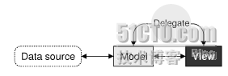

# 三十八、model-view 架构

从这一节开始，我们进入 model-view 阶段。这一阶段主要还是依据 C++ GUI Programming with Qt4, 2nd Edition。

我们的系统有很多数据显示的需求，比如从数据库中把数据取出，然后以自己的方式显示在我们自己的应用程序的界面中。进行这一操作的典型方式是使用 Qt 的 Item View 类。

在早期的 Qt 版本中，要实现这个功能，我们需要定义一个 widget，然后在这个 widget 中保存一个数据对象，比如是个 list，然后我们对这个 list 进行查找、插入等的操作，或者把修改的地方写回这个 list，然后刷新 widget 进行显示。这个思路很简单，也很清晰，但是对于大型程序，这种设计就显得苍白无力。比如，在一个大型系统中，你的数据可能很大，如果全部存入一个 widget 的数据对象中，效率会很低，并且这样的设计也很难在 widgets 之间共享变量，也就是说，如果你要几个组件共享一个数据对象，要么你就要用 getter 函数公开这个数据对象，要么你就必须把这个数据对象放进不同的组件分别进行维护。

Smalltalk 语言发明了一种崭新的实现，用来解决这个问题，这就是著名的 MVC 模型。对这个模型无需多言，简单来说，这是一个 model-view-controller 模型，即模型-视图-控制器。在 MVC 中，模型负责获取需要显示的数据，并且能够存储这些数据的修改。每种数据类型都有它自己对应的模型，但是这些模型提供一个相同的 API，用于隐藏内部实现。视图用于将模型数据显示给用户。对于很大的数据，或许只显示一小部分，这样就能很好的提高性能。控制器是模型和视图之间的媒介，将用户的动作解析成对数据的操作，比如查找数据或者修改数据，然后转发给模型执行，最后再将模型中需要被显示的数据直接转发给视图进行显示。

对于 Qt 而言，它使用的是一个类似于 MVC 模型的 model-view 架构。其中，model 就相当于 MVC 架构中的 model，而对于控制器部分，Qt 使用的是另外的一种抽象，代理 delegate。代理被用来提供对 item 渲染和编辑的控制。对于每种视图，Qt 都提供了一个默认的代理，对于大多数应用来说，我们只需要使用这个默认的代理即可。这其中的类关系如下图所示(出自 C++ GUI Programming with Qt 4, 2nd Edition)

使用 Qt 的 model-view 架构，我们可以让 model 是取回 view 所要展示的数据，这样就可以在不降低性能的情形下处理大量数据。并且你可以把一个 model 注册给多个 view，让这些 view 能够显示同样的数据，也就是为同一个数据提供不同的显示方式。Qt 会自动地对这些 view 保持同步，自动刷新所有的 view 以显示最新的数据。这样，我们就可以只对 model 进行修改，view 会自动更新。

在少量数据的情形下，我们不需要动用 model 这样重量级的组件。Qt 为了方便起见也提供了 item view 类，分别是 QListWidget，QTableWidget 和 QTreeWidget，使用这些类可以直接对 item 进行操作。这种实现很像 Qt 早期版本，组件中包含了相应的 item，例如 QTableWidget 中包含有 QTableWidgetItem 等。但是对于很大的数据，我们则需要使用 Qt 的 view 类，比如 QListView，QTabelView 和 QTreeView，同时需要提供一个 model，可以是自定义 model，也可以是 Qt 预置的 model。例如，如果数据来自数据库，那么你可以使用 QTabelView 和 QSqlTableModel 这两个类。

今天就说这些，下次我们将开始进入对 model-view 架构的具体介绍。

本文出自 “豆子空间” 博客，请务必保留此出处 [`devbean.blog.51cto.com/448512/193918`](http://devbean.blog.51cto.com/448512/193918)