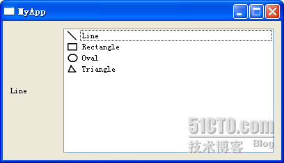
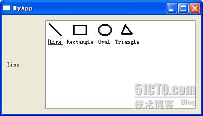

# 三十九、QListWidget

前面一节简单概述著名的 MVC 模式在 Qt 中的实现，现在我们从 QListWidget 开始了解 Qt 提供的一系列方便的 item view 类。

第一个要说的是 QListWidget。这个类为我们展示一个 List 列表的视图。下面还是先看代码：

```cpp

listwidget.h
 #ifndef LISTWIDGET_H 

 #define LISTWIDGET_H 

 #include <QtGui> 

class ListWidget : public QWidget 
{ 
public: 
        ListWidget(); 

private: 
        QLabel *label; 
        QListWidget *list; 
}; 

 #endif // LISTWIDGET_H
```

listwidget.cpp

```cpp

 #include "listwidget.h" 

ListWidget::ListWidget() 
{ 
        label = new QLabel; 
        label->setFixedWidth(70); 
        list = new QListWidget; 
        list->addItem(new QListWidgetItem(QIcon(":/images/line.PNG"), tr("Line"))); 
        list->addItem(new QListWidgetItem(QIcon(":/images/rect.PNG"), tr("Rectangle"))); 
        list->addItem(new QListWidgetItem(QIcon(":/images/oval.PNG"), tr("Oval"))); 
        list->addItem(new QListWidgetItem(QIcon(":/images/tri.PNG"), tr("Triangle"))); 
        QHBoxLayout *layout = new QHBoxLayout; 
        layout->addWidget(label); 
        layout->addWidget(list); 

        setLayout(layout); 

        connect(list, SIGNAL(currentTextChanged(QString)), label, SLOT(setText(QString))); 
}
```

main.cpp

```cpp

 #include <QtGui> 

 #include "listwidget.h" 

int main(int argc, char *argv[]) 
{ 
        QApplication a(argc, argv); 
        ListWidget lw; 
        lw.resize(400, 200); 
        lw.show(); 
        return a.exec(); 
}
```

一共三个文件，但是都比较清晰。我们先建立了一个 ListWidget 类，然后在 main 函数中将其显示出来。

ListWidget 类中包含一个 QLabel 对象和一个 QListWidget 对象。创建这个 QListWidget 对象很简单，只需要使用 new 运算符创建出来，然后调用 addItem()函数即可将 item 添加到这个对象中。我们添加的对象是 QListWidgetItem 的指针，它有四个重载的函数，我们使用的是其中的一个，它接受两个参数，第一个是 QIcon 引用类型，作为 item 的图标，第二个是 QString 类型，作为这个 item 后面的文字说明。当然，我们也可以使用 insertItem()函数在特定的位置动态的增加 item，具体使用请查阅 API 文档。最后，我们将这个 QListWidget 的 currentTextChanged()信号同 QLabel 的 setText()连接起来，这样，在我们点击 item 的时候，label 上面的文字就可以改变了。



我们还可以设置 viewModel 这个参数，来确定使用不同的视图进行显示。比如，我们使用下面的语句：

```cpp

list->setViewMode(QListView::IconMode);
```

再来看看程序界面吧！



本文出自 “豆子空间” 博客，请务必保留此出处 [`devbean.blog.51cto.com/448512/193918`](http://devbean.blog.51cto.com/448512/193918)