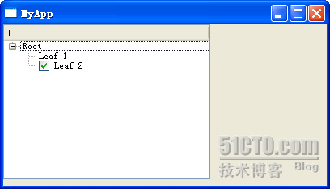
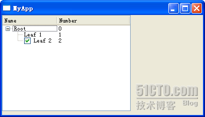

# 四十、QTreeWidget

前段时间笔记本坏掉了，一直没有更新博客，现在终于修好了啊，还是来继续《Qt 学习之路》这个系列吧！

接着前面的内容，今天要说的是另外一个 item view class，QTreeWidget。顾名思义，这个类用来展示树型结构。同前面说的 QListWidget 类似，这个类需要同另外一个辅助类 QTreeWidgetItem 一同使用。不过，既然是提供方面的封装类，即便是看上去很复杂的树，在使用这个类的时候也是显得比较简单的。当不需要使用复杂的 QTreeView 的特性的时候，我们可以直接使用 QTreeWidget 代替。

下面来看代码。

treewidget.h

```cpp

 #ifndef TREEWIDGET_H 

 #define TREEWIDGET_H 

 #include <QtGui> 

class TreeWidget : public QWidget 
{ 
public: 
        TreeWidget(); 

private: 
        QTreeWidget *tree; 
}; 

 #endif // TREEWIDGET_H
```

treewidget.cpp

```cpp

 #include "treewidget.h" 

TreeWidget::TreeWidget() 
{ 
        tree = new QTreeWidget(this); 
        tree->setColumnCount(1); 
        QTreeWidgetItem *root = new QTreeWidgetItem(tree, QStringList(QString("Root"))); 
        QTreeWidgetItem *leaf = new QTreeWidgetItem(root, QStringList(QString("Leaf 1"))); 
        root->addChild(leaf); 
        QTreeWidgetItem *leaf2 = new QTreeWidgetItem(root, QStringList(QString("Leaf 1"))); 
        leaf2->setCheckState(0, Qt::Checked); 
        root->addChild(leaf2); 
        QList<QTreeWidgetItem *> rootList; 
        rootList << root; 
        tree->insertTopLevelItems(0, rootList); 
}
```

首先，我们在构造函数里面创建了一个 QTreeWidget 的实例。然后我们调用 setColumnCount()函数设定栏数。这个函数的效果我们以后再看。然后我们要向 QTreeWidget 添加 QTreeWidgetItem。QTreeWidgetItem 有九个重载的构造函数。我们在这里只是来看看其中的一个，其余的请自行查阅 API 文档。这个构造函数的签名如下：

```cpp

QTreeWidgetItem::QTreeWidgetItem ( QTreeWidget * parent, const QStringList & strings, int type = Type );
```

这里有 3 个参数，第一个参数用于指定这个 item 属于哪一个树；第二个参数是指定这个 item 显示的文字；第三个参数用于指定这个 item 的类型。Type 有两个可行的取值：QTreeWidgetItem::Type 和 QTreeWidgetItem::UserType，由于我们并没有定义用户类型，所以只使用其默认值即可。这里你会奇怪，第二个参数为什么是一个 QStringList 类型的，而不是 QString 类型的？我们先不去管它，继续下面的代码。

后面我们又创建了一个 QTreeWidgetItem，注意它的第一个参数不是 QTreeWidget 而是 QTreeWidgetItem 类型的，这就把它的父节点设置为前面我们定义的 root 了。然后我们使用了 setCheckState()函数，让它变得可以选择，最后使用 addChild()函数把它添加进来。

最后一步，我们创建了一个 QList 类型，前面的 root 添加进去，然后 insert 到 top items。这里可以想象到，由于这个树组件可以由多个根组成（严格来说这已经不是树了，不过姑且还是叫树吧），所以我们传进来的是一个 list。

好了，编译运行一下我们的代码吧！



样子同我们想象的基本一致，只是这个树的头上怎么会有一个 1？还记得我们跳过去的那个函数吗？下面我们修改一下代码看看：

```cpp

 #include "listwidget.h" 

TreeWidget::TreeWidget() 
{ 
        tree = new QTreeWidget(this); 
        tree->setColumnCount(2); 
        QStringList headers; 
        headers << "Name" << "Number"; 
        tree->setHeaderLabels(headers); 
        QStringList rootTextList; 
        rootTextList << "Root" << "0"; 
        QTreeWidgetItem *root = new QTreeWidgetItem(tree, rootTextList); 
        QStringList leafTextList; 
        leafTextList << "Leaf 1" << "1"; 
        QTreeWidgetItem *leaf = new QTreeWidgetItem(root, leafTextList); 
        root->addChild(leaf); 
        QStringList leaf2TextList; 
        leaf2TextList << "Leaf 2" << "2"; 
        QTreeWidgetItem *leaf2 = new QTreeWidgetItem(root, leaf2TextList); 
        leaf2->setCheckState(0, Qt::Checked); 
        root->addChild(leaf2); 
        QList<QTreeWidgetItem *> rootList; 
        rootList << root; 
        tree->insertTopLevelItems(0, rootList); 
}
```

我们把 columnCount 设为 2，然后传入的 QStringList 对应的有 2 个元素。这样再来运行一下：



原来这个 columnCount 就是用于在列表中显示树的！这样，你就可以很容易的将树和列表结合在一起，从而实现类似 Windows 资源管理器的界面。当然，如果你不需要显示这个 header，可以调用 setHeaderHidden()函数将这个功能隐藏掉。

本文出自 “豆子空间” 博客，请务必保留此出处 [`devbean.blog.51cto.com/448512/193918`](http://devbean.blog.51cto.com/448512/193918)