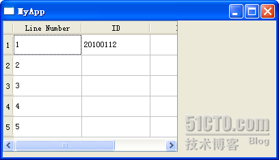

# 四十一、QTableWidget

今天的 QTableWidget 是最后一个 items class 类型了。不过这并不是 model-view 的终结，因为我们现在还只是接触到了最简单的 model-view 的封装类，更复杂和强大的 model-view 类型的应用还没有见识到呢！

QTableWidget 用起来也很方便，并不比前面的两个复杂到哪里去。我们运行的结果是这样子的：



下面是代码：

tablewidget.h

```cpp

 #ifndef TABLEWIDGET_H 

 #define TABLEWIDGET_H 

 #include <QtGui> 

class TableWidget : public QWidget 
{ 
public: 
        TableWidget(); 

private: 
        QTableWidget *table; 
}; 

 #endif // TABLEWIDGET_H
```

tablewidget.cpp

```cpp

 #include "tablewidget.h" 

TableWidget::TableWidget() 
{ 
        table = new QTableWidget(this); 
        table->setColumnCount(3); 
        table->setRowCount(5); 
        QStringList headers; 
        headers << "Line Number" << "ID" << "Name" << "Age" << "Sex"; 
        table->setHorizontalHeaderLabels(headers); 
        table->setItem(0, 0, new QTableWidgetItem(QString("1"))); 
        table->setItem(1, 0, new QTableWidgetItem(QString("2"))); 
        table->setItem(2, 0, new QTableWidgetItem(QString("3"))); 
        table->setItem(3, 0, new QTableWidgetItem(QString("4"))); 
        table->setItem(4, 0, new QTableWidgetItem(QString("5"))); 
        table->setItem(0, 1, new QTableWidgetItem(tr("20100112"))); 
}
```

代码看起来很清楚。首先创建了 QTableWidget 对象，然后设置列数和行数。接下来使用一个 QStringList，把每一列的标题设置了一下。然后调用 addItem()函数。这个函数前两个参数分别是行 row 和列 col，然后第三个参数构建一个 QTableWidgetItem 对象，这样，Qt 就会把这个对象放在第 row 行第 col 列的单元格里面。注意，这里的行和列都是从 0 开始的。

本文出自 “豆子空间” 博客，请务必保留此出处 [`devbean.blog.51cto.com/448512/193918`](http://devbean.blog.51cto.com/448512/193918)