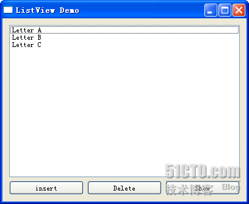

# 四十二、QStringListModel

今天开始我们要看看 Qt 的 model-view 类了。正如前面说的那样，之前三节的 item class 类只是 Qt 为了方便我们使用而封装了的一些操作。比起真正的 model-view 类来，那些类更易于使用，但是功能也会更简单，并且缺少实时性的支持，比如我们并不方便实现插入、删除等一些常见操作。而现在我们要说的 model-view 类使用起来可能会复杂一些，但是功能强大，并且在 model 更新时会自动更新 view，而 model 多是一些数据集合，因此比较便于操作。

model-view 类中，view 大致有三种：list、tree 和 table，但是 model 千奇百怪，不同的业务，甚至同样的业务不同的建模都会有不同的 model。为了方便使用，Qt 提供了一些预定义好的 model 供我们使用。QStringListModel 是其中最简单的一种。

顾名思义，QStringListModel 就是封装了 QStringList 的 model。QStringList 是一种很常用的数据类型，它实际上是一个字符串列表。我们可以想象，对于一个 list 来说，如果提供一个字符串列表形式的数据，就应该能够把这个数据展示出来。因为二者是一致的：QStringList 是线性的，而 list 也是线性的。所以，QStringListModel 很多时候都会作为 QListView 的 model。

下面我们来看怎么使用它们。比起前面的 QListWidget，这里要使用两个类：QStringListModel 和 QListView，并且还有一些辅助类。不过你可以看到，即便这样复杂的工作，我们的代码也不会很多的：

mylistview.h

```cpp

 #ifndef MYLISTVIEW_H 

 #define MYLISTVIEW_H 

 #include <QtGui> 

class MyListView : public QWidget 
{ 
        Q_OBJECT 
public: 
        MyListView(); 

private: 
        QStringListModel *model; 
        QListView *listView; 

private slots: 
        void insertData(); 
        void deleteData(); 
        void showData(); 
}; 

 #endif // MYLISTVIEW_H
```

mylistview.cpp

```cpp

 #include "mylistview.h" 

MyListView::MyListView() 
{ 
        model = new QStringListModel(this); 
        QStringList data; 
        data << "Letter A" << "Letter B" << "Letter C"; 
        model->setStringList(data); 
        listView = new QListView(this); 
        listView->setModel(model); 
        QHBoxLayout *btnLayout = new QHBoxLayout; 
        QPushButton *insertBtn = new QPushButton(tr("insert"), this); 
        QPushButton *delBtn = new QPushButton(tr("Delete"), this); 
        QPushButton *showBtn = new QPushButton(tr("Show"), this); 
        btnLayout->addWidget(insertBtn); 
        btnLayout->addWidget(delBtn); 
        btnLayout->addWidget(showBtn); 
        QVBoxLayout *mainLayout = new QVBoxLayout(this); 
        mainLayout->addWidget(listView); 
        mainLayout->addLayout(btnLayout); 
        this->setLayout(mainLayout); 

        connect(insertBtn, SIGNAL(clicked()), this, SLOT(insertData())); 
        connect(delBtn, SIGNAL(clicked()), this, SLOT(deleteData())); 
        connect(showBtn, SIGNAL(clicked()), this, SLOT(showData())); 
}
```

```cpp

void MyListView::insertData() 
{ 
        bool isOK; 
        QString text = QInputDialog::getText(NULL, "Insert", "Please input new data:", 
                                                                                 QLineEdit::Normal, "You are inserting new data.", &isOK); 
        if(isOK) { 
                int row = listView->currentIndex().row(); 
                model->insertRows(row, 1); 
                QModelIndex index = model->index(row); 
                model->setData(index, text); 
                listView->setCurrentIndex(index); 
                listView->edit(index); 
        } 
}
```

```cpp

void MyListView::deleteData() 
{ 
        if(model->rowCount() > 1) { 
                model->removeRows(listView->currentIndex().row(), 1); 
        } 
}
```

```cpp

void MyListView::showData() 
{ 
        QStringList data = model->stringList(); 
        QString str; 
        foreach(QString s, data) { 
                str += s + "\n"; 
        } 

        QMessageBox::information(this, "Data", str); 
}
```

来看看我们的代码吧。

首先我们创建一个 QStringListModel 的对象。然后创建一个 QStringList 对象，并且把这个对象设置为 model 的数据。此时，这个 model 已经拥有数据了。然后，我们创建一个 QListView 的对象，并把 model 设置为它的 model。后面是三个按钮的创建以及信号槽的连接，这里就不再赘述。

先来运行一下看看结果吧！



我们只是把 QStringListModel 设置为 QListView 的 model，QListView 就已经可以把 model 里面的数据展示出来了。下面我们看看增、删、改的操作。

先来看增加数据的操作。这部分是在代码中的 insertData()函数实现的。先把那个函数拿出来看看：

```cpp

void MyListView::insertData() 
{ 
        bool isOK; 
        QString text = QInputDialog::getText(NULL, "Insert", "Please input new data:", 
                                                                                 QLineEdit::Normal, "You are inserting new data.", &isOK); 
        if(isOK) { 
                int row = listView->currentIndex().row(); 
                model->insertRows(row, 1); 
                QModelIndex index = model->index(row); 
                model->setData(index, text); 
                listView->setCurrentIndex(index); 
                listView->edit(index); 
        } 
}
```

我们使用 QInputDialog::getText()函数要求用户输入数据。这部分在前面讲过，这里也不再赘述。如果用户点击了 OK 按钮，首先，我们使用 listView()->currentIndex()函数，获取 QListView 当前行。注意，这个函数的返回值是一个 QModelIndex 类型。这个类我们以后再说，只要知道这个类保存了三个重要的数据：行、列以及属于哪一个 model。我们调用其 row()函数获得行，这个返回值是一个 int，也就是第几行。然后 model 插入一行。insertRows()函数签名如下：

```cpp

bool insertRows(int row, int count, const QModelIndex &parent = QModelIndex());
```

这个函数原本是 QAbstractListModel 类的函数，而 QStringListModel 把它覆盖了。所以我们会发现它还需要另外的一个参数。我们调用 insertRows(row, 1); ，所谓 1 就是指插入 1 条数据，而前面又把 row 保存成当前行，因此，这行语句实际上是在当前的 row 行插入 count 行，这里的 count = 1。然后我们使用 model 的 index()函数获取当前行的 QModelIndex 对象，使用 setData()函数把我们用 QInputDialog 接受的数据插入。这里其实是一个冗余的操作，因为用 currentIndex()函数已经获取当前行了。这么写仅仅是为了展示如何使用这个函数。不过，你知道了 insertRow()函数，就可以很容易的做出插入空白行的效果了。然后我们把当前行设为新插入的一行，并调用 edit()函数，这个函数使得这一行可以被编辑。就这样，我们向 model 插入了数据。

然后来看删除数据的操作：

```cpp

void MyListView::deleteData() 
{ 
        if(model->rowCount() > 1) { 
                model->removeRows(listView->currentIndex().row(), 1); 
        } 
}
```

使用 model 的 removeRows()函数可以轻松的完成这个功能。这个函数同前面所说的 insertRows()很类似，就不再多说了。需要注意的是，我们用 rowCount()函数判断了一下，要求最终始终保留 1 行。这是因为如果你把数据全部删除，你就不能再插入数据了，因为那时侯按照我们所写的插入逻辑就不对了。所以，前面所说的插入操作实际上还需要再详细考虑。

最后那个 showData()仅仅为了查看 model 的数据，没有什么要说的东西。你可以在 insert 或者 remove 完成后查看一下 model 里面的数据是不是真的被修改了。

关于 QStringListModel 就说这么多。你可以看到，我们的几乎所有操作都是针对 model 的，也就是说，我们直接针对的是数据，而 model 侦测到数据发生了变化，会立刻通知 view 刷新。这样，我们就可以把精力集中到对数据的操作上，而不用担心 view 的同步等操作。这也是 model-view 模型的一个便捷之处。

本文出自 “豆子空间” 博客，请务必保留此出处 [`devbean.blog.51cto.com/448512/193918`](http://devbean.blog.51cto.com/448512/193918)