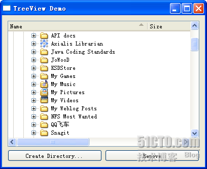

# 四十三、QDirModel

今天我们来看一个很有用的 model：QDirModel。这个 model 允许我们在 view 中显示操作系统的目录结构。这次让我们先来看看运行结果：



这个界面很熟悉吧？不过这可不是由 QFileDialog 打开的哦，这是我们自己实现的。而提供这种实现支持的，就是 QDirModel 和 QTreeView。我们来看一下代码。

mytreeview.h

```cpp

 #ifndef MYLISTVIEW_H 

 #define MYLISTVIEW_H 

 #include <QtGui> 

class MyTreeView : public QWidget 
{ 
        Q_OBJECT 
public: 
        MyTreeView(); 

private: 
        QDirModel *model; 
        QTreeView *treeView; 

private slots: 
        void mkdir(); 
        void rm(); 
}; 

 #endif // MYLISTVIEW_H
```

mytreeview.cpp

```cpp

 #include "mylistview.h" 

MyTreeView::MyTreeView() 
{ 
        model = new QDirModel; 
        model->setReadOnly(false); 
        model->setSorting(QDir::DirsFirst | QDir::IgnoreCase | QDir::Name); 

        treeView = new QTreeView; 
        treeView->setModel(model); 
        treeView->header()->setStretchLastSection(true); 
        treeView->header()->setSortIndicator(0, Qt::AscendingOrder); 
        treeView->header()->setSortIndicatorShown(true); 
        treeView->header()->setClickable(true); 

        QModelIndex index = model->index(QDir::currentPath()); 
        treeView->expand(index); 
        treeView->scrollTo(index); 
        treeView->resizeColumnToContents(0); 

        QHBoxLayout *btnLayout = new QHBoxLayout; 
        QPushButton *createBtn = new QPushButton(tr("Create Directory...")); 
        QPushButton *delBtn = new QPushButton(tr("Remove")); 
        btnLayout->addWidget(createBtn); 
        btnLayout->addWidget(delBtn); 
        QVBoxLayout *mainLayout = new QVBoxLayout(this); 
        mainLayout->addWidget(treeView); 
        mainLayout->addLayout(btnLayout); 
        this->setLayout(mainLayout); 

        connect(createBtn, SIGNAL(clicked()), this, SLOT(mkdir())); 
        connect(delBtn, SIGNAL(clicked()), this, SLOT(rm())); 
}
```

```cpp

void MyTreeView::mkdir() 
{ 
        QModelIndex index = treeView->currentIndex(); 
        if (!index.isValid()) { 
                return; 
        } 
        QString dirName = QInputDialog::getText(this, 
                                                                                        tr("Create Directory"), 
                                                                                        tr("Directory name")); 
        if (!dirName.isEmpty()) { 
                if (!model->mkdir(index, dirName).isValid()) { 
                        QMessageBox::information(this, 
                                                                         tr("Create Directory"), 
                                                                         tr("Failed to create the directory")); 
                } 
        } 
}
```

```cpp

void MyTreeView::rm() 
{ 
        QModelIndex index = treeView->currentIndex(); 
        if (!index.isValid()) { 
                return; 
        } 
        bool ok; 
        if (model->fileInfo(index).isDir()) { 
                ok = model->rmdir(index); 
        } else { 
                ok = model->remove(index); 
        } 
        if (!ok) { 
                QMessageBox::information(this, 
                                                                 tr("Remove"), 
                                                                 tr("Failed to remove %1").arg(model->fileName(index))); 
        } 
}
```

构造函数中，首先我们创建了 QDirModel 的一个对象，并且设置 ReadOnly 为 false，也就是说我们可以对其进行修改。而下一个 setSorting()函数是对其进行排序，排序的依据也很清楚：文件夹优先(QDir::DirsFirst)，忽略大小写(QDir::IgnoreCase)，而且是根据名字排序(QDir::Name)。更多的规则组合可以参见 API 文档了。

然后我们创建一个 QTreeView 实例，并且把 model 设置为刚刚的 QDirModel 实例。然后我们开始设置 QTreeView 的相关属性。首先把 stretchLastSection 设置为 true。如果把这个属性设置为 true，就是说，当 QTreeView 的宽度大于所有列宽之和时，最后一列的宽度自动扩展以充满最后的边界；否则就让最后一列的宽度保持原始大小。第二个 setSortIndicator()函数是设置哪一列进行排序。由于我们前面设置了 model 是按照名字排序，所以我们这个传递的第一个参数是 0，也就是第 1 列。setSortIndicatorShown()函数设置显示列头上面的排序小箭头。setClickable(true)则允许鼠标点击列头。这样，我们的 QTreeView 就设置完毕了。最后，我们通过 QDir::currentPath()获取当前 exe 文件运行时路径，并把这个路径当成程序启动时显示的路径。expand()函数即展开这一路径；scrollTo()函数是把视图的视口滚动到这个路径的位置；resizeColumnToContents()是要求把列头适应内容的宽度，也就是不产生...符号。这样，我们就通过一系列的参数设置好了 QTreeView，让它能够为我们展示目录结构。

至于后面的两个 slot，其实并不能理解。第一个 mkdir()函数就是创建一个文件夹。

```cpp

void MyTreeView::mkdir() 
{ 
        QModelIndex index = treeView->currentIndex(); 
        if (!index.isValid()) { 
                return; 
        } 
        QString dirName = QInputDialog::getText(this, 
                                                                                        tr("Create Directory"), 
                                                                                        tr("Directory name")); 
        if (!dirName.isEmpty()) { 
                if (!model->mkdir(index, dirName).isValid()) { 
                        QMessageBox::information(this, 
                                                                         tr("Create Directory"), 
                                                                         tr("Failed to create the directory")); 
                } 
        } 
}
```

正如它的代码所示，首先获取选择的目录。后面这个 isValid()的判断很重要，因为默认情况下是没有目录被选择的，此时这个路径是非法的，为了避免程序出现异常，必须要有这一步判断。然后会弹出对话框询问新的文件夹名字，如果创建失败会有提示，否则就是创建成功。这时候你就可以到硬盘上的实际位置看看啦！

删除目录的代码也很类似：

```cpp

void MyTreeView::rm() 
{ 
        QModelIndex index = treeView->currentIndex(); 
        if (!index.isValid()) { 
                return; 
        } 
        bool ok; 
        if (model->fileInfo(index).isDir()) { 
                ok = model->rmdir(index); 
        } else { 
                ok = model->remove(index); 
        } 
        if (!ok) { 
                QMessageBox::information(this, 
                                                                 tr("Remove"), 
                                                                 tr("Failed to remove %1").arg(model->fileName(index))); 
        } 
}
```

同样需要实现检测路径是否合法。另外需要注意的是，目录和文件的删除不是一个函数，需要调用 isDir()函数检测。这一步在代码中有很清楚的描述，这里就不再赘述了。

注意，QDirModel 在最新版 Qt 中已经不建议使用了。文档中说使用 QFileSystemModel 代替。由于这两者的函数几乎一样，所以就没有对代码进行修改。与 QDirModel 不同的是，QFileSystemModel 会启动自己的线程进行文件夹的扫描，因此不会发生因扫描文件夹而导致的主线程阻塞的现象。另外，无论 QDirModel 还是 QFileSystemModel 都会对 model 结果进行缓存，如果你要立即刷新结果，前者提供了 refresh()函数，而后者会通知 QFileSystemWatcher 类。

本文出自 “豆子空间” 博客，请务必保留此出处 [`devbean.blog.51cto.com/448512/193918`](http://devbean.blog.51cto.com/448512/193918)