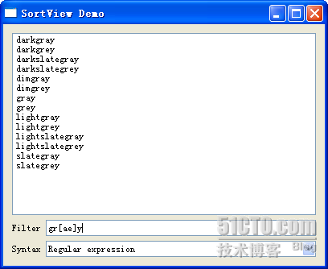

# 四十四、QSortFilterProxyModel

Qt 为我们预定义了很多 model，前面已经说过了 QStringListModel、QDirModel(也算是 Qt 推荐使用的 QFileSystemModel 吧，这个在上一章最后重新加上了一段话，没有注意的朋友去看看哦)。今天我们要说的这个 QSortFilterProxyModel 并不能单独使用，看它的名字就会知道，它只是一个“代理”，真正的数据需要另外的一个 model 提供，并且它是用来排序和过滤的。所谓过滤，也就是说按照你输入的内容进行数据的筛选，很像 Excel 里面的过滤器。不过 Qt 提供的过滤功能是基于正则表达式的，因而功能强大。

我们从代码开始看起：

sortview.h

```cpp

 #ifndef SORTVIEW_H 

 #define SORTVIEW_H 

 #include <QtGui> 

class SortView : public QWidget 
{ 
        Q_OBJECT 
public: 
        SortView(); 

private: 
        QListView *view; 
        QStringListModel *model; 
        QSortFilterProxyModel *modelProxy; 
        QComboBox *syntaxBox; 

private slots: 
        void filterChanged(QString text); 
}; 

 #endif // SORTVIEW_H
```

sortview.cpp

```cpp

 #include "sortview.h" 

SortView::SortView() 
{ 
        model = new QStringListModel(QColor::colorNames(), this); 

        modelProxy = new QSortFilterProxyModel(this); 
        modelProxy->setSourceModel(model); 
        modelProxy->setFilterKeyColumn(0); 

        view = new QListView(this); 
        view->setModel(modelProxy); 

        QLineEdit *filterInput = new QLineEdit; 
        QLabel *filterLabel = new QLabel(tr("Filter")); 
        QHBoxLayout *filterLayout = new QHBoxLayout; 
        filterLayout->addWidget(filterLabel); 
        filterLayout->addWidget(filterInput); 

        syntaxBox = new QComboBox; 
        syntaxBox->setSizePolicy(QSizePolicy::Expanding, QSizePolicy::Preferred); 
        syntaxBox->addItem(tr("Regular expression"), QRegExp::RegExp); 
        syntaxBox->addItem(tr("Wildcard"), QRegExp::Wildcard); 
        syntaxBox->addItem(tr("Fixed string"), QRegExp::FixedString); 
        QLabel *syntaxLabel = new QLabel(tr("Syntax")); 
        QHBoxLayout *syntaxLayout = new QHBoxLayout; 
        syntaxLayout->addWidget(syntaxLabel); 
        syntaxLayout->addWidget(syntaxBox); 

        QVBoxLayout *layout = new QVBoxLayout(this); 
        layout->addWidget(view); 
        layout->addLayout(filterLayout); 
        layout->addLayout(syntaxLayout); 

        connect(filterInput, SIGNAL(textChanged(QString)), this, SLOT(filterChanged(QString))); 
}
```

```cpp

void SortView::filterChanged(QString text) 
{ 
        QRegExp::PatternSyntax syntax = QRegExp::PatternSyntax( 
                        syntaxBox->itemData(syntaxBox->currentIndex()).toInt()); 
        QRegExp regExp(text, Qt::CaseInsensitive, syntax); 
        modelProxy->setFilterRegExp(regExp); 
}
```

至于 main()函数的内容，由于和前面的代码几乎是一样的，这里就不再贴出来了。我们使用的是 QColor::colorNames()函数提供的数据。这个函数返回值是一个 QStringList 类型的变量，可以给出预定义的颜色的名字。我们使用一个 QStringListModel 包装这个数据，这和前面的内容没有什么区别。然后创建一个 QSortFilterProxyModel 对象，使用它的 setSourceModel()函数将前面定义的 QStringListModel 传进去，也就是我们需要对这个 model 进行代理。那么我们需要过滤哪一列呢？虽然 QStringListModel 只有一列，但是我们也需要使用 setFilterKeyColumn()函数设置一下，以便让这个 proxy 知道要过滤的是第 0 列。最后重要的一点是，QListView 的 model 必须设置为 QSortFilterProxyModel，否则是看不到效果的。

下面的 QLineEdit 提供过滤数据的输入，这个没什么好说的。后面的 QComboBox 列出了三项：

```cpp

syntaxBox->addItem(tr("Regular expression"), QRegExp::RegExp); 
syntaxBox->addItem(tr("Wildcard"), QRegExp::Wildcard); 
syntaxBox->addItem(tr("Fixed string"), QRegExp::FixedString);
```

这是正则表达式的类型。正则表达式有一套通用的语法，但是对于不同的环境，正则表达式的规则可能是不一样的。第一个 QregExp::RegExp 提供了最一般的正则表达式语法，不过这个语法不支持贪婪限定符。这也是 Qt 默认的规则。如果你需要使用贪婪限定符，需要使用 QRegExp::RegExp2，根据文档描述，这个将会是 Qt5 的默认规则。第二个是 Unix 下 shell 很常见的一种规则。第三个即固定表达式，也就是说基本上不使用正则表达式的。

我们使用 connect()函数，将 QLineEdit 的 textChanged()信号同 slot 连接起来。其中我们的 slot 函数如下所示：

```cpp

void SortView::filterChanged(QString text) 
{ 
        QRegExp::PatternSyntax syntax = QRegExp::PatternSyntax( 
                        syntaxBox->itemData(syntaxBox->currentIndex()).toInt()); 
        QRegExp regExp(text, Qt::CaseInsensitive, syntax); 
        modelProxy->setFilterRegExp(regExp); 
}
```

第一步，使用 QComboBox 的选择值创建一个 QRegExp::PatternSyntax 对象，然后利用这个语法规则构造一个正则表达式，注意我们在 QLineEdit 里面输入的内容是通过参数传递进来的，然后设置 proxy 的过滤器的表达式。好了，就这样运行一下看看效果吧！



本文出自 “豆子空间” 博客，请务必保留此出处 [`devbean.blog.51cto.com/448512/193918`](http://devbean.blog.51cto.com/448512/193918)