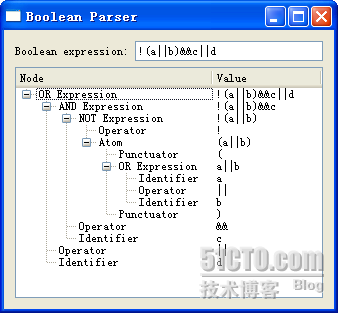

# 四十七、自定义 Model 之三

今天来说的是自定义 model 中最复杂的例子。这个例子同样也是出自 C++ GUI Programming with Qt 4, 2nd Edition 这本书。

这个例子是将布尔表达式分析成一棵树。这个分析过程在离散数学中经常遇到，特别是复杂的布尔表达式，类似的分析可以比较方便的进行表达式化简、求值等一系列的计算。同样，这个技术也可以很方便的分析一个表达式是不是一个正确的布尔表达式。在这个例子中，一共有四个类：

Node：组成树的节点； BooleaModel：布尔表达式的 model，实际上是一个 tree model，用于将布尔表达式表示成一棵树； BooleanParser：将布尔表达式生成分析树的分析器； BooleanWindow：输入布尔表达式并进行分析，展现成一棵树。

这个例子可能是目前为止最复杂的一个了，所以先来看看最终的结果，以便让我们心中有数：



先来看这张图片，我们输入的布尔表达式是!(a||b)&&c||d, 在下面的 Node 栏中，用树的形式将这个表达式分析了出来。如果你熟悉编译原理，这个过程很像词法分析的过程：将一个语句分析称一个一个独立的词素。

我们从最底层的 Node 类开始看起，一步步构造这个程序。

Node.h

```cpp

class Node 
{ 
public: 
        enum Type 
        { 
                Root, 
                OrExpression, 
                AndExpression, 
                NotExpression, 
                Atom, 
                Identifier, 
                Operator, 
                Punctuator 
        }; 

        Node(Type type, const QString &str = ""); 
        ~Node(); 

        Type type; 
        QString str; 
        Node *parent; 
        QList<Node *> children; 
};
```

Node.cpp

```cpp

Node::Node(Type type, const QString &str) 
{ 
        this->type = type; 
        this->str = str; 
        parent = 0; 
} 

Node::~Node() 
{ 
        qDeleteAll(children); 
}
```

Node 很像一个典型的树的节点：一个 Node 指针类型的 parent 属性，保存父节点；一个 QString 类型的 str，保存数据。另外，Node 里面还有一个 Type 属性，指明这个 Node 的类型，是一个词素，还是操作符，或者其他什么东西；children 是一个 QList<node>类型的列表，保存这个 node 的子节点。注意，在 Node 类的析构函数中，使用了 qDeleteAll()这个全局函数。这个函数是将[start, end)范围内的所有元素进行 delete。因此，它的参数的元素必须是指针类型的。并且，这个函数使用 delete 之后并不会将指针赋值为 0，所以，如果要在析构函数之外调用这个函数，建议在调用之后显示的调用 clear()函数，将所有子元素的指针清为 0.</node>

在构造完子节点之后，我们开始构造 model：

booleanmodel.h

```cpp

class BooleanModel : public QAbstractItemModel 
{ 
public: 
        BooleanModel(QObject *parent = 0); 
        ~BooleanModel(); 

        void setRootNode(Node *node); 

        QModelIndex index(int row, int column, 
                                            const QModelIndex &parent) const; 
        QModelIndex parent(const QModelIndex &child) const; 

        int rowCount(const QModelIndex &parent) const; 
        int columnCount(const QModelIndex &parent) const; 
        QVariant data(const QModelIndex &index, int role) const; 
        QVariant headerData(int section, Qt::Orientation orientation, 
                                                int role) const; 
private: 
        Node *nodeFromIndex(const QModelIndex &index) const; 

        Node *rootNode; 
};
```

booleanmodel.cpp

```cpp

BooleanModel::BooleanModel(QObject *parent) 
        : QAbstractItemModel(parent) 
{ 
        rootNode = 0; 
} 

BooleanModel::~BooleanModel() 
{ 
        delete rootNode; 
} 

void BooleanModel::setRootNode(Node *node) 
{ 
        delete rootNode; 
        rootNode = node; 
        reset(); 
} 

QModelIndex BooleanModel::index(int row, int column, 
                                                                const QModelIndex &parent) const 
{ 
        if (!rootNode || row < 0 || column < 0) 
                return QModelIndex(); 
        Node *parentNode = nodeFromIndex(parent); 
        Node *childNode = parentNode->children.value(row); 
        if (!childNode) 
                return QModelIndex(); 
        return createIndex(row, column, childNode); 
} 

Node *BooleanModel::nodeFromIndex(const QModelIndex &index) const 
{ 
        if (index.isValid()) { 
                return static_cast<Node *>(index.internalPointer()); 
        } else { 
                return rootNode; 
        } 
} 

int BooleanModel::rowCount(const QModelIndex &parent) const 
{ 
        if (parent.column() > 0) 
                return 0; 
        Node *parentNode = nodeFromIndex(parent); 
        if (!parentNode) 
                return 0; 
        return parentNode->children.count(); 
} 

int BooleanModel::columnCount(const QModelIndex & /* parent */) const 
{ 
        return 2; 
} 

QModelIndex BooleanModel::parent(const QModelIndex &child) const 
{ 
        Node *node = nodeFromIndex(child); 
        if (!node) 
                return QModelIndex(); 
        Node *parentNode = node->parent; 
        if (!parentNode) 
                return QModelIndex(); 
        Node *grandparentNode = parentNode->parent; 
        if (!grandparentNode) 
                return QModelIndex(); 

        int row = grandparentNode->children.indexOf(parentNode); 
        return createIndex(row, 0, parentNode); 
} 

QVariant BooleanModel::data(const QModelIndex &index, int role) const 
{ 
        if (role != Qt::DisplayRole) 
                return QVariant(); 

        Node *node = nodeFromIndex(index); 
        if (!node) 
                return QVariant(); 

        if (index.column() == 0) { 
                switch (node->type) { 
                case Node::Root: 
                         return tr("Root"); 
                case Node::OrExpression: 
                        return tr("OR Expression"); 
                case Node::AndExpression: 
                        return tr("AND Expression"); 
                case Node::NotExpression: 
                        return tr("NOT Expression"); 
                case Node::Atom: 
                        return tr("Atom"); 
                case Node::Identifier: 
                        return tr("Identifier"); 
                case Node::Operator: 
                        return tr("Operator"); 
                case Node::Punctuator: 
                        return tr("Punctuator"); 
                default: 
                        return tr("Unknown"); 
                } 
        } else if (index.column() == 1) { 
                return node->str; 
        } 
        return QVariant(); 
} 

QVariant BooleanModel::headerData(int section, 
                                                                    Qt::Orientation orientation, 
                                                                    int role) const 
{ 
        if (orientation == Qt::Horizontal && role == Qt::DisplayRole) { 
                if (section == 0) { 
                        return tr("Node"); 
                } else if (section == 1) { 
                        return tr("Value"); 
                } 
        } 
        return QVariant(); 
}
```

现在，我们继承了 QAbstractItemModel。之所以不继承前面说的 QAbstractListModel 或者 QAbstractTableModel，是因为我们要构造一个 tree model，而这个 model 是有层次结构的。所以，我们直接继承了那两个类的基类。在构造函数中，我们把根节点的指针赋值为 0，因此我们提供了另外的一个函数 setRootNode()，将根节点进行有效地赋值。而在析构中，我们直接使用 delete 操作符将这个根节点 delete 掉。在 setRootNode()函数中，首先我们 delete 掉原有的根节点，再将根节点赋值，然后调用 reset()函数。这个函数将通知所有的 view 对界面进行重绘，以表现最新的数据。

使用 QAbstractItemModel，我们必须重写它的五个纯虚函数。首先是 index()函数。这个函数在 QAbstractTableModel 或者 QAbstractListModel 中不需要覆盖，因此那两个类已经重写过了。但是，我们继承 QAbstractItemModel 时必须覆盖。这个函数的签名如下：

```cpp

virtual QModelIndex index(int row, int column, const QModelIndex &parent = QModelIndex()) const = 0;
```

这是一个纯虚函数，用于返回第 row 行，第 column 列，父节点为 parent 的那个元素的 QModelIndex 对象。对于 tree model，我们关注的是 parent 参数。看一下我们的实现：

```cpp

QModelIndex BooleanModel::index(int row, int column, 
                                                                const QModelIndex &parent) const 
{ 
        if (!rootNode || row < 0 || column < 0) 
                return QModelIndex(); 
        Node *parentNode = nodeFromIndex(parent); 
        Node *childNode = parentNode->children.value(row); 
        if (!childNode) 
                return QModelIndex(); 
        return createIndex(row, column, childNode); 
}
```

如果 rootNode 或者 row 或者 column 非法，返回一个非法的 QModelIndex。然后使用 nodeFromIndex()函数取得索引为 parent 的节点，然后我们使用 children 属性(这是我们前面定义的 Node 里面的属性)获得子节点。如果子节点不存在，返回一个非法值。最后，当是一个有效值时，由 createIndex()函数返回有效地 QModelIndex 对象。

对于具有层次结构的 model 来说，只有 row 和 column 值是不能确定这个元素的位置的，因此，QModelIndex 中除了 row 和 column 之外，还有一个 void*或者 int 的空白属性，可以存储一个值。在这里我们就把父节点的指针存入，这样，就可以由这三个属性定位这个元素。因此，createIndex()中第三个参数就是这个内部的指针。所以我们自己定义一个 nodeFromIndex()函数的时候要注意使用 QModelIndex 的 internalPointer()函数获得这个内部指针，从而定位我们的 node。

后面的 rowCount()和 columnCount()这两个函数比较简单，就是要获得 model 的行和列的值。由于我们的 model 定义成 2 列，所以在 columnCount()函数中始终返回 2.

parent()函数要返回子节点的父节点的索引，我们要从子节点开始寻找，直到找到父节点的父节点，这样就能定位到父节点，从而得到子节点的位置。而 data()函数要返回每个单元格的返回值，经过前面两个例子，我想这个函数已经不会有很大的困难了的。headerData()函数返回列头的名字，同前面一样，这里就不再赘述了。

前面的代码很长，BooleanWindow 部分就很简单了。就是把整个 view 和 model 组合起来。另外的一个 BooleanParser 类没有什么 GUI 方面的代码，是纯粹的算法问题。如果我看得没错的话，这里应该使用的是编译原理里面的递归下降词法分析，有兴趣的朋友可以到网上查一下相关的资料。我想在以后的《自己动手写编译器》中再详细介绍这个算法。

好了，今天的内容很多，为了方便大家查看和编译代码，我已经把这接种出现的所有代码打包传到附件中。

本文出自 “豆子空间” 博客，请务必保留此出处 [`devbean.blog.51cto.com/448512/193918`](http://devbean.blog.51cto.com/448512/193918)