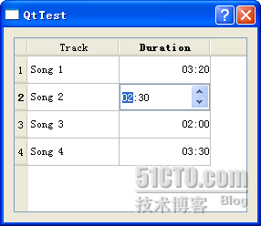

# 四十八、自定义委托

好久没有来写文章了，由于家里面宽带断了，所以一直没能更新，今天现在写上一篇。

还是继续前面的内容。前面我们分三次把自定义 model 说完了，其实主要还是那三个实例。在 model/view 架构中，与 model 同等重要的就是 view。

我们知道，在经典的 MVC 模型中，view 用于向用户展示 model 的数据。但是，Qt 提供的不是 MVC 三层架构，而是一个 model/view 设计。这种设计并没有包含一个完整而独立的组件用于管理用户的交互。一般来说，view 仅仅是用作对 model 数据的展示和对用户输入的处理，而不应该去做其他的工作。在这种结构中，为了获得对用户输入控制的灵活性，这种交互工作交给了 delegate，也就是“委托”，去完成。简单来说，就像它们的名字一样，view 将用户输入委托给 delegate 处理，而自己不去处理这种输入。这些组件提供一种输入能力，并且能够在某些 view 中提供这种交互情形下的渲染，比如在 table 中通过双击单元格即可编辑内容等。对这种控制委托的标准接口被定义在 QAbstractItemDelegate 类中。

delegate 可以用于渲染内容，这是通过 paint() 和 sizeHint() 函数来完成的。但是，对于一些简单的基于组件的 delegate，可以通过继承 QItemDelegate 或者 QStyledItemDelegate 来实现。这样就可以避免要完全重写 QAbstractItemDelegate 中所需要的所有函数。对于一些相对比较通用的函数，在这两个类中已经有了一个默认的实现。

Qt 提供的标准组件使用 QItemDelegate 提供编辑功能的支持。这种默认的实现被用在 QListView，QTableView 和 QTreeView 之中。view 实用的 delegate 可以通过 itemDelegate() 函数获得。setItemDelegate() 函数则可以为一个标准组件设置自定义的 delegate。

Qt 4.4 版本之后提供了两个可以被继承的 delegate 类：QItemDelegate 和 QStyledItemDelegate。默认的 delegate 是 QStyledItemDelegate。这两个类可以被相互替代，用于给 view 组件提供绘制和编辑的功能。它们之间的主要区别在于，QStyledItemDelegate 使用当前的风格(style)去绘制组件。所以，在自定义 delegate 或者需要使用 Qt style sheets 时，建议使用 QStyledItemDelegate 作为父类。使用这两个类的代码通常是一样的，除了需要使用 style 进行绘制的部份。如果你希望为 view item 自定义绘制函数，最好实现一个自定义的 style。这个你可以通过 QStyle 类来实现。

如果 delegate 没有支持为你的数据类型进行绘制，或者你希望自己绘制 item，那么就可以继承 QStyledItemDelegate 类，并且重写 paint() 或者还需要重写 sizeHint() 函数。paint() 函数会被每一个 item 独立调用，而 sizeHint()函数则可以定义每一个 item 的大小。在重写 paint() 函数的时候，通常需要用 if 语句找到你需要进行渲染的数据类型并进行绘制，其他的数据类型需要调用父类的实现进行绘制。

一个自定义的 delegate 也可以直接提供一个编辑器，而不是使用内置的编辑器工厂(editor item factory)。如果你需要这种功能，那么需要实现一下几个函数： createEditor(): 返回修改数据的组件； setEditorData(): 为 editor 提供编辑的原始数据； updateEditorGeometry(): 保证 editor 显示在 item view 的合适位置以及大小； setModelData(): 根据 editor 的数据更新 model 的数据。 好了，这就是一个自定义 delegate 的实现了。下面来看一个例子。

这是一个歌曲及其时间的例子。使用的是 QTableWidget，一共有两列，第一列是歌曲名字，第二列是歌曲持续的时间。为了表示这个数据，我们建立一个 Track 类：

track.h

```cpp

 #ifndef TRACK_H 
 #define TRACK_H 

 #include <QtCore> 

class Track 
{ 
public: 
        Track(const QString &title = "", int duration = 0); 

        QString title; 
        int duration; 
}; 

 #endif // TRACK_H
```

track.cpp

```cpp

 #include "track.h" 

Track::Track(const QString &title, int duration) 
        : title(title), duration(duration) 
{ 
}
```

这个类的构造函数没有做任何操作，只是把 title 和 duration 这两个参数通过构造函数初始化列表赋值给内部的成员变量。注意，现在这两个成员变量都是 public 的，在正式的程序中应该声明为 private 的才对。然后来看 TrackDelegate 类：

trackdelegate.h

```cpp

 #ifndef TRACKDELEGATE_H 

 #define TRACKDELEGATE_H 

 #include <QtGui> 

class TrackDelegate : public QStyledItemDelegate 
{ 
        Q_OBJECT 

public: 
        TrackDelegate(int durationColumn, QObject *parent = 0); 

        void paint(QPainter *painter, const QStyleOptionViewItem &option, const QModelIndex &index) const; 
        QWidget *createEditor(QWidget *parent, const QStyleOptionViewItem &option, const QModelIndex &index) const; 
        void setEditorData(QWidget *editor, const QModelIndex &index) const; 
        void setModelData(QWidget *editor, QAbstractItemModel *model, const QModelIndex &index) const; 

private slots: 
        void commitAndCloseEditor(); 

private: 
        int durationColumn; 
}; 

 #endif // TRACKDELEGATE_H
```

trackdelegate.cpp

```cpp

 #include "trackdelegate.h" 

TrackDelegate::TrackDelegate(int durationColumn, QObject *parent) 
        : QStyledItemDelegate(parent) 
{ 
        this->durationColumn = durationColumn; 
} 

void TrackDelegate::paint(QPainter *painter, const QStyleOptionViewItem &option, const QModelIndex &index) const 
{ 
        if (index.column() == durationColumn) { 
                int secs = index.model()->data(index, Qt::DisplayRole).toInt(); 
                QString text = QString("%1:%2").arg(secs / 60, 2, 10, QChar('0')).arg(secs % 60, 2, 10, QChar('0')); 
                QTextOption o(Qt::AlignRight | Qt::AlignVCenter); 
                painter->drawText(option.rect, text, o); 
        } else { 
                QStyledItemDelegate::paint(painter, option, index); 
        } 
} 

QWidget *TrackDelegate::createEditor(QWidget *parent, const QStyleOptionViewItem &option, const QModelIndex &index) const 
{ 
        if (index.column() == durationColumn) { 
                QTimeEdit *timeEdit = new QTimeEdit(parent); 
                timeEdit->setDisplayFormat("mm:ss"); 
                connect(timeEdit, SIGNAL(editingFinished()), this, SLOT(commitAndCloseEditor())); 
                return timeEdit; 
        } else { 
                return QStyledItemDelegate::createEditor(parent, option, index); 
        } 
} 

void TrackDelegate::commitAndCloseEditor() 
{ 
        QTimeEdit *editor = qobject_cast<QTimeEdit *>(sender()); 
        emit commitData(editor); 
        emit closeEditor(editor); 
} 

void TrackDelegate::setEditorData(QWidget *editor, const QModelIndex &index) const 
{ 
        if (index.column() == durationColumn) { 
                int secs = index.model()->data(index, Qt::DisplayRole).toInt(); 
                QTimeEdit *timeEdit = qobject_cast<QTimeEdit *>(editor); 
                timeEdit->setTime(QTime(0, secs / 60, secs % 60)); 
        } else { 
                QStyledItemDelegate::setEditorData(editor, index); 
        } 
} 

void TrackDelegate::setModelData(QWidget *editor, QAbstractItemModel *model, const QModelIndex &index) const 
{ 
        if (index.column() == durationColumn) { 
                QTimeEdit *timeEdit = qobject_cast<QTimeEdit *>(editor); 
                QTime time = timeEdit->time(); 
                int secs = (time.minute() * 60) + time.second(); 
                model->setData(index, secs); 
        } else { 
                QStyledItemDelegate::setModelData(editor, model, index); 
        } 
}
```

正如前面所说的，这个类继承了 QStyledItemDelegate，覆盖了其中的四个函数。通过前面的讲解，我们已经了解到这些函数的作用。至于实现，我们前面也说过，需要通过 QModelIndex 选择我们需要进行渲染的列，然后剩下的数据类型仍然需要显式地调用父类的相应函数。由于我们在 Track 里面存储的是歌曲的秒数，所以在 paint()里面需要用除法计算出分钟数，用%60 计算秒数。其他的函数都比较清楚，请注意代码。

最后写一个使用的类：

trackeditor.h

```cpp

 #ifndef TRACKEDITOR_H 

 #define TRACKEDITOR_H 

 #include <QtGui> 

 #include "track.h" 

class TrackEditor : public QDialog 
{ 
        Q_OBJECT 

public: 
        TrackEditor(QList<Track> *tracks, QWidget *parent); 

private: 
        QList<Track> *tracks; 
        QTableWidget *tableWidget; 
}; 

 #endif // TRACKEDITOR_H
```

trackeditor.cpp

```cpp

 #include "trackeditor.h" 

 #include "trackdelegate.h" 

TrackEditor::TrackEditor(QList<Track> *tracks, QWidget *parent) 
        : QDialog(parent) 
{ 
        this->tracks = tracks; 

        tableWidget = new QTableWidget(tracks->count(), 2); 
        tableWidget->setItemDelegate(new TrackDelegate(1)); 
        tableWidget->setHorizontalHeaderLabels(QStringList() << tr("Track") << tr("Duration")); 

        for (int row = 0; row < tracks->count(); ++row) { 
                Track track = tracks->at(row); 

                QTableWidgetItem *item0 = new QTableWidgetItem(track.title); 
                tableWidget->setItem(row, 0, item0); 

                QTableWidgetItem *item1 = new QTableWidgetItem(QString::number(track.duration)); 
                item1->setTextAlignment(Qt::AlignRight); 
                tableWidget->setItem(row, 1, item1); 
        } 

        QVBoxLayout *mainLayout = new QVBoxLayout; 
        mainLayout->addWidget(tableWidget); 
        this->setLayout(mainLayout); 
}
```

其实也并没有很大的不同，只是我们使用 setItemDelegate()函数设置了一下 delegate。然后写 main()函数：

```cpp

 #include <QtGui> 

 #include "trackeditor.h" 

int main(int argc, char *argv[]) 
{ 
        QApplication a(argc, argv); 
        QList<Track> tracks; 
        Track t1("Song 1", 200); 
        Track t2("Song 2", 150); 
        Track t3("Song 3", 120); 
        Track t4("Song 4", 210); 
        tracks << t1 << t2 << t3 << t4; 
        TrackEditor te(&tracks, NULL); 
        te.show(); 
        return a.exec(); 
}
```

好了，运行一下看看效果吧！



本文出自 “豆子空间” 博客，请务必保留此出处 [`devbean.blog.51cto.com/448512/193918`](http://devbean.blog.51cto.com/448512/193918)