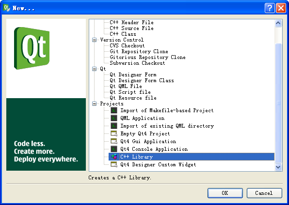
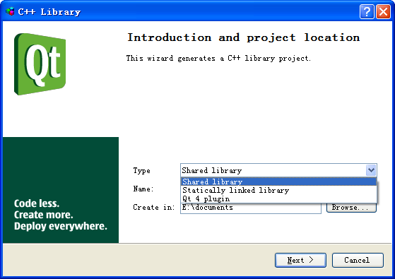

# 六十一、创建 shared library

前段时间说了 Qt 一些类库的使用，今天来换一下口味，来看一下程序设计的问题。今天来说的是关于共享库 shared library。

如果你打开一些 Windows 应用程序的目录，你会发现有很多程序的 exe 文件都很小，大约几百 K 的样子，并且目录中不仅仅只有一个 exe 文件，还包含着一大堆 dll 文件。这些 dll 其实就是一些共享库，所谓共享库，其实就是一些动态链接库，能够由程序在运行时进行动态加载的库。既然说是共享，那就是说，这些库不仅仅自己的程序可以使用，并且其他程序也可以使用，例如某些通用算法。如果你发布一下自己编写的 Qt 程序，也会看到很多系统的共享库，就是那些 QtGui.dll 之类的东西。或许你会说，我写的程序没有同其他应用共享的库，就不需要这些了吧！其实不然。因为共享库的一个好处是可以动态加载，也就是说，如果你需要升级程序，那么就要简单的替换掉这个 dll 就好了，不需要要求用户重新安装全部文件。当然，这些 dll 也是有缺点的：动态加载的东西肯定会比静态编译的东西效率低一些。不过在现在的硬件环境下，这点性能损失已经可以忽略不计了。

今天我们要说的就是如何用 Qt 创建共享库代码。

我们还是使用 QtCreator。在创建工程的时候，我们选择下面的 C++ Library 一项，然后点击 OK。



在接下来的对话框中，有一个下拉列表，分别是 Shared Library（共享库），Statically Linked Library（静态链接库）和 Qt 4 Plugin（Qt 4 插件）。我们选择第一个共享库，后面的步骤中会要求选择加入哪几个 Qt 模块，和前面一样，选择自己需要的部分，最后完成工程的创建。



我们会看到 QtCreator 已经帮我们创建好了一些文件。其中有一个 {projectName}_global.h 的文件是 QtCreator 替我们创建的。下面我们就从这个 {projectName}_global.h 开始：

```cpp

 #ifndef LIB_GLOBAL_H  

 #define LIB_GLOBAL_H  

 #include <QtCore/qglobal.h>  

 #if defined(LIB_LIBRARY)  

 #  define LIBSHARED_EXPORT Q_DECL_EXPORT  

 #else  

 #  define LIBSHARED_EXPORT Q_DECL_IMPORT  

 #endif  

 #endif // LIB_GLOBAL_H
```

这个文件中只是定义了两个宏 LIBSHARED_EXPORT，注意这里的 LIB 就是我的工程名字。如果定义了 LIB_LIBRARY，LIBSHARED_EXPORT 定义为 Q_DECL_EXPORT，否则定义为 Q_DECL_IMPORT。看这个名字，就知道这就是把对象导出的语句了。下面我们来编写一个窗口（如果你希望这么做，不要忘记在创建工程时勾选 QtGui 模块，默认是不勾选的）：

lib.h

```cpp

 #ifndef LIB_H  

 #define LIB_H  

 #include <QMainWindow>  

 #include "lib_global.h"  

class LIBSHARED_EXPORT MainWindow : public QMainWindow {  
public:  
    MainWindow(QWidget *parent = 0);  
};  

 #endif // LIB_H
```

lib.cpp

```cpp

 #include "lib.h"  

MainWindow::MainWindow(QWidget *parent)  
    : QMainWindow(parent)  
{  
}
```

代码很简单，就是创建一个 MainWindow。同前面的代码唯一不同的是，在头文件中，使用了 LIBSHARED_EXPORT 这个宏。你可以简单的把它理解成，我需要把这个类 MainWindow 导出。所谓导出，就是将其编译成一个 dll 文件之后，其他的类可以使用这个导出类。好了，下面和原来一样，编译一下这个工程。在 debug 文件夹下你得到的是一个 lib.dll 文件和 liblib.a。后者是 Linux 下使用的库，这里不再详述。

好了，我们要去使用这个 dll 了。新建另外一个工程，需要吧 .pro 文件修改一下：

```cpp

TARGET = test  
TEMPLATE = app  

SOURCES += main.cpp  

INCLUDEPATH += ../  

LIBS += ../debug/lib.dll
```

首先，我们添加了 INCLUDEPATH 这一行。这一行就是为了让我们的 test 项目可以找到 lib.h 和 lib_global.h 这两个文件，你需要把这里的路径替换成符合你的工程的路径。LIBS 这一行则需要告诉编译器（注意，这里是编译器！）到哪里去找到这个 dll 文件。然后我们编写 main.cpp：

```cpp

 #include <QtGui/QApplication>  

 #include "lib.h"  

int main(int argc, char *argv[])  
{  
    QApplication a(argc, argv);  
    MainWindow w;  
    w.show();  
    return a.exec();  
}
```

注意，我们使用了 lib.h，但是这个文件并没有在 HEADERS 里面声明，Qt 实际上就是从 INCLUDEPATH 这里去找到这个文件。MainWindow 在新建的 test 工程中并没有声明，那么它在哪里呢？当然就是在我们编译出来的 lib.dll 里面啦！我们知道，在链接的时候编译器需要找到实现入口，也就是必须定位到这个 dll，这就是由这个 LIBS 指定的地方。

最后编译运行一下这个 exe 文件，怎么样？哦，如果你照我说的做了的话，你应该得到一个错误：找不到 lib.dll。怎么会找不到呢？不是使用 LIBS 指定了吗？请注意，我们强调了，这个指定是编译期的。dll 是动态链接库，也就是说，在 exe 运行的时候需要找到这个库。运行时查找的顺序是：当前路径 -> 系统路径(通常是 system32)。所以，要把我们先前生成的这个 lib.dll 复制到 exe 所在目录，然后直接双击一下这个 exe 文件。一个窗口出来了！有什么区别吗？运行起来是没有区别的，但是我们知道，这个窗口是在这个 dll 里面实现的！我们想往窗口里面加个按钮？没问题，那就加吧！加完之后重新编译一个新的 dll，复制到 exe 文件夹覆盖旧的，修改就完成啦！我们不需要修改这个 exe 了。

这个时候我们再来回忆一下，我们使用自己创建的 dll 的时候，是不是就和使用 QtGui.dll 一样呢？只不过 QtGui.dll 已经放在了库目录下， 不需要手动修改 .pro 文件添加 INCLUDEPATH 和 LIBS 罢了。

本文出自 “豆子空间” 博客，请务必保留此出处 [`devbean.blog.51cto.com/448512/193918`](http://devbean.blog.51cto.com/448512/193918)

更多信息请访问 [`wiki.jikexueyuan.com/project/learn-road-qt/`](http://wiki.jikexueyuan.com/project/learn-road-qt/)